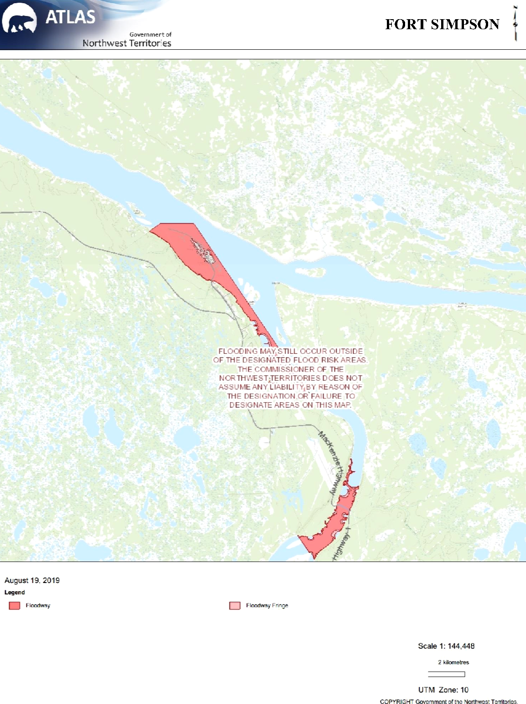
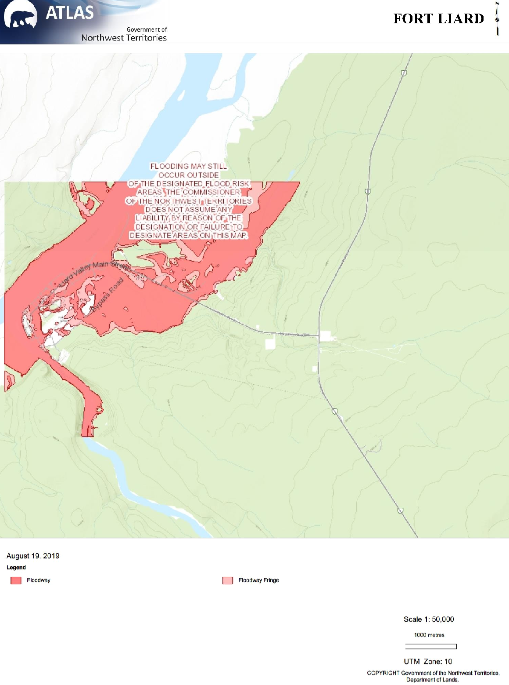
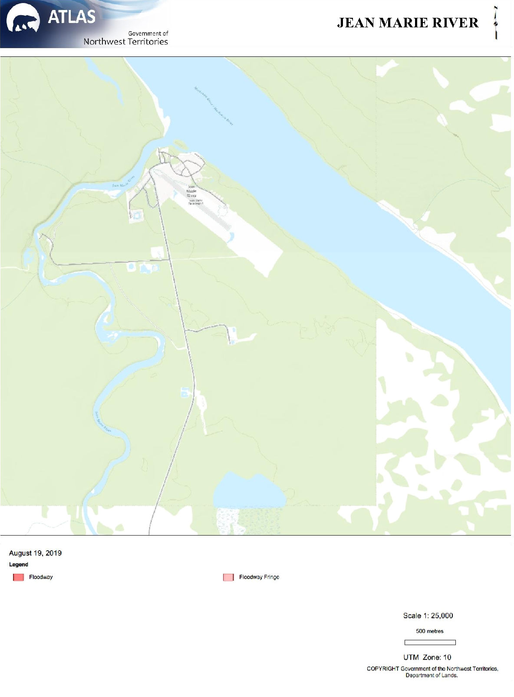
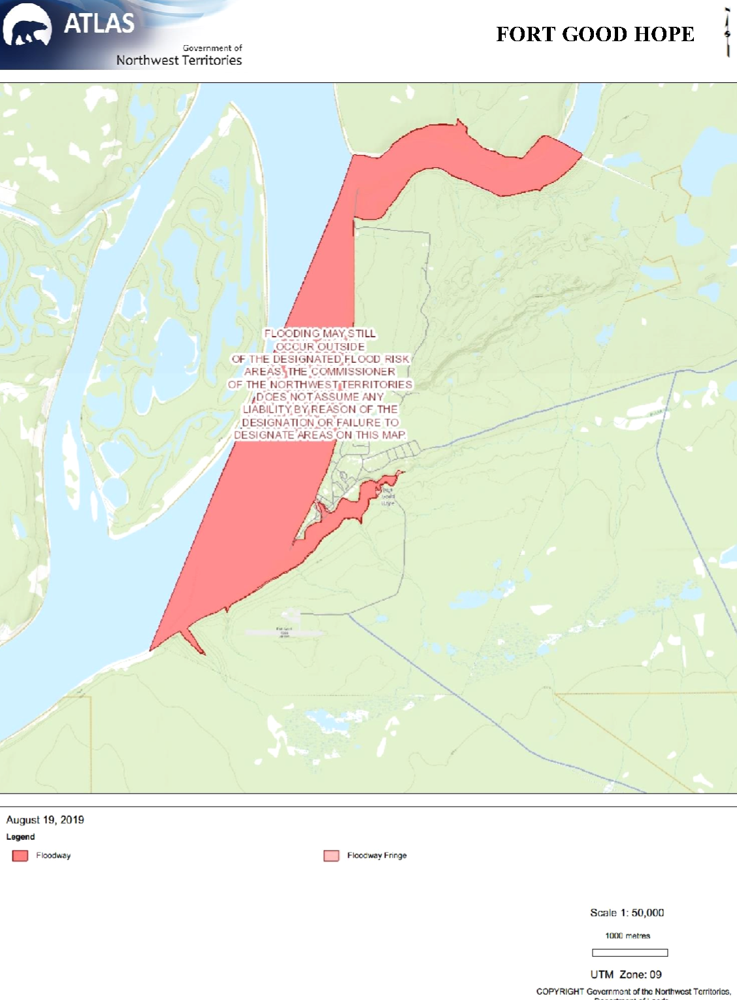
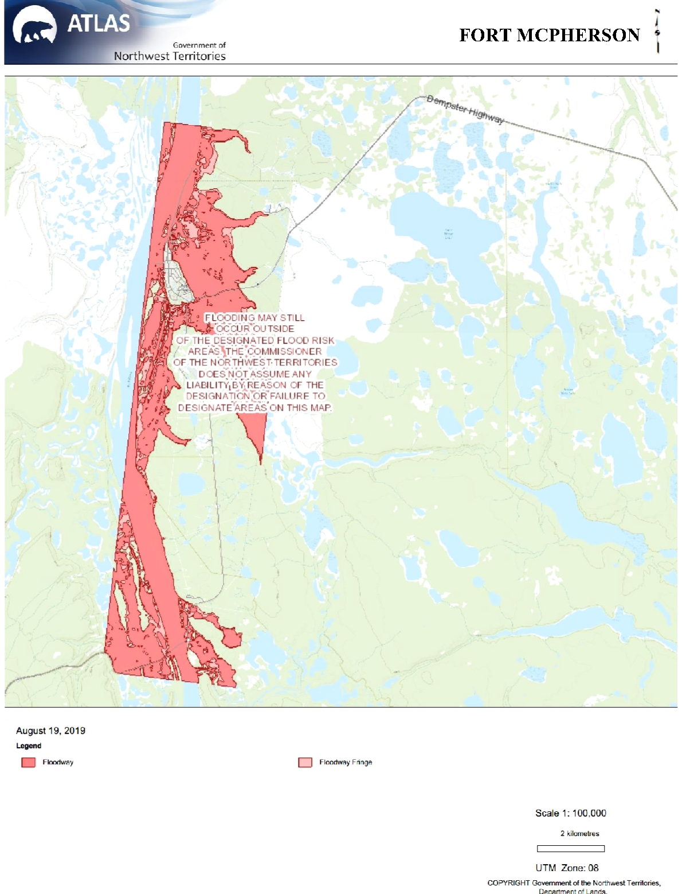
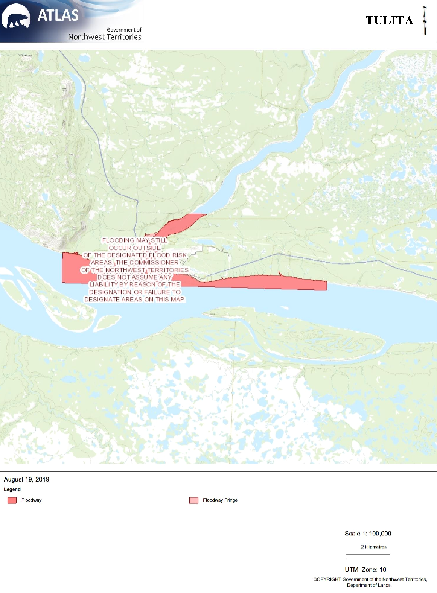
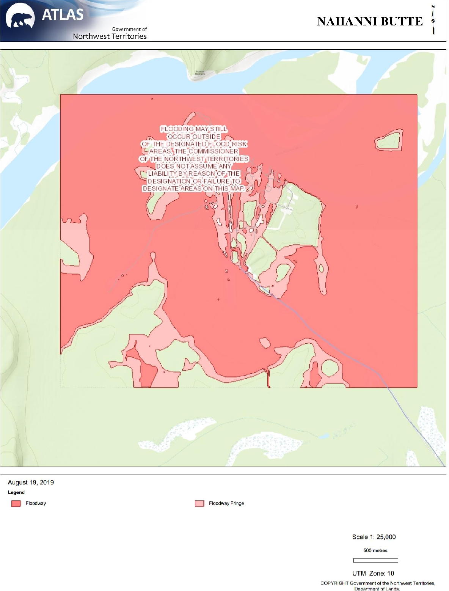
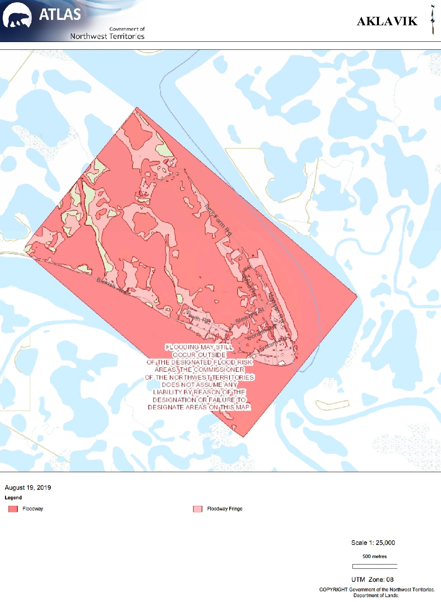
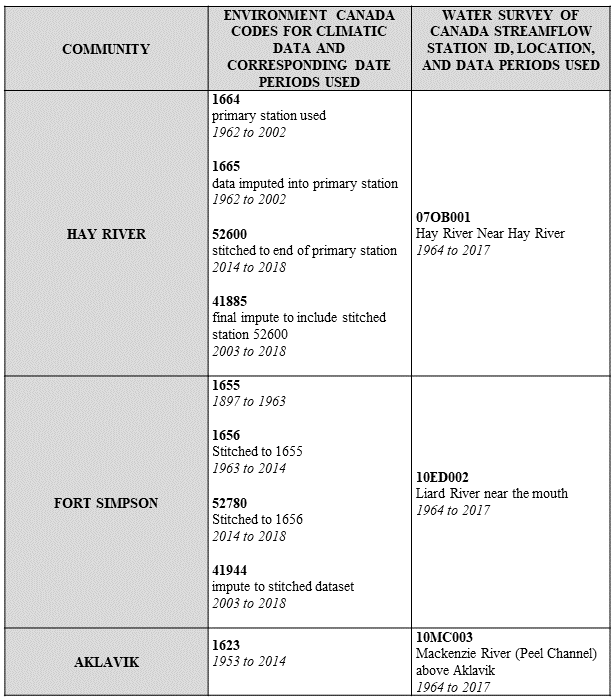

---
---

# Appendix

## APPENDIX C: FLOODPLAIN MAPS

{ width=100% }

{ width=100% }

{ width=100% }

{ width=100% }

{ width=100% }

{ width=100% }

{ width=100% }

{ width=100% }

{ width=100% }

The floodway shows all elevations below that designated under the Canada - Northwest Territories Agreement Respecting Flood Damage Reduction and Flood Risk Mapping in the mid-1980s. The floodway fringe is a flood risk area and shows all areas where the elevation is 1.0 meter or less higher than the flood water elevation.

## APPENDIX D: METEOROLOGICAL AND HYDROMETRIC STATIONS FROM ENVIRONMENT CANADA AND THE WATER SURVEY OF CANADA

{ width=100% }

## APPENDIX E: R CODE

Below are the scripts from R that were used in the data analysis portion of this report.

[Final Data Sets](scripts/FinalDataSets.rmd)

[Streamflows](scripts/Streamflow.rmd)

[Water Levels](scripts/waLevels.rmd)

[Hypothesis 1](scripts/Hypothesis1.rmd)

[Hypothesis 2](scripts/Hypothesis2.rmd)

[Hypothesis 3](scripts/Hypothesis3.rmd)

[Hypothesis 4](scripts/Hypothesis4.rmd)

[Hypothesis 5](scripts/Hypothesis5.rmd)
