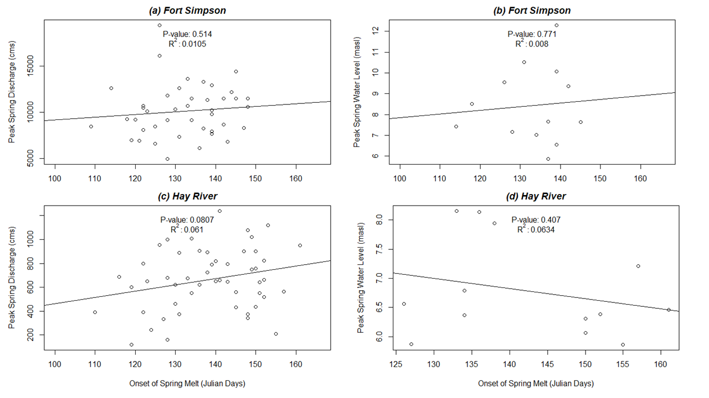
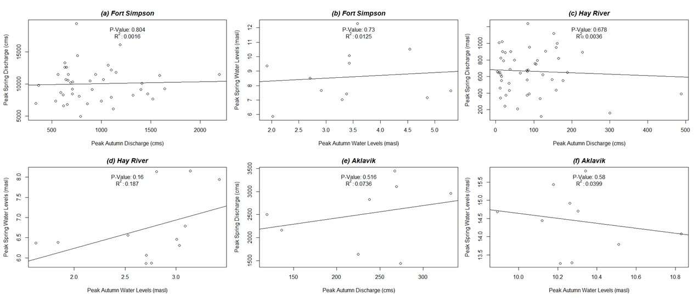

---
---

[home](home.html)

# Data analysis

## Analysis objectives

In this section, outlined first is a list of each hypothesis explored in this report. Second is the methodology general to the data analysis approach. Third, the rationale behind each hypothesis is presented followed by the results and discussion specific to each hypothesis. Finally ending with a discussion of the general findings, limitations, and recommendations.

While water levels and discharge rates are an integrated response to multiple interacting hydrological processes, the objective of this data analysis is to assess the relationship of single meteorological conditions to high water levels and associated flood events. The results of this simplified approach could potentially be useful – in the future – for aiding with a quick and real-time determination of the risk of a flood event occurring. To that extent, five hypotheses of simple relationships between climatic and hydrometric variables were tested: To complete the data analysis, five hypothetical, flood-inducing scenarios were examined. They are discussed below.

1.	Later spring melt is associated with higher spring water levels and greater flood risk.

2.	Cooler spring temperatures are associated with higher spring water levels and greater flood risk.

3.	Larger snowfall snow water equivalent (SWE) measurements (cm) are associated with higher spring water levels (and streamflows) and a greater flood risk.

4.	Antecedent water levels impact spring water levels, and may therefore be associated with greater flood risk.

5.	The impact of rain-on-snow events on spring water levels is associated with higher flood risk

## General methodology

For the sake of this report, only ice jam flood events were analyzed. If a flood event was shown to have occurred between the months of April and June, but no data was available to identify the cause of the flood as an ice jam, then ice jam was the assumed cause.

For each community studied, a more complete climate record was developed by combining data from weather stations (downloaded from Environment Canada) within close proximity to one another ([Appendix D](appendix.md)). Aklavik only had one long-term climate data station available, but Hay River and Fort Simpson had more available long-term records. Data for Fort Simpson and Hay River were stitched, imputed, and interpolated by using a combination of self-developed R ([Appendix E](appendix.md)) code and the “CRHMr” package, developed by Shook (2019). CRHMr, or “Cold Regions Hydrological Model r” was made to process data for input into the Cold Regions Hydrological Model, however, many routines and subroutines within the package are broadly applicable to processing other time series data. After data from geographically similar locations were stitched together, an imputation function was employed. Imputation consisted of importing available data from a secondary station into a primary station of interest (primary station is generally the weather station with the longest record), if data gaps existed during the same date range, within the primary data. Imputation was conducted on temperature data (mean, minimum, and maximums) for both Hay River and Fort Simpson. Precipitation was included in imputation for Fort Simpson as a linear regression of the variable between the stations in question yielded an r^2^ value of 0.89. However, linear regression correlation between precipitation from the Hay River stations was low (low r^2^), so precipitation was not included in imputation for Hay River. After imputation, an interpolation function was used to fill in any gaps of less than 7 days in length. Precipitation was not included in interpolation for either station. As precipitation is a spot measurement, values between geographically similar stations were discovered to not show sufficient correlation when compared using linear regression (plots not included in report).

In total, four stations were used to create a climate record for Fort Simpson; four stations were used for Hay River, and one station was used for Aklavik (where data are only available until 2014) (See [Appendix D](appendix.md)). A final spreadsheet was compiled with the all the historical climatic data, called the “Master List.” The master list was made to be added to as new climate data is released. It would be ideal to also add the climate data for the remainder at risk communities in the NWT. For hydrometric data, one main station was used for each community ([Appendix D](appendix.md)). These records are used in the analysis presented below, and could be applied by others (e.g. GNWT Hydrologists) for future analysis. The records can be augmented with new climate data from Environment Canada, as it becomes available. The scripts used to produce these climate records are presented in [Appendix E](appendix.md).

Flood event analysis for each hypothesis was conducted by first identifying years of recorded flood events in each community (five identified for Aklavik; four for Fort Simpson, and twenty-three for Hay River). Those years were then excluded from the long term record to provide what will be identified as “flood years”, or, years of recorded flood events; and “non-flood years”, or, every other year in the record, excluding years when floods occurred (also referred to as the long term average). For each parameter of interest (example: streamflows, water levels, springtime temperatures), the average during flood years was then compared to the long-term average of the parameter, during non-flood years, to determine if the flood year average was above/below the long-term average.

Maximum springtime streamflow and water levels for each community were determined using code developed in R. First, the data were manipulated to change the date of each record to the day of year (DOY) using the “strftime” function. A new column with the DOY was then added to the original dataset. Then, dates for each year were filtered such that all dates after a specified DOY were removed (June 15, Julian day 166 in this case), leaving only winter and springtime measurements each year (January 1 to June 15). The dplyr method of piping was then used to group all measurement records by year, selecting the maximum recorded streamflow and water level for each year.

Peak fall water levels and discharge were determined using a similar method as was used for peak springtime flows and water levels. First, the month of usual freeze-up was identified (October for Hay River and November for Fort Simpson and Aklavik). A two week centered rolling mean was then calculated for each qualifying measurement for the freeze up month. In practice this means that a two week centered average is only available for the middle two weeks of the freeze up month. From the calculated two week averages, the maximum streamflow/water level was selected. This method assumes the peak average measurements during freeze up occur during that two week window in the middle of the identified freeze-up month.

Water levels for each community were only available from the Water Survey of Canada from 2002 to present. Therefore, both water levels and streamflows were reviewed in this report as a more thorough streamflow record was available. However, it should be noted that ice jams can cause high water levels at relatively low discharges when compared to the amount of flow it would take during an open water flood to achieve the same stage (Lindenschmidt, 2017). The stage-discharge relationship is also less accurate during ice cover, and according to the Government of Canada (2019, explaining on their website that the presence of ice makes water level and discharge data invalid. For these reasons the derived relationships between streamflow and ice jam floods should be approached with greater caution then relationships established using water level, but were included in this report due to lack of long term water level data readily available.

Relationships between discharge and water levels with the parameters in question in each hypothesis were determined using linear regression, and identifying the correlation coefficient, r^2^, and p-value to determine significance. A p-value < 0.05 and an r^2^ value > 0.6 was used for significance determination. A significant p-value indicates that there is a statistically significant relationship between the independent and dependent variables in question. A significant r^2^ value indicates that there is a high goodness of fit between the variables, and this suggests that the model explains a large proportion of variation in the dependent variable.

## Hypothesis examination

The rationale, results, and discussion of data analysis for each identified hypothesis are described below.

**Hypothesis 1: _Later spring melt is associated with higher spring water levels and greater flood risk_**

_Rationale_: Romolo (2016) states that the occurrence of ice jams and the possibility of subsequent floods is highly influenced by the rate and timing of spring melt. A delayed spring melt typically results in thicker end-of-winter ice cover (Zhao, 2012). Thicker ice yields more water storage, and more water storage means excess runoff will occur as that ice melts (Prowse and Beltaos, 2002). Higher runoff volumes can increase the risk of mechanical ice breakup, which can lead to ice floes and consequently greater likelihood of ice jam occurrence. With this hypothesis, the aim was to determine if there is a correlation between timing of spring melt and the occurrence of ice jam floods.

_Methodology_: Bilello (1980) identified the onset of thawing degree-days to be the time that snowmelt starts. Bilello (1980) suggested that a best estimate of the start of ice cover decay is the first date of the first five consecutive days when average daily temperatures exceed -5⁰C. By comparison, Dingman (2015) indicated that an average threshold temperature of 0⁰C would be appropriate. This is because melt can occur at the surface when air temperatures are above 0⁰C for short or long periods, at which point meltwater can move through the snowpack and refreeze, releasing latent heat, which raises the overall snowpack temperature (Dingman, 2015). Yet, night-time temperatures below 0⁰C would reset the “melt clock” as it takes time for the snowpack to gain enough energy to begin melting again. Although radiative surface melting can occur at temperatures below 0⁰C, the snowpack will typically retain enough cold content to prevent the profile from becoming isothermal and primed for melting. Therefore a more conservative approach was used: for each year on record, the timing of spring melt was calculated to be the first day (of five consecutive days) when daily minimum (rather daily average) air temperatures exceeded 0⁰C. To conduct this analysis, a code was developed in R called “Timing of Spring Melt” ([Appendix E](appendix.md)). The code analyzes minimum temperature data, and uses another author developed code to identify when the five consecutive day pattern each year first begins, and then identifies the Julian day of year the pattern begins.

_Plot(s) of spring melt vs. peak water level:_

{ width=100% }

**Figure 4: Relationships between day of year (Julian day) of start of spring melt on: 1) Peak Springtime Discharge (cms) for (a) Fort Simpson and (b) Hay River; and 2) Peak Springtime water levels (masl) for (b) Fort Simpson, and (d) Hay River, NWT. “masl” = meters above sea level; “cms” = cubic meters per second.**

_Results of linear regression:_ No significant relationships exist between peak springtime water levels and the timing of spring melt for either Hay River or Fort Simpson (p-values of 0.4 and 0.7, respectively; r^2^ values both under 0.6). The same is true for the peak springtime discharge and timing of spring melt for each community (p-value and r^2^ for Hay River of 0.8 and 0.06; 0.5 and 0.01 for Fort Simpson).

Though visually it appears there may be a positive relationship between spring melt timing and peak springtime discharge for both communities, as well as peak springtime water level for Hay River, p-values would indicate this relationship is not significant. Conversely, there appears to be a negative relationship between peak springtime water levels and timing of spring melt for Hay River, but again, this is not significant. More observations would add confidence to these conclusions. Too many gaps were identified in the Aklavik climate data and water level/discharge data to get accurate linear regression analyses, and was therefore not included.

_Can we reject the null hypothesis?_ Based on the data from each community, we cannot reject the null hypothesis. Timing of spring melt appears to have little influence on the timing of peak springtime discharge and water levels in all cases.

_Are occasions of flood events associated with later spring melt?_ To determine if previous flood events have been associated with later spring melt timing, the mean day of year of peak spring water levels and discharge during known flood years were determined and compared to the mean day of year of peak springtime water levels and discharge for non-flood years. The results are shown in Table 2.

**Table 2: Timing of spring melt for flood years compared to timing of spring melt for non-flood years for three communities in the NWT.  FY = Flood years; NFY = Non-flood years.**

{ width=75% }

Based on the results in Table 2, for Hay River and Aklavik, there appears to be a weak positive effect of spring melt timing on the years that flooding has occurred. For Fort Simpson, there appears to be a weak negative effect between timing of spring melt and the years flooding occurred. Overall, it would seem timing of spring melt as an individual variable has minimal influence on the occurrence of ice jam flooding in these communities.

**Hypothesis 2: _Cooler spring temperatures are associated with higher spring water levels and greater flood risk_.**

_Rationale:_ Cool springs in the NWT mean that the rivers stay frozen for longer. Prowse and Beltaos (2002) discuss that both river freeze-up and break-up dates correlated well with mean air temperatures, not only from spring, but also the previous autumn. The Mackenzie River flows from south to north, so its headwaters or southern tributaries often undergo melt earlier due to south-north temperature gradients, and this difference could be exacerbated if springs are cooler than usual in the NWT. This means that snowmelt water will move downstream and likely either encounter solid ice and back up to cause flooding; or, if the force is great enough, break the ice up and push it downstream into more ice, causing an ice jam. When that ice jam breaks, a flood wave will propagate downstream and potentially flood downstream communities (Hicks and Beltaos, 2008).

_Methodology:_ Code was developed in R to calculate the average daily temperature in a four week window (two weeks on either side) around the day of year of spring melt, previously determined in Hypothesis 1. Spring in this case encompasses April through June. The code, can be found in Appendix E.

_Plot(s) of spring temperature vs. peak water level:_

{ width=100% }

**Figure 5: Mean spring temperature (in a 4-week window centered around first day of year of spring melt) plotted against the peak springtime discharge for (a) Fort Simpson and (c) Hay River; and water levels for (b) Fort Simpson and (d) Hay River, NWT. “masl” = meters above sea level; “cms” = cubic meters per second.**

_Linear regression results:_ Not enough water level and streamflow data were collected to be able to get a good representation of those two variables against mean springtime temperature for Aklavik. Fort Simpson did not any significant correlations between spring temperature and peak springtime discharge or water levels (Figure 5). Hay River also shows no statistical significance between the variables.

_Can we reject the null hypothesis?_ We cannot reject the null hypothesis. The p-values and r^2^ values do not show significant correlation between peak springtime discharges or for peak springtime water levels with average spring temperatures.

_Are flood events associated with low spring temperatures?_ Table 3 shows average spring temperatures during flood years and non-flood years for each community. Mean spring temperature in Hay River is about 1.2 °C warmer during flood years. By comparison, mean temperatures in Fort Simpson Aklavik are 0.5 – 1.8°C cooler in flood years than non-flood years.

 **Table 3: Mean springtime temperatures (⁰C) for Aklavik, Hay River, and Fort Simpson, NWT. Springtime in each community is identified as beginning on the day of year spring melt begins (identified in Hypothesis 1), and ends June 15 every year. FY = Flood years; NFY = Non-flood years.**

{ width=75% }

**Hypothesis 3: _Larger snowfall snow water equivalent (SWE) measurements (cm) are associated with higher spring water levels (and streamflows) and greater flood risk._**

_Rationale:_ Higher end-of-winter snow water equivalent (SWE) in the snowpack would logically be associated with higher discharge when the snowpack melts. Mahabir et al (2008) showed, for Fort McMurray and the Athabasca River in Alberta, which the opposite is also true - low snowpack SWE was associated with low maximum water levels. Contrastingly, the presence of large snowpack’s on the ice itself can also affects ice cover deterioration during ice break-up, in addition to water levels. Larger snowpack depths limit solar radiation penetration thus slowing the rate of ice melt and potentially driving a mechanical breakup (Zhao, 2012). Without snow cover to block radiative melting, river ice is more prone to the influence of solar radiation, and would thermally decay more readily, resulting in thermal breakup which is less likely to cause ice jams (Beltaos and Prowse, 2001).

_Methodology:_ To determine end-of-winter SWE at each community, I used the Master List of climate data that was generated for this project, in R, with a SWE code written by Dr. Connon of the GNWT. The code takes total precipitation and subtracts out total rain to estimate total SWE (code can be found in [Appendix E](appendix.md)). SWE was plotted with peak springtime water levels and peak springtime discharge to assess the relationship between the respective variables for each community. (Figure 6).

_Plot(s) of estimated SWE vs. springtime peak water level and springtime peak discharge._

{ width=100% }

**Figure 6: Estimated maximum annual SWE plotted against (1) peak springtime discharge for (a) Fort Simpson and (c) Hay River; and (2) peak springtime water levels for (b) Fort Simpson and (d) Hay River, NWT. “cms” cubic meters per second; “mm” = millimeters.**

_Results of linear regression:_ There was not enough flow or water level data available to match up with SWE to carry out the analysis for Aklavik. Data for peak springtime discharge for Fort Simpson and peak springtime water levels for Hay River visually show what appears to be a positive correlation; but the relationship is not statistically significant (p-values greater than 0.05) (Figure 6a, 6d). However, estimated annual maximum SWE plotted against peak springtime water levels for Fort Simpson yield a p-value < 0.05, showing a statistical significant relationship exists (Figure 6b). By comparison, the p-value for peak springtime discharge for Hay River is 0.06, so very close to the 0.05 threshold, indicating a significant relationship may exist (Figure 6c).

_Can we reject the null hypothesis?:_ Based on these results, we cannot reject the null hypothesis in regards to SWE versus discharge for Fort Simpson nor for SWE versus water levels for Hay River, as no significant relationships appear to exist. Contrastingly, we can reject the null hypothesis in regards to SWE versus water levels for Fort Simpson and possibly for SWE versus discharge for Hay River (p-values indicate significance exists).

_Are flood events associated with high snowfall SWE?_ Table 4 shows snowfall SWE during flood years and snowfall SWE during non-flood years, for all three communities.

**Table 4: Snowfall SWE (mm) during flood years and non-flood years for three communities in the NWT. FY = Flood years; NFY = Non-flood years.**

{ width=75% }

Aklavik was included in the creation of the table because SWE data was available. However, due to the limited number of flood years on record, only two observations of maximum SWE were available during the identified flood years for Aklavik. Hay River appears to show little relationship between estimated SWE and flooding; while for both Fort Simpson and Aklavik, it appears there is a positive relationship between estimated SWE in flood years.

**Hypothesis 4: _Antecedent fall water levels impact subsequent spring water levels, and may therefore be associated with greater flood risk._**

_Rationale:_ Beltaos and Prowse (2001) show that that when fall freeze-up levels are low, subsequent spring water levels will also be low. Conversely, when water levels at freeze-up are high, resultant spring water levels are also high. The latter can lead to increased likelihood of mechanical break-up events, and the occurrence of ice jam formation will be greater.

_Methodology:_ To determine average peak fall water levels, maximum annual water levels were calculated within a two week window in October or November (usually the months when fall freeze-up occurs) for each community by means of a rolling two-week average code in R (code is listed in [Appendix E](appendix.md)). Once average peak fall water levels were determined, they were plotted against spring water levels (freeze-up versus break-up) to see if there was a relationship.

_Plot(s) of fall water level vs. peak water level:_

{ width=100% }

**Figure 7: Average peak fall water levels and (1) Peak spring water levels for (b) Fort Simpson, (d) Hay River, and (f) Aklavik and (2) peak springtime discharge for (a) Fort Simpson, (c) Hay River, and (e) Aklavik, NWT.**

_Results of linear regression:_ Based on the results shown in Figure 7, it appears there is no significant correlation between maximum fall water levels and maximum spring water levels for either community. The same can be said for peak springtime discharge.

_Can we reject the null hypothesis?_ We cannot reject the null hypothesis. Average peak fall water levels appear to have little impact on peak springtime discharge and water levels for these communities.

_Are flood events associated with high fall water levels?_ Based on the results listed in Table 5, it appears mean fall water levels have little impact on whether or not floods will occur in the following spring. However, for both Hay River and Aklavik, mean fall streamflows are larger in the fall preceding a flood event when compared to streamflows during fall seasons when no subsequent springtime flooding occurs. For Fort Simpson, Table 5 shows fall streamflows during years when subsequent spring flooding does not occur to be greater than streamflows in years where spring floods follow.

**Table 5: Mean fall water levels and mean fall discharge from the previous calendar year of known spring ice jam floods. Levels and discharges from years when floods occurred the following spring to years when floods did not occur. FY = Flood years; NFY = Non-flood years.**

{ width=75% }

**Hypothesis 5: _The impact of rain-on-snow events on spring water levels is associated with higher flood risk._**

_Rationale_: The impact of rain-on-snow events on spring floods is not well understood (Putkonen et al., 2009). This scenario may increase the risk of ice jam flooding in two ways. From the perspective of a snowpack energy balance, the latent heat transfer from the rain refreezing within the snowpack would either enhance internal melting or decrease the cold content of the snowpack. Rainfall would either prime the snowpack for melt or expedite melt within the snowpack, resulting in the river ice being exposed to direct incoming solar radiation. When river ice is exposed to more to solar radiation, the ice is weakened, and makes it more prone to mechanical break up during the impending freshet. In a second situation, if rain-on-snow occurs further upstream, a rapid snowmelt event may produce a flash flood that propagates rapidly from warmer headwaters, making residual river ice vulnerable to mechanical break up. That ice would then be forced downstream to the point where it may jam and lead to flooding. Rain-on-snow induced flood events are projected to increase in response to climate change (Putkonen et al., 2009).

_Methodology:_ A metric was created for determining the timing and magnitude of rain-on-snow events. The date range for observing rain-on-snow events was February 15 to June 30, as ice jamming that results in floods tends to occur within this range, and a snowpack generally still exists. Code for looking at rain-on-snow events can be found in [Appendix E](appendix.md).

_Plot(s) of rain-on-snow vs. peak water level:_

{ width=100% }

**Figure 8. Peak springtime discharge and peak springtime water levels plotted against total rain on snow (mm) for Fort Simpson (a, b) and Hay River (c, d).**

_Can we reject the null hypothesis?:_ Based on Figure 8, we cannot reject the null hypothesis as it appears rain-on-snow has little influence on streamflow and water levels, at the sites specifically. This is likely because meteorological and hydrometric stations analyzed were located at or near each town. Since streamflows originate in the headwaters, further analysis for rain-on-snow events should be completed on stations upstream.

**Table 6: Average rain-on-snow amounts (mm) that occur at Hay River, Fort Simpson, and Aklavik, during years where floods occurred and years where flood were excluded. FY = Flood years; NFY = Non-flood years.**

{ width=75% }

No rain on snow events were available for Aklavik within the available date range.

_Are flood events associated with rain-on-snow events?_ When comparing on-site rain-on-snow events for each community, it appears no trends exist. Hay River shows that during flood years, the amount of rain-on-snow tends to be greater by about 1.3 mm. Fort Simpson shows the opposite, with greater rain-on-snow occurring during years that did not result in flooding.

## General conclusions and limitations

Generally, the results of this data analysis indicate that individual climatic indicators (timing of spring melt, cooler spring temperatures, estimated onsite SWE, antecedent fall water levels, and rain-on-snow) are likely not useful for predicting or forecasting flood events.

Correlations between the individual climatic parameters with peak springtime discharge and water levels, and occurrence of flood events, were low and largely non-significant, however, some relationships did show significant positive suggesting a relationship may exist, though that relationship may not be linear.
Antecedent fall streamflows for Hay River and Aklavik were both greater during years when subsequent spring flooding occurred. The opposite was true for Fort Simpson.

At Hay River, as springtime temperatures increase, the limited water level data show a slight decrease. This could likely be due to the fact that the town is located at the mouth of the south-to-north flowing Hay River as it empties into the Great Slave Lake. As temperatures increase, lake ice likely decreases, allowing Hay River flow from the south to enter the lake rather than back up.

When SWE was compared to peak springtime water levels for Fort Simpson and to peak springtime streamflows for Hay River, the p-values from the linear regressions indicated significance, meaning for Hay River, amount of SWE can influence peak springtime discharge, as the snowpack becomes meltwater. Interestingly enough for Fort Simpson, SWE did not show a significant relationship with discharge, but did with peak springtime water levels. For Aklavik and Hay River, estimated SWE onsite was also shown to be greater during years when flooding occurred when compared to years where flooding events were excluded. It would be interesting to see how these results may change with more data in the future. Also to note, based on Figure 6, it appears that estimated SWE is positively correlated with peak springtime discharge: when estimated SWE is high, peak discharge also appears to be high (likely a result of higher water storage in the SWE converting to streamflow upon melt). Yet, Figure 6 also shows that estimated SWE is negatively correlated with water levels. This could be indicative of the fact that water levels are difficult to measure in the winter due to the presence of ice (Government of Canada, 2019). However, it could also just be due to the short period of record for available water levels.

Not only are water level data availability not available before 2002 from the Water Survey of Canada, but the record of flood years for Fort Simpson and Aklavik were also a limitation. Only five years of recorded flooding were available for comparison for Aklavik, which often times did not match up with the years of available data, making analysis difficult. For Fort Simpson, only four years of recorded flood events are available. Some of the other flood-prone communities also only have few observed/documented flood events (within the two to five range). The small sample size limits researcher’s ability to be confident with the climatic drivers of those events.

Beltaos (2002) confirmed the anticipated sequence of causes and effects with respect to incidence of winter breakup events; warmer air temperatures enhance incidence of mild days in winter, and in turn cause increased rainfall. Higher rainfall equates to higher runoff and higher flows in winter. When winter flows exceed threshold values, ice jam break events can occur. Though these characteristics are not directly observed in the analysis above, it’s possible further analysis could show these relationships.

Data availability was a limitation of this project. Specifically, water level data, the number of recorded flood years, and more remote climate stations having gaps longer than seven days in length. In regards to the availability of water level data from Water Survey of Canada (WSC), the fact that water levels are typically only readily available online from 2002 onward. A hydrologist from the Water Survey was contacted during the project and asked for water level data pre-2002. The author was told the extent of their records were what was presented online. This project therefore used both streamflow and water level data, with the original intention that water level could be back-calculated from streamflow with stage-discharge relationships. However, when ice is present, water levels can be significantly higher compared to water levels of the same discharge during open water conditions (Government of Canada, 2019). This therefore makes most stage-discharge relationships inaccurate during ice conditions, and makes the use of streamflow as a surrogate for water level challenging.

As most analyses were explored using linear regression, it is important to note that linear regression is a good tool for providing the most simplistic look at the relationship between two variables. However, relationships in nature are not often linear, which is the linear regression methods biggest limitation in this sort of analysis.

In all cases of data analysis, more observational data, such as water levels, snow-on-ground, precipitation, and recorded flood events will increase the confidence of the results.

## Applicability and recommendations

Recommendations for future monitoring include looking at upstream (headwaters) climate data to compare to flow and flood events, or amalgamating meteorological stations together across a given basin, rather than just looking at the meteorological stations at or near the community. Past studies have found that ice breakup in north-south oriented catchments begin in the south nearer the headwaters and propagate southward (Hicks et al., 1992). Precipitation has a more prominent and immediate influence on the flow hydrograph over snow which has a more delayed influence (Beltaos et al 2001). In the catchments studied the transition from snow to rain likely begins sooner in the year near the headwaters then at the towns studied. Given that the initiation of breakup begins in the headwaters, it seems reasonable that a more statistically significant fit would occur between hydrometeorological predictors from the headwaters vicinity and timing of ice jam flooding in a downstream community. Should it prove possible for an operational tool to be developed, it seems reasonable that a greater lead time could be gained by using hydrometeorological data from the headwaters rather than the communities. This suggests that meteorological conditions within the towns may be less important than those taken from the headwaters for the purposes of making flood forecasts with large lead times.

It is also recommended that future analysis begin with working with the Water Survey of Canada to see if historical rating curves can be obtained for all years without water level measurements so that water levels can be back calculated.

The impacts of climate change can and will likely influence break-up and freeze-up processes, so any forecasting/prediction tool should take climate change into consideration. As Beltaos et al (2001) explained, as climate change continues, the complexities of atmosphere-surface water budget that controls cloud cover will be irregular, and accurate predictions in the North in regards to precipitation and exposure to solar radiation will lead to weaknesses in predicting ice competence, and subsequently the likelihood of ice jams and resulting floods.

Ice jam formation and breakup are highly stochastic processes, this study has shown that relationships between individual variables with streamflow, water level, or ice jam flooding are not robust enough to allow for the creation of a univariate statistical model.  Only one of the variables investigated, SWE, indicated a statistically significant or almost statistically significant relationship with streamflow or water levels.  While a multivariate statistical model, such as logistic regression, is more likely to accurately predict flood events then the methods used in this report, this report’s findings strongly indicate the need to explore additional variables before undertaking the construction of a multivariate model.  Other variables such as ice thickness, freezing degree day indexes, and more robust approximations of energy fluxes resulting in river ice melt should be explored to see if they have statistically significant relationships with flooding.  Given that the variables studied under this investigation had limited periods of record for Aklavik, developing more robust statistical models for other remote northern communities may be inhibited by lack of available historical data. The following is a more complete list of data that should also be considered or investigated for a more comprehensive understanding of these processes:

 * Flow under ice
 * Ice thickness
 * Backwater effect from ice jams
 * Solar radiation
 * Radar satellite imagery
 * GIS data
 * Geomorphological information on each riverine system
 * Rain on snow events upstream
 * Soil conditions pre- and post-freeze (little soil moisture data is currently available in the NWT)
 * Climate change temperature predictions
 * Cloudiness vs. hours of bright sunshine
 * Wind speed
 * Permafrost thaw

It was found that the narrow range of years with recorded flood events for Fort Simpson and Aklavik was also a limiting factor in analysis. Where Hay River had over 20 years of recorded flood history, Aklavik had five while Fort Simpson had four. Being able to find statistical relationships with small sample sizes is not ideal.
