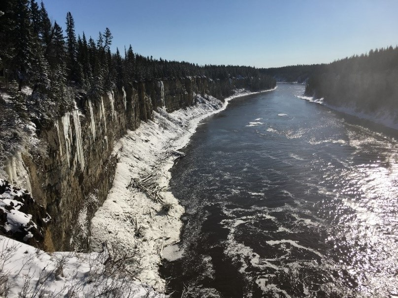
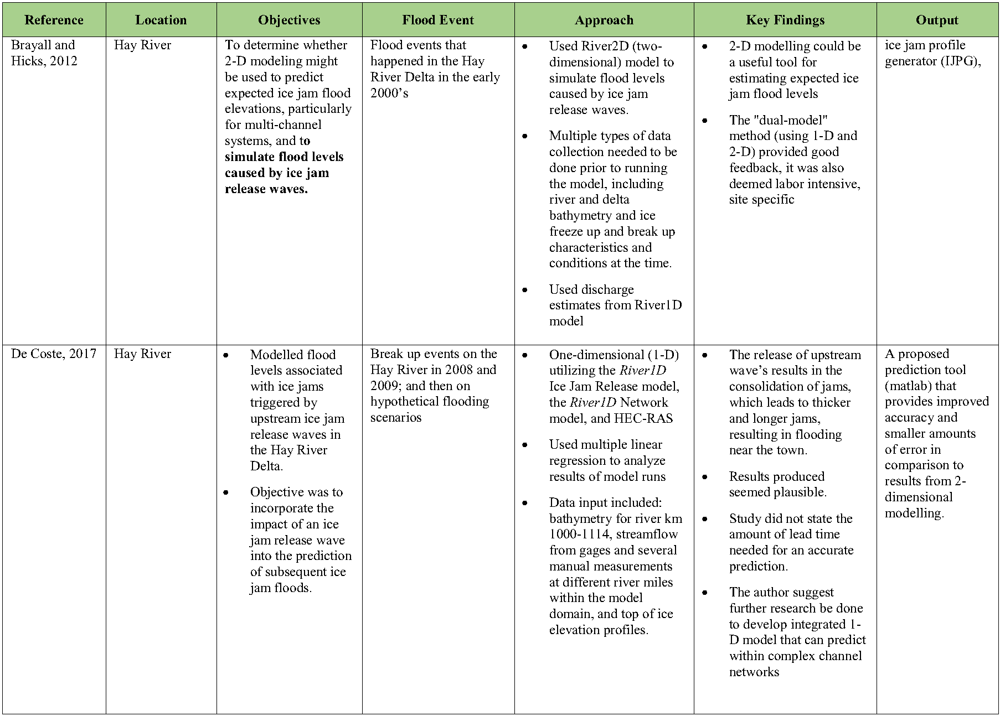
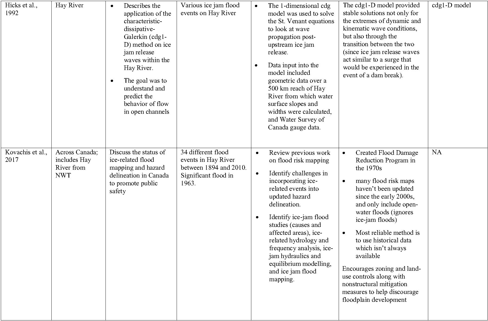
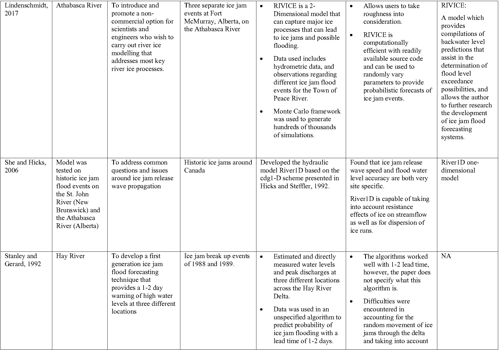
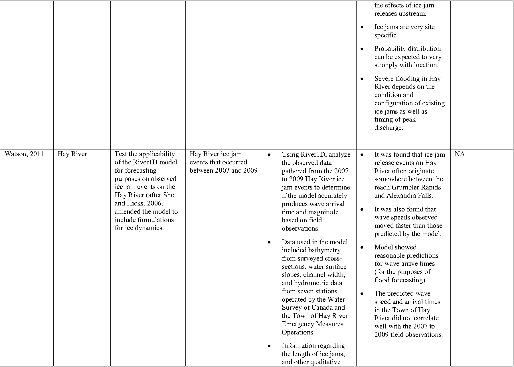
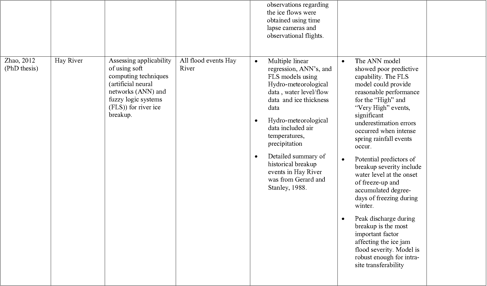

---
---

[home](home.html)

# Introduction

In 1975, the federal government initiated a Flood Damage Reduction program to address flood hazards in Canada. The NWT became part of the program in 1979, and in the late 1980’s, nine of the 33 NWT communities were identified as “at risk" of recurrent and severe flooding (Northwest Territories Flood Designations, 2016). These communities are generally situated on the banks of the Hay, Liard, Peel, and Mackenzie Rivers, and are listed below:

1.	Hay River
2.	Nahanni Butte
3.	Fort Simpson
4.	Fort Liard
5.	Fort McPherson
6.	Fort Good Hope
7.	Tulita
8.	Aklavik
9.	Tuktoyaktuk

The ninth community, Tuktoyaktuk, was not included in this report as the community also experiences coastal flooding caused by tidal influences, which will not be discussed. Instead, the Government of the Northwest Territories identified a separate community, Jean Marie River, to add to the list, which experienced a near-miss flood in 2018, so has since been of interest.

Some of the main drivers of flooding in these communities are rainfall (especially on the Liard River due to the steep terrain of its headwaters and lack of natural storage), rain-on-snow events (which can result in rapid snowmelt due to the latent heat transfer from the warmer rain water), springtime snowmelt, and ice jams which are the most prevalent cause (Government of Canada, 2010). Ice jams are temporary blockages of ice that form in a river channel during breakup. They impede flow and can cause water levels to rise drastically, often well above levels from similar discharge during ice-free conditions (Kovachis et al., 2017). Under certain circumstances, the wave released when an ice jam fails can rapidly surge downstream and result in flooding. Ice jam floods can also occur from the backwater behind a jam if incoming flow is sufficient (back water is defined as the difference between open water stage and observed ice-influenced stage for the same discharge (Beltaos and Prowse, 2001)).

Of the different flood causations, ice jams are the least understood. Ice jam floods can occur suddenly and without warning. They therefore pose a significant threat to the “at risk” river bank communities (Figure 3). The rapid and sudden rise in water levels often makes them more severe than open water floods. Once formed, ice jams can stay in place anywhere from a few minutes to more than a few days; and can range in size from hundreds of meters long to several kilometers. Due to the considerable thickness river ice can achieve, as well as the extra roughness to streamflow it causes, the presence of ice jams can cause much higher water levels when compared to open water conditions with the same discharge (Hicks and Beltaos, 2008; Lindenschmidt, 2017). Ice jams break up one of two ways: mechanical or thermal. Mechanical breakup are often referred to as “premature” as mechanical breakage of ice is caused by higher than normal flows, heavy rains, rapid melts, or any other hydrodynamic force (Beltaos and Prowse, 2001). Whereas thermal break up is also referred to as “mature” or “over-mature” breakup, occurring when weather is mild and runoff is low, lending the river ice to thermally deteriorate due to slowly heated water underneath or via solar radiation and mild air temperatures from the top (Beltaos and Prowse, 2001).

Most ice jam floods are a result of mechanical breakup. One of the worst ice jam induced floods on record happened in Hay River in 1963, when large ice floes travelled downstream and collided with still solid ice on the Great Slave Lake. There was not enough force behind the floes to push the river ice on top of the lake ice, thus an ice jam was formed that dammed the river behind it, rapidly flooding the town (Brayall and Hicks, 2012). Hundreds of people were evacuated, and damage costs were in the millions. The impacts of the flood caused the city center to be relocated to higher grounds as a result, however, and old town within the flood plain is still inhabited (Kovachis et al., 2017). Another damaging flood worth noting occurred in 1982 in Aklavik. Rapid snowmelt led to higher than normal discharge, which resulted in mechanically broken ice floes entering the area, along with the excess water, causing 95% of the delta to be covered in water. Up-to-date floodplain maps of each community can be found in [Appendix C](appendix.md).

{ width=100% }

**Figure 1: Quote from community member in Fort Liard regarding flood evacuations.**

The breakup of river ice and subsequent ice jams and floods are governed by each river’s hydrograph, along with ice strength and thickness, streambed geomorphology, and general location (Beltaos, 2002). In particular, ice thickness and strength along with winter stream discharge are not only dependent on a location’s geomorphology, but are also influenced, directly and indirectly, by weather conditions both at the site and upstream. For example, snow cover acts as an insulator of river ice, protecting the ice from degradation driven by atmospheric radiative fluxes (Prowse and Beltaos, 2002). Solar radiation is directly influenced by hours of bright sunshine, so the presence of clouds results in less solar radiation-induced melting (Hicks and Beltaos, 2008). Mid-winter rain can increase the rate of snow melt as latent heat from the rain is transferred to the snow on ground. The variable underside of river ice (roughness) caused by heat exchange with the under-flowing water can also impact the strength of the overlying ice (Beltaos and Prowse, 2001). As ice integrity decreases, chunks break off and begin to flow downstream. When ice floes meet obstructions such as sharp river bends, or even solid ice that hasn’t yet broken, an ice jam is likely to occur (Beltaos and Prowse, 2001). Another contributing factor to extreme floods caused by ice jams is frozen ground and antecedent moisture regimes (Beltaos and Prowse, 2001). Though infiltration into frozen ground can still occur (Ireson et al., 2013), if the pre-freeze soil moisture levels are high, infiltrabilty of spring runoff water will be low, which can result in rapid runoff as well. These rapid runoff events can also influence stream morphology by causing flood-induced bank erosion and bed scour. These are just some of the reasons why creating an all-encompassing predictive tool for flood forecasting has been challenging, as so many variables can be highly site specific, are dependent on the particular circumstances of an event, and may have unique interactions with each other. Also, with climate change, it is possible that relationships between water levels and climatic variables, along with hydrological regimes in general, could and likely will shift, thus making the use of an empirically-based predictive tool difficult. Any predictive tool should be able to be easily modified and adjusted to the specific regions changing climate.

As better predictive tools are needed, the primary objectives of this project are to improve understanding of flooding and aid in possible flood forecasting at NWT communities by:

 * Developing, if possible, a set of early-warning indicators of climatic and water level conditions that might indicate imminent flooding;

 * Identifying data gaps and recommending potential locations for future monitoring and data collection;

 * Developing code to potentially help aid GNWT hydrologists and other researchers in hydrometric and meteorological data analysis using water level and discharge data from the Water Survey of Canada along with climate data from Environment and Climate Change Canada.

By better understanding and modelling climatic drivers associated with ice jam flooding, the GNWT will be better placed to improve municipal preparedness and public safety, and potentially reduce costs to infrastructure, thereby improving quality of life for residents of the NWT.

{ width=100% }

**Figure 2: Hay River at Alexandra falls, looking north (photo by A. Cook)**

## Previous Research
Previous studies on or related to ice jams and ice jam flooding were reviewed to create a state of knowledge of ice jam flooding in the Northwest Territories. Topics included discussions of models used in forecasting attempts, climatic and physical variables seen to influence ice jams formation and release, factors which led to ice jam release flooding in certain communities, and suggestions for future research.

Most of studies that have taken place in the NWT have researched the mechanisms behind ice jam flooding, such as ice jam formation, breakup, and expected timing and magnitude of breakup waves (Zhao, 2012). These studies have been predominantly in and around the town of Hay River. Several river ice formation and breakup – models have been created and tested, within Hay River, to varying degrees of success. Table 1 outlines some of these past studies as well as some of the models used.
Note: this is not a comprehensive list.

**Table 1: Summary of ice jam flood research that has taken place in Canada, many specific to the Northwest Territories.**

{ width=100% }

{ width=100% }

{ width=100% }

{ width=100% }

{ width=100% }

Some key findings amongst most researchers are that though some models have proven successful at recreating past events, most ice jam floods are site specific, so model inputs and outputs will vary between locations. A common limitation identified in almost every paper was the fact that available historical data is very limited, therefore, using the past to predict the future has been challenging. The remote locations of many of the at risk communities adds to the difficulty of modeling these processes. Access for field observations can be challenging, especially during the early spring when ice conditions are questionable.

A more recent study done by Lindenschmidt et al., 2019 on the Oder River in Germany discussed the importance of including the whole life cycle of an ice jam when considering a forecasting system, from formation, movement, extension, and lastly breakup. The authors go on further to discuss the how a warming climate may impact ice jam formation. For example, an increase in mean air temperatures can decrease the duration and integrity of ice cover. Yet also, more precipitation falling as rain in the headwaters can deliver greater discharge, intensifying ice jamming and leading to increased water stages. Another model frequently used in river ice studies is HEC-RAS, developed by the United States Army Corps of Engineers (Hicks and Peacock, 2005). The model is best used for open water floods, however; as 2005, Hicks and Peacock (2005) identified its limitations, noting that though the model can simulate river ice processes well (from ice cover using known thickness and roughness values to providing reasonable backwater estimates), it is not yet useful for flood forecasting.

Despite the fact that more advanced models capable of incorporating dynamic ice jam characteristics have been developed, it hasn’t been until more recently that those models have been able to prove their worth as more validation data has become available (Healy and Hicks, 2006 and 2007). This is an important achievement in ice jam flood modelling as predictive tools are desirable to aid in floodplain mapping and management with the inevitable goal of improved public safety (Healy and Hicks, 2006 and 2007). However, as White (2003) points out, a completely physically based prediction tool is not yet quite feasible due to all of the complexities of ice jam formation previously discussed. So though progress has been made, an efficient and effective predictive tool is still a work in progress.
