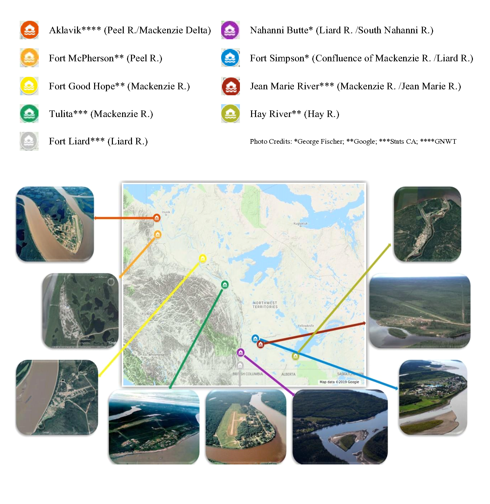

---
---

# Site Description

The Northwest Territories (NWT), in north-western Canada, is bordered by Yukon to the west, Nunavut to the east, and British Columbia, Alberta, and Saskatchewan to the south. It has a population of roughly 44,000 (about 50% of which live in the capital city of Yellowknife). The NWT has a total area of over 1,000,000 square kilometers, and houses many remote communities that are only accessible by ice roads (in the winter) or by plane. Most floods in the NWT occur following river ice breakup in the spring. This is largely due to the climate and geography of the north. Most if not all the rivers in the NWT are north-flowing, so as spring ice breakup begins in the southern headwaters and tributaries, broken ice and warmer spring freshet water surges downstream. During the propagation of the breakup downstream it can often encounter unbreakable solid ice as winter has yet to release its grip on the more northerly portions of the basin. This results in ice jams and a high likelihood of ice jam release or backwater (water held back behind an ice jam, like a dam) floods.

As mentioned in the introduction, eight of the nine “at risk” of flooding communities, deemed so by the government of Canada, were to be reviewed for this report. Figure 3 show photos of each community along with Jean Marie River, as well as a map with their locations respective to one another. Below, each community is identified by location and a brief description of noteworthy flood event is provided (Kriwoken, 1983).

{ width=100% }

**Figure 3: Map of Northwest Territories showing the locations of eight of the nine flood prone communities identified by the Government of Canada, plus Jean Marie River, recently identified as at risk by the Government of the Northwest Territories.**

**Aklavik:**

 * Located on the Peel Channel in the Mackenzie Delta

 * Floods occur when ice jams are formed at the meander bend, seen in the photo in Figure 3.

 * Major flood event: June 2-3, 2013. Water plant was down one pump due to sedimentation in the water source as a lot of mud was in the water from bank erosion. A water conservation advisory was issued. Schools and the band office were closed for days.

**Fort Simpson:**

 * Alluvial island confluence of the Liard and Mackenzie Rivers

 * Floods occur when the Liard River headwaters melt and the freshet pulse is conveyed downstream where it encounters solid ice on the Mackenzie River. The Liard subsequently backs up and causes flooding in Fort Simpson.

 * Major flood event: 1963. Community relocated as a result.

**Hay River:**

 * Located at the southern end if the Great Slave Lake, and at the mouth of the Hay River

 * Most studied ice jam location in the NWT.

 * Floods occur when ice floes from upstream breakup events on the Hay River travel downstream to the mouth, which is also where the town of Hay River is located. These ice floes meet up with the still solid ice on the Great Slave Lake, and cause backwater levels to rapidly increase, resulting in floods.

 * Major flood event: May 3, 1985. Record high flows on Hay River and presence of ice jams caused flooding. Evacuation of west channel residents occurred. One injury. Estimated cost: $1.1 million.

 **Fort Liard:**

 * Located 37 km north of the British Columbia border along the Liard highway and on the east bank of the Liard River where the Petitot River enters the Liard.

 * Floods occur when the Liard River jams up with ice near the town.

 * Major flood event: May 1-9, 1989. Ice Jam flood near 3-mile Island near the community. Local state of emergency was declared. Fort Simpson was also damaged. Riverbanks were eroded. Over 50 homes were impacted. 150 evacuations took place and sadly several pets drowned. Total estimated cost ranged from 500,000 to 2.5 million.

**Tulita:**

 * Located: Located at the confluence of the Great Bear and Mackenzie Rivers about 60 km southeast of Norman Wells. Formally known as Fort Norman.

 * Floods occur when: ice is obstructed by a nearby island, causing ice jams; also due to intact ice on the Great Bear River.

 * Major flood event: May 28, 1964. Ice jam formed at junction of Great Bear River and the Mackenzie – resulted in “immense ice structure standing 9 meters above winter ice level.”

**Fort Good Hope:**

 * Located at the confluence of Jackfish creek and the Mackenzie River about 145 km northwest of Norman Wells.

 * Floods occur when: Ice jams downstream at an island below the mouth of the Hare Indian River. Backwater has also entered the community via Jackfish Creek.

 * Major flood event: May 11 to 14, 2005. Ice Jam flood caused 50 evacuations. State of emergency declared. Total estimated damage cost: $920,000.

**Jean Marie River:**

 * Located at the confluence of the Jean Marie and Mackenzie Rivers about 30 km southeast from the confluence of the Liard and Mackenzie Rivers.

 * Major flood event: No major floods as of yet; but town experienced a near-miss flood in 2018 which piqued the interest of regional hydrologists.

**Nahanni Butte:**

 * Located at the confluence of the Liard and South Nahanni Rivers near the eastern edge of Nahanni National Park.

 * Floods occur when: (Primarily summer floods) summer storm events combine with late breakup of the South Nahanni River.

 * Major flood event: June 9, 2012. This rainfall flood caused 100 out of 115 residents to evacuate. Some were evacuated for at least 2 weeks; flooded buildings had two inches of silt inside, damage was done to the band office and gym; power plant was flooded which lead to a loss of power for the entire community.

**Fort McPherson:**

 * Located on the east bank of the Peel River about 30 km from its confluence with the Mackenzie River.

 * Floods occur when: Spring melt water from Richardson Mountains enter tributaries of the Peel River; and backwater flooding cause by ice jams downstream at the Peel /Mackenzie confluence.

 * Major flood event: Ice jam flood on May 26, 2013. Cabins were dislodged and sent floating down the river; worst flooding seen in a long time according to Chief William Koe.

 * Town also highly susceptible to rainfall floods, which can impact ferry traffic to and from the town.

Ultimately due to time constraints only a smaller subset of the above communities were chosen for further data analysis. For the purposes of this study, three communities of those identified as “at risk” earlier in the report, from three different regions with influences from three different river systems were chosen: Fort Simpson (floods influenced by the Liard and Mackenzie Rivers), Hay River (floods are due mainly to the Hay River), and Aklavik (floods influenced by the Peel and Mackenzie Rivers).
