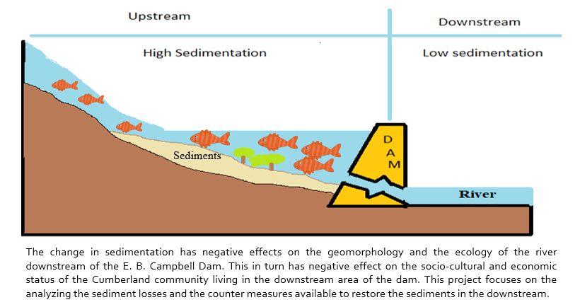

---
---

[home](home.html)

# 1. Executive Summary

This report is based on the topic of restoration of sediments in the Saskatchewan River Delta. The overview includes changes in sediment deposition, modification in seasonality of flow and reduction in biological activities in the Saskatchewan River Delta - the largest delta in North America. It is home to Cree and Metis communities. Due to the irregular flow of water from the dam, the impact on humans is significant. One of the major impacts is the loss of fish habitat, on which the local community is dependent for their livelihood. A decrease in fish populations is predicted to occur due to loss of sediments in the downstream of the dam and channel widening and deepening. Thus the report focuses on the problem “EB Campbell Dam induced manipulation of sediments resulting in impacts on ecology of the Saskatchewan River”. The main objective of this project is to investigate the sediment loss due to construction of EB Campbell dam in upstream and downstream of the Saskatchewan River. Another objective is to compare the sediment concentration in the downstream over the span of 30 years. Also, analysis was done on daily sediment load profiles for year 2014 and 2017 for Big Eddy Camp. Apart from this, comments were given on the accuracy of spot measurements of the TSS (Total Suspended Solids).

 Results after analyzing the data suggests that there are negative effects on the dam downstream due to the construction of dam. These findings are discussed in detail in this report. Different management practices such as sediment bypass, sediment flushing, sediment augmentation and sediment sluicing are also studied which could be helpful in restoring the sediments in the downstream of the dam.

 **Figure 1:** Graphical Abstract of the report
