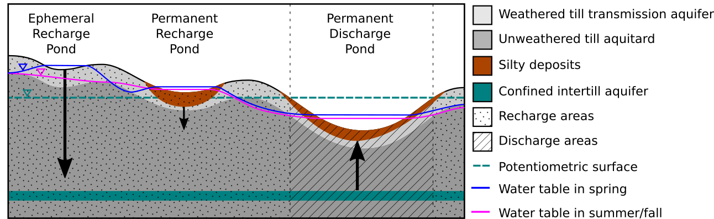

---
---

[home](home.html)

# Model

**OPTIONAL**

Describe the objective of the modelling exercise, describe the model used and any relevant methods, provide results and a conclusion. You must be concise. If additional details are generated which will be useful to future workers, these can be included in an appendix.

## Objective

Here's my objective

## Methods/Model description

Methods. You are encouraged to include here a conceptual model/diagram of your model, if appropriate

You can (and should!) include equations like this:

$$\frac{\partial T}{\partial t}=D\frac{\partial^2T}{\partial x^2}$$

## Results

Results. Include Figures using the command:

{ width=100% }

## Conclusion

Conclusion

Include references as appropriate and write down all reference information in the file references.md
