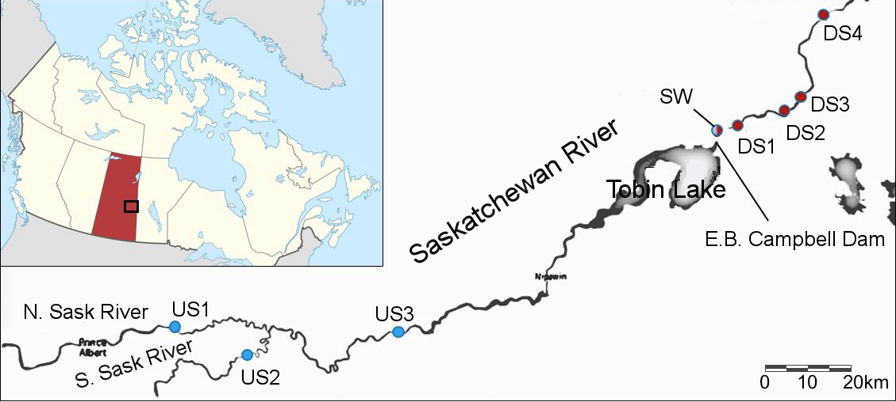

---
---

[home](home.html)

# 3. Site Description

#### 3.1 Cumberland House

In Saskatchewan, Cumberland House is the oldest settlement established in 1774. Its situation is in the heart of Saskatchewan River Delta, and it stands on Pine Island towards Cumberland Lake’s south. It is in eastern Saskatchewan, near the Manitoba boundary 137 km to the north of Nipawin (85 miles) (Abu 2018) . It is home for Cree and Metis people who have relied on the services provided by this ecosystem in the form of waterfowl, fish, generational medicine, and fur (Abu 2018). The Metis people have mixed European and North American ancestry and form a distinct cultural group, and status “Indians” are descendants of swampy Cree people. As a result of a treaty signed by the Cree “Indians” in 1876, they were put on Pine Bluff Reserve which is 25 miles to the west. However, in 1960, they relocated to reserve land, which is next to the broader community of Metis (Abu 2018) .

#### 3.2 The Saskatchewan River Delta (SRD)

Its location is at the central Canadian lowlands straddling the border of Manitoba and Saskatchewan. Rivers crossing Alberta and Western Saskatchewan plains, and draining the eastern slopes of Canadian Rocky Mountains feed into the Saskatchewan River Delta. It covers 10,000 km² making it the largest inland delta in North America (Andrews et al., 2018).

Samples in this study were collected at five locations (Figure 2): one upstream location was chosen as a reference area, while four downstream locations were selected ranging from immediately below the dam (2 km) to ~50 km downstream. The blue dot represents the site upstream of the reservoir which is named Wapiti (US1), while the red dots (DSI, DS2, DS3) are sites immediately downstream of the dam and correspond to the sites sampled by Ashmore and Day (1988).  The furthest downstream site, DS4, represents Big Eddy Camp in the Saskatchewan River Delta and is a location of continuous monitoring of turbidity.

 **Figure 2:** Study area. Spot samples of total suspended solids were measured at US3, DS1, DS2, DS3 and DS4, and turbidity was measured continuously at DS4. Map adapted from Mihalicz et al., 2019.
