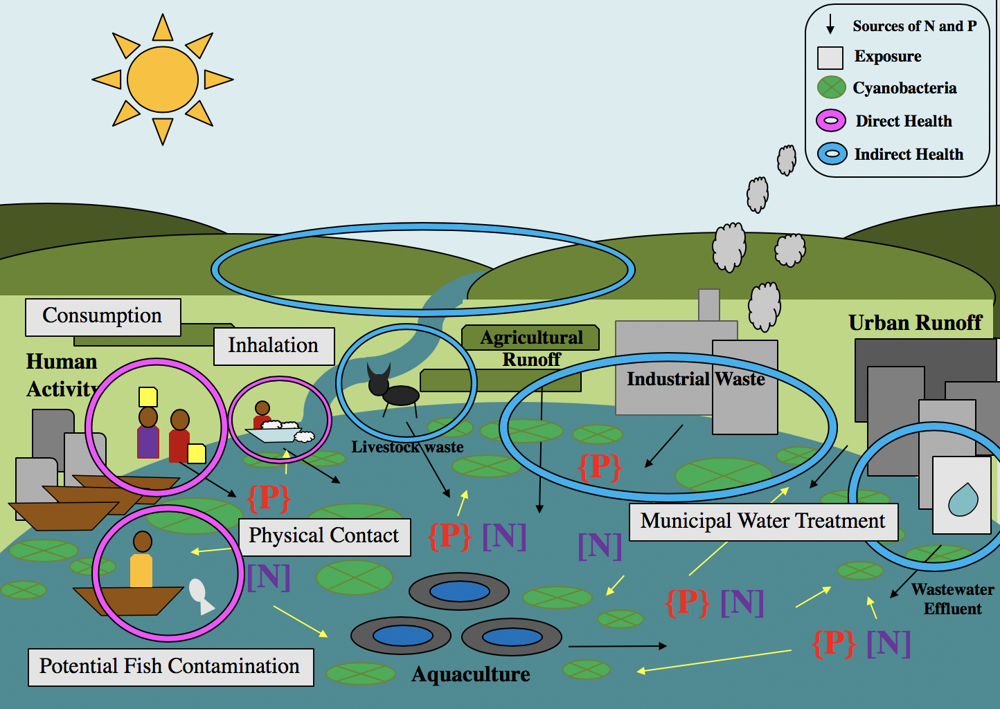

---
---

[home](home.html)

# Executive Summary

The purpose of my placement at the National Fisheries Resource Research Institute (NaFIRRI) was to develop a planetary health case study in regard to the degradation of Lake Victoria, Uganda (locally known as Nalubale) and the associated vulnerability of the local fishing communities. The case study objectives consisted of a mesocosm experiment in Napoleon Gulf on Lake Victoria and several observational community visits. The placement focused on transdisciplinary research to tackle the complex issue of HABs and to promote the development of sustainable solutions.

The experiment was designed to enhance the knowledge on how harmful algal blooms (HABs) develop in Napoleon Gulf under different nutrient conditions. The experiment consisted of a 14 day trial with 8 nutrient treatments Control, Phosphorus (P), Urea ((NH2)2CO), Ammonium (NH4), Nitrate (NO3), Urea and Phosphorus (Urea + P), Ammonium and Phosphorus (NH4 + P), and Nitrate and Phosphorus (NO3 + P) and used chlorophyll-a (chl-a) as an indicator for phytoplankton growth. The initial analysis of the data collected showed that the Napoleon Gulf is nitrogen-limited in regards to chl-a growth. The observational visits were used to identify excess sources of nutrients, potential toxin exposure, community knowledge and understanding of HABs, and potential health impacts from HABs. Four communities within the Napoleon Gulf were visited over the period of July and August. The observational visits determined that these communities are at high risk of toxin exposure due to the reliance on the Napoleon Gulf for their livelihood. The outcomes of the case study can be used for further scientific research, co-development of policy in regard to nutrient management and HABs, and improving health-environment based education on HABs for vulnerable communities

{ width=100% }
Figure 1. A conceptual diagram of Napoleon Gulf, Lake Victoria, Uganda and the potential sources of N and P that promote eutrophication and HABs and the associated exposure pathways that impact human and environmental health
