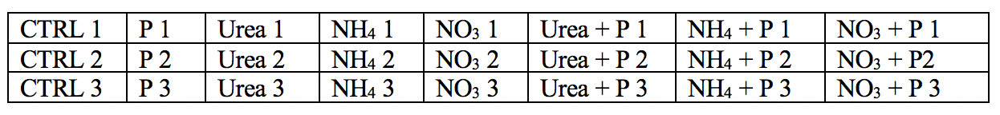

---
---

[home](home.html)

# 3.0 Field work

## 3.1 Experimental objective

The nutrient enrichment mesocosm experiment was designed to measure in situ growth of phytoplankton (specifically cyanobacteria) in response to different nutrient conditions. The experiment was made up of seven treatments and a control with three replicates for each. The treatments were Phosphorus (P), Urea ((NH2)2CO), Ammonium (NH4), Nitrate (NO3), Urea and Phosphorus (Urea + P), Ammonium and Phosphorus (NH4 + P), and Nitrate and Phosphorus (NO3 + P). The purpose of the N, P, and N +P, treatments were to support the previous literature on Lake Victoira's nutrient limitations. The variation of N-sources (NH4, NO3 and Urea) were used to determine if cyanobacteria had preferential up-take of N-sources in nutrients. The experiment design was based on the Finlay et al (2010) in situ mesocosm experiment conducted on Wascana Lake, Saskatchewan, Canada.

Table 1. The table shows the different treatments for the mesocosm experiment and replicate notations
{ width=100% }

## 3.2 Methodology

The experiment was comprised of 3 trials over the course of June, July and August 2019. Due to unforeseeable issues the duration of the trials, mesocosm unit design and sampling technique varied. This report only outlines the findings from Trial 3, as Trials 1 and 2 were deemed unusable.

Trial 3 ran from July 9th to July 23rd (14 days) and measured how chlorophyll-a (chl-a) growth responded to each treatment (see table 1). Water quality measurements and samples were taken every day at approximately 10 a.m. to measure field conditions and daily chl-a response. On Day 0, 3, 7 and 14, 1 litre water samples were taken for further nutrient and chl-a analysis. Nutrients enrichment occurred on Day 0 and 7.

The mesocosm bags were made two days before the deployment date of July 9th using materials sourced from Jinja Market, NaFIRRI and Makerere University. The design of the mesocosm units were based on a similar experiment run at NaFIRRI by Dr. Okello. The units were comprised of plastic sheets (76 cm in width and 150 cm) heat-sealed at the bottom, a plastic ring (50 cm in diameter), and an inflatable tube, seen in figure 4. The mesocosm bags were filled with 150 L of lake water which was filtered through a mesh sieve to remove zooplankton on Day 0 at NaFIRRI Farm. The experiment was set up at the NaFIRRI Farm and can be seen in the conceptional diagram figure 5.

{ width=100% }
Figure 4. Photos of the mesocosm units deployed at NaFIRRI Farm, Napoleon Gulf, LV Uganda.

{ width=100% }
Figure 5. Conceptual diagram of the mesocosm experiment at NaFIRRI Farm.

The nutrients were added to the experiment on Day 0 and 7, and stock solutions were prepared the night before to ensure treatments with Phosphorus received 0.02 (mg/L) of P and treatments of nitrogen received 0.5 (mg/L) of N. These were calculated using the Redfield ratio of 16:1. The chemicals used for each treatment were Urea ((NH2)2CO), Ammonium Chloride (NH4Cl), Potassium Nitrate (KNO3), and Potassium Phosphate Dibasic (K2HPO4). Each replicated received the following concentrations of nutrients for the associated treatment, 3.609 (mg/L) of KNO3, 1.072 (mg/L) of (NH2)2CO, 1.909 (mg/L) of NH4Cl, and 0.112 (mg/L) of K2HPO4.  The stoichiometry calculations are outlined in appendix C. The nutrients were added before 1 litre water samples were taken on Day 0 and 7, for nutrient and chl-a concentration analysis, section 4.0.

On Day 0, the water quality data (pH, temperature, conductivity, specific conductivity, chlorophyll-a and turbidity) was collected by using the YSI EXO2 multiparameter and the HACH probe was used to collect dissolved oxygen. On Day 1, the water quality data was collected with both the YSI EXO2 multiparameter and HACH probe for pH, millivolts, temperature, conductivity, dissolved oxygen and percent saturation for a correction factor as the rest of trial 3 used only the HACH probe. Due to difficulty with the HACH probe, Day 10 – 14 were measured in the lab from samples collected from each replicate. Secchi depth was taken each day after the samples and measurements were taken and the weather conditions were record for the beginning and end of the sampling period.

50 mL samples were collected each day from the individual replicates after each unit was thoroughly stirred to ensure the water column was mixed. These samples were stored in a cooler and brought back to the lab for analysis with the Trilogy Laboratory Fluorometer. Standard method was used, outline in appendix C, to measure the in vivo chl-a relative fluorescence units (RFU). 1 litre samples were collected on Day 0, 3, 7, and 14 for further nutrient and chl-a analysis, described in section 4.0.

## 3.3 Results

The following sections shows the chl-a (RFU) response to nutrient additions on Day 0 and 7 over the course of trial 3 (Day 0 to 14). The following graphs show the average and standard error of chl-a (RFU) values for treatments CTRL, P, Urea, Urea + P, NO3 and NO3 + P (Figures 6 – 11). Chl-a can be used as an indicator of growth because of pre-established relationship (Koreivienė et al., 2014). The results for NH4 and NH4 + P were not included due to an unresponsive NH4 + P treatment but their results are thoroughly discussed in appendix C.

{ width=100% }
Figure 6. The RFU [-] of chl-a for the average of CTRL treatment for Day 0 to 14 of trial 3.

{ width=100% }
Figure 7. The RFU [-] of chl-a for the average of P treatment for Day 0 to 14 of trial 3.

{ width=100% }
Figure 8. The RFU [-] of chl-a for the average of Urea treatment for Day 0 to 14 of trial 3.

{ width=100% }
Figure 9. The RFU [-] of chl-a for the average of Urea + P treatment for Day 0 to 14 of trial 3.

{ width=100% }
Figure 10. The RFU [-] of chl-a for the average of NO3 treatment for Day 0 to 14 of trial 3.

{ width=100% }
Figure 11. The RFU [-] of chl-a for the average of NO3 + P treatment for Day 0 to 14 of trial 3.

## 3.4 Conclusions

The field data collected for the mesocosm experiment was used to better understand how chl-a (RFU) responded to the nutrient enrichment under the environmental conditions of the Napoleon Gulf, Lake Victoria. The water quality date collected contributed to the background environmental data of the Napoleon Gulf which could be used for further research and model development. These findings can be used for further interpretation of the data to understand the environmental conditions that contribute to cyanobacteria growth in the Napoleon Gulf.

Trial 1, not reported, was used to determine the initial peak of growth after Day 0 enrichment, using chl-a as an indicator. Therefore, the data presented in figures 6 – 11 (and in appendix C) supported the predicted trend from trial 1. In Trial 3 peak chl-a (RFU) occur on approximately Day 3 after nutrient enrichment on Day 0, followed by a crash towards Day 7. After the second enrichment on Day 7, chl-a began to raise again and peaked on approximately Day 10, followed by the final crash on Day 14.

When comparing treatments, all the treatments (CTRL, P, Urea, Urea + P, NO3 and NO3 + P) followed a similar growth pattern of chl-a (RFU). The N and N + P treatments (Urea, Urea + P, NO3 and NO3 + P) had slightly higher reported chl-a (RFU) values. The growth patterns of CTRL, seen in figure 6, are most likely the result of the initial conditions of the lake influencing phytoplankton growth. Since there isn’t a large different between the growth patterns between N treatments (Urea and NO3) and N + P (Urea + P and NO3 + P) treatments it could determine that the Napoleon Gulf is most likely N-limited not P-limited, which supports the literature.

Through the field data and chl-a (RFU) measurements we could only determine the chl-a (RFU) response to nutrient additions and establish the base-line environmental conditions. The laboratory analysis, section 4.0, completed for this experiment was used to determine nutrient concentration and chl-a (ug/L) changes over the course of trial 3. Further lab analysis, which will be completed in Canada, will determine the species succession and toxin profiles. The data collected could inform on how  different forms of Nitrogen (Urea, NH4 and NO3), influence the development of cyanobacteria and possible toxin production. It is hypothesized that cyanobacteria will dominate the second peak (after Day 7 enrichment) due to their competitive advantage.

There were several challenges faced during the field work section of the placement. Firstly, Trials 1 and 2 were unusable due to punctures in the plastic mesocosm bags throughout their field deployment. Secondly, we faced multiple equipment failures out in the field which lead to changes in sampling and measurement techniques. This meant our sampling methods were not standard throughout individual trials or between trials. Thirdly, the experiment was subjected to environmental conditions and sources of error could marginally be mitigated for. A main source of error could have occurred through the addition of nutrients from external sources. The mesocosm bags were exposure to bird droppings, small insects, human interference, and plant material. There were reported cases of birds along the NaFIRRI farm cage and floating debris (plant and plastic materials) near the mesocosm units. There were several large storms during the experiment and water exchange could have occurred. Therefore, due to the limitations during the trial periods the experiment requires improvements to the mesocosm design and sampling procedure. Additional field trials will either support or contradict the findings from trial 3 which will further the understanding of HAB development in the Napoleon Gulf.
