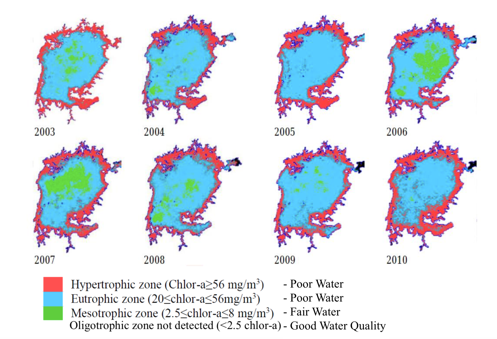

---
---

[home](home.html)

# 1.0 Introduction

The following report outlines the case study developed for the University of Saskatchewan’s Queen Elizabeth II Diamond Jubilee Scholarship Planetary Health Placement in partnership with Dr. Okello and the National Fisheries Resource Research Institute (NaFIRRI) in Uganda. The purpose of this partnership was to explore planetary health issues around Lake Victoria (locally known as Nalubale) in regard to increased eutrophication and harmful algal blooms (HABs), as well as the associated risks to vulnerable fishing communities in the Lake Victoria Basin.

The eutrophication of Lake Victoria is a complex problem which has serious social, environmental and economic implications that need to be addressed using a system-thinking approach. The first objective of the case study involved developing a mesocosm experiment to test the growth responses of cyanobacteria under different nutrient conditions. The second objective of the case study was to identify through observational data how fishing communities and water users around Lake Victoria would be impacted by HABs.

## 1.1 Background

Lake Victoria is Africa’s largest fresh water lake with a surface area of 68,000 km2 and part of the African Great Lakes system located within the East African Rift Valley (Bootsma & Hecky 2003). It is also considered a Global Great Lake (Bootsma & Hecky 2003). The lake shares international boundaries with Tanzania, Uganda and Kenya (Bootsma & Hecky 2003). Tanzania has the largest portion of Lake Victoria, followed by Uganda, then Kenya. The upper Lake Victoria Basin includes the additional countries of Burundi and Rwanda (The World Bank, 2018). The Lake Victoria Basin drains into the River Nile (its only outlet) and is considered locally as the “source of the Nile”.

Lake Victoria has experienced large changes over the last several decades, including rapid population growth, biodiversity loss, diversified resource use and water quality conditions. The lake underwent significant changes in the 1950s with the introduction of Nile perch which led to social, economic and environmental strains on the lake and water users (Pringle, 2005). This introduction led to large ecological shifts and biodiversity losses within the lake but also promoted more profitable fish catches and opportunities for development (Bootsma & Hecky 2003). The world bank estimated that the Lake Victoria Basin supports a population of approximately 45 million, with the significant increase occurring over the last twenty years (The World Bank, 2018). A large portion of the population within the basin and along the shores of Lake Victoria rely heavily on the natural resources of the area (Ntiba et al., 2001).

The lake supports commercial and local fishing industries, industrial activity, shipping and transport, aquaculture facilities, hydropower, municipal water and water waste treatments, agriculture (commercial and subsistence) and tourism (Scheren et al., 2000). These uses have produced multiples sources of pollutants (point and non-point) that enter into the lake (Ntiba et al., 2001). The large demand on the lake has led to increased eutrophic and hyper-eutrophic zones along the shoreline and highly degraded quality water, seen in figure 2 (The World Bank, 2018). Therefore, the local anthropogenic impacts paired with the environmental conditions (weather patterns and temperature) of Lake Victoria puts the local inhabitants and water users at higher human and environmental health risks caused by HABs.

{ width=100% }
Figure 2. This figure shows changes in water quality long the shorelines of Lake Victoria over the past seven years (The World Bank, 2018)

In addition to the local anthropogenic stressors on Lake Victoria, the continued global exceedance on the planet’s boundaries, such as climate change and biogeochemical flows, amplifies the lakes vulnerabilities (Rockström et al., 2009). Shifts in global and localized weather patterns brought on by climate change will greatly impact the local hydrology and ecology of the area. Changes in precipitation (both increased or decreased conditions) and temperature can influence bloom production (Paerl & Huisman, 2008). Growth in global population and food production suggest the increased use of nutrient rich fertilizers, which ultimately travel through the environment and end in water systems (freshwater and saltwater ecosystems).

## 1.2 Literature Review

The purpose of this literature review is to explore the topics of increased eutrophication in tropical freshwater lakes and the associated harmful algal blooms (HABs) that are produced under these conditions. The eutrophication of water bodies is strongly connected to increased additions of nutrients (specifically, Nitrogen (N) and Phosphorus (P) from human activity (agriculture, wastewater and industry etc.) (Conley et al., 2009). Other environmental conditions that influence eutrophication are sunlight, water temperature, resistance time, and the pre-existing natural conditions (Paerl and Paul, 2012). Increased eutrophication promotes primary productivity and alters the existing water bodies’ chemical, physical and biological structure (Conley et al., 2009).

The development of HABs are strongly linked to eutrophic conditions (Gikuma-Njuru et al, 2005). HABs are produced by cyanobacteria (or blue-green algal) and disrupt the natural system which results in negative impacts on human and environmental health (Dionysiou, 2010). HABs can cover large surface areas on bodies of water which can cause changes in turbidity and light conditions, oxygen, water temperature and pH as well as biological composition (including large fish kills) (Paerl and Paul, 2012). HABs cause a variety of direct and indirect planetary health issues.

Direct human health impacts are associated with the production of toxins produced by cyanobacteria. The types of toxins produced by certain cyanobacteria species can be identified as neurotoxins, hepatotoxins and irritant-dermal toxins (Okello et al., 2010). Acute and chronic exposure to these toxins can occur through consumption (drinking or eating contaminated food), physical contact, and/or inhalation (Koreivienė et al., 2014). Several studies found that recreational exposure to cyanobacteria results in symptoms such as fever, gastrointestinal illness (diarrhoea and vomiting) headaches, pneumonia, myalgia, skin irritations, mouth ulcers, eye infections and ear infections (Koreivienė et al., 2014). There are multiple factors that influences the symptoms produced by the toxins depending on an individual’s health, type and duration of exposure, dosage, concentration of toxin and toxin type (Koreivienė et al., 2014).

In freshwater systems, the most common form of toxin produced by cyanobacteria is the cyclic heptatpeptide microsystins (Okello et al., 2010). The main species of concern are _Anabaena_, _Anabaenopsis_, _Microcystis_, _Nostoc_, and _Planktothrix_ _spp_ for production the hepatotoxin microcystins (MCs). In Uganda it was found that _Microcystis_ produced the highest amounts of MC during a 2010 study on twelve freshwater systems (Okello et al., 2010). Common symptoms of low-level Microcystin exposure are nausea, thirst, headache, vomiting, diarrhoea, malaise; high-levels of exposure can result in shock, vomiting, dyspnoea, varying pulse rates, weakness, respiratory distress, liver inflammation, hepatotoxicosis, and organ failure (Koreivienė et al., 2014). Koreivienė et al. (2014) suggests the cases of toxin exposure are often missed due to lack of information and knowledge on these issues, including multiple exposure routes to toxins. Although, the symptoms of MC toxin are understood there are still areas of public health and epidemiology research that need to be addressed.

The study of toxin up-take and transfers throughout the food-web in freshwater ecosystems is an important area of health research that is currently being improved upon. Fish production from Lake Victoria supports local diets and global export markets and the potential transfer of toxins from fish to humans is a serious health risk (Poste et al., 2012). Semyalo et al. (2010) studied the potential contamination of Nile tilapia with MC in Lake Victoria. The study found that in Lake Victoria there was a positive relationship between the concentration of MC in the water and in the Nile tilapia gut but further research is needed to understand the potential transfer of toxins through the food-web and impacts on human and animal health (Semyalo et al., 2010). Understanding how toxins are transferred through the food-web can help develop global guidelines for fish standards and improve water quality guidelines  (Poste et al., 2012).

In addition to the direct human health impacts from HABs, there are several indirect health and environmental impacts caused by HABs. HABs cover large areas of water bodies which lead to low-no oxygen conditions (Anderson et al., 2002). These changes in water conditions can lead to detrimental shifts in ecological structure, such as fish kill (Anderson et al., 2002). Communities that are reliant on the lake for natural resources are severely impacted by the environmental degradation of the lake. HABs can impact the local economy by reducing or eliminating fish production (large fish-kills), causing livestock fatalities and disrupting tourism ventures (Cheung et al., 2013). These local economic impacts can greatly impact these communities’ livelihoods through a reduction of income and food sources. These impacts can directly relate back to their physical and mental health.

Therefore, because of the serious direct and indirect human and environment health risks associated with HABs, research needs are focused on management and mitigation strategies. There is a strong relationship between nutrients (N and P) and eutrophication, and therefore nutrient management is often the focus of research. Other environmental factors such as sunlight, temperature and resistance time are nearly impossible to control. Understanding the relationships between the environmental influences and nutrient additions into water bodies can help promote effective policy and management solutions.

There are complex interactions between the natural environment and anthropogenic disruptions that determine species presence and toxin production in HABs. Cyanobacteria are highly adapted organisms that tolerate a wide range of environmental conditions (Anderson et al., 2002). Cyanobacteria are able to use nutrient for growth and therefore research is focused on how the nutrient present in water bodies influences growth (Mur et al., 1999). The identification of P-limitation in freshwater and N-limitation in saltwater ecosystems has been globally established but the focus on freshwater study has dominantly focused on temperate lakes (such as the Laurentian Great Lakes). Variations between freshwater systems (trophic and temperate) adds to the complexity of the issue. Previous nutrient enrichment experiments conducted in the Lake Victoria Basin determined that the lake is N-limited and not P-limited for primary productivity (Guildford et al., 2003). Within cyanobacteria there are differences between N2-fixing and non N2-fixing species, which adds to the complexity of problem. N-sources used by cyanobacteria can be inorganic such as ammonium (NH4), nitrate (NO3) and organic such as Urea ((NH2)2CO) (Flores & Herrero, 2005). Research efforts are focused on how nutrient impacts toxin-producing species of cyanobacteria (Cheung et al., 2013).

On the forefront of this research are studies on the impact of urea ((NH2)2CO) fertilizer on HABs development for several reasons. Globally, the use of urea for an N-source fertilizer is rising and is forecasted to continue to rise with the growing global demand for food production (Finlay et al., 2010). Urea is an organic compound that has two available N-molecules and has been found to be highly soluble in water (Finlay et al., 2010). Studies suggest that the addition of urea may promote conditions favourable to _Microcystis_ and the production of microcystins verses other N2-fixing species (Finlay et al., 2010). It is important to understand how different forms of nutrients paired with existing environmental conditions impact the cyanobacteria species composition (specifically in regard to toxic producing species).

Therefore, the presence of HABs is a complex planetary health issue which requires a systems-thinking approach to protect human and environmental health. Specifically, HABs have serious health and wellbeing implications for Lake Victoria which requires transdisciplinary research efforts. The complexity of HAB development requires site specific research to understand how blooms occur under environmental and anthropogenic conditions. For the purpose of the case study the Napoleon Gulf served as the research field site. The placement was designed first to further the understanding of how nutrient enrichment in the Napoleon Gulf could influence HAB development, specifically looking at the differences between N-sources (Urea, NH4 and NO3). The second purpose was to take the information/data gained from the experiment and relate it back to the users of Napoleon Gulf who are at the greatest risk. Combining these research efforts may allow for the development of culturally and environmentally sensitive solutions. Improving upon site-specific research can improve the global understanding of HABs development and planetary health impacts.

## 1.3 Objectives

1. Develop a mesocosm experiment on Napoleon Gulf to determine the growth of cyanobacteria under different nutrient conditions and measure toxins produced under these conditions.

2. Partake in observational community visits to understand the risk and vulnerability of the fishing communities in Napoleon Gulf in regard to increased occurrence of harmful algal blooms.
