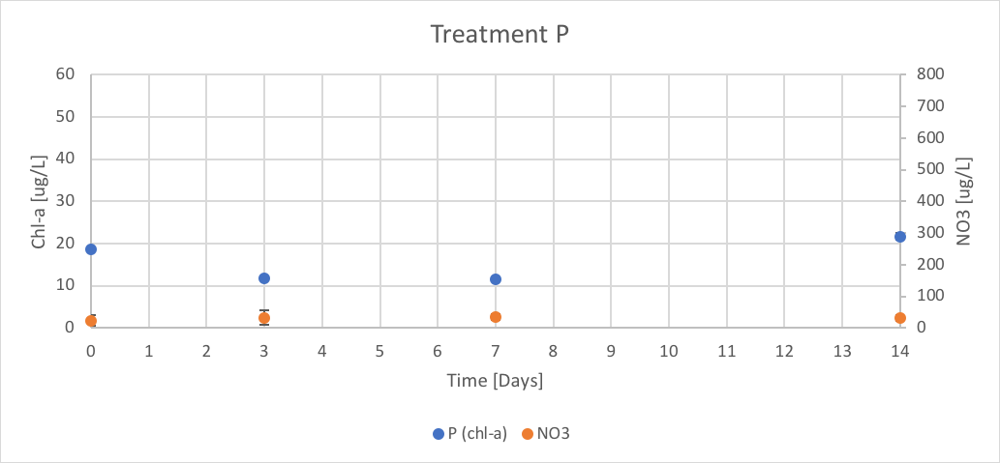

---
---

[home](home.html)

# 4.0 Laboratory Analysis

## 4.1 Objectives

The 1 litre samples collected on Days 0, 3, 7 and 14 for trial 3 were analyzed to determine the concentration of chlorophyll-a (chl-a) and the concentration of specific nutrients over the period of trial 3 for each treatment. The following nutrients were analyzed: soluble reactive phosphorus (SRP), total dissolved phosphorus (TDP), total dissolved nitrogen (TDN), ammonium (NH 4) and nitrate (NO3). Measurements were taken on Day 0 to determine the initial conditions, on Day 3 to determine the conditions on the predicted peak of chl-a, on Day 7 to determine conditions after enrichment and on Day 14 to determine the final conditions. Further analysis will be done in Canada to determine the species succession and toxin profiles. The purpose of these analyses were to determine the nutrient conditions in the Napoleon Gulf that promote cyanobacteria growth and toxin production. This information can be used for further nutrient management and improving monitoring and prediction techniques in the Lake Victoria Basin.

## 4.2 Methodology

### 4.2.1 Filtration

Of the 1 L samples collected on Day 0, 3, 7 and 14, 250 mL of the raw sample was filtered through 47 mm GF/F (x 2) and 25 mm (x 2) filters for High Performance Liquid Chromatography (HPLC), microcystins congeners (MC-Cong) and Chl-a extraction analysis. The filtered samples were collected for nutrient analysis, section 4.2.3. The chl-a (ug/L) extraction was completed at NaFIRRI but the HPLC and MC-Cong analysis will be completed at a later date in Canada. The full methodology can be found in the technical report in appendix C.

### 4.2.2 Chl-a Extraction

The purpose of the chl-a extraction analysis was to determine the concentration of chl-a using the standard hot ethanol extraction technique paired with spectrophotometry. After the extraction process occurred, outlined in the technical report appendix C, each sample was run through the Jenway spectrophotometer at the wavelength 665 nm and 750 nm using standard procedure. The samples then had 90% Ethanol solution added and were re-run at the wavelengths 665 nm and 750 nm using standard procedure. Through this technique, absorbance was measured for each treatment and the concentration of chl-a was calculated using the equation 1.

{ width=100% }

### 4.2.3 Nutrient Analysis

Separate spectrophotometry analyses were completed for the following nutrients, soluble reactive phosphorus (SRP), total dissolved phosphorus (TDP), total dissolved nitrogen (TDN), ammonium (NH4), and nitrate (NO3). These were completed by following the standard procedure outline in Stainton & Armstrong (1977) and are reported in appendix C.

## 4.3 Results

The average of each treatment was taken and plotted over time with the standard error. The chl-a was plotted on the primary axis and the nutrient concentration are plotted on the secondary axis over time (Day 0 to 14). This was repeated for each nutrient analysis using chl-a concentration (ug/L) and chl-a (RFU), described in section 3, and all the results are reported in appendix C. The following graphs show the results of the treatments CTRL, P, Urea, Urea + P, NO3, and NO3 + P for the NO3 nutrient analysis.

{ width=100% }
Figure 12. The concentration of chl-a for average of CTRL treatment verse the concentration of NO3 over Day 0 to 14 of trial 3.

{ width=100% }
Figure 13. The concentration of chl-a for average of P treatment verse the concentration of NO3 over Day 0 to 14 of trial 3.

{ width=100% }
Figure 14. The concentration of chl-a for average of Urea treatment verse the concentration of NO3 over Day 0 to 14 of trial 3.

{ width=100% }
Figure 15. The concentration of chl-a for average of Urea + P treatment verse the concentration of NO3 over Day 0 to 14 of trial 3.

{ width=100% }
Figure 16. The concentration of chl-a for average of NO3 treatment verse the concentration of NO3 over Day 0 to 14 of trial 3.

{ width=100% }
Figure 17. The concentration of chl-a for average of NO3 + P treatment verse the concentration of NO3 over Day 0 to 14 of trial 3.

The CTRL treatment had concentrations of chl-a of 17.77 (ug/L), 3.95 (ug/L) 17.77 (ug/L) on 20.36 (ug/L) on Days 0, 3, 7 and 14 respectively. The concentrations of NO3 were negative due to negative absorbance values. These results are shown in figure 12.

The P treatment had concentrations of chl-a of 18.56 (ug/L), 11.85 (ug/L), 11.45 (ug/L), and 21.68 (ug/L) on Day 0, 3, 7 and 14 respectively. The concentration of NO3 remained relatively linear throughout trial 3 with reported concentrations of 23.05 (ug/L), 32.31 (ug/L), 33.61 (ug/L), and 32.68 (ug/L) on Day 0, 3, 7 and 14 respectively. These results are shown in figure 13.

The Urea treatment had concentrations of chl-a of 20.14 (ug/L), 35.94 (ug/L), 15.80 (ug/L), and 17.98 (ug/L) on Day 0, 3, 7 and 14 respectively. The concentration of NO3 remained relatively linear throughout trial 3 with reported concentrations of 29.90 (ug/L), 36.02 (ug/L), 33.42 (ug/L), and 27.69 (ug/L) on Day 0, 3, 7 and 14 respectively. These results are shown in figure 14.

The Urea + P treatment had concentrations of chl-a of 19.35 (ug/L), 33.57 (ug/L), 12.24 (ug/L), and 17.75 (ug/L) on Day 0, 3, 7 and 14 respectively. The concentration of NO3 were reported as 361.94 (ug/L), 114.36 (ug/L), 40.46 (ug/L), and 25.83 (ug/L) on Day 0, 3, 7 and 14 respectively. These results are shown in figure 15.

The NO3 treatment had concentrations of chl-a of 19.75 (ug/L), 17.77 (ug/L), 24.49 (ug/L), and 20.19 (ug/L) on Day 0, 3, 7 and 14 respectively. The reported concentrations of NO3 over trial 3 were 541.76 (ug/L), 409.35 (ug/L), 694.91 (ug/L), and 30.83 (ug/L) on Day 0, 3, 7 and 14 respectively. These results are shown in figure 16.

The NO3 + P treatment had concentrations of chl-a of 20.54 (ug/L), 30.80 (ug/L), 19.75 (ug/L), and 13.75 (ug/L) on Day 0, 3, 7 and 14 respectively. The reported concentrations of NO3 over trial 3 were 524.54 (ug/L), 145.83 (ug/L), 570.83 (ug/L), and 32.13 (ug/L) on Day 0, 3, 7 and 14 respectively. These results are shown in figure 17.

The discussion of these results can be found in section 4.4

## 4.4 Conclusions

The purpose of the laboratory analysis was to understand how the nutrient concentration and chl-a concentration varied over time depending on each treatment and to discuss the difference in the chl-a (RFU) and chl-a (ug/L) values. The results displayed in section 4.3 (Figure 12 – 17 ) show how the concentration of chl-a and the nutrient NO3 varied over time in the treatments CTRL, P, Urea, Urea + P, NO3 and NO3 + P.

### 4.4.1 Chl-a Concentration Discussion

The chl-a concentrations in treatments CTRL, P and NO3, did not follow the reported trends from the chl-a (RFU), section 3.3. The variation between chl-a (RFU) and chl-a (ug/L) could be because the RFU measurements are from the unfiltered in vivo samples and other particulates could have caused the change in RFU. The chl-a (ug/L) measurements are filtered and extracted, discussed in section 4.2.1, and give a more representative measurement. Another possibility is that a lab error occurred during the chl-a hot ethanol analysis. Therefore, the chl-a concentrations for treatments CTRL and P, are expected if the Napoleon Gulf is indeed N-limited. It was expected that the NO3 would follow the trends of Urea, Urea + P, NO3 and NO3 + P (RFU), but the concentration of chl-a did not peak at Day 3. This could be due to a miscalculation for the sample collection day. As reported in the chl-a (RFU) trend for this treatment the peak occurs on Day 4 not Day 3 and is lower than the initial recorded value, which follows the chl-a (ug/L) trend, figure 10 and 16.

In the Urea, Urea + P, NO3 and NO3 + P treatments the chl-a (ug/L) and chl-a (RFU) values followed the same trend with an increased peak on Day 3 and lower concentrations on Day 0, 7 and 14. When comparing the treatments of CTRL, P, Urea, Urea + P and NO3 + P, excluding the NO3, the results suggest that the Napoleon Gulf would be N-limited. With the continuation of the mesocosm experiment with both extended 21-day trials and multiple trials the conditions of Napoleon Gulf will be better understood.

### 4.4.2 NO3 Nutrient Concentration Discussion

It is important to note that due to laboratory error the TDN measurements did not include Day 3, which is a critical day for data interpretation. That is why for the nutrient analysis interpretation NO3 was used not TDN. The trend of nutrient NO3 concentration followed the predicted trends for each treatment. CTRL, P, Urea and Urea + P showed the background levels of NO3 within the lake and do not vary over trial 3. The Urea + P treatment had higher reported values of initial NO3 concentrations but were still lower than the NO3 and NO3 + P treatments.

For the NO3 and NO3 + P treatments the values spiked on Days 0 and 7, which corresponds to the nutrient enrichment days. On Day 3, the concentration of NO3 had depleted from the initial concentration for treatments NO3 and NO3 + P. This depletion for the treatment NO3 corresponds to the peak of chl-a in the RFU measurements but not the chl-a (ug/L) measurements. There are still discrepancies with the interpretation of the treatment. The depletion of NO3 nutrient in the NO3 + P treatment corresponds with both the chl-a (RFU) and chl-a (ug/L) values peaking on Day 3. This depletion suggests that the phytoplankton present within the mesocosm bags are using the nutrients for growth. For both the NO3 and NO3 + P treatments the lowest reported values of the nutrient concentration for NO3 occurred on Day 14. This supports the use of NO3 by phytoplankton in the mesocosm bags. It is important to note that the concentration of chl-a was not measured between Day 7 and 14, which might have missed an important population peak.

Due to limited time and access to proper equipment the species succession and MC congeners analysis were unable to be completed during the placement. This will be completed in Canada using High Performance Liquid Chromatography (HPLC) and an inverted microscope method. These results could show how nutrient conditions promote the growth of certain species of cyanobacteria. It was predicted that the species _Microcystis_ would have favored the Urea conditions, due to the availability of the N molecules. The analysis could also show if toxins were produced during the experiment and at what concentration throughout the experiment. This information could be compared against the World Health Organization’s standard for toxins in drinking water and recreational water use to help understand potential risks for the communities along the shores of the Napoleon Gulf. These communities rely heavily on the lake for their livelihood. These results can help develop policies regarding nutrient management in the Napoleon Gulf.
