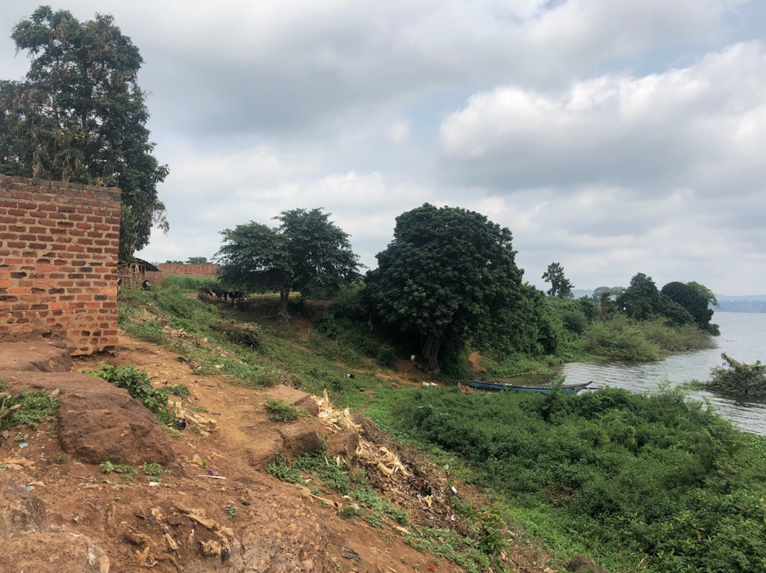

---
---

[home](home.html)

# 5.0 Social Engagment Activity

## 5.1 Objective

The purpose of the observational community visits were to determine the communities’ access to drinking water and sanitation facilities/practices and to identify how harmful algal blooms (HABs) might pose risks to these communities. The Kikondo, Wairaka, Masese and Rock villages are fishing communities within the Napoleon Gulf, whose livelihoods are highly dependent on the natural resources supplied by the lake (drinking water, hygiene practices, raw materials, food/protein sources and income/fishing). These fishing communities face the greatest risk and are often not supported by polices and development.

## 5.2 Ethics approval

The observational community visits were covered by Article 2.1 of the Tri-Council Policy Statement (TCPS): Ethical Conduct for Research Involving Humans, December 2014. Please see appendix D for the full description.

## 5.3 Methods

The four communities, Kikondo, Wairaka, Masese and Rock, were visited throughout the period of the placement. The visits were observational in nature and no quantitative or qualitative data was collected. We visited with the local council members and/or local volunteers within the communities to discuss topics of water access, sanitation and hygiene, health/health risks, use of the lake, livelihood, culture and policy. Through these discussions we were able to understand and identity the routes of exposure and associated risks these communities face during HABs.

## 5.4 Results

### 5.4.1 Water Access

Three of the four communities visited had paid access to a treated water system. The Masese and Rock communities were connected to the Jinja water system, by public water taps. It was explained that the communities could buy a permit to connect themselves to the city’s water system, but whomever purchases the permit for the community can then charge for usage. It was explained that the water tap can be run as a business. The cost to fill a 20 L jerry can range from 200-300 UGX, which works out to 0.075 CAD. The Kikondo Landing Site had a water filtration system put in by WaterMission Uganda called the Kikondo Trade Water Project. This system pumped water from the lake up into the village and was treated with chlorine and the associated cost was the same.

The Wairaka community did not have access to treated drinking water and collect drinking water directly from the lake. Although 3 of the 4 communities had access to a treated water source, it was explained that often community members are unable to afford the fee and would collect water directly from the lake. They would use the untreated water for drinking, cooking, bathing, laundry and other domestic uses. When asked if the water was boiled before consumption or domestic use, it depended on if the community member could afford charcoal for fuel. Charcoal prices are often too expensive for families to afford and often the water is consumed and used without boiling.

### 5.4.2 Sanitation and Hygiene

When asked about hygiene practices and the domestic use of the water (e.g. washing, laundry and cleaning) it was explained that bathing and washing were done directly in the lake. We were shown a few of the locations were bathing, washing and collection took place. The Wairaka community’s collection site was a five minute walk from the landing site, seen in figure 18. Men’s motorbikes (boda’s) were also washed directly in the lake (Figure 19).

{ width=100% }
Figure 18. Pictured are two members of the Wairaka community collecting water and washing clothes in the Napoleon Gulf, LV, UG.

{ width=100% }
Figure 19. Pictured here are two members of the Wairaka communities washing their bodas along the shores of Napoleon Gulf, LV, UG.

We were only able to ask the Wairaka and Rock communities about their sanitation practices/facilities. The Wairaka community had access to a community pit latrine and the Rock community has a septic system installed. The Rock community’s septic system had begun to spill over into the community, seen in figure 20. The shelters here are side by side and the sceptic system was located slightly uphill of the majority of the shelters. When asked if there were services provided by the city of Jinja or if a private company pumps the septic system it was explained that they were responsible for physically removing the waste. The lack of infrastructure for sanitation and hygiene practices impose large human health risks for these communities. Due to the structure and compacted nature of these communities the natural drainage systems within the communities promote puddles of standing water, seen in figure 21.

{ width=100% }
Figure 20. Shows the seepage (the dark material) of waste from the septic tank at the Rock Community.

{ width=100% }
Figure 21. This shows the drainage conditions within the Masese community that promotes standing water. These conditions were consistent throughout the four communities.

### 5.4.3 Livelihood

All these communities rely heavily on the fishing opportunities within the Napoleon Gulf for their livelihoods. Their day-to-day lives are completely focused around the use of the lake. Each of the communities we visited had an associated landing site. It was explained that generally the catches are sold within the communities and the farthest export would still remain in Uganda. The Kikondo and Masese are larger communities and appeared to have a more diverse economy within their communities. The women of the Rock community wash plastic bags and sell them to the siding material factory in Kampala. These women collect water from the lake to wash the bags in containers, shown in figure 22.

{ width=100% }
Figure 22. Pictured here is the washing station for the plastic bags that the women of Rock rely on for an income. Water is collected from the small opening in the wetland.

### 5.4.4 Sources of Excess Nutrients

Paired with the observational community visits, we travelled around Napoleon Gulf via boat to identity potential sources of excess nutrient additions into the lake. The first identified source of nutrient addition into the Napoleon Gulf was the urban runoff from the City of Jinja. The streets drain directly back into the gulf during rainstorms. The second source of nutrients from Jinja was the effluent from the wastewater treatment plant, although there is a system of settling ponds and a wetland buffer zone between the wastewater treatment and Napoleon Gulf. The third was grazing livestock along the shorelines. Often within these communities (and within the City of Jinja) there are cows, goats and chickens roaming and excreting waste everywhere. Figures 23 and 24 show the proximity of livestock to the water’s edge. The fourth source of nutrients was from agricultural practices along the lake. We weren’t able to learn about the fertilizer application practices but there were both commercial and subsistence farms within the gulf. The fifth source is from the aquaculture farms located within the Napoleon Gulf. The sixth source of nutrients was from industrial activity within the Napoleon Gulf. A tannery was located only feet away from the Rock community, seen in figure 25. The final source of waste identified was from human activity within the local communities. Often, as mentioned in the previous section, there is a lack of proper sanitation facilities and infrastructure, so human waste directly enters into the lake. Bathing and washing in the lake are common hygiene practices within these communities, and when examining the detergent, we found P compounds were present. Again, men wash their bodas in the lake which can add multiple contaminates into the lake.

{ width=100% }
Figure 23. This is the landing site at the Wairaka village with a cow grazing right along the water’s edge.

{ width=100% }
Figure 24. Shows the cows and goats uphill of the water at the Kikondo village.

{ width=100% }
Figure 25. Pictured here is the community of Rock and the tannery directly across from them.

## 5.5 Conclusions

Throughout the communities visits we were able to identify several routes of toxin exposure the communities would face during a HAB. The conceptional diagram, seen in section 1.0 figure 1, shows the identified routes of exposure identified in all four of the communities.

There were two main routes of potential toxin exposure identified. The first being direct consumption and the second being physical contact. It is important to note that although we were unable to determine if inhalation of the toxins were occurring in the basin, it has been identified within the literature as a potential route and is likely to occur within the Napoleon Gulf during a HAB. As mentioned in the previous section, these communities rely on the water for drinking and cooking purposes. This allows for direct consumption of the toxins, if present. Boiling does not effectively remove toxins from waters, and again as mentioned before, boiling often doesn’t occur which leads to the higher risks of pathogen exposure. A third possible source of contamination could be through the consumption of fish, which is a staple in the communities’ diet. As mentioned in the literature, there is still limited understanding on how toxins move through this web-food but since the fish production is critical to the lake it is an important area of research to develop.

The second being physical exposure to HABs and toxins. The day-to-day lives of these community members revolve around the use of the lake. The women and children collect water for drinking, cooking and domestic use. Community members bath and wash items (clothes, bodas etc.) in the lake. The men of the community are out on the lake during the day fishing and wade out into the waters. This physical exposure puts them at risk for inhalation of the toxins as well.

When asked about the presence of algae in the lake there was mixed understanding but when properly translated most understood what it was. When asked about sickness and rashes caused by the algae, they often would rely with rashes, by gesturing to their skin to show irritation. Some explained that they understood algae was bad and would cause irritation but avoiding it was not an option for them. It is important to note that the symptoms of toxin exposure are often similar to those of other water-borne illness, diarrhea, vomiting, weakness, etc. It is likely that these communities would not have excess funds to access sufficient medical treatment, so it could be assumed that cases of acute and chronic toxin exposure would go unreported.

In addition to identifying the risks and exposures, we talked briefly about policy and regulations surrounding the lake. These communities are deemed “illegal” and practice “illegal fishing” so their concerns and voices aren’t met nor heard. They mentioned that they feel the policies surrounding the management of the lake are not reflective or beneficial to them and only benefit industry. Since, they are unable to voice their concerns and are at the greatest risk there needs to be the co-development of culturally and environmentally sensitive policies.
