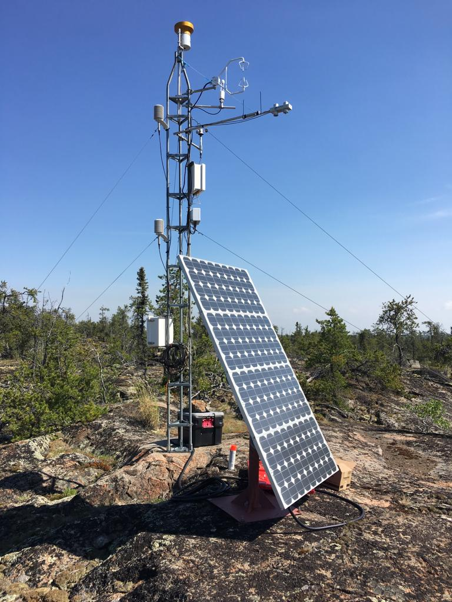

---
---

[home](home.html)

# 3. Data Analysis

## Objectives

The objective of the data analysis portion of this project was to prepare the driving data and streamflow data for the model. The meteorological parameters required by MESH are: temperature, humidity, barometric pressure, wind speed, incoming shortwave radiation, incoming longwave radiation, and precipitation. The timestep of the driving data files must be the same frequency of the model timestep (typically 30 or 60 minutes) and be complete for the entire model duration (University of Saskatchewan, 2019a). Preparation of the driving data involved combining driving data from a number of sources into one continuous set.

## Data Summary

Driving data for the model was obtained from 4 sources:

1) Environment and Climate Change Canada's historical weather records for the Yellowknife A station (Environment and Climate Change Canada, 2019). 
2) Hydrometeorological and hydrological data collected within the Baker Creek Watershed during research activitys betwen 2003 and 2016 (Spence & Hedstrom, 2018); the Vital Tower is shown in Figure 3.1 below.
3) Environment and Climate Change Canada's Regional Deterministic Prediction System (RDPS), which is based on the GEM-NWP model (Mailhot et al., 2006).
4) Precipitaiton data from the Canadian Precipitation Analysis (CaPA) dataset (Fortin et al., 2018).

{height=9cm}  

> ***Figure 3.1 - Vital Tower located within the Baker Creek watershed (Photo Credit: A. Cook, 2019)***

Historical weather records for the ECCC Yellowknife A station are available since 1942 and includes air temperature, wind speed, barometric pressure, and relative humidity at a hourly timestep, and precipitation at a daily timestep (Environment and Climate Change Canada, 2019a). 

The CaPA datasets are produced by ECCC by combining precipitation data from a number of different sources such as precipitation gauges operated by the Meteorological Service of Canada and other partners, radar information from the Canadian Weather Radar Network, and short-term forecasts provided by the Regional Deterministic Prediction System (RDPS) using the Regional Deterministic Precipitation Analysis (RDPA) (Environment and Climate Change Canada, 2014). The CaPA data is available for much of North America, and consists of a gridded quantitative precipitation estimate (QPE) every 6 hours or 24 hours.  For this project, CaPA data was obtained for the grid containing the Vital Tower in the Baker Creek Watershed for the years between 2002 and 2018 at a 6 hour timestep.

Meteorological measurements at an hourly timestep were obtained from ECCC's Global Environmental Multiscale (GEM) model (Mailhot et al., 2006) at a 40 m height from 2004 onward, and from a 2 m height from 2011 onward. GEM is used in the Regional Deterministic Prediction System (RDPS) which produces short-term forecasts (Environment and Climate Change Canada, 2014). 

Spence & Hedstrom (2018) includes hydrometeorological data, ground temperature, soil moisture, streamflow, and spatial data for the Baker Creek watershed between 2005 and 2016; a number of these datasets were utilized for the project.

The meta data for the hydrometeorological data sources are shown in Table 3.1 and 3.2 below. 

> ***Table 3.1 - Measurement interval, time period, and units for the hyrometeorological data sources used in the model and units requred by MESH***
{height=9cm}  

> ***Table 3.2 - Measurement heights for the hyrometeorological data sources used in the model***
{height=4.3cm}  

Streamflow measurements were obtained from the Water Survey of Canada for station 07SB013 "Baker Creek at the Outlet of Lower Martin Lake"(Water Survey of Canada, 2019). The end of the modelling period was limited to the end of 2016 since streamflow observations beyond that time were not available at the time of data sourcing.

## Quality Assurance and Quality Control
Quality assurance and quality control checks were performed during data processing by visually comparing plots of meteorological variables from each source. Conservation of the sum of precipitation and of the average of all other variables was ensured by comparing the completed driving dataset with the original source data. 

## Methods

All data processing and plotting was done using the R programming language via RStudio (Studio Team, 2018). The general methodology was to characterize each dataset, load into R, plot the data, perform unit conversions, perform timezone shifts (for the GEM and CaPA datasets), interpolate the data, and scale the meteorological observations up to the measurement height required for the model (as necessary). The datasets from each source were prepared separately and converted into a consistent format. Then, the forcing variable from each source was compared, and stitched into one complete set. The priority of source datasets was:

- Vital Tower
- Yellowknife A
- GEM/CaPA for the grid containing Vital Tower

The R scripts used in the driving data preparation and additional driving data preparation methodology are included in Appendix D.

The Yellowknife precipitation data was not used due to the coarse (daily) measurement interval; however, it was used to during analysis to compare with the precipiation data from the other sources. Precipitation data from the Vital Tower was not adjusted for undercatch. Even though GEM data was obtained for both 2 m and 40 m measurement heights from 2004, only the 40 m dataset was used for consistency purposes and to limit the calculations required.

Hourly observations from the Yellowknife and GEM datasets were converted to half hourly intervals using linear interpolation. The CaPA precipitation data was converted from 6 hourly to half hourly intervals by taking the precipitation rate at the time observed and back-filling the 6 hours prior with the same precipitation rate (i.e. the reported precipitation rate is the precipitation rate for the previous 6 hours).

During data inspection, there were some noticeable shifts forward in time or up in magnitude in the Vital data compared to the GEM and/or CaPA data. These shifts were adjusted to match the GEM/CaPA data or sections removed from the final dataset (see Appendix D for more detail). 

All data sources were taken as local standard time for Yellowknife (Mountain Standard time, UTC-7) except for the GEM and CaPA data which was in UTC. Therefore, GEM and CaPA data were shifted to MST.

Relative humidity was converted to specific humidity using the equation from the MESH wiki page (University of Saskatchewan, 2019a). Temperature observations were scaled up to 40 m using a dry adiabatic lapse rate of 6.5^o^C/km. Wind observations were scaled up to 40 m using equations 3.27 and 3.30 a and b from Dingman, 2015 considering an average vegetation height of 2 m.

Streamflow measurements obtained from the Water Survey of Canada at station 07SB013 were loaded into R, and then processed for use in the model.  MESH does not read negative flow values and requires a full complete dataset for the model duration; therefore, missing values were replaced with an arbitrary negative number (i.e. -9999), and subsets for the calibration and validation periods were created by converting flows outside the period of interest to negative values.

## Results

The outcome of the data analysis was a continuous dataset for the modelling period for each of the seven hydrometeorological variables requred by MESH, as well as the streamflow data for the model input and post-processing.
