---
---

[home](home.html)

# 4. Model

## Objective

The main objective of the modelling exercise was to repeate the experiment by former MWS student, H. Mkandla (2017), in the Baker Creek watershed to determine if the same relationship between model complexity with respect to the representation of spatial heterogeneity in the MESH model would be observed compared to those obtained in the White Gull Creek watershed. The key observations from the White Gull Creek modelling are presented in the *Introduction* section. The main objective is hereafter referred to as "Phase 1" of the project.

The secondary objectives, selected upon reviewing the results of the replication phase, were to a) Calibrate a third modelling scenario considering more than one grid in the basin in order to include sub-basin routing (Phase 2), and b) Assess the model performance using the PDMROF overland flow algorithm (Phase 3).

## Model Description
The modelling was completed using the MESH model (Modelisation Environmentale Communautaire (MEC) - Surface and Hydrology).  MESH is a land-surface-hydrology model which couples a land-surface scheme (LSS), which represents the vertical movement of water and energy between the atmosphere and earth's surface and subsurface, and a hydrologic model, which characterizes the movement of water horizontally over the land as well as through the soil (Changing Cold Regions Network, 2019). For this project, the Canadian Land Surface Scheme (CLASS) version 3.6 (Verseghy, 2012) and WATROF (Kouwen, 2014) options were utilized within MESH for Phase 1 and 2, and PDMROF (Mekonnen et al., 2014) was utilized for Phase 3.  Phases 1 and 2 utilized MESH version r1024, which was the same version used by Mkandla (2017), and verion r1552 was used for Phase 3.

The MESH model uses a Grouped Response Unit (GRU) methodology, which assumes that each GRU will behave hydrologically similarly based on certain properties, such as vegetation, land use, soil type, slope/aspect, etc (Kouwen, 2014). Each GRU is parameterized with one or more of five landcover types - needleleaf trees, broadleaf trees, crops, grass, and urban/barren land/impervious areas (University of Saskatchewan, 2019a), as well as hydrological and soil characteristics. GRUs are not necessarily contiguous throughout the watershed. The MESH setup requires that the watershed be divided into one or more grids, and the portion of each GRU within a grid cell are called tiles (Elshamy et al., 2019). At each timestep, MESH utilizes the LSS (CLASS in this case) to calculate the vertical water and energy balances for each tile.

The OSTRICH software (Matott, 2017) was used for calibrating the model. OSTRICH can be used with any text-base modelling software, and can be configured to utilize a number of different calibration and optimization algorithms (Matott, 2017). The Dynamically-Dimensioned Search (DDS) algorithm was used to calibrate MESH; this algorithm was created for calibrating hydrologic models with a large number of parameters (Tolson and Shoemaker, 2007). The DDS algorithm is for global optimization, it adjusts the search space to find a good solution and avoid poor local optimum values, and has been shown to be computationally efficient compared to other methods (Tolson and Shoemaker, 2007). A General-purpose Constrained Optimization Platform (GCOP) was also used within OSTRICH, which uses a response variable to calculate the system cost and penalty function; the goal of the algorithm is to minimize the cost function (Matott, 2017). For this project, the Nash-Sutcliffe Efficiency (NSE, Nash & Sutcliffe, 1970) was used as the response variable, but since OSTRICH seeks to find the minimum, the negative of NSE was fed to OSTRICH. A script was also written to return an infeasible value of negative-NSE in the case of a model crash. The equation for calculating NSE is:

$$NSE=1-\frac{\sum_{t=1}^{T}(Q_{sim}^t-Q_{obs}^t)^{2}}{\sum_{t=1}^{T}(Q_{obs}^t-\overline{Q_{obs}})^{2}}$$

where $Q_{sim}^t=$ modeled streamflow at time *t*, $Q_{obs}^t=$ observed (measured) streamflow at time *t*, and $\overline{Q_{obs}}=$ mean of observed streamflow.

The Nash-Sutcliffe efficiency is a the difference between initial and residual variance divided by the initial variance; when the residual variance is equal to the intial variance, NSE=0 and the simulated values are the same as the no-model values (Nash & Sutcliffe, 1970). The NSE value can range from $-{\infty}$ to +1, with a value of 0 meaning that the average of the streamflow is just as close of a guess as the model output (Nash & Sutcliffe, 1970) and a value of 1 representing a perfect match between observed and simulated values.

The OSTRICH configuration settings are presented in Table 4.1 below.

> ***Table 4.1 - OSTRICH configuration details***   
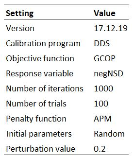{width=50%, height=6.4cm}

For all scenarios, there were four soil layers defined with thicknesses of 0.15 m (shallowest), 0.25 m, 0.70 m, and 3.00 m (deepest) for a total depth of 4.1 m.

## Methods

This section presents the methods used in designing the model configuration for each scenario, selecting parameters and initial conditions, and running the model.

### Model Configuration Scenarios

To the extent possible, the methodology used in the Mkandla project (Mkandla, 2017) were followed for Phase 1 of this project while also adjusting the setup where appropriate to incorporate the characteristics of the Baker Creek watershed. All of Mkandla's MESH modelling files were available for this project, so the same setup and procedure was closely followed.

In the Mkandla experiment (2017), six different model configurations were used. These configurations differed by utilizing a uniform, averaged forcing dataset vs distributing two different forcing datasets betwetten the 2 ecodistrics, by implementing a uniform parameter set over 1 or 2 GRUs (i.e. whole watershed or by ecodistric), varying the parameters within each GRU by ecodistric, or by distributing the parameters based on landcover type in each ecodistrict (see Table 1.1, in the *Introduction* section). Since the watershed area was relatively small and the goal of the project was to explore the effect of the representation of sub-grid spatial heterogeneity within MESH, all scenarios considered one grid cell (Mkandla, 2017).

The Baker Creek watershed is approximately 155 km^2^, which is approximately one-quarter of the size of the White Gull Creek watershed (629 km^2^), and is located within one ecodistrict (see *Site Description*.  Additonally, there was only one set of driving data for the basin (see *Data Analysis*).  Therefore, the replication phase (Phase 1) of this project considered only two different model configurations; the details are presented in Table 4.2 below.

> ***Table 4.2 - Model configuration details***
{height=4.6cm}

Scenario 1 considered the basin to contain one GRU - meaning that the entire watershed is assumed to behave hydrologically similar.  This GRU contained five landcover types based on the CLASS parameterization (Verseghy, 2012).  The land cover types defined in Spence and Hedstrom (2018) were used, with the CLASS landcover type "grass" being used to define wetlands and peatlands, and the "barren land" type being used to define open water and exposed bedrock areas (see Table 4.3 and Figure 4.1 below).

In Scenario 2, the basin was divided into 6 GRUs defined by landcover type, with the vegetation, surface, hydrology, and soils parameterized individually for each GRU (see Figure 4.1 below).

In Scenario 3, the parameterization was the same as for Scenario 2 but the watershed was divided into five grid cells (see Figure 4.1 below) with tiles in each cell representing the a portion of each GRU. This configuration was chosen as it was the next logical step in increasing the complexity of the model configuration.

Scenarios 1-P and 2-P were parameterized the same as Scenarios 1 and 2, respectively, except that parameters for WATROF were replaced with those for PDMROF (Mekonnen et al., 2014; University of Saskatchewan, 2019a). It was hypothesized that due to the large number of lakes, dominance of large lakes, and fill-and-spill nature of the basin, PDMROF may improve the predictive power of the model.

> ***Table 4.3 - Landcover parameterization in the MESH model***
{height=5.5cm}

{width=100%}  

> ***Figure 4.1 - Conceptual figure of MESH scenario configurations***

### Parameter selection

The general methodology for parameter selection was to choose values (for non-calibrated parameters) and ranges (for calibrated parameters) that would best represent the physical conditions in the Baker Creek basin based on literature and personal experience of research personnel (Spence, 2019). Table C.1 in Appendix C presents the parameter values, rationale, and referenced sources for non-calibrated parameters, and Table C.2 presents the parameter ranges, rationale, and referenced sources for calibrated parameters. Soil characteristics were first selected for Scenario 2, and an areal-weighted average by landcover type (Spence and Hedstrom, 2018) was used to select the values and ranges to represent the "effective" soil characteristics for Scenario 1. Since bedrock and peat are parameterized in MESH using integer flags (University of Saskatchewan, 2019a), bedrock layers were appoximated as 100% clay, and peat layers were approximated as 100% organic matter.

### Initial conditions

The model start time was selected to be in the fall at a time when the vegetation was entering the dormant stage, when there was no snow in the watershed, and there had been little to no rain in the few days prior. These conditions allow the initial condition of snow depth, snow density, and water ponding depth in the canopy and on the ground to be set to zero, which avoids introducing bias into the model by estimating these values. Normally, a hydrological model start date is selected as October 1st - the "typical" start of the hydrologic year, but due to the northern latitude and precipitation conditions in 2006 when the model was started, the start date was chosen as September 15th.

Initial soil temperature and moisture for the surface layers were calculated from the average of the observed measurements on September 15 from the data reported in Spence and Hedstrom (2018) and the temperature and moisture profiles for the deeper layers were estimated based on the trends reported in Morse, Wolfe, Kokelj, & Gaanderse (2016). For Scenarios 2, 3, and 2-P, variations based on landcover type were considered in selecting the initial conditions.

### Running the models

As discussed above, the model start date was selected as September 15, 2006 and the first year of the model run was used as a spin-up period prior to calibration. During the years of data availability (2005-2016), there was a general period of wetter-than-normal conditions in the watershed from 2008 to 2011, and a drier-than-normal period from 2012-2016 (Spence and Hedstrom, 2016). The model calibration period was divided into two sections - one in the wet period and one in the dry period - in order to condition the model to respond to both states. The model was calibrated from September 15, 2007 through September 15, 2010, and from September 15 2013 through September 14, 2015 (5 years total); the validation periods were September 15, 2010 through September 14, 2013, and September 15, 2015 through September 13, 2016 (4 years total). Figure 4.2 below shows the hydrograph for WSC station 07SB013 at the outlet of the watershed for the years between 2005-2016 along with the selected spin-up, calibration, and validation periods.

MESH was run using a half hour timestep and a reference height of 40 m for all measurements.

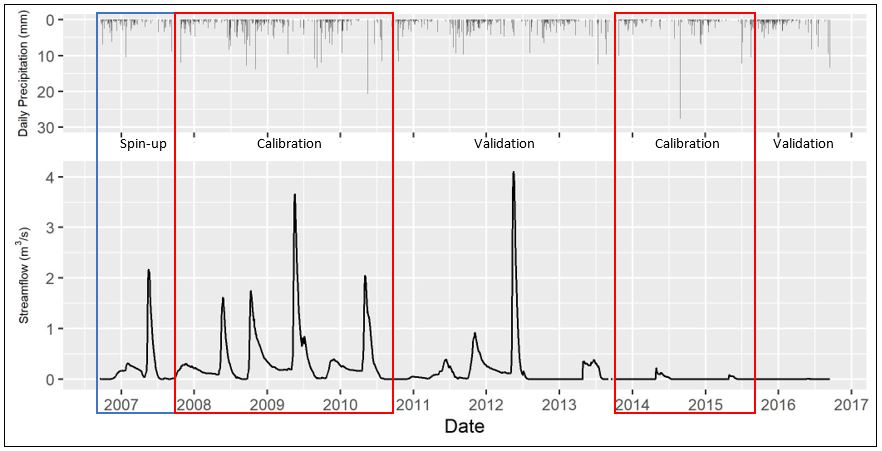{height=9cm}

> ***Figure 4.2 - Streamflow at WSC station 07SB013 Baker Creek at the Outlet of Lower Martin Lake and the daily precipitation forcing data, showing model spin-up, calibration, and validation periods***

The model scenarios were calibrated using OSTRICH for 100 trials - each using a different seed number - with 1000 iterations of MESH for each trial. MESH and OSTRICH were compiled and the calibrations were run on the University of Sasktchewan's High-Performance Computing cluster, PLATO (University of Saskatchewan, 2019b). In order to reduce total model run time, the scenarios were divided into batches and run concurrently; Scenarios 1, 2, 1-P, and 2-P were divided into 10 batches, and Scenario 3 was divided into 15 batches.

## Results

Results were processed and visualizations created using RStudio (Studio Team, 2018); the post-processing code is included in Appendix D.  Water balance plots for each scenario are included in Appendix C. 

The trial number and NSE value for the best calibration run and corresponding validation NSE are presented in Table 4.4 below, and a figure showing box plots of the NSE of calibration results for the 100 trials of each model scenario are presented in Figure 4.3. The ranked NSE values for the calibration of all scenarios is presented in Figure C.1 (Appendix C). It is observed that the best calibration result for Scenario 1 is below zero, meaning that the average observed streamflow provides a better estimate of watershed response than the model result (Nash & Sutcliffe, 1970). The best calibration results for Scenarios 2 and 3 are only slightly above zero while the majority of the results from the 100 trials were below zero. With increasing model complexity from Scenario 1 to 2 to 3, the model performance in terms of NSE also improved. In both cases, the configuration utilizing PDMROF performed better than the one using WATROF. While Scenario 2 results were better than Scenario 1, Scenario 1-P results were better than Scenario 2-P. 

> ***Table 4.4 - Summary of Nash-Sutcliffe Efficiency (NSE) values for the calibration and validation periods of each model scenario***  
{height=4.3cm}  

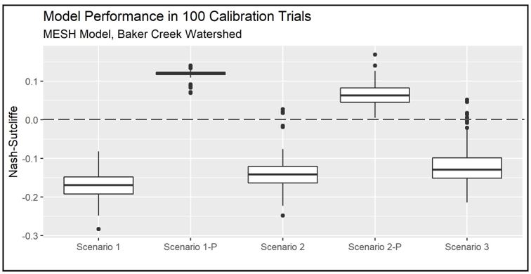{height=7.7cm}  
  
> ***Figure 4.3 - A comparison of the model performance (NSE) for each configuration scenario. The horizontal line represents the NSE limit below which model results are worse then no-model observed streamflow***

Hydrographs showing measured vs. best calibration streamflow, as well as NSE values for the calibration and validation periods, are presented in Figure 4.4 through 4.8.

As shown in Figure 4.4 below, the streamflow results from Scenario 1 do not match measured streamflow well. Only the magnitude of the spring peak in 2010 is matched, while the rest of the spring peak flows are greatly underestimated (or missed entirely), and the spring peak flows during the dry period are greatly overestimated. Additionally, fall peak flows and winter flows are not represented by the model. 

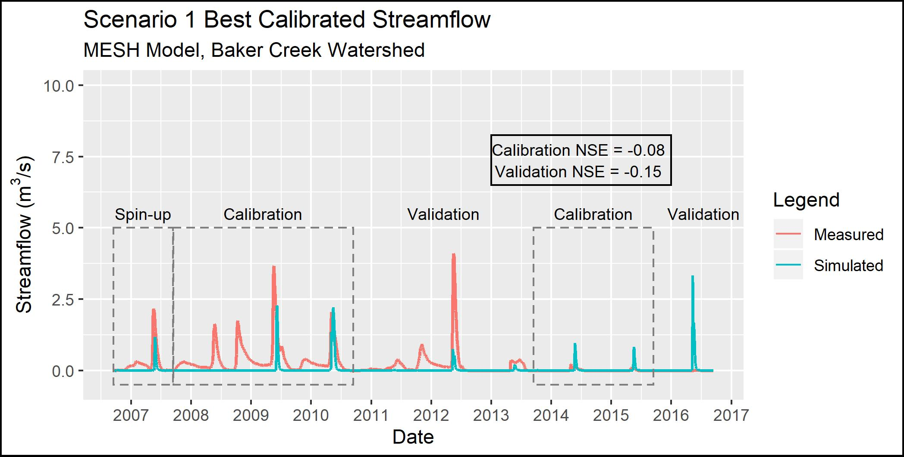{height=8cm}

> ***Figure 4.4 - Observed and simulated streamflow for Scenario 1***

As shown in Figure 4.5 below, the Scenario 2 model configuration simulates the peak flows in the spring of 2009, 2010, and 2012 reasonably well, yet misses the fall/winter flows, especially the fall peak flows in 2008, 2009, and 2011. This scenario estimates the spring peak flows better than Scenario 1 for most years, and there is a small amount of fall flow in 2009. The model also tends to under-estimate peak flows during the wet period (2008-2012) and over-estimate peak flows during the drier period (2013 onward). 

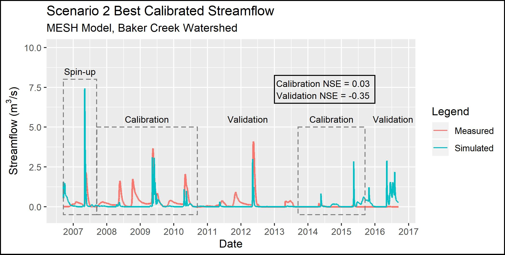{height=8cm}

> ***Figure 4.5 - Observed and simulated streamflow for Scenario 2***

The results for Scenario 3 are comparible to Scenario 2, as shown in Figure 4.6 below (compared to Figure 4.5 above).  This similarity indicates that increasing the complexity by adding more grid cells in the basin and including hydraulic routing through the basin resulted in only minimal improvement in model accuracy.

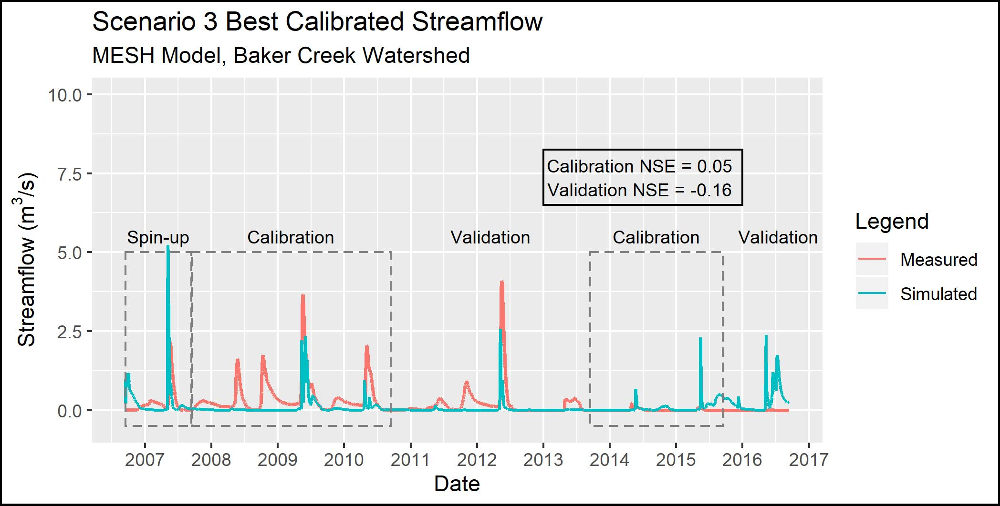{height=8cm} 
 
> ***Figure 4.6 - Observed and simulated streamflow for Scenario 3***

The results for Scenario 1-P (which used the Scenario 1 parameterization but switched PDMROF for WATROF) are shown in Figure 4.7. Compared to Scenario 1, the Scenario 1-P model is a better reflection of the spring peaks, with the most notable improvements in spring 2008 and 2011. Scenario 1-P shows a small amount of flow in the fall of 2009, but all other fall peaks are negligibly represented by the model.

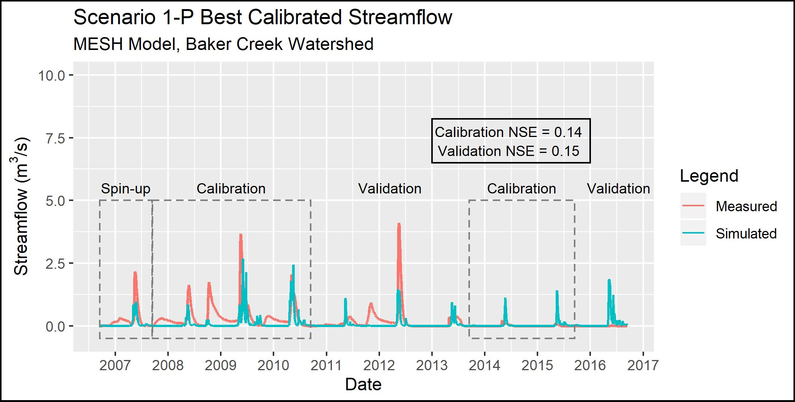{height=8cm}  

> ***Figure 4.7 - Observed and simulated streamflow for Scenario 1-P***

The results for Scenario 2-P (which used the Scenario 2 parameterization but switched PDMROF for WATROF) are shown in Figure 4.8. Compared to Scenario 2, the Scenario 2-P spring peak flows are lower in 2009 and 2012, and the fall peaks are more visible in 2008 and 2009 though still much lower than observed. 

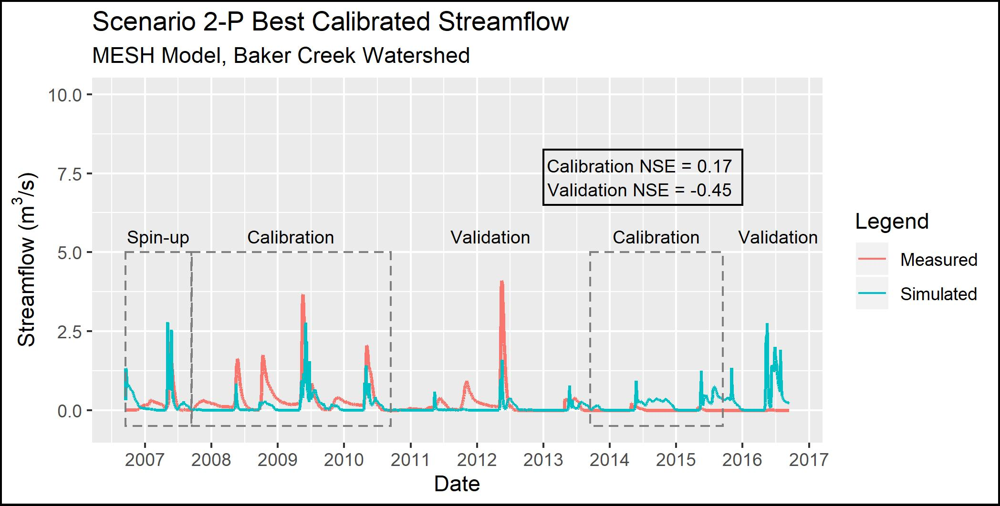{height=8cm}  

> ***Figure 4.8 - Observed and simulated streamflow for Scenario 2-P***

Figure 4.9 (below) presents a comparison between the top 10% (10 out of 100) of the calibration trials and the corresponding validation results. In every scenario except Scenario 1-P, the performance during the validation period was worse than during the calibration period. 

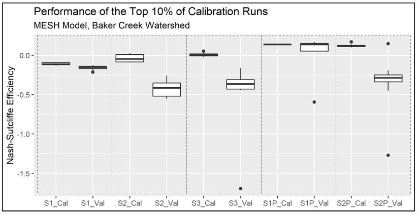{height=8cm} 
  
> ***Figure 4.9 - Comparison of the performance of the top 10% (10 of 100) of trials during both the calibration (Cal) and validation (Val) periods***

Figure 4.10 below shows a comparison between model performance during calibration and the average run time of the calibration. As model complexity increased for Scenario2 1-3, so did the average time for a single calibration run. The calibration of Scenario 1 took 4.71 hours per trial on average, while Scenarios 2 and 3 took 9.86 and 35.71 hours, respectively. The difference in run time between Scenario 2 and 3 is large with only a marginal (0.024) increase in NSE. Scenario 1-P took 7.04 hours per run - 49% longer to than Scenario 1 - and Scenario 2-P took 12.40 hours per trial, which is 26% longer than Scenario 2. Therefore, there was a tradeoff between model performance, which increased with more GRUs and by changing the runoff algorithm, and run time, which also increased with additional model complexity.

{height=8cm}   

> ***Figure 4.10 - Comparison of the model performance and calibration run time for each scenario.***

Identifiability is a measure of the degree to which the true value of a parameter can be identified from a model (Gábor, Villaverde, & Banga, 2017). The value of a parameter may not be uniquely determined due to insensitivity of the outputs to the parameter, parameter interdependence, and poor data quality (Gábor, Villaverde, & Banga, 2017).

The same methodology as Mkandla 2017 was used, considering a parameter to be identifiable if the differece between the 10th and 90th percentile of the normalized parameter range is less than 0.3 using a normalization range of 0 to 1. A parameter identifiability range of 0 would mean the parameter is perfectly identifiable, and a value of 1 would mean the parameters is completely unidentifiable. The normalized values are calculated by: 

$$Normalized Value = \frac{(max'-min')}{(max-min)}\cdot(value-max)+max$$

where *max* and *min* is the range of the calibrated values for a given parameter, *max'* and *min'* is the normalized range, and *value* is the parameter value being converted.

Plots of the parameter identifiability for all scenarios are shown in Figure 4.11 through Figure 4.15.  WF-R2, which is a channel roughness factor combining channel shape, width to depth ratio, and Manning's n, are identifiable in Scenarios 1, 2, and 3. In Scenarios 2, 3, and 2-P, natural log of roughness height (LNZO-NL, which corresponds to tree height) and permeable depth soil (SDEP-NL) are identifiable for the needleaf/conifer GRU. In Scenario 1-P, the identifiable parameters are minimum leaf area index of needleaf forest (LAMN-NL), and the limiting snow depth to consider 100% coverage (ZSNL). It is noted that LNZO-NL and LAMN-NL are is just above 0.3 in Scenarios 1-P and 2-P, respectively.    

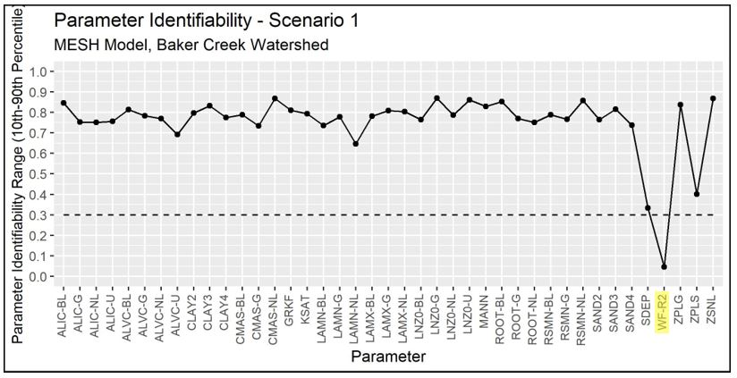{height=8cm}   

> ***Figure 4.11 - Identifiability of calibrated parameters for Scenario 1***

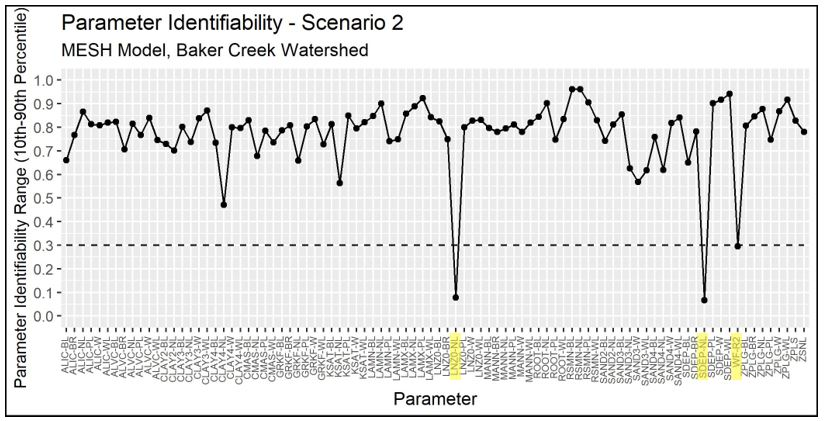{height=8cm}   

> ***Figure 4.12 - Identifiability of calibrated parameters for Scenario 2***

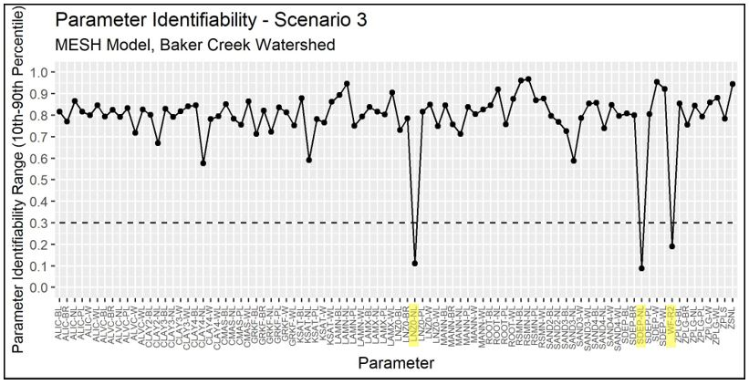{height=8cm}   

> ***Figure 4.13 - Identifiability of calibrated parameters for Scenario 3***

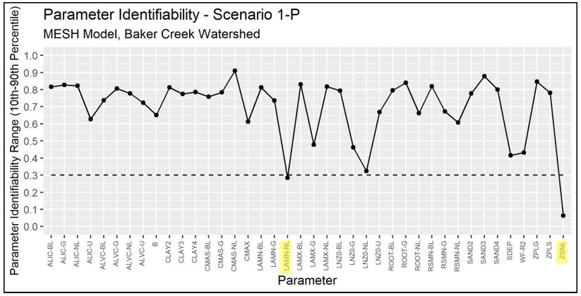{height=8cm}   

> ***Figure 4.14 - Identifiability of calibrated parameters for Scenario 1-P***

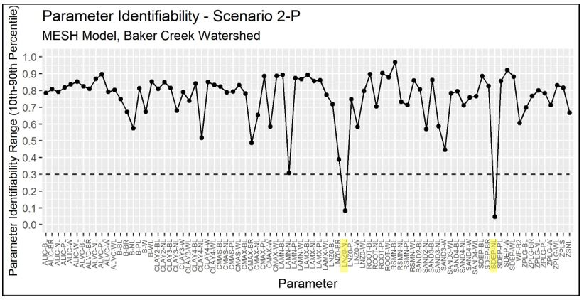{height=8cm}   

> ***Figure 4.15 - Identifiability of calibrated parameters for Scenario 2-P***

## Discussion and Conclusion
The objective of Phase 1 (Scenarios 1 and 2) was to replicate the modelling methodology from the White Gull Creek basin (Mkandla, 2017) and compare the conclusions. A summary of the comparison of the White Gull Creek and Baker Creek MESH modelling is presented in Table 4.5 below.

> ***Table 4.5 - Comparison of results between White Gull Creek and Baker Creek MESH Modelling***  
{height=9cm}

It is also noted that all the NSE results from the Baker Creek calibration were much lower than those for White Gull Creek; possible improvements are discussed below and in the *Towards a Solution* section. Regardless, the trends observed between the calibration and validation periods, and between scenarios, can provide useful information about the behavior of the MESH model in the watershed.

In all Scenarios, the model under-estimates most peak flows during the wet period (2008-2012) and over-estimates peak flows during the dry period (2013 onward). This is likely because the calibration was trying to match both high and low streamflow periods but did not do very well at matching either of them. Also, the use of NSE as the performance metric tended to steer the calibration toward matching peak flows rather than low flows.

The very poor performance (Nash-Sutcliffe values near zero) could be due to the calibration period including both a wetter-than-average and drier-than-average flow periods. Ideally, the model should be able to represent the hydrological processes in the basin so that the streamflow could be estimated in both wet and dry periods, but there are still some improvements to be made. Additionally, calibrating to streamflow when streamflow is near or at zero is not ideal, and it would be better to calibrate to another variable such as evapotranspiration or snow depth.

Bedrock is also not well-represented by the MESH model. MESH (i.e. CLASS) considers bedrock to be impermeable and runoff proceeds directly to the stream. However, as discussed in Spence, 2006, bedrock areas often retain water in fractures, soil-filled zones, and local depressions before it is transmitted to the stream or evaporated. The amount of runoff generated by bedrock areas depends on the available storage, evaporation demand, and rainfall amount and intensity (Spence & Woo, 2002). Phillips, Spence, & Pomeroy (2011) also stated that the connectivity of bedrock areas is controlled by peatlands and wetlands in the upland areas.

The MESH model configurations may also be limited in by the represenation of soil thermal properties and frozen soil representation appropriately. The basin is in a zone of discontinuous permafrost and the presence of seasonally frozen soils can vary spatially and temporally depending on soil moisture conditions (Spence, 2006; Elshamy et al., 2019). 

The under-representation of fall peak flows indicates that the hydrological process(es) most influencial in the release of water at that time (i.e. storage and release of water from the lakes) are not well-represented in MESH. In general, it seems that the configurations of the model were not able to capture the storage and release behavior of the large lakes in the basin. 

For the Scenario 1 and Scenario 2 configurations, the PDMROF runoff algorithm led to better results than the WATROF algorithm.  

It is interesting that Scenario 1-P performed better than Scenario 2-P, even though the performance of Scenario 1 was worse than Scenario 2. This could potentially be because the 1-P model was better able to constrain the contributing area of the whole basin with only one value of CMAX and B while the segmented contributing area was segmented by GRU (landcover type) in 2-P. It could also be that due to the interaction between the larger number of calibration parameters in Scenario 2-P, the calibration was not able to converge on a better solution within the 1000 iterations.

Depending on the application, the marginal improvement in performance between Scenarios 2 and 3 may not be worth the 262% increase in calibration time.

