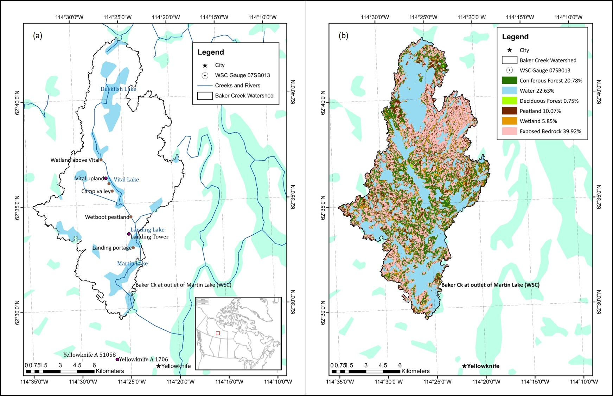
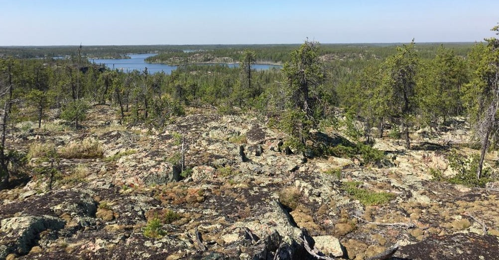
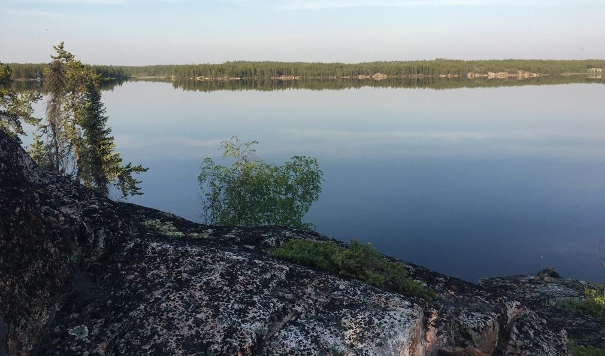
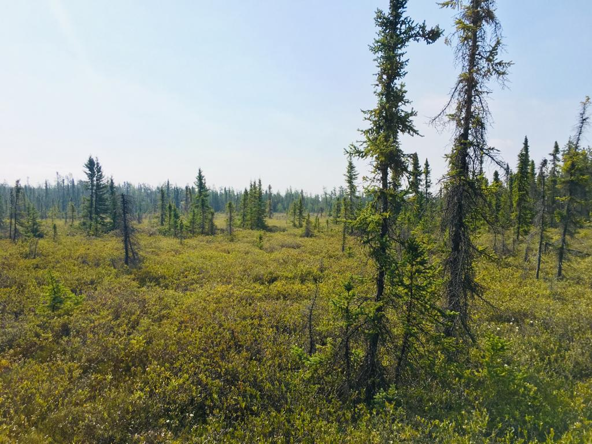

---
---

[home](home.html)

# 2. Site Description

The Baker Creek watershed is located in the Northwest Territories (NWT) of Canada, with the outlet defined by the Water Survey of Canada (WSC) hydrometric gauging station 07SB013 - Baker Creek at Outlet of Lower Martin Lake - located approximately 7 km north of the capital city of Yellowknife, NWT (see Figure 2.1a below). The watershed covers an area of approximately 155 km^2^, with an elevation ranging from approximately 200 meters above sea level (masl) to 266 masl (Spence and Hedstrom, 2018). The watershed is located within the Taiga Shield Ecozone, the Tazin Lake Upland Ecoregion, and the Beaulieu River Ecodistrict (number 260) (Agriculture and Agrifood Canada (AAFC), 2019).

## Climate

The climate in the area can be classified as "subarctic" (Kokelj, 2003) and is characterized by short, cool summers and long, cold winters with daily average temperatures below 0^o^C between October and mid-April (Environment and Climate Change Canada, 2019a). At the nearby ECCC meteorological station, Yellowknife A, the 30-year daily average temperatures ranged from -25.6^o^C in January and 17.0 ^o^C in July (Environment and Climate Change Canada, 2019a). The area received an average of 289 mm of precipitation annually, with approximately 41% as snowfall (Environment and Climate Change Canada, 2019a).

## Land Use

The Baker Creek watershed is largely undeveloped, and there are a number of research stations in the basin (Spence and Hedstrom, 2018). Research by the University of Saskatchewan and Carleton University has been occuring in the basin since 2004, with some water quality data available from 1995 (Changing Cold Regions Network (CCRN), 2019b; Spence and Hedstrom, 2018).

Water bodies and exposed bedrock make up the largest majority of the basin at 62.5% (22.6% and 39.9%, respectively), with forested hillslopes of primarily coniferous trees and some deciduous trees comprising just over 21%, and peatlands and wetlands the remaining 16% (Spence and Hedstrom, 2018); the Baker Creek watershed landcover map is shown in Figure 2.1(b). Photograph 2.1 below shows an example of bedrock upland, forested hillslopes, and a Vital Lake beyond, Photograph 2.2 is a closer view of the bedrock and treed areas at the shore of Vital Lake, and Photograph 2.3 depicts a peatland area near the Tower Peatland site.

## Vegetation

In general, the vegetation in the area can be described as open, short forest (Kokelj, 2003). Vegetation in peatland areas is typically a mixture of nonvascular plants, such as lichens, and vascular plants, such as evergreen shrubs, black spruce, and jack pine with an average vegetation height of about 0.3m (Guan, Westbrook, & Spence, 2010). At a forested valley site, Guan, Westbrook, and Spence (2010) described the vegetation as black spruce-dominated with some willow, birch, prickly rose, dwarf bilberry, and lichen; the area had a mean vegetation height of 7m. At a wetland site between Lake 690 and Vital Lake, vegetation was primarily deciduous shrubs with some black spruce, birch, and tamarack and a mean vegetation height of 1.4 m (Guan, Westbrook, & Spence, 2010).

{width=17.75cm}

> ***Figure 2.1 - Baker Creek Watershed location and major water bodies (a), and landcover (b); based on Spence and Hedstrom, 2018.***

{height=9cm}  

> ***Photograph 2.1 - Baker Creek watershed from the Tower Peatland instrumentation site (Photo Credit: Cook, 2019)***

{height=9cm}  

> ***Photograph 2.2 - Overlooking Vital Lake in the Baker Creek watershed (Photo Credit: Cook, 2019)***

{height=9cm} 
 
> ***Photograph 2.3 - Peatland near the Tower Peatland instrumentation site (Photo Credit: Cook, 2019)***

## Geology and Soils
The Baker Creek watershed is located in the Canadian Precambrian Shield and contains pockets of lacustrine deposits from the historical inundation glacial activity during the Wisconsin glaciation (Guan, Westbrook, & Spence, 2010). The bedrock in the basin is moderately to highly fractured, and mineral soils (silty and sandy texture) are present in the fissures and valleys from bedrock weathering and erosion (Phillips, Spence, & Pomeroy, 2011). The thickness of overburden above the bedrock ranges from less than 1 m to more than 10 m (Spence & Hedstrom, 2018). The peatland site studied by Guan, Westbrook, & Spence (2010) was comprised of 1.2 m of peat soil with bedrock below, the valley site was characterized by about 0.2m of organic matter underlain by loose gravel, silty clay, and sandly clay, and the wetland site contained 0.2-0.6 m of peat overlying impervious lacustrine clay (Guan, Westbrook, & Spence, 2010). 

## Hydrology

The Baker Creek watershed contains a number of large lakes drained by short streams which exit the basin through the gauge at the outlet of Lower Martin Lake, which has a gross drainage area of approximately 155 km^2^ (Spence et al., 2010). Baker Creek then continues for another 6 km and flows into Great Slave Lake. The flow regime in the basin is highly variable due to the variability of storage capacity in the basin (Spence, 2006; Phillips, Spence, & Pomeroy, 2011). There are 349 lakes in the basin - 97% of which are smaller than 0.5 km^2^ and eight are larger than 1 km^2^ (Spence, 2006). The largest and most hydrologically-significant of these lakes include Duckfish Lake (6.2 km^2^), Vital Lake (1.5 km^2^), Landing Lake (1.1 km^2^), and Martin Lake (3 km^2^) (Spence, 2006). The dominant lakes and general streamflow through the basin is shown in Figure 2.1(a) above.

The average streamflow at the WSC gauge (07SB013) is 0.24 m^3^ s^-1^ and annual runoff ratio is 0.17; however, the runoff ratio has been observed to vary by up to three orders of magnitude, as observed by a runoff ratio of 0.005 in 2015 and 0.34 in 2001 (Spence & Hedstrom, 2018; Spence & Woo, 2002). This is due to variable storage and infiltration capacity controlled by depth of soil cover, geometry of bedrock fractures, rainfall intensity, and evaporation (Kokelj, 2003).  The basin is in an area of discontinusous permafrost, which also alters the runoff regime depending on the soil conditions (Kokelj, 2003; Guan, Spence, & Westbrook, 2010). The presence of permafrost is influenced by topography, vegetation, snow accumulation, geology, and hydrological conditions, and stark variations in these properties result in highly discontinuous permafrost patterns (Spence & Hedstrom, 2018). Typically, permafrost is found in areas containing organic glaciolacustrine clays and outwash and organic deposits (such as peatland and valley areas) while bedrock and well-drained sandy areas tend to be permafrost-free (Spence & Hedstrom, 2018). 

Phillips, Spence, & Pomeroy (2011) stated that there are thresholds in the basin that dominate the hydrological response of the basin, and that the rates and energy driving key hydrological processes are the most influencial factors governing hydraulic connectivity in the basin (Phillips, Spence, & Pomeroy, 2011).

The hydrological response at the outlet of Lower Martin Lake is controled by a number of "gatekeepers", which are elements in the basin that collect, store, and discharge water (Phillips, Spence, & Pomeroy, 2011; Spence & Woo, 2002). In upland areas, the gatekeepers are primarily peatlands and wetlands which control the connectivity of bedrock runoff, and gatekeepers in the downstream areas are large lakes which collect, store, and discharge water from a number of sub-catchments (Phillips, Spence, & Pomeroy, 2011). This nested-nature of storage and release in the basin make the streamflow response of the basin highly variable. Elements that can have the most influence on the connectivity of the basin are lakes with a large lake area compared to contributing area, and lakes closer to the outlet (Phillips, Spence, & Pomeroy, 2011). 

 The hydrograph at the basin outlet features peak streamflows in the spring due to snowmelt runoff (Water Survey of Canada, 2019; see Figure 4.2), and fall flows can also be observed due to late-summer rains that reduce available storage, intense fall rain events, and reduced evapotranspiration capacity as the trees become dormant (such as the fall peak in 2008; Spence et al., 2010). Backwater conditions have also been observed in the basin, which can delay streamflow propagation to the outlet (Spence, 2006).
