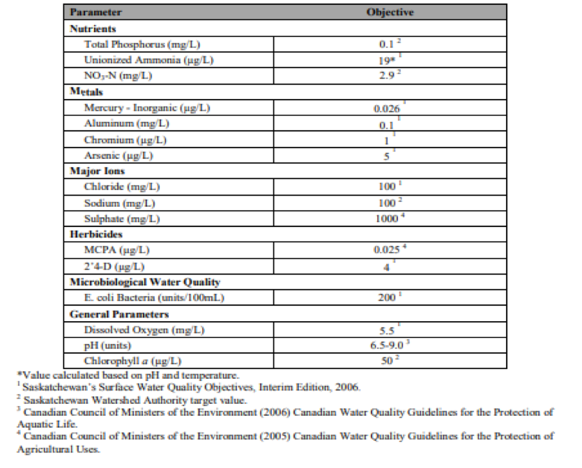

---
---

[home](home.html)

# Data analysis

## Baseline Data

Baseline Data
Jackfish, Murray lakes, and the five creeks were monitored by Stewards of Jackfish and Murray Lakes (SJML) using intensive water quality monitoring approach between 1997 and 2007 producing a baseline record of water quality parameters including nutrients, heavy metals, major ions, dissolved oxygen, water depth, bacteria. Sampling frequency varied from two to six times per year during summer seasons. Different nutrient forms including orthophosphate, total phosphorus, nitrate, nitrite, and ammonia as nitrogen were monitored over the 10-year period. Another sampling was conducted in the summer of 2014 and 2017. The complete set of data can be found in the appendix section of this report

## Management Strategy

The three recommended nutrient management strategies approach for this project are long-term baseline monitoring, intensive research mass balance, and stewardship-based approach

## Long-term Baseline Monitoring Program

This approach uses existing historical data using a box plot and water quality index (WQI) analysis. A comparison between the historical baseline and recent data will be analyzed using box excel plot and WQI model illustrating health of the watershed over time. The developed approaches will be based on the objectives of a lake.

### Water Quality Index

Water quality index (WQI) is a model by the Canadian Council of Ministers of the Environment (CCME) that aids in processing and communication of complex water quality data. It summarizes vital water quality parameters in a single index providing overall health of watershed that can be reported consistently. It compares several water quality parameters (i.e. nutrient, dissolved oxygen, pH, metals, chlorophyll a, TDS) to a set water quality objective resulting in water quality ranking (poor, good, excellent) ranging from 1-100. The set water quality objectives of different parameters are found in table 2 below.

Table 2: WQI Water Quality Objectives
{ width=100% }

The WQI calculation is based on three factors, mainly the scope, frequency, and amplitude as explained in the CCME (2017). WQI rating score was conducted for 2014 Jackfish lake Sample data. Complete data can be found in the appendix section of this report.

Table 3: 2014 Jackfish Lake Water Quality Result
{ width=100% }

The scope is the percentage of parameters that do not meet the set objectives CCME guidelines. The bolded values in table 3 do not meet the set parameter targets in table 2. The scope is calculated as follows;

$$F1(scope)=\frac {Number\ of\ failed\ parametrs}{Total\ number\ of\ parameters}×100$$

$$F1=\frac {3}{13}×100$$
$$F1=23.08$$

F2 (frequency) is the percentage of test samples that failed the test
$$F2(frequency)=\frac {Number \ of \ failed \ sets}{Total \ number \ of \ test}×100$$
$$F2=\frac {3}{13}×100$$
$$F2=23.08$$

F3 (Amplitude) represents the amount by which failed test values do not meet their guidelines and calculated in three steps. First, we calculate excursion as;

$$excursion=\frac {Failed\ test}{Objective}-1$$
$$excursion=\frac {251}{100}-1$$
$$excursion=1.51$$

We calculate for pH and arsenic respectively as 0.00111 and 2.4 using the above formula. Next the normalized sum of excursions is calculated as;

$$nse=\frac {\sum_{i}^{n}excursion}{number\ of\ tests}$$

where n represents number of excursions

$$nse=\frac{1.51+0.00111+2.4}{13}$$

$$nse=0.30085$$
Therefore, yield is calculated using the formula below;
$$F3=\frac {nse}{0.01(nse)+0.01}$$

$$F3= \frac {0.30085}{0.01(0.30085)+0.01}$$
$$F3=23.13$$
$$WQI Score=100- \frac {\sqrt {〖F1〗^2+〖F2〗^2+〖F3〗^2 }} {1.732}$$
$$WQI Score=100- \frac {\sqrt {(23.08)^2+(23.12)^2+(23.12)^2 }} {1.732}$$

$$WQI Score=76.9≈77$$

{ width=100% }
Figure 3: Jackfish lake Water Quality Index (WQI) Result

The WQI score values for Jackfish Lake ranges from 56 to 79 for the historical data and the 2014 data, as shown in figure 3. WQI analysis gives the lake a health score range of marginal to poor WQI rating based on CCME grading scale. Although other parameters might have contributed to the outlier score in 2004, water levels in 2003-2004 reached their lowest point since 1966. This is understood to be the factor responsible for that, as explained by Saskatchewan Watershed Authority (2010). For the 2014 data, only arsenic, pH, and sodium are parameters that do not meet their guidelines for the sampling period. Murray Lake is a deeper lake compared to Jackfish Lake. Farming activities at the jackfish creek, irrigation, water levels, and climate change might have contributed to the depleting score in Jackfish lake.

### Box Plot Analysis

Box plot (also called box and whisker) is an analysis of representing the distribution of a data set constructed based on a 5-number summary. The summary includes mainly minimum, interquartile range (first quartile, median, third quartile) and maximum number, as shown in figure 4 below. It shows how far the extreme values are from the majority of a dataset and compare how close other data values are to them. The box plot gives a good, quick visual of complex data.

{ width=100% }
Figure 4: Box Plot Summary Number

Box plot analysis indicates how symmetrical, outliers, and how compactly skewed a group of data is. The relationship between nutrient concentrations and other parameters during blooms were examined using box plot analysis. The decade historical data for nutrients from 1997-2007 can be compared to the current 2017 data to illustrate how water quality parameters have differed over time in the lakes and the creek. A box plot analysis was performed using the nitrate and phosphate dataset.

{ width=100% }
Figure 5: Nitrate for Jackfish Lake

Figure 5 represents the box plots showing the historical and current nitrate as nitrogen data for Jackfish lake baseline. The minimum and maximum nitrate concentration values are 0.01 mg/L and 0.16 mg/L respectively. In contrast to 2017, the nitrogen concentration recorded is 0.04 mg/L in May and October. From figure 5, it can be seen  that the 2017 nutreient data agrees with the historical nitrate data.

{ width=100% }
Figure 6: Phosphate for Jackfish Lake

The same analysis was done for phosphate in jackfish baseline. Figure 6 shows a minimum concentration value of  0.04 mg/L and an outlier maximum concentration value of 0.14 mg/L for the historical value. The 2017 data falls below the interquartile range with a maximum reading of 0.03 mg/L recorded in May of 2017.

{ width=100% }
Figure 7: Phosphate for Jackfish Creek

A box plot analysis was conducted for the Jackfish creek. The figure shows 0.03 mg/L and 0.21 mg/L for minimum and maximum phosphorus content with a mean of 0.085 mg/L for the historical data in the creek. Phosphate content for 2017 data falls below the interquartile range when compared to the historical data. The 2017 data shows a minimum phosphorus concentration of 0.02 mg/L, with a mean concentration value of 0.03 mg/L.

{ width=100% }
Figure 8: Nitrate for Jackfish Creek

Similar analysis was done for nitrate as nitrogen for jackfish creek as shown in figure 8. The chart shows a different trend compared to phosphate. The 2017 data falls within the interquartile range for the historical data. This suggest the nitrate content in the creek is within the acceptable historical nitrogen concentration. The mean nitrate concentration for the historical data is 0.06 mg/L, and two outliers one been the maximum as 0.28 mg/L.

{ width=100% }
Figure 9: Nitrate for Murray lake

The only sample was conducted for the year 2017 in Murray lake. The nitrogen data is not evenly spread out, hence resulting in a lot more outliers. The historical data shows four maximum outliers and a minimum nitrate concentration value of 0.01 mg/L as shown in figure 9. The lone 2017 data box plot analysis falls within the historical nitrate data interquartile range.

{ width=100% }
Figure 10: Phosphate for Murray Lake

Unlike nitrate, phosphate historical data was evenly distributed, resulting in an acceptable box plot summary. The phosphate analysis differs from nitrate as shown in figure 10. The chart shows a minimum and maximum phosphate concentration values of 0.02 mg/L and 0.11 mg/L, respectively. Again, the lone sample for 2017 is 0.01 mg/L and falls below the historical data minimum value.

## Intensive Research Mass Balance

Having data is essential and aid in better decision making. In terms of water quality, it helps track changes in water quality and provides researchers the opportunity to study trends of a particular watershed. Jackfish has limited water quality data with lots of gaps. The approach is an increased cost option that will provide the authority with reliable data using a consulting company. This approach offers the opportunity to look at multiple parameters of water quality. However, the community is at risk of losing authority over data due to the nature of working with a third party. There are concerns over the administration of the program, including the duration of the research program, staff time, and interpretation of data to the community. There also exists the challenge of reliance on volunteers. Having all this place will result in extensive water quality data for the period of the research program.

Sampling should be conducted based on the water quality objectives of a community as budget constraints dictate the intensity of sampling to be undertaken. The primary goal of Jackfish Lake is algae bloom control using nutrient monitoring management.  Conducting an intensive research will provide long-term monitoring of lake because of farming activities, discharge from sewage septic tanks and fisheries management in the lake. Water quality parameters to be tested includes inorganic, organics, metals, bacteria, nutrients, ions, hardness, pH, pesticides, total suspended sediments (TSS), total dissolved solids, carbon, dissolved oxygen. This approach brings extra levels of complexity to the project due to multiple partners involved (RM, citizens volunteers, consulting company). The estimated cost of this approach option is between $5000-$30000 per year, depending on the nature of sampling, location, and consulting company. Community should have solution in place on how to benefit from data generated at the end of research period.

## Stewardship-Based Approach

This option is a long-term approach with an organized body that oversees activities of the larger group. It should be a proactive committee pursuing both educational and scientific programs with a common objective of protecting and enhancing the water quality of Jackfish lakes. The group should work on implementing various projects over a specific period. These projects include tree planting, shoreline restoration, educational programs, shoreline assessment, and many more. The stewardship group should have representatives of different stakeholders, including farmers, first nation, government, and cottage owners in the various communities surrounding the lakes. The stewardship approach will provide fair decision making based on environmental concerns of the different stakeholders.
