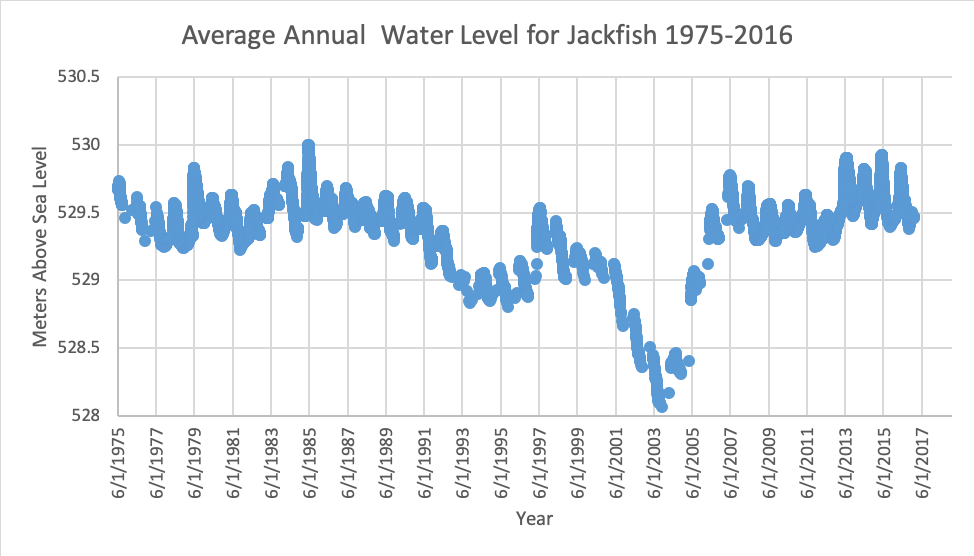

---
---

[home](home.html)

# Site Description

Jackfish and Murray lakes are Located in the aspen parkland ecoregion approximately 30 km north of the city of North Battleford, Saskatchewan at longitude 53.040" N, and latitude 108.0240" W. The region extends from Radisson Saskatchewan to the north of Jackfish Lake, with cereal dominated as the primary land use of the cropland (Saskatchewan Watershed Authority, 2011). Historically known for commercial and recreational fishing since the early 1900s, but has ceased fishing commercially since 1980s (SWA, 2011). However, both Lakes are prominent for irrigation, boating, and swimming. The lakes are located in Rural Municipality (RM) of Meota, with settlements in various communities including Metinota, Cochin, Aquadeo, and two first nations (Moosomin and Saulteaux) communities.

{ width=100% }
Figure 1: Jackfish and Murray Lakes locations

Both are shallow, well-mixed, isothermal lakes with a surrounding watershed of approximately 8200 square kilometers (SWA, 2011). Connected by Lehman's creek, both lakes are sensitive to climate change because of the semi-arid climate condition (Sereda et al., 2010). Murray Lake is a deeper water body with a maximum depth of 8.5m, while Jackfish has a depth of 4.5 m (Saskatchewan Watershed Authority, 2005). Surface and groundwater are the main sources of water supply into the watershed. Spring runoff accounts for the majority of inflow, with groundwater accounting for up to 30% of the annual water inflow into both lakes (Sereda et al., 2010). Surface water supply for Jackfish is primarily supplied from Jackfish creek, while Losthorse and Crystal's creek supply surface water for Murray Lake

Jackfish Lake is characterized by excessive weed growth susceptible to elevated levels of unionized ammonia (Sereda et al., 2010). Both lakes are classified as sub-saline, with Murray lake having higher dissolved oxygen level because it is deeper than Jackfish (SWA, 2010). The soil is black with nutrient-rich loam to silt loam surface texture (Saskatchewan Watershed Authority, 2007). Less is known about fertilizer applications used on the farmland at the creek, and other agricultural land uses surrounding the watershed. No sewage treatment plant located in the study area, and there is scarcity in the knowledge of nutrient loss. Most of the farms and smaller towns within the catchment do not have proper sewage treatment systems and rely on septic tanks. These sources have been identified as a possible source of pollution resulting from septic tanks leakage
The water level has been consistent since the 1960s except for the period between 2003-2004 where historical lows were recorded as seen in figure 2

{ width=100% }
Figure 2: Annual Water level for Jackfish lake 1975-2016. https://wateroffice.ec.gc.ca/report/data_availability_e.html?type=historical&station=05EG003&parameter_type=Level
