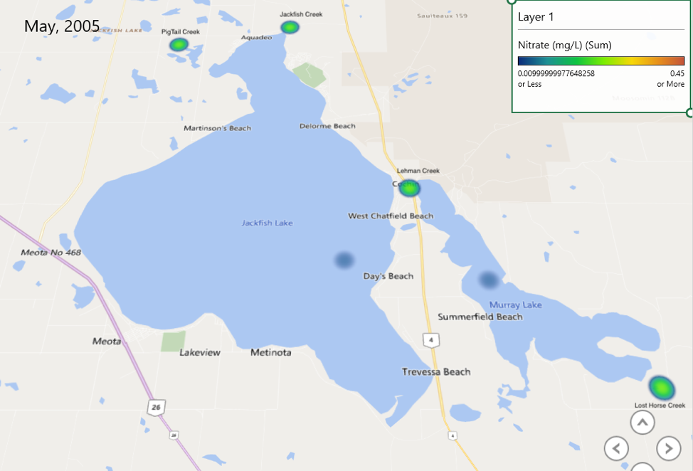

---
---

[home](home.html)

# Towards a solution

The project has aimed to understand nutrient loading in lakes and implement monitoring strategies for lake water quality. The analysis highlighted the need to collect and interpret long-term water quality parameters datasets. Such data sets are needed to describe the changes of watersheds in response to human activities and climatic changes over time. The historical data suggests that water quality remained consistent compared to the 2017 data. The outcome of community engagement provides opportunities for improving and protecting water quality in the lake for future generations. Furthermore, participants in both meetings expressed their interest in having a visual tool representation of data.

A heat map was created to support community need of improving water quality in Jackfish Lake. Heat map is an excel add-on tool that represents data such as water quality parameters visually in a map. This analysis is essential as individuals perceive/understand data visually, providing the opportunity of ease in the decision-making process. Since one of the major community concern is algae bloom controls, the heat map for nutrients such as nitrogen and phosphorus was performed displaying intensity of different parameters analyzed. The representation is based on colors and can be customized based on individual preference. For this project, green color represents the high value, while yellow represents moderate value, and blue color represents low value.

{ width=100% }

Figure 11 is a heat map representing the Jackfish, Murray lakes, and its various tributaries. It can be seen from the chart that the lakes have lower nitrate concentration compared to the tributaries for May 2005 as represented by the color. This visual tools can be useful for communities as it presents a visual representation of lakes health and helps narrow down nutrient hot spot.

## Recommendations

The government at all levels should support existing stewardship groups with resources for a healthy lake. Government should encourage environmental friendly activities that promote water quality in Jackfish Lake. The researcher is to develop a management strategy that could detect human waste nutrient from agricultural nutrient. In the future researchers should focus on providing an environmental-friendly solution that supports sustainable agriculture and housing on the lake. Future research should look at possible impact of climate change. They should be a fair representation of various stakeholders, including first nation community surrounding the lake for more beneficial outcomes of stewardship groups. Jackfish lake community can take these simple steps to prevent the growth of blue-green algae:
* 	Educate the community on the use of phosphate-free personal care and household cleaning products.
* Abstain from fertilizer application on lawns
* Reducing agricultural runoff by planting trees and maintain a natural shoreline on lake and riverfront properties
* Regularly check septic systems to ensure they do not leak into the water source
