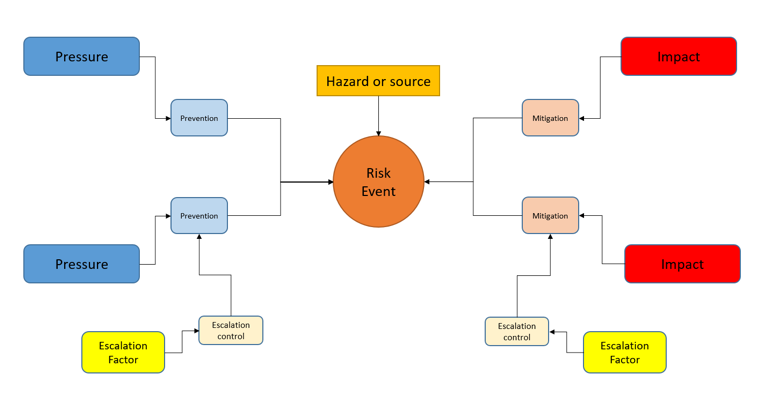

---
---

[home](home.html)

# 1.0 Introduction

Natural systems require policy and management plans that are all-encompassing to incorporate land, water, air, wildlife, humans, and all relevant industrial activities to manage the system in a sustainable way. A comprehensive policy and management framework approach such as this is critical in reducing the pressures of cumulative effects, the changes in the environment due to an activity in combination with other past, present, and future human activities (Cormier, Elliott, et al., 2018). Managing cumulative effects requires policies and strategies that reduce pressures of these activities and mitigate impacts. Therefore, when cumulative effects are observed, the framework may not be managing the pressures effectively (Cormier, Elliott, et al., 2018).  In a well-balanced management and policy framework, there should be an effective prevention strategy paired with an effective reactive strategy of mitigation (Cormier, Elliott, et al., 2018).

However, environmental policy and management frameworks come with challenges, specifically the gap between decision-makers and science. Scientific knowledge generated through research should be used to educate and inform the public and political system, and influence the political agenda and priorities of that political system (Cormier et al., 2017), while managers must understand which research questions need to be answered. Science can fill these knowledge gaps and mobilize the information for effective, sustainable management strategies (Creed, Cormier, et al., 2016). Without this collaboration, it may be left to scientists to determine which topic is researched, and ensuring the information is translated to the managers, which can increase the gap between science and decision-makers (Cormier et al., 2017). To help close this gap, it is necessary in environmental policy and management to have a tool or method to look at the big picture, to see connections, trade-offs, and potential gaps of a policy and management framework in regard to an environmental pressure (Creed, Cormier, et al., 2016).

The ISO Risk Management Standardization is a framework to bring science and management together and includes more than 31 risk assessment techniques (Cormier, Elliott, et al., 2018). These techniques include the Bowtie Risk Assessment Tool, a way to identify risks of concern and understand how they are managed (Cormier, Elliott, et al., 2018). The Bowtie Assessment is a technique to visualize the existing policy and management framework strategy by identifying risk in a policy context, the pressures to the risk, and consequences of the risk event.

To use the tool for a policy and management framework assessment, a policy problem must first be established. The tool provides a systematic process of creating pressure-risk-impact  pathways, along which management measures are put in place to prevent the effect from occurring or to mitigate its effects (Kishchuk et al., 2018). The tool pathways include a risk event, pressures, impacts, prevention controls, mitigation controls, and escalation factors (Figure 1.1). The pressures can be physical, chemical, or biological means that are introduced to the environment from human activity that creates cumulative effects (Creed, Weber, Accatino, & Kreutzweiser, 2016). Preventative controls aim to reduce the risk event, while the event itself is the residual harmful effect that occurs after preventative measures (Cormier, Stelzenmüller, et al., 2018). The impacts are harmful consequences that occur from the event, and can range from ecological, hydrological, economical, or sociological in nature, while mitigation controls aim to reduce the magnitude or severity of the impacts (Cormier, Stelzenmüller, et al., 2018). Mitigation controls can reduce the spatial scale, the duration, intensity of the impact, or the recovery controls that restore damage of the impact (Cormier et al., 2019). Prevention and mitigation controls can be both hard (based on science and engineering) and soft (such as facilitating and tracking activities) (Creed, Weber, et al., 2016). Lastly, an escalation factor is an outside influence that can increase the severity of the pressures and decrease the abilities of prevention or mitigation controls (Creed, Weber, et al., 2016).

{ width=100% }

*Figure 1.1: Conceptual diagram of the Bowtie Risk Assessment Tool, depicting the pressure-risk-impact pathways.*

These risk pathways can highlight potential strengths and weaknesses of the management measures in the policy context, such as gaps or redundancies in the management system (Kishchuk et al., 2018). The Bowtie Assessment is a tool that can improve management and governance structure in a specific context and encourage informed decisions. More specifically, it can be applied as a policy tool to evaluate cumulative effects of a management system in an environmental context (Kishchuk et al., 2018).

The Bowtie Assessment is a versatile tool, in that it can be altered to fit many risk scenarios, over a range of spatial scales (i.e. applicable to a city, a body of water, a province, etc.). While the tool originated in the Petroleum industry and is currently used frequently in health services, this assessment has been increasingly adapted and found to work within environmental policy (Cormier, Elliott, et al., 2018). The tool has been used within the context of marine management (Cormier, Stelzenmüller, et al., 2018), Great Lakes management (Cormier, Stelzenmüller, et al., 2018; Creed, Cormier, et al., 2016), and forest management (Kishchuk et al., 2018).

The tool has been tested in marine and fresh water management using two case studies of the North Sea and the Great Lakes (Cormier, Stelzenmüller, et al., 2018). Authors found that maintaining the current state of ecosystem services of both areas was at risk and without understanding the management framework and the cumulative effects from human activities, it would be difficult to get to the root issue of ecosystem change and improve the management framework (Cormier, Stelzenmüller, et al., 2018). The authors aimed to use a modeling framework that combined both qualitative and quantitative assessments of preventative barrier effectiveness to predict the residual pressure that would impact the ecosystem, choosing to combine the use of the tool and a Bayesian Belief Network. The tool is to represent the management system of preventative barriers, while the Bayesian Belief Network assesses the effectiveness of those barriers (Cormier, Stelzenmüller, et al., 2018). After analysis, the authors found that the combined models of the tool and Bayesian Belief Network can be used to analyse the effectiveness of preventative barriers irrespective of the ecosystem setting, such as the North Sea or the Great Lakes. They found this method was useful in communicating and engaging with stakeholders, scientists, and decision-makers, closing the gap between policy and science by providing transparency in the framework (Cormier, Stelzenmüller, et al., 2018).

A second case study on Great Lakes management explored how the tool can be used by governments to reduce the risk of failing to achieve policy objectives as the quality of ecosystems of the Great Lakes is deteriorating (Creed, Cormier, et al., 2016). The Great Lakes have many environmental and human pressures that are impacting the ecosystem, such as land use change, contamination, invasive species, food web collapse, and climate change (Creed, Cormier, et al., 2016). The Great Lakes are complicated in that there are many governments (e.g. Government of Canada, Government of Ontario, Government of Michigan) and stakeholders involved, therefore the authors proposed the adoption of the tool by all decision makers in the Great Lakes Basin to support development of an effective policy and management framework (Creed, Cormier, et al., 2016). They concluded that a tool such as the Bowtie Assessment helps address the need for science and management integration to manage the Great Lakes sustainably in the future. They found that this system has potential to guide towards a policy and management framework that will be sustainable for the ecosystem of the Great Lakes (Creed, Cormier, et al., 2016).

The tool has additionally been applied to forest management systems in Canada (Kishchuk et al., 2018). The Boreal zone is at risk of cumulative effects of human activities such as natural resource extraction, as well as climate change (Kishchuk et al., 2018). Authors explored the use of the tool to support reducing risk to forest management and to integrate science and management. They found that the tool is a valuable asset for exploring the risk of failing to achieve sustainable forest management criteria, and that adoption of this approach would facilitate consistency in the management of impacts of resource extraction across different jurisdictions and sectors (Kishchuk et al., 2018).

Therefore, the Bowtie Risk Assessment Tool is a method which can visualize an existing policy and management framework to help identify weaknesses, bridge gaps within science and management, and help assess cumulative effects of an environmental issue. Further questions for the tool that need to be addressed include; to what extent can this tool be used, and can it be used for all types of environmental issues or risks? More research is needed to build a range of examples of how it can be used in environmental policy and how it can be communicated to decision makers. The tool  has not yet been used in water management in a Saskatchewan community, therefore this report will continue to explore the applications of the tool in a new environmental context to add to this portfolio.

This project identifies the human activities that have the largest pressures on the water flow regime in Cumberland House, Saskatchewan, the resultant cumulative effects on hydrology, ecology, and the community, and identify legislated and non-legislated policies and management strategies that aim to prevent changing flow and mitigate the impacts. This project also explored how well the tool works in this environmental context, and if there are any gaps or restrictions in the tool itself.

The objectives of this study were to:

1. Identify pressures to the flow regime in Cumberland House.

2. Identify impacts of the changing flow regime on the community of Cumberland House.

3. Identify and analyze existing legislated and non-legislated frameworks that are in place to manage the risk.
