---
---

[home](home.html)

# 2.0 Methodology

## 2.1 Case Study

This project aimed to conduct a Bowtie Assessment on the changing water flow regime in Cumberland House, Saskatchewan. Cumberland House was officially established in 1774 by the Hudson’s Bay company as a fur-trading post, however people have been traditionally hunting, trapping, harvesting, and fishing in the area for much longer (Abu & Reed, 2018). Cumberland House is home to two politically and municipally distinct settlements of Métis and Cree communities: The Northern Village of Cumberland House (770 members) and Cumberland House Cree Nation (820 members on-reserve, and 570 off-reserve), respectively (Irland, 2017). Cumberland House is found in the Saskatchewan River Delta (Figure 2.1), the largest inland delta in North America (E. J. Andrews et al., 2018) at 10,000 km2 (Abu & Reed, 2018), and is at the bottom of the Saskatchewan River Basin (E. J. Andrews et al., 2018) (Figures 2.1 and 2.2). Residents of Cumberland House have indicated that the River Delta is very important culturally and spiritually, and they feel strong connections to this environment (Abu & Reed, 2018).

The Saskatchewan River Basin is a large and important ecosystem in Canada (Gober & Wheater, 2014). Over the past half-century, more demand has been placed on freshwater resources in this basin, such as irrigation, industry use, domestic and municipal use, and recreation (Saskatchewan Water Security Agency, 2012). This demand has caused changes in water management, specifically in the creation of dams throughout the Saskatchewan River Basin in Alberta and Saskatchewan (Hassanzadeh et al., 2017) (Figure 2.2). Since the creation of these dams, residents of Cumberland House have noticed increasing changes of the water flow regime through the delta (Abu & Reed, 2018; Sagin, Sizo, Wheater, Jardine, & Lindenschmidt, 2015) . The Saskatchewan River Delta is sensitive to these upstream dams and water uses as approximately 80% of flow into the delta is from the North and South Saskatchewan Rivers, making it vulnerable to upstream water management (Hassanzadeh et al., 2017).

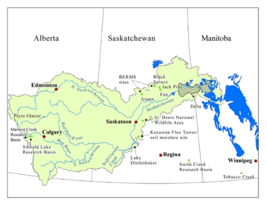{ width=100% }

*Figure 2.1: Saskatchewan River Delta is depicted in the grey area, in the North-East of Saskatchewan, and shares a border with Manitoba (GIWS, n.d.).*

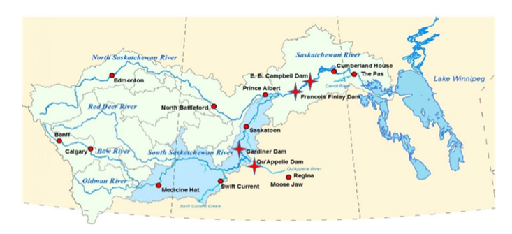{ width=100% }

*Figure 2.2: Map depicting Cumberland House in the Saskatchewan River Basin, with stars representing upstream dams in Saskatchewan (E. J. Andrews et al., 2018).*

For context of this report, flow regime describes the quantity, seasonal timing, and daily timing of river discharge into the Saskatchewan River Delta near the community of Cumberland House. Over the past 50 years, community members have noticed, or reported oral history, of overall decreasing water levels in streams, wetlands, and lakes, fluctuating water levels, changes in fish and wildlife, as well as changes in timing of important peak flows (Abu & Reed, 2018). Water bodies such as rivers, lakes, and wetlands provide many beneficial ecosystem services, such as carbon sequestration, habitat, recreation, water filtration, flood control, and traditional activities (Clarkson, Ausseil, & Gerbeaux, 2013) that are important for the surrounding ecosystems and communities and impacted by a changing flow regime. Therefore, there is a need to understand the risk of the changing flow regime within the policy and management framework of water resources in the Saskatchewan River Basin.

## 2.2 Bowtie Risk Assessment

The first step in the Bowtie Assessment was to decide on the case study and choose the risk event of flow regime through Cumberland House. Through discussing with academic experts from the University of Saskatchewan (Appendix), and researching publicly available documents: pressures, impacts, and escalation factors related to a changing flow regime were determined. In addition, the legislated policies and unlegislated management plans or resources relevant to the pressures and impacts were researched. The policy and management measures were classified into preventative or mitigative barriers based on each measure’s intention. For example, a regulation on a minimum flow requirement would be considered to prevent or avoid flow regime change. By placing all information in the BowtieXP software, the tool creates a map of the management systems in place to then determine if there are gaps in the framework. However, this was an iterative process, at every step a Bowtie framework was created, but was constantly changing with more research and discussion. The following sections will go into further detail regarding the pressures and impacts related to change in flow regime through Cumberland House. The report will choose one pathway to explain how each barrier either reduces the risk or mitigates impacts, and the effects of an escalation factor on the system, as an example of how this tool functions.

## 2.3 Cumulative Impacts and Science Branch

The external partner of this project is the Saskatchewan Ministry of Environment, Cumulative Impacts and Science Branch. The main goal of this branch is to strengthen the Ministry of Environment’s capacity for ensuring landscapes that are sustainable as well as resilient to climate change. This is not a regulatory branch but provides scientific expertise and technical support to the Ministry. The Cumulative Impacts and Science Branch intends to use the Bowtie Risk Assessment Tool to assess cumulative effects in various scenarios, and this proof-of-concept project is a helpful step in depicting how the tool can be used in a hydrology context in a small community.

# 3.0 Results and Discussion

## 3.1 Results

Using the case study of flow regime change in Cumberland House, the main hazard in this situation is “Flow Regime,” with the risk event as “Changes in quantity and timing to the natural flow regime through Cumberland House”.

Figure 3.1 depicts the complete Bowtie Assessment, detailing the pathways between pressures, risk, and impacts, while Figure 3.2 depicts a simplified version.

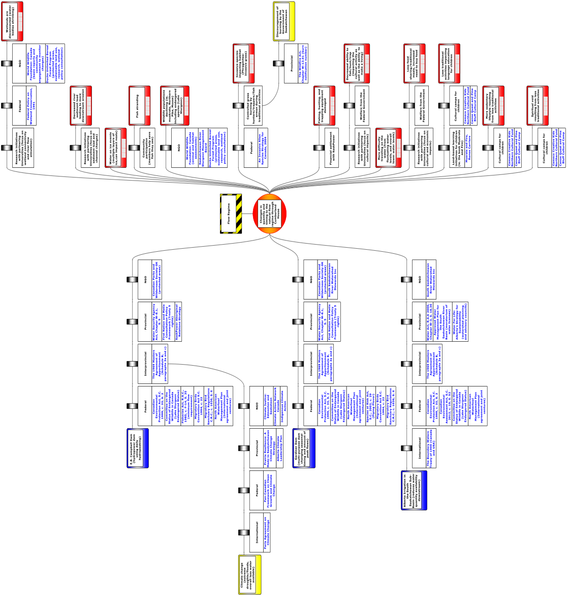{ width=100% }

*Figure 3.1: Completed Bowtie Assessment describing the policy and management framework of a changing flow regime through Cumberland House. Created using the BowtieXP software.*

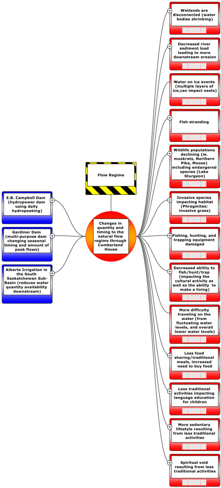{ width=100% }

*Figure 3.2: Simplified Bowtie diagram showing the basic pathways. The risk of flow change is in the middle (orange), with pressures to flow on the left (blue) and impacts of the flow change on the right (red). Created using BowtieXP software.*

## 3.2 Pressures

The main pressures are the E.B. Campbell Dam (Smith et al., 2016a), the Gardiner Dam (Saskatchewan Water Security Agency, 2012), and upstream Alberta irrigation (Partners for the Saskatchewan River Basin, 2009).

The E.B. Campbell Dam is a hydroelectric station (Figure 3.3) that was built in 1963, located near Nipawin, Saskatchewan, approximately 100 km upstream from Cumberland House and the Saskatchewan River Delta (Andrews, 2015). The E.B. Campbell Dam creates the large reservoir Tobin Lake (Figure 3.4), a waterbody popular for fishing and recreation with a 2.2 billion m3 storage capacity (Smith, Morozova, Pérez-Arlucea, & Gibling, 2016b). This dam is owned by the Water Security Agency and operated through a license by the Crown Corporation SaskPower (SaskPower, 2019). As of December 31, 2018, SaskPower reported the dam operating license has been renewed in perpetuity, while they are still in discussion with Fisheries and Oceans Canada to renew authorization in regard to fish and their habitat (SaskPower, 2019). In the meantime, SaskPower continues to operate under the old authorization (SaskPower, 2019). E.B. Campbell Dam has a net capacity of 289 MW (SaskPower, n.d.), and in 2017-2018 provided power generation, transmission, and distribution to approximately 533,000 customers in a geographic area of approximately 652,000 km2 (SaskPower, 2018). This makes the E.B. Campbell Dam an important resource for the people of Saskatchewan, and a cleaner option than coal generated power. SaskPower has set a target to get 50% of Saskatchewan’s power from renewable resources by 2030 (Government of Saskatchewan, 2017), and hydroelectric power will be an important part of this goal (SaskPower, 2019).

The E.B. Campbell hydropower station puts pressure on flow regime due to its structure and operating procedures. The dam itself is the closest structure to Cumberland House on the river and operates as a barrier for sediment movement (Smith et al., 2016b). Hydropower is created by falling water, which flows through penstocks, turns a hydraulic turbine and creates electricity, and once that water has moved through the turbine it is released downstream (SaskPower, n.d.). Hydropower is created through hydropeaking: as power demands increase, more water is released downstream, and as power needs decrease, less water is released downstream but held back in Tobin Lake (DFO, 2019). Therefore hydropeaking creates daily, or even hourly fluctuations in flow (DFO, 2019).

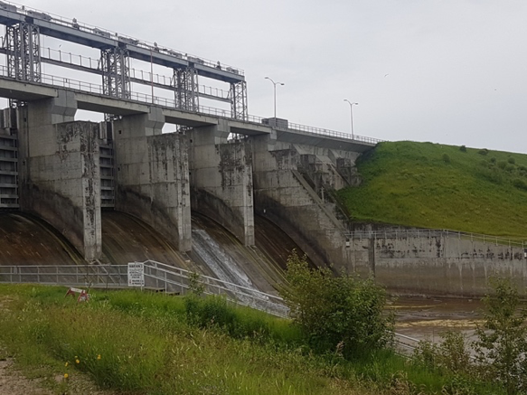{ width=100% }

*Figure 3.3: The spillway structure of the E.B. Campbell Dam (image: Kayla Garvey)*

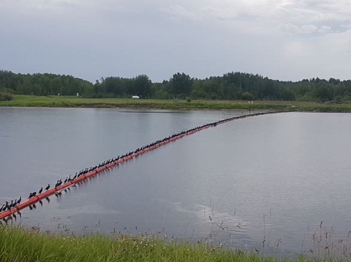{ width=100% }

*Figure 3.4: Tobin Lake before water moves into the power turbines. Picture shows Cormorants on a barrier that keeps people and logs away from the turbines (image: Kayla Garvey)*

Gardiner Dam is a 64 m earth-filled dam built in 1967, found approximately 100 km upstream of Saskatoon, which is owned and operated by the Water Security Agency (Saskatchewan Water Security Agency, 2012). The dam, in conjunction with the Qu’Appelle Dam, creates the large reservoir of Lake Diefenbaker (Figure 3.5), which has a usable storage of 4.01 billion m3, approximately half of the South Saskatchewan River inflow to the reservoir (Saskatchewan Water Security Agency, 2012). Lake Diefenbaker is an important resource to the people of Saskatchewan, as it has many uses including: municipal drinking water, flood and drought control, irrigation, hydropower (the Coteau Creek power station), fisheries, recreation, and downstream environmental flows required for habitat, aesthetics, and recreation (Saskatchewan Water Security Agency, 2012). Lake Diefenbaker provides drinking water for approximately 70% of Saskatchewan (population of 1.16 million), including Regina, Moose Jaw, and Saskatoon (Gober & Wheater, 2014). Therefore, this reservoir has many stakeholders involved, and the Water Security Agency aims to operate and optimize services to benefit the people of Saskatchewan (Saskatchewan Water Security Agency, 2012). However, this optimization of all services puts a pressure on the flow regime downstream.

Gardiner Dam impacts flow regime downstream through the Saskatchewan River because of its operating principles. In the spring, the reservoir is low but fills as the spring snowmelt comes through (for flood and drought mitigation, high lake levels for recreation, and other services) which holds back spring peak floods downstream of the dam (Saskatchewan Water Security Agency, 2012). During the fall the reservoir has been filled, and in winter water is released downstream as hydropower stations provide electricity (Saskatchewan Water Security Agency, 2012). Therefore, Gardiner Dam is changing the flow regime downstream by decreasing spring peak flows, and increasing winter minimum flows by 4-5 times (Saskatchewan Water Security Agency, 2012) (Figure 3.6). In addition, due to the large size of the reservoir, approximately half of all water loss from Lake Diefenbaker comes from evaporation (Saskatchewan Water Security Agency, 2012).

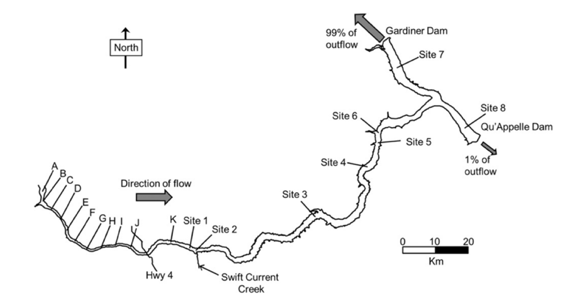{ width=100% }

*Figure 3.5: Diagram of Lake Diefenbaker, showing the locations of both the Gardiner and Qu’Appelle Dams (Lucas, Liber, & Doig, 2015).*

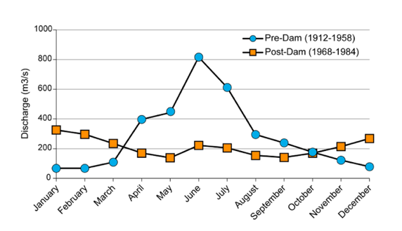{ width=100% }

*Figure 3.6: An annual hydrograph from the South Saskatchewan River at Saskatoon, showing pre- and post- Gardiner Dam construction (Gober & Wheater, 2014).*

The Saskatchewan River Basin is composed of many sub-basins and can be split further into the North Saskatchewan River Sub-Basin and the South Saskatchewan River Sub-Basin. These basins have their headwaters in the Canadian Rocky Mountains, flow through the prairie provinces of Alberta and Saskatchewan, before meeting and becoming the Saskatchewan River (Partners for the Saskatchewan River Basin, 2009). As seen in Figure 3.7, the South Saskatchewan River has considerably more water consumed than the North Saskatchewan River, 3.3 million dam3/year vs 300 000 dam3/year, respectively (Partners for the Saskatchewan River Basin, 2009). Through various dams in Alberta, approximately 70% of the water used in the South Saskatchewan Basin is for irrigation in Alberta, placing a strain on water availability downstream (Partners for the Saskatchewan River Basin, 2009). On average, flow of the South Saskatchewan River is reduced by 1.9 billion m3/year, with 95% going to irrigation (Saskatchewan Water Security Agency, 2012). While irrigation is important for agriculture, with these large amounts of water being consumed, less water is available downstream for the Saskatchewan River Delta.

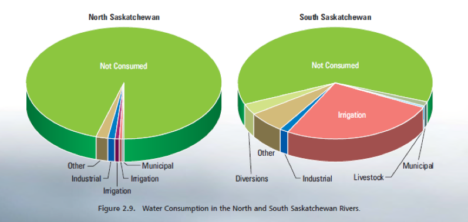{ width=100% }

*Figure 3.7: Water consumption in the North and South Saskatchewan Rivers  (Partners for the Saskatchewan River Basin, 2009)*

## 3.3 Impacts

With a changing flow regime through Cumberland House and the Saskatchewan River Delta, there are many hydrological, ecological, and cultural consequences in this region. While some consequences come as a direct result of one specific pressure on flow regime, most emerge from the cumulative effects of all pressures on the flow regime.

### 3.3.1 Hydrological Impacts

While the pressures are directly impacting the quantity and timing of the flow regime, other hydrological consequences include a decreased sediment load and decreased wetland connectivity. The E.B. Campbell Dam stores the fluvial sediment that moves through the river, allowing very little to flow into the delta (Smith et al., 2016b). This creates a sediment-starved river, which in turn increases riverbed erosion and creates a wider and deeper main channel (Smith et al., 2016b). In part due to these wider and deeper channels, along with a lower quantity of water moving through the delta, wetlands and lakes adjacent to the main channels are becoming disconnected and shrinking (Hassanzadeh et al., 2017). This lack of connectivity can affect water chemistry (concentrations of phosphorous, nitrogen, and dissolved oxygen), and limit access to spawning and nursery areas for fish (Hassanzadeh et al., 2017). In addition, during winter, release of water for hydropower leads to water-on-ice events, creating double layers of ice which affect mammals in the area by destroying habitat (GIWS, 2016). Rapid flow fluctuations in the summer can lead to fish stranding,  pushing some community members to try to save the fish by hand (The Globe and Mail, 2017).

### 3.3.2 Ecological Impacts

The changing flow regime and disconnect between wetlands, lakes, and river channels is fragmenting, decreasing, and changing aquatic and riparian habitat (Abu & Reed, 2018). This change is contributing to declining populations in wildlife (Abu & Reed, 2018). With the lower amounts of water coming in to the delta, along with channel disconnect, community members have noticed a decrease in Cumberland Lake from 22 to 3 feet deep (Charlton, 2016), with different populations, such as Northern Pike, muskrats, and geese, changing over the past half-century (Abu & Reed, 2018). As the E.B. Campbell Dam performs hydropeaking each day for power generation, water discharges range from 75-1000 m3/second, with water level changes up to 150 cm/hour, compared to the recommended <15 cm/hour (DFO, 2019). Such fast increases and decreases in discharge (ramping rate) strand fish as there is not enough time for them to adapt and move to a deeper area (DFO, 2019).

### 3.3.3 Social and Cultural Impacts

There is a deep spiritual connectivity between humans and nature that is important to many Indigenous communities, rooted from their history and close relationship to the land (E. Andrews, 2015). With a changing environment in the Saskatchewan River Delta, many of the Indigenous traditions such as hunting, fishing, and trapping are declining, creating almost a spiritual void (National Geographic, 2017). This decline emerges from lower water levels in the delta, as traveling by boat has become much more difficult (Abu & Reed, 2018). Additionally, because of lower animal populations people must travel further (Abu & Reed, 2018). Without these traditional activities, the culture suffers (National Geographic, 2017) through the inability to make a living through traditional means,  less language education for children on the land and water, and less traditional food sharing and meals (Abu & Reed, 2018). A lack of traditional activities has also contributed to a more sedentary lifestyle in the delta, with an increased need to buy food, creating economic pressure (Abu, Reed, M.G., & Belcher, 2017). In addition, with fast ramping rates in both the summer and winter, hunters, trappers, and fisherman may experience stranding or equipment damage as flows increase and decrease quickly (The Globe and Mail, 2017). As traditional activities are becoming more infrequent, the invasive grass *Phragmites australis* has become an increasing problem in the delta. In the past, this invasive species has been removed with fire by hunters, trappers, and fishermen as they moved through the delta (National Geographic, 2017). However, with less activity on the delta, and fire being discouraged by the provincial government, *Phragmites australis* have continued to take over (National Geographic, 2017). *Phragmites australis* are very aggressive, and can out-compete native vegetation, removing habitats for many species (Catling & Mitrow, 2011).

## 3.4 Pathway Example

As an example of how the tool creates pressure-risk-impact pathways, this report will follow a pathway and explain how the barriers contribute to either preventative or mitigative measures. The example will be the pathway of the E.B. Campbell Dam putting pressure on flow regime and contributing to the issue of less language education for children (Figure 3.8).

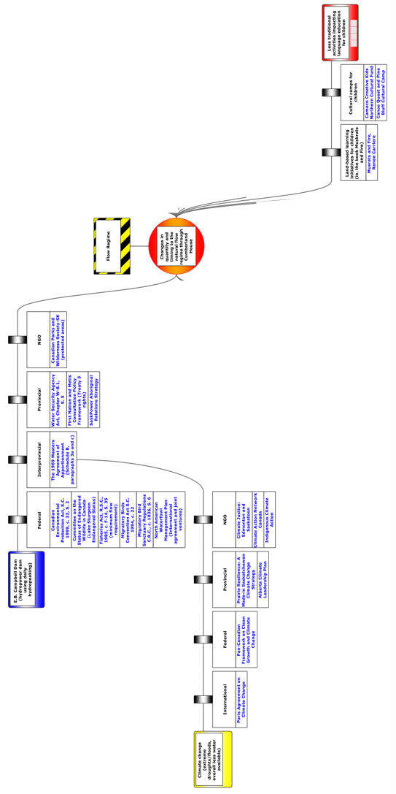{ width=100% }

*Figure 3.8: Pressure-risk-impact pathway of the E.B. Campbell Dam. Created using BowtieXP software.*

The pathway begins with the pressure of the E.B. Campbell Dam and its influence on flow regime through hydropeaking, as discussed earlier. The pathway then leads to the barriers in place to prevent a change in flow regime from this dam (Figure 3.9). In this example the preventative barriers begin with federal policies or management techniques, to interprovincial, provincial, and then non-governmental organizations.

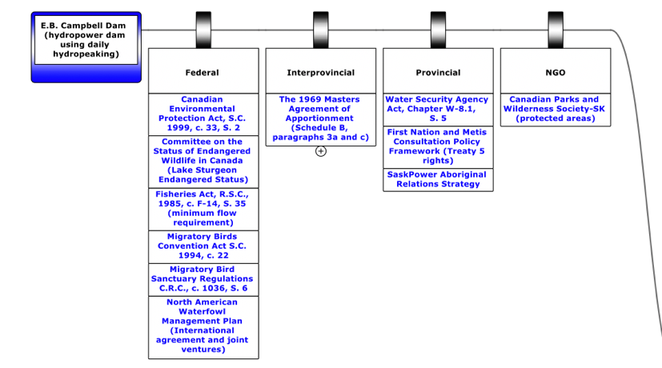{ width=100% }

*Figure 3.9: Preventative arm of the pathway, showing the pressure of the E.B. Campbell Dam on flow, and the preventative barriers in place to reduce the risk of flow change.*

The preventative barriers include the *Canadian Environmental Protection Act*. Section 2 of the Act describes the purposes of this act and defines responsibilities of the government. These include protecting the environment, and that lack of full scientific certainty will not be used as a reason for delaying cost-effective measures to prevent environmental harm (C. E. P. Act, 1999). This section also describes how the government must take preventative and remedial measures to protect, enhance, and restore the environment, and take the necessity of protecting the environment into account in making social and economic decisions (C. E. P. Act, 1999). They also must apply knowledge, including traditional Indigenous knowledge, to identify and resolve environmental problems (C. E. P. Act, 1999). This is a preventative barrier as the Government of Canada has duties to protect the environment including the Saskatchewan River Delta, and even with limited amounts of scientific research they must also take into account the traditional Indigenous Knowledge of the area.

The next federal barrier is the Endangered Status of Lake Sturgeon that are found in Cumberland Lake, as well as the Saskatchewan River. This species has been designated as endangered by the Committee on the Status of Endangered Wildlife in Canada (COSEWIC), which is an arms-length advisory panel to the Minister of Environment and Climate Change Canada (ECCC, 2017). This designation is important because species that have been designated as endangered by COSEWIC may then qualify for legal protection and recovery under the federal Species at Risk Act (SARA), however this is the federal government’s decision (ECCC, 2017). This is a preventative barrier because the Saskatchewan River Delta is a Lake Sturgeon habitat in close proximity to the dam. With an endangered status, and a possibility of being protected under SARA, this is therefore a species that SaskPower needs to consider when operating the dam.

The federal *Fisheries Act* then aims to protect fish and their habitat from any harmful activities (Fisheries Act, 1985). This is a preventative barrier because it regulates how the dam can operate. Section 35 states "that no person shall carry on any work, undertaking or activity that results in serious harm to fish that are part of a commercial, recreational or Aboriginal fishery, or to fish that support such a fishery" (Fisheries Act, 1985). Specifically, if work is going to interfere with significant ecological areas, the Minister of Fisheries and Oceans may require modifications to any plans, procedures, schedules, or restrict the work (Fisheries Act, 1985). Pertaining to this Act, the Minister implemented a minimum flow requirement for the E.B. Campbell Dam (DFO, 2019). When first built, the dam was allowed to completely stop water flow when there was no power demand, however now they must maintain a minimum of 75 m3/second at all times (DFO, 2019). Therefore, this minimum flow directly aids in preventing a change in flow through Cumberland House.

The federal *Migratory Birds Convention Act* and the *Migratory Birds Regulations* aim to protect and conserve migratory birds, as populations, individuals, and nests (M. B. C. Act, 1994). The Saskatchewan River Delta is home to many migratory birds and waterfowl (IBA, n.d.). This is a preventative barrier, as the act states in Section 12 that "the Governor in Council may make any regulations that the Governor in Council considers necessary to carry out the purposes and provisions of this Act and the Convention" including regulations for "nests that may be damaged, destroyed, removed or disturbed" (M. B. C. Act, 1994). The regulations declare in Section 6 that "no person shall disturb, destroy or take a nest, egg, nest shelter, duck shelter or duck box of a migratory bird...exept under authority of a permit therefor" (Migratory Birds Regulations, 2018). These regulations should provide protection to the migratory bird habitat and nests within the delta.

The *North American Waterfowl Management Plan* (NAWMP) is an international partnership between Canada, the United States, and Mexico to conserve waterfowl populations and habitat (Government of Canada, 2014). It therefore extends throughout North America, and works to conserve and restore wetlands, associated uplands or any key habitats for waterfowl (Government of Canada, 2014). This is a preventative barrier because the Saskatchewan River Delta has many wetlands that are important for waterfowl and migratory birds (IBA, n.d.), and this agreement states that these habitats need to be conserved.

The Prairie Water Board *Master Agreement on Apportionment* is a preventative barrier because it regulates how much water in the Saskatchewan River must pass from Saskatchewan to Manitoba (Prairie Water Board, 1969). Canada, and the provinces of Alberta, Saskatchewan, Manitoba entered this agreement on October 30, 1969, which provides an apportionment formula for eastward flowing interprovincial water (Prairie Water Board, 1969). Within the agreement, Schedule B (paragraph 3a and c) indicates that it is agreed that Saskatchewan allows one half of the water flowing from Alberta into Manitoba, and half of the natural flow from Saskatchewan to Manitoba (Prairie Water Board, 1969). This is a preventative barrier as it describes a certain amount of water that must be passed on to Manitoba (Prairie Water Board, 1969), which is relevant because the Saskatchewan River Delta is found in both Saskatchewan and Manitoba, the border being just east of Cumberland House. While this does not indicate timing of water flow, it enforces that water should not be held back from Manitoba.

The provincial *Water Security Agency Act* is a preventative barrier because its mandate and purpose are to manage and protect water and watersheds, while promoting and coordinating management, conservation, and research (The Water Security Agency Act, 2005). Authority and power of the Water Security Agency include: "to regulate and control the flow of water in any lake, river, reservoir, or other water body in Saskatchewan," "to receive and consider applications for, and issue, water rights licenses and approvals to construct, extend, alter or operate works," and "enter into agreements with the Crown in right of Canada and Indian bands relating to the management, administration, development, conservation, protection and control of any water, watershed, and related land resource in Saskatchewan." (The Water Security Agency Act, 2005).

The provincial *Duty to Consult* is an important preventative barrier that requires the government to consult with and accommodate, as appropriate, First Nation and Métis communities (Government of Saskatchewan, 2010). This barrier works to respect and protect Treaty and Aboriginal rights through consultations to ensure negative impacts on these rights are avoided or minimized (Government of Saskatchewan, 2010). The *Duty to Consult* applies to government decisions and actions that have the potential to negatively impact the exercise of rights (hunting, fishing, trapping, and other traditional uses of land), or a decision where an activity has the potential to harm the environment (Government of Saskatchewan, 2010). This is especially relevant because Cumberland House Cree Nation is a part of Treaty 5 (Treaty 5, 1969).

Another provincial barrier is the SaskPower Aboriginal Relations Strategy, which was given Progressive Aboriginal Relations Gold Status in 2017 by the Canadian Council for Aboriginal Business (SaskPower, 2017). This is a preventative measure because SaskPower has been recognized as a good business partner, a good place to work and is committed to prosperity in Aboriginal communities (SaskPower, 2017). This recognition and status encourage positive relationships between Cumberland House and SaskPower, creating lines of communication to solve problems and maintain prosperity of the community and delta.

The Canadian Parks and Wilderness Society of Saskatchewan (CPAWS-SK) are an NGO, and a preventative barrier in that they are working with Cumberland House, Peter Ballantyne Cree Nations, Weyerhauser Forest products, and the Saskatchewan Government to identify a protected area in the Suggi Lowlands and Mossy River watershed (CPAWS-SK, 2019). This area will be downstream of the E.B. Campbell Dam and in the Saskatchewan River Delta (CPAWS-SK, 2019). While the organization is still in discussions with stakeholders, creating a protected area will be beneficial to the flow regime through the delta.

With preventative barriers in place, the change in flow regime remains a risk that may have impacts. The impact example that will be further explored is the decrease in language education for children (Figure 3.91). The mitigative barriers in place are land-based learning initiatives for children, such as a book called “Muskrats and Fire” (Carriere & Carriere, 2019) and cultural camps (SaskCulture, 2019). Books such as Muskrats and Fire can help children learn about the culture and incorporate traditional language in regard to the environment, while cultural camps have a similar use in that it gets children on the land and water, and helps teach children about the traditional activities, culture, and language.

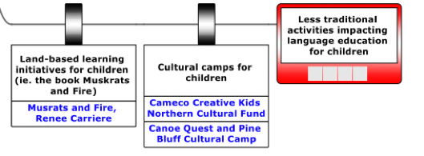{ width=100% }

*Figure 3.91:Less traditional activities impacting language education for children as a result of a change in flow regime, and the mitigative strategies in place to reduce the impact. Created using BowtieXP software.*

In this case study, climate change is an escalation factor that can influence the pressures on flow regime, escalating the pressures to be more severe (Figure 3.92). In the Saskatchewan River Basin, climate change is expected to increase the length and severity of droughts and floods, higher temperatures will cause increased evaporation, and possibly alter timing and amount of flow from the headwaters (Saskatchewan Water Security Agency, 2012). Large-scale hydrological models suggest an average spring melt decrease of 8.5%, however smaller scale models suggest that some scenarios might see an increase in spring runoff (Pomeroy, Fang, & Williams, 2009). It is therefore predicted that initially there will be an increase in runoff before it decreases later in the century (Pomeroy et al., 2009).

Climate change will increase the severity of pressures and decrease the effectiveness of many of the preventative barriers through different pathways. The Bowtie software requires the escalation factor to attach to one barrier, but realistically climate change does affect the entire pathway. With warmer temperatures and increased potential for drought, more water will be held back in Alberta as required for irrigation purposes (Gober & Wheater, 2014). Warmer temperatures would also increase water loss through evaporation (Gober & Wheater, 2014) from the reservoirs Lake Diefenbaker and Tobin Lake. In addition, less overall spring runoff will decrease water available downstream (Gober & Wheater, 2014). Therefore, climate change will increase the need of water consumption from the basin, increase evaporative losses from reservoirs, and decrease spring runoff. Higher temperatures will also put more demand on the hydropower facilities, specifically E.B. Campbell, as more power is needed to cool homes and businesses (Burillo, n.d.). The escalation factor then has barriers to prevent climate change from increasing severity of the pressure and decreasing effectiveness of barriers (Figure 3.92). In this case, barriers include the international *Paris Agreement*, the *Pan-Canadian Framework on Clean Growth and Climate Change*, provincial strategies such as *Prairie-Resilience: A Made-in Saskatchewan Climate Change Strategy* and *Alberta Climate Leadership Plan*, and NGO initiatives such as *Climate Justice*, *Climate Action Network Canada*, and *Indigenous Climate Action*. These barriers focus on strategies such as overcoming climate change impacts (Government of Saskatchewan, 2017), conducting further research (ICA, 2017), and bringing further awareness to the public (CJS, 2018).

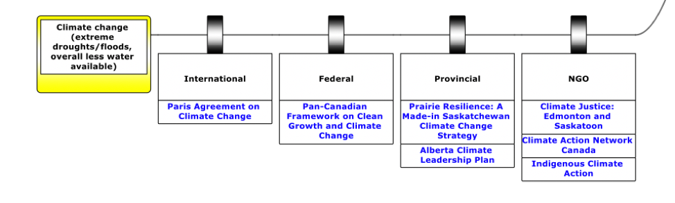{ width=100% }

*Figure 3.92: Escalation of climate change will increase severity of pressures and undermine effectiveness of the preventative barriers. Created using BowtieXP software.*

## 3.5 Possible Gaps in the Policy and Management Framework

The completed diagram provides insights into possible gaps in the policy and management framework of a changing flow regime through Cumberland House. Looking at the complete Bowtie and policy and management framework, it is evident that while there are a few main pressures, there are many negative impacts on hydrology, ecology, and the community of Cumberland House. As seen in the diagram, this is a “preventative” policy and management framework, as the diagram is heavily skewed towards preventative barriers. The pressures on flow regime have many preventative barriers, including international agreements, federal and provincial policies, interprovincial agreements, and NGO's. On the right side there are more impacts, yet much fewer mitigative barriers to reduce the severity of these impacts. One observation is that of the few mitigative barriers present, not many are policies, as compared to the preventative side. Many of the barriers include research initiatives, NGO's, and learning initiatives in the community, while some impacts do not have any mitigative barriers, such as water on ice events, or difficulty traveling on water.

Possible gaps in this framework may therefore include the need for more mitigative barriers. Mitigative barriers for impacts on Indigenous culture are difficult, as it is challenging to mitigate a feeling such as a spiritual void due to changes in the environment that the culture and community relies on. However, a mitigative barrier such as a watershed plan for Cumberland House focused on mitigating some of these impacts may be helpful. Figure 3.93 shows the completed watersheds in Saskatchewan, and the Saskatchewan River Watershed, in which Cumberland House and E.B. Campbell Dam resides (found above the Carrot River Watershed), does not have a watershed plan. A plan and committee might be helpful in bringing together stakeholders and setting goals and objectives to protect the water resources.

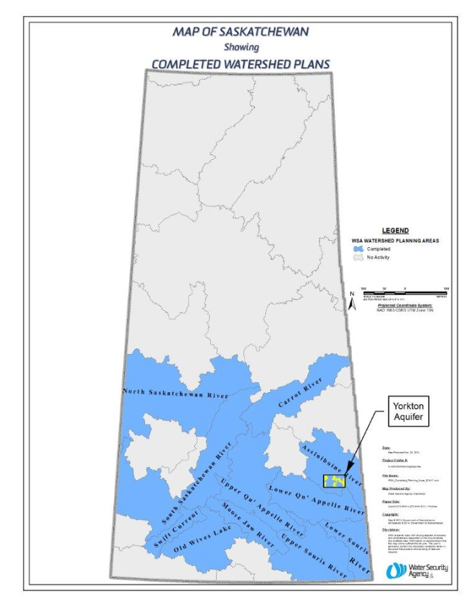{ width=100% }

*Figure 3.93: Completed watershed plans in Saskatchewan (WSA, 2011).*

Other observations include that there are very few flow specific regulations, such as the minimum requirements for flow released from E.B. Campbell Dam and Gardiner Dam. Perhaps other flow specific policies may be needed in this framework, for example a regulation on ramping rate to the recommended <15 cm/hour (DFO, 2019) for E.B. Campbell Dam. This would be a preventative barrier for flow change, which would help prevent fish stranding and equipment damage for community members. This may also help with traveling on the water, with less of a chance of extreme water fluctuation in a day, decreasing the chance that boats or other equipment will be stranded.

In addition, the *Saskatchewan Environmental Assessment Act* was not in effect until 1980 (The Environmental Assessment Act, 1980), many years after the E.B. Campbell and Gardiner Dams were built (1963 and 1967, respectively). Therefore, no environmental assessments were completed when the dams were built (The Globe and Mail, 2017).
