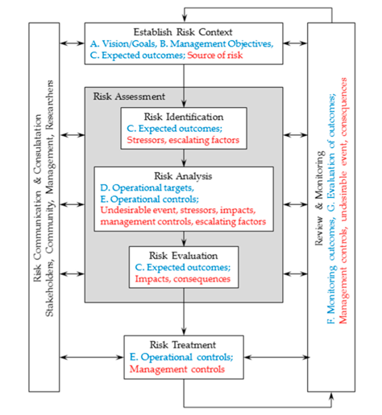
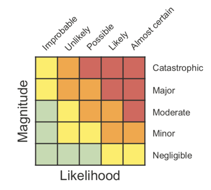

---
---

[home](home.html)

# 5.0 Towards a Solution

Important further steps include the application of the tool on new environmental case studies. This will continue to build the repertoire
of applications of this tool, more “proof-of-concept” projects and research. In addition, further research for each case study, including for flow regime, should include a more detailed risk analysis and land simulation analysis.

The next step for further research should use the base Bowtie Assessment diagram to perform a risk analysis (Figure 5.1), which will assess and assign a level of risk to each impact. To help make a decision or advise on the needs of the framework, it is important to understand the severity and likelihood of the impacts, and effectiveness of the barriers, using criteria that forms risk-tolerance levels that have been approved by all stakeholders and rights holders involved (Creed, Cormier, et al., 2016). Based on the outcomes of the criteria, and placement of risks on risk-tolerance matrix (Figure 5.2), decisions or recommendations can be made including no management required (green), existing management sufficient (yellow), existing management needs change (orange), and additional management measures need to be implemented (red) (Creed, Cormier, et al., 2016). This exercise would aid in determining the likelihood and magnitude of these impacts, and thus how effective the present management is.

{ width=100% }

*Figure 5.1:  Flow chart of risk analysis steps. After the Bowtie Assessment (risk identification) the next step is risk analysis and evaluation (Astles & Cormier, 2018).*

{ width=100% }

*Figure 5.2: Risk-tolerance matrix that can be used to determine likelihood and severity of impacts, and therefore the effectiveness of barriers (Creed, Cormier, et al., 2016).*

After determining likelihood and severity of impacts, and effectiveness of the current policy and management framework, the next step is to use a land simulation model, such as A Landscape Cumulative Effects Simulator (ALCES). This is a model which provides an approach to simulating and modeling various effects over time (North Saskatchewan Watershed Alliance, 2009). This simulator has proven to be valuable in areas such as hydrology, resource management, land use planning, and cumulative effects evaluation (Hudson, 2002). ALCES could help simulate the impacts by adding, removing, or changing barriers to see how it effects the negative impacts.  This would aid in decision making or recommendations for the policy and management framework, as it allows simulation of the effects of different management techniques.
