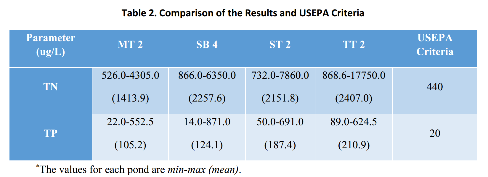

---
---

[home](home.html)

# Discussion

&nbsp;&nbsp;&nbsp;&nbsp;&nbsp;&nbsp;&nbsp;&nbsp;&nbsp;The algae results show a very high diversity of algae species identified in 4 SWMPs compared with other SWMPs in Canada. There were 60 different species found from samples. Olding (2000) reported 32 species in two SWMPs from Ontario in 1997 (June to September). Vincent and Kirkwood (2014) reported 25 species in 22 stormwater ponds from Ontario in 2011 (June to August), while the dominant species are blue-green and euglenid algae. Nonetheless, it’s worth noting that our sampling time covered the whole non-frozen period (April to October). Interestingly, there are relatively fewer algae species reported in warm areas. DeLorenzo and Fulton (2009) summarized 22 species in 112 southeastern coastal stormwater ponds from U.S. Lewitus et al. (2008) reported 23 species in over 50 stormwater detention ponds from coastal South Carolina during 2001 – 2005, while cyanobacteria are the common dominant species in low brackish waters. However, the abundance of algae species is still much less compared with larger water bodies such as lakes and oceans in Canada. Hammer et al. (1983) identified 212 species (including 41 cyanobacteria species) from 41 saline lakes in southern Saskatchewan during 1959 – 1982. South (1984) summarized 354 species and subspecies marine algae from eastern coastal Canada.

&nbsp;&nbsp;&nbsp;&nbsp;&nbsp;&nbsp;&nbsp;&nbsp;&nbsp;Algae growth conditions can be reflected in the Chl-a concentrations (Wetzel, 2001). Most of SWMPs maintained low average Chl-a levels (<50 ug/L) during summertime. The results are close to the data based on the 58 stormwater retention basins in Winnipeg (Wakelin et al., 2003). Vincent and Kirkwood (2014) also detected low Chl-a levels from 20 out of 22 stormwater ponds and 3 neutral lakes in summer, and the 3 neutral lakes had lower Chl-a levels (<17 ug/L) than stormwater ponds. Xu et al. (2014) detected even lower Chl-a levels (average of 9.485 ug/L) in Lake Taihu, China in July and September. There are no criteria for water quality of SWMPs, so the criteria for natural lakes are used to compare. According to USEPA criteria, the standard Chl-a concentration for level-III ecoregion-15 lakes is 2.1 ug/L (USEPA, 2001). The 4 SWMPs exceeded this level in the most of times.

&nbsp;&nbsp;&nbsp;&nbsp;&nbsp;&nbsp;&nbsp;&nbsp;&nbsp;It is very hard to determine the dominant species in the 4 SWMPs for a long period (over 1 month). Downing et al. (2001) found that with the increasing concentration of Chl-a (1 – 100 ug/L), the risk of cyanobacteria dominance (>50%) is also increased. Unfortunately, the results from the 4 SWMPs do not show similar trends. Olding et al. (2000) pointed that phytoplankton communities only tend to be predictably related to trophic status in deep water bodies (maximum depth > 5 m), whereas in shallow water bodies (maximum depth < 5 m) the key factor for predicting dominant bacteria is water residence times. Similarly, Anderson et al.(2002) also proved that P levels have a strong relationship with cyanobacteria in deep lakes (> 10 m). The species of algae in all the ponds change rapidly every two weeks. In 2015, pond MT 2 and SB 4 maintained low Chl-a conditions (mostly < 50 ug/L) while pond ST 2 and TT 2 did not. But they did not show a significant difference in the number of species. For the low Chl-a lakes, there were a few samples that did not find any algae species, whereas algae were found in all the samples from high Chl-a lakes with only one exception. Thus, the methods for predicting the dominant algae species in shallow water bodies or SWMPs still need to be developed.

&nbsp;&nbsp;&nbsp;&nbsp;&nbsp;&nbsp;&nbsp;&nbsp;&nbsp;Normally, algae grow quickly during summertime due to the warm temperature and strong solar radiation (DeLorenzo et al., 2011; Singh and Singh, 2015; Paerl and Otten, 2013). This is opposite to our results. All the SWMPs reached their highest Chl-a concentrations in April except for pond TT 2 in 2015, and kept relatively low Chl-a concentration during summertime till they reached their second peaks after September. Interestingly, similar trends are found in a tidal creek in coastal South Carolina (DeLorenzo et al., 2011). This long-term monitoring study of chlorophyll also found the Chl-a concentrations are significantly correlated with total monthly rainfall, which is also not reflected in our results. (Sønderup et al., 2015)

&nbsp;&nbsp;&nbsp;&nbsp;&nbsp;&nbsp;&nbsp;&nbsp;&nbsp;As the major nutrients for algae growth, exceeding nitrogen and phosphor are always assumed as the important cause for eutrophication and algae blooms (Anderson et al., 2002). The Alberta Water Quality Guideline only provides the criteria for nitrate + nitrite which is 100 000 ug/L in N for livestock (Government of Alberta, 2018). All of the 4 SWMPs had concentrations lower than this level. However, almost all the SWMPs exceeded the USEPA criteria (Table 2).

&nbsp;&nbsp;&nbsp;&nbsp;&nbsp;&nbsp;&nbsp;&nbsp;&nbsp;There are many factors can influence the P and N levels in open water bodies. Land use is assumed to be one of the most important reasons (Sønderup et al., 2015). There is a strong correlation between harmful algae blooms and fertilizer use (Heisler et al., 2008). All of the 4 SWMPs are located in the residential area which tends to be the major source of the runoff containing fertilizers and pesticides from gardening water. The frequently gardening and turf management are the non-point source of nutrients (Lewitus et al., 2008). In our study, the nutrient level varies from site to site in one pond. The nutrient levels around inlets are always higher than those around outlets. Since each pond has more than one inlet, the nutrient level around inlets that receive more runoff from residence also higher than that receive less runoff from the residence. Sønderup et al. (2015) pointed that the nutrient retaining capacity of young age (< 5 years) SWMPs is higher than middle age (5 – 10 years) SWMPs, and old age (> 10 years) SWMPs have almost no capacity for particulate fractions of organic matter, P and N. None of the SWMPs belongs to young age in our study. Pond SB 4 was 12-year old and Pond TT 2 was 14-year old in 2014. Both of them are old age ponds, but SB 4 had the lowest nutrient levels while TT 2 had the highest nutrient levels. Animal wastes are also an important source of nutrients in SWMPs (Wakelin et al., 2003). The study of nutrient from Canada geese’s waste is required in the future.   

&nbsp;&nbsp;&nbsp;&nbsp;&nbsp;&nbsp;&nbsp;&nbsp;&nbsp;N:P ratio is commonly used to predict eutrophic status and algae dominance in lakes. Tilman et al. (1982) proposed that cyanobacteria are dominant in low TN:TP lakes. Smith (1983) also mentioned that the cyanobacteria becomes rare when the molar ratio of TN:TP is greater than 80:1. The highest TN:TP obtained from our study is 31.409, which is much lower than the proposed value. The cyanobacteria were rarely dominant during the whole monitoring period. When TN:TP ratio is high (>50), P-deficient consistently occurred (Jarvie et al., 1998). The low TN: TP molar ratio (< 45.5) in 4 SWMPs indicates that N limitation is more frequently (Downing and McCauley, 1992; Jarvie et al., 1998). According to Figure 3 and 4, TN and TP growth have a strong correlation. They always increase and decrease at the same time. Many studies pointed out this relationship (Both Chiandet & Xenopoulos, 2010; Jarvie et al.,1998; Seip, 1994). It works well in both SWMPs and natural lakes. According to Figure 4, the lower TN:TP ratios indicate lower eutrophic levels (in terms of Chl-a) in SWMPs. With the TN:TP ratios increasing, the eutrophic levels also increase in SWMPs. This is the opposite to what happens in lakes (Seip, 1994).

&nbsp;&nbsp;&nbsp;&nbsp;&nbsp;&nbsp;&nbsp;&nbsp;&nbsp;Moreover, the sampling depths are also important. Song et al. (2017) already proved that TP and TPP levels have obvious spatial differences even in shallow SWMPs (from 1 – 4 m depth). The multi-depth samplings and measurements will provide more reliable data.
