---
---

[home](home.html)

# Data analysis

## 1.Analysis objectives

Plot the parameters measured in the sample.

## 2.Quality assurance and quality control

See detection limit in Appendix C.

## 3.Methods

The plots were made by MS Excel and MatLab. The pond average values are the mean value of all the sites.

## 4.Results

### 4.1 Algae Species in Each Site of Each Pond
&nbsp;&nbsp;&nbsp;&nbsp;&nbsp;&nbsp;&nbsp;&nbsp;&nbsp;The total number of 60 different algae species were identified from samples, while 9 of them are cyanobacteria. Figure 2 shows the algae composition at different sites in each pond from 2014 (July to September) and 2015 (April to October). The percentage of algae species was converted by the equivalent Chl-a contribution. The species that contributed less than 10% of Chl-a in the sample were not plotted. The blank means no algae was found in the sample. It is seen that the algae species had high difference and diversity among different time (biweekly and yearly), different sites in one pond, as well as different ponds.

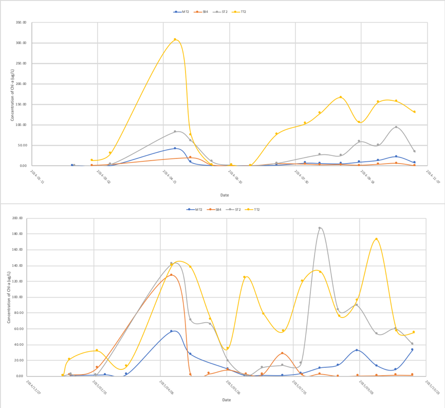{ width=100% }

<em>Figure 2. Time Series Chl-a in Each Pond 2014 – 2015</em>

&nbsp;&nbsp;&nbsp;&nbsp;&nbsp;&nbsp;&nbsp;&nbsp;&nbsp;It is seen from Figure 2 that Chl-a concentrations in each pond showed similar trend in both years except for pond TT 2 in 2015. They reached their peaks around April 14th. They then dropped rapidly and kept relatively stable during summer time. At the end of summer and the beginning of fall, the concentrations of Chl-a in each pond increased again except for pond SB 4 in 2015. Pond MT 2 and SB 4 almost maintained good eutrophic conditions based on the WHO guidelines that defines the algae bloom as the concentration of Chl-a is greater than 50 ug/L. But the Chl-a concentration in pond ST 2 and TT 2 exceeded this level a lot.

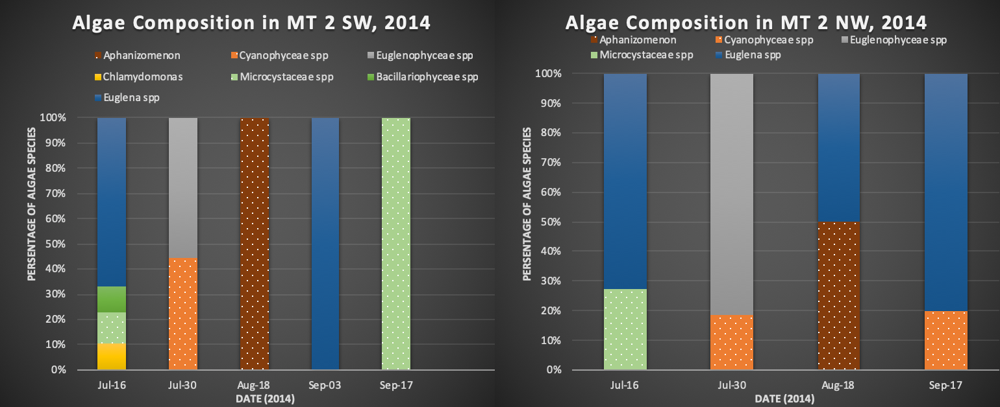 &nbsp;&nbsp;&nbsp;&nbsp;&nbsp;&nbsp;&nbsp;&nbsp;&nbsp;&nbsp;&nbsp;&nbsp;&nbsp;&nbsp;&nbsp;&nbsp;(a) MT 2 SW 2014 &nbsp;&nbsp;&nbsp;&nbsp;&nbsp;&nbsp;&nbsp;&nbsp;&nbsp;&nbsp;&nbsp;&nbsp;&nbsp;&nbsp;&nbsp;&nbsp;&nbsp;&nbsp;&nbsp;&nbsp;&nbsp;(b) MT 2 NW 2014   
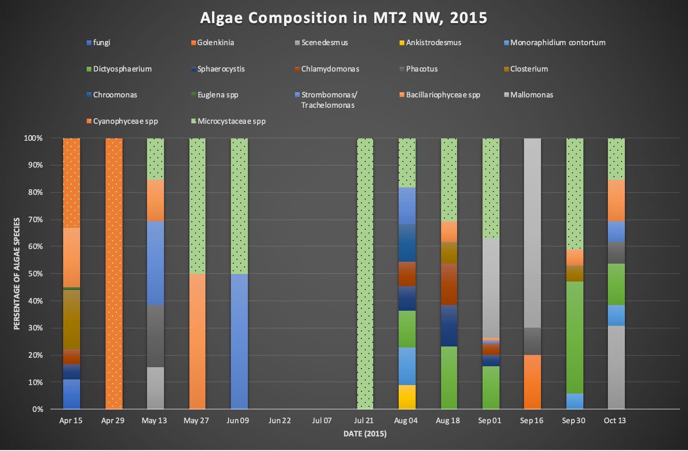&nbsp;&nbsp;&nbsp;&nbsp;&nbsp;&nbsp;&nbsp;&nbsp;&nbsp;&nbsp;&nbsp;&nbsp;&nbsp;&nbsp;&nbsp;&nbsp;&nbsp;&nbsp;&nbsp;&nbsp;&nbsp;&nbsp;&nbsp;&nbsp;&nbsp;&nbsp;&nbsp;&nbsp;&nbsp;&nbsp;&nbsp;&nbsp;&nbsp;&nbsp;&nbsp;&nbsp;&nbsp;&nbsp;&nbsp;(c) MT 2 NW 2015
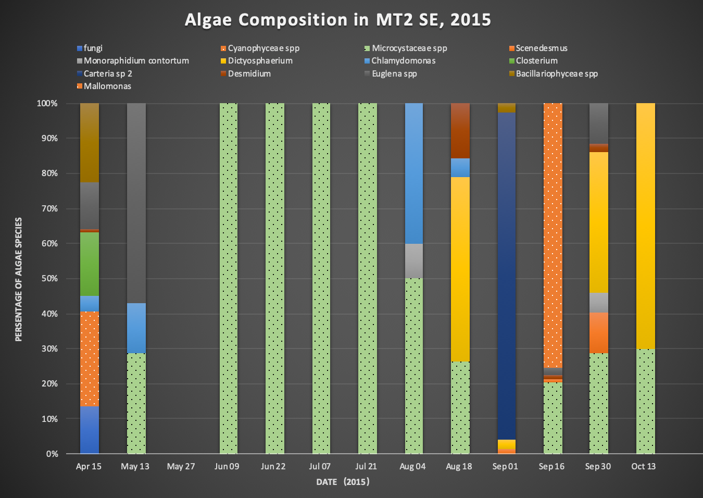&nbsp;&nbsp;&nbsp;&nbsp;&nbsp;&nbsp;&nbsp;&nbsp;&nbsp;&nbsp;&nbsp;&nbsp;&nbsp;&nbsp;&nbsp;&nbsp;&nbsp;&nbsp;&nbsp;&nbsp;&nbsp;&nbsp;&nbsp;&nbsp;&nbsp;&nbsp;&nbsp;&nbsp;&nbsp;&nbsp;&nbsp;&nbsp;&nbsp;&nbsp;&nbsp;&nbsp;&nbsp;&nbsp;&nbsp;(d) MT 2 SE 2015
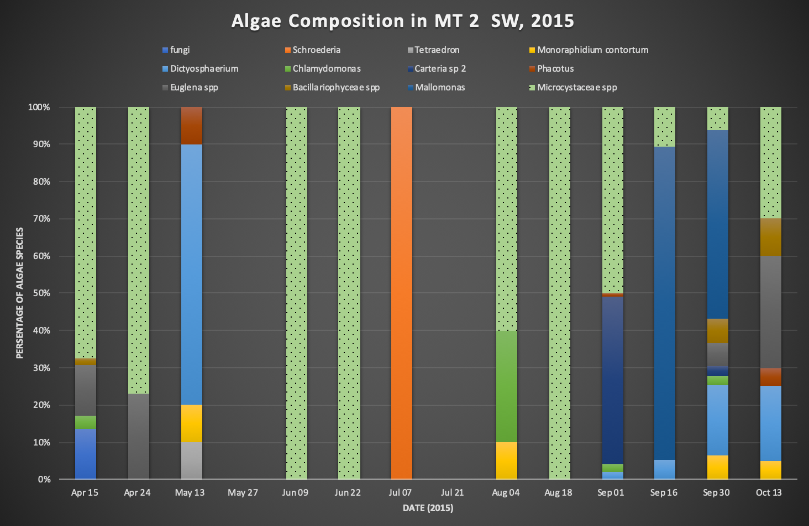&nbsp;&nbsp;&nbsp;&nbsp;&nbsp;&nbsp;&nbsp;&nbsp;&nbsp;&nbsp;&nbsp;&nbsp;&nbsp;&nbsp;&nbsp;&nbsp;&nbsp;&nbsp;&nbsp;&nbsp;&nbsp;&nbsp;&nbsp;&nbsp;&nbsp;&nbsp;&nbsp;&nbsp;&nbsp;&nbsp;&nbsp;&nbsp;&nbsp;&nbsp;&nbsp;&nbsp;&nbsp;&nbsp;&nbsp;(e) MT 2 SW 2015

&nbsp;&nbsp;Figure 3 (A). Algae Composition in Different Sites of Pond MT 2

According to WHO guidelines, the algae bloom is defined as the concentration of Chl-a is greater than 50 ug/L or where cyanobacteria are responsible for at least 10 ug/L of Chl-a. In 2014, pond MT 2 did not have bloom from July to September. More than 7 algae species were identified. Euglena spp was the most abundant species in both sites, and it contributed 100% of Chl-a for site SW in Sep 3rd. Three different cyanobacteria species were identified in both sites, they were Aphanizomenon, Microcystacea spp, and Cyanophyceae spp, while the first two contributed 100% of Chl-a for site SW on Aug 18th and Sep 17th, respectively. In 2015, more than 17 algae species were identified. Microcystacea spp was the most abundant species among three sampling sites, but Aphanizomenon was not found. Only the first day (April 15th) of sampling had bloom ([Chl-a]=56.54 ug/L), Microcystacea spp contributed about 68% of Chl-a at site SW and Cyanophyceae spp contributed about 20% at site SE. Interestingly, in some days there was no algae found in the sample.

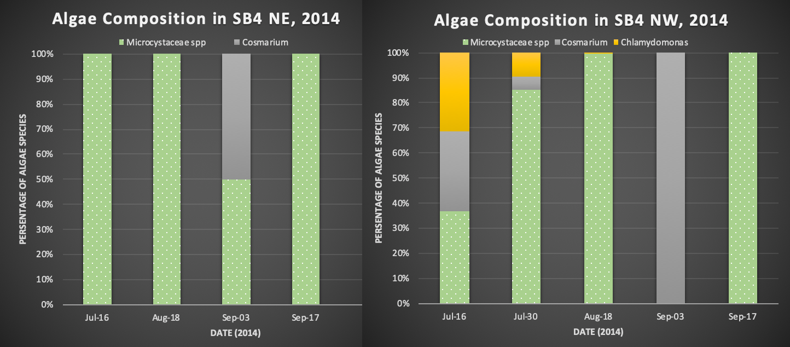&nbsp;&nbsp;&nbsp;&nbsp;&nbsp;&nbsp;&nbsp;&nbsp;&nbsp;&nbsp;&nbsp;&nbsp;&nbsp;&nbsp;&nbsp;&nbsp;(a) SB 4 NE 2014  &nbsp;&nbsp;&nbsp;&nbsp;&nbsp;&nbsp;&nbsp;&nbsp;&nbsp;&nbsp;&nbsp;&nbsp;&nbsp;&nbsp;&nbsp;&nbsp;&nbsp;&nbsp;&nbsp;&nbsp;(b) SB 4 NW 2014
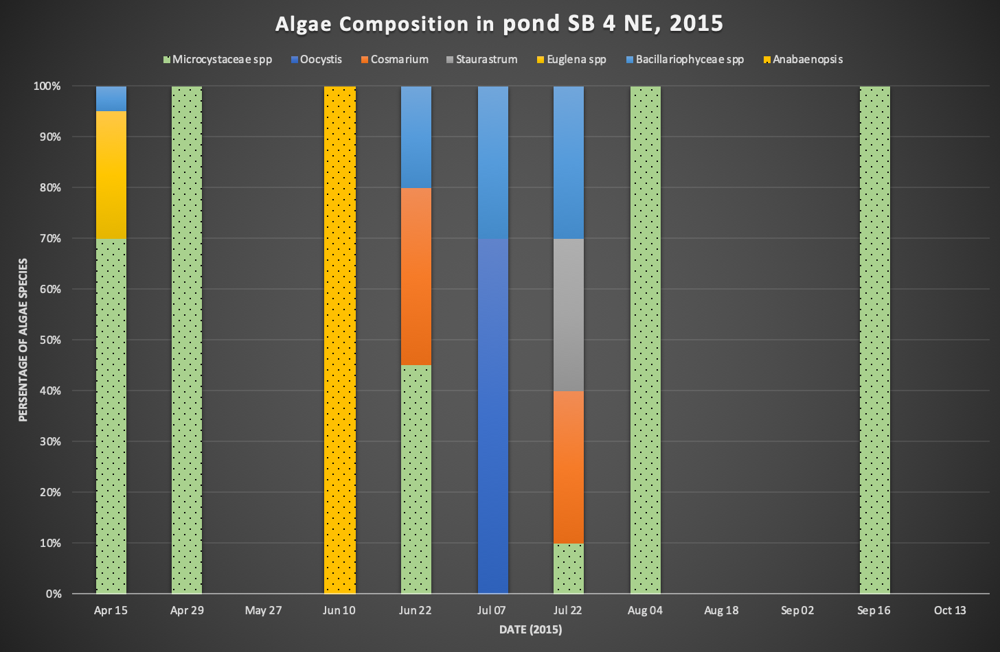&nbsp;&nbsp;&nbsp;&nbsp;&nbsp;&nbsp;&nbsp;&nbsp;&nbsp;&nbsp;&nbsp;&nbsp;&nbsp;&nbsp;&nbsp;&nbsp;&nbsp;&nbsp;&nbsp;&nbsp;&nbsp;&nbsp;&nbsp;&nbsp;&nbsp;&nbsp;&nbsp;&nbsp;&nbsp;&nbsp;&nbsp;&nbsp;&nbsp;&nbsp;&nbsp;&nbsp;&nbsp;&nbsp;&nbsp;(c) SB 4 NE 2015
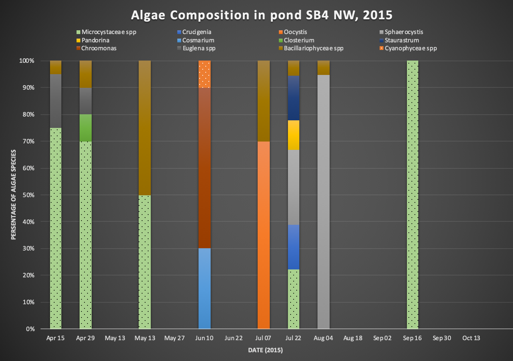&nbsp;&nbsp;&nbsp;&nbsp;&nbsp;&nbsp;&nbsp;&nbsp;&nbsp;&nbsp;&nbsp;&nbsp;&nbsp;&nbsp;&nbsp;&nbsp;&nbsp;&nbsp;&nbsp;&nbsp;&nbsp;&nbsp;&nbsp;&nbsp;&nbsp;&nbsp;&nbsp;&nbsp;&nbsp;&nbsp;&nbsp;&nbsp;&nbsp;&nbsp;&nbsp;&nbsp;&nbsp;&nbsp;&nbsp;(d) SB 4 NW 2015
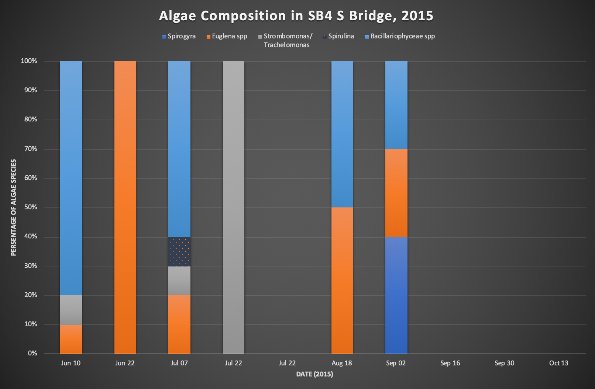&nbsp;&nbsp;&nbsp;&nbsp;&nbsp;&nbsp;&nbsp;&nbsp;&nbsp;&nbsp;&nbsp;&nbsp;&nbsp;&nbsp;&nbsp;&nbsp;&nbsp;&nbsp;&nbsp;&nbsp;&nbsp;&nbsp;&nbsp;&nbsp;&nbsp;&nbsp;&nbsp;&nbsp;&nbsp;&nbsp;&nbsp;&nbsp;&nbsp;&nbsp;&nbsp;&nbsp;&nbsp;&nbsp;&nbsp;(e) SB 4 NW 2015

&nbsp;Figure 3 (B). Algae Composition in Different Sites of Pond SB 4

&nbsp;&nbsp;&nbsp;&nbsp;&nbsp;&nbsp;&nbsp;&nbsp;&nbsp;In 2014, pond SB 4 did not have algae bloom the whole year, and only 3 algae species were identified in pond SB 4. Microcystacea spp was the only cyanobacteria found and it had an obvious advantage over Chlamydomonas and Cosmarium. In 2015, only site SE on April 15th had bloom ([Chl-a]=341.06 ug/L), where the sampling was not conducted, unfortunately. Compared with 2014, the diversity of algae species increased a lot. More than 13 algae species were identified, including four cyanobacteria: Microcystacea spp, Cyanophyceae spp, Anabaenopsis, and Spiralina. Similar to pond MT 2 in 2015, in some days there was also no algae found in the sample.

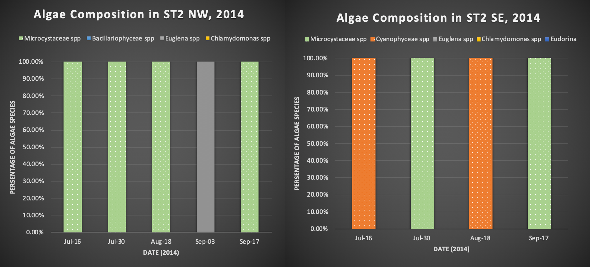&nbsp;&nbsp;&nbsp;&nbsp;&nbsp;&nbsp;&nbsp;&nbsp;&nbsp;&nbsp;&nbsp;&nbsp;&nbsp;&nbsp;&nbsp;&nbsp;(a) ST 2 NW 2014&nbsp;&nbsp;&nbsp;&nbsp;&nbsp;&nbsp;&nbsp;&nbsp;&nbsp;&nbsp;&nbsp;&nbsp;&nbsp;&nbsp;&nbsp;&nbsp;&nbsp;&nbsp;&nbsp;&nbsp;(b) ST 2 SE 2014
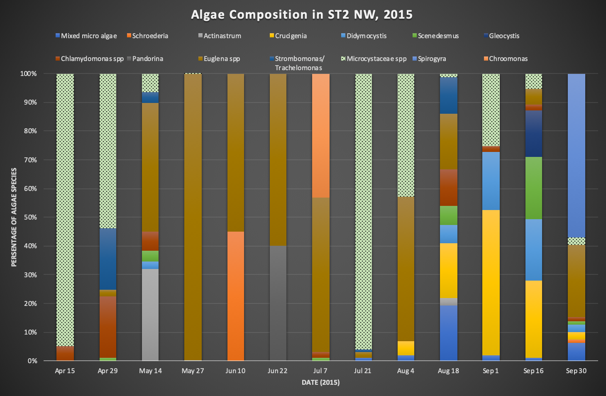&nbsp;&nbsp;&nbsp;&nbsp;&nbsp;&nbsp;&nbsp;&nbsp;&nbsp;&nbsp;&nbsp;&nbsp;&nbsp;&nbsp;&nbsp;&nbsp;&nbsp;&nbsp;&nbsp;&nbsp;&nbsp;&nbsp;&nbsp;&nbsp;&nbsp;&nbsp;&nbsp;&nbsp;&nbsp;&nbsp;&nbsp;&nbsp;&nbsp;&nbsp;&nbsp;&nbsp;&nbsp;&nbsp;&nbsp;(c) ST 2 NW 2015
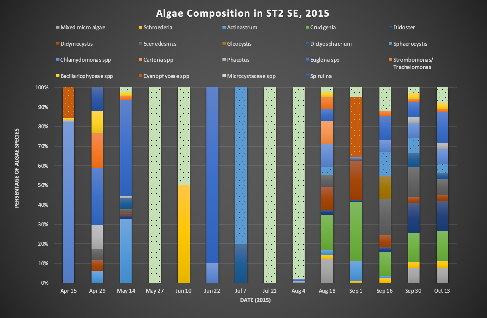&nbsp;&nbsp;&nbsp;&nbsp;&nbsp;&nbsp;&nbsp;&nbsp;&nbsp;&nbsp;&nbsp;&nbsp;&nbsp;&nbsp;&nbsp;&nbsp;&nbsp;&nbsp;&nbsp;&nbsp;&nbsp;&nbsp;&nbsp;&nbsp;&nbsp;&nbsp;&nbsp;&nbsp;&nbsp;&nbsp;&nbsp;&nbsp;&nbsp;&nbsp;&nbsp;&nbsp;&nbsp;&nbsp;&nbsp;(d) ST 2 SE 2015
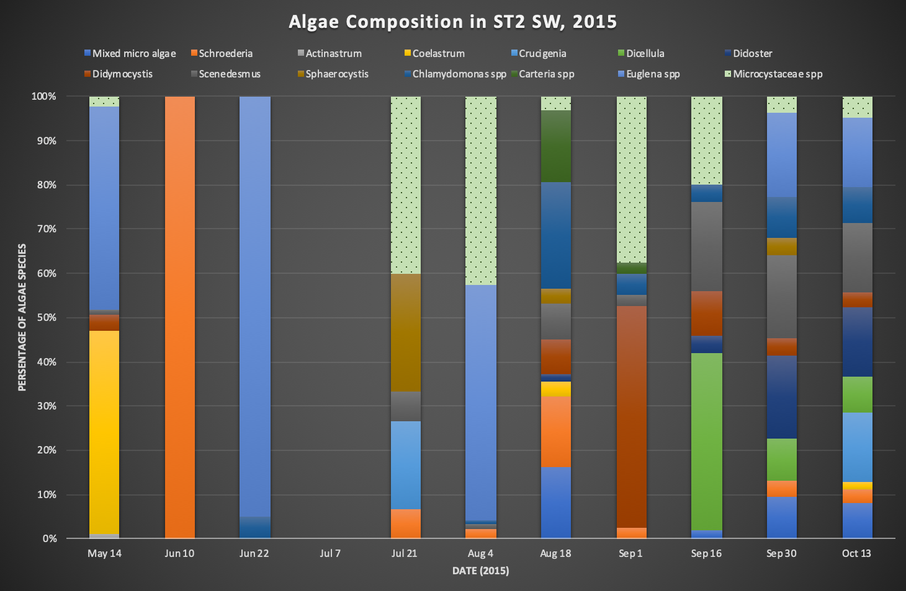&nbsp;&nbsp;&nbsp;&nbsp;&nbsp;&nbsp;&nbsp;&nbsp;&nbsp;&nbsp;&nbsp;&nbsp;&nbsp;&nbsp;&nbsp;&nbsp;&nbsp;&nbsp;&nbsp;&nbsp;&nbsp;&nbsp;&nbsp;&nbsp;&nbsp;&nbsp;&nbsp;&nbsp;&nbsp;&nbsp;&nbsp;&nbsp;&nbsp;&nbsp;&nbsp;&nbsp;&nbsp;&nbsp;&nbsp;(e) ST 2 SW 2015

&nbsp;Figure 3(C). Algae Composition in Different Sites of Pond ST 2

 &nbsp;&nbsp;&nbsp;&nbsp;&nbsp;&nbsp;&nbsp;&nbsp;&nbsp;In 2014, pond ST 2 had algae bloom except for the first of measurement (July 16th). Over 5 algae species were identified from two sites. The most abundant species were Microcystacea spp and Euglena spp. Two cyanobacteria species were identified, including Microcystacea spp and Cyanophyceae spp. In 2015, pond ST 2 had bloom except for the period from May 27th to July 21st during the sampling period. More than 20 algae species were identified, the cyanobacteria found were the same as in 2014 plus Sphaerocystis and the small number of mixed bluegreens. Microcystacea spp were dominant as cyanobacteria in all the sites; Euglena spp also contributed a lot to all the sites.

 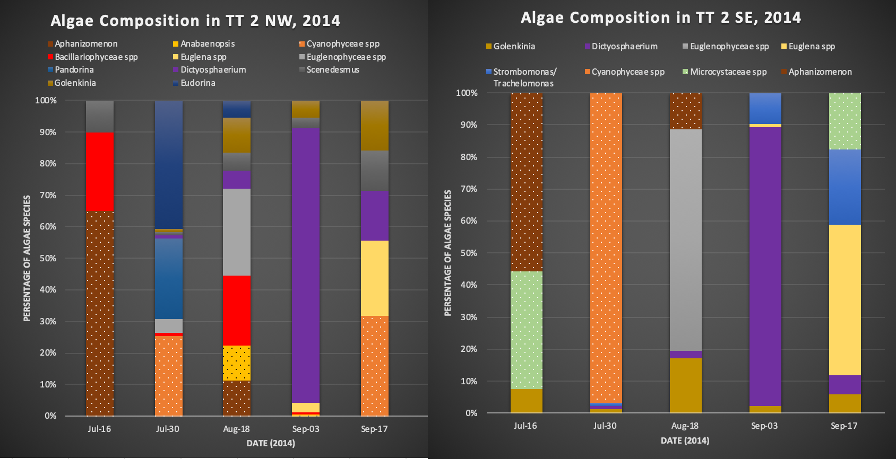&nbsp;&nbsp;&nbsp;&nbsp;&nbsp;&nbsp;&nbsp;&nbsp;&nbsp;&nbsp;&nbsp;&nbsp;&nbsp;&nbsp;&nbsp;&nbsp;(a) TT 2 NW 2014   &nbsp;&nbsp;&nbsp;&nbsp;&nbsp;&nbsp;&nbsp;&nbsp;&nbsp;&nbsp;&nbsp;&nbsp;&nbsp;&nbsp;&nbsp;&nbsp;&nbsp;&nbsp;&nbsp;&nbsp;(b) TT 2 SE 2014
 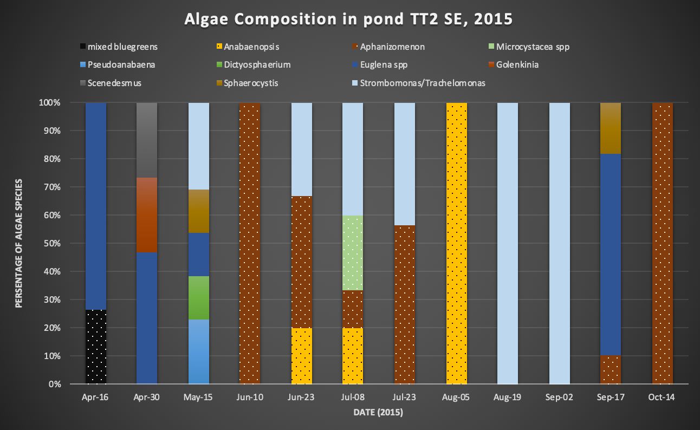&nbsp;&nbsp;&nbsp;&nbsp;&nbsp;&nbsp;&nbsp;&nbsp;&nbsp;&nbsp;&nbsp;&nbsp;&nbsp;&nbsp;&nbsp;&nbsp;&nbsp;&nbsp;&nbsp;&nbsp;&nbsp;&nbsp;&nbsp;&nbsp;&nbsp;&nbsp;&nbsp;&nbsp;&nbsp;&nbsp;&nbsp;&nbsp;&nbsp;&nbsp;&nbsp;&nbsp;&nbsp;&nbsp;&nbsp;(c) TT 2 SE 2015
 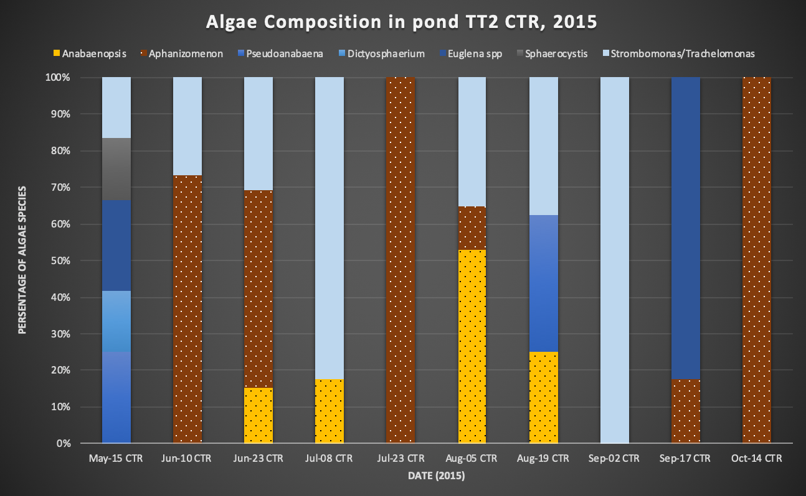&nbsp;&nbsp;&nbsp;&nbsp;&nbsp;&nbsp;&nbsp;&nbsp;&nbsp;&nbsp;&nbsp;&nbsp;&nbsp;&nbsp;&nbsp;&nbsp;&nbsp;&nbsp;&nbsp;&nbsp;&nbsp;&nbsp;&nbsp;&nbsp;&nbsp;&nbsp;&nbsp;&nbsp;&nbsp;&nbsp;&nbsp;&nbsp;&nbsp;&nbsp;&nbsp;&nbsp;&nbsp;&nbsp;&nbsp;(d) TT 2 Center 2015
 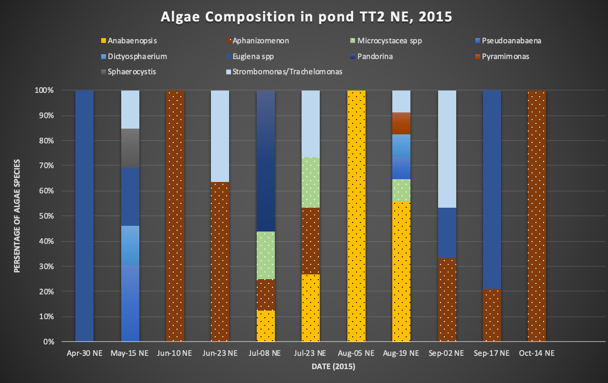&nbsp;&nbsp;&nbsp;&nbsp;&nbsp;&nbsp;&nbsp;&nbsp;&nbsp;&nbsp;&nbsp;&nbsp;&nbsp;&nbsp;&nbsp;&nbsp;&nbsp;&nbsp;&nbsp;&nbsp;&nbsp;&nbsp;&nbsp;&nbsp;&nbsp;&nbsp;&nbsp;&nbsp;&nbsp;&nbsp;&nbsp;&nbsp;&nbsp;&nbsp;&nbsp;&nbsp;&nbsp;&nbsp;&nbsp;(e) TT 2 ne 2015

&nbsp;Figure 3 (D). Algae Composition in Different Sites of Pond TT 2

&nbsp;&nbsp;&nbsp;&nbsp;&nbsp;&nbsp;&nbsp;&nbsp;&nbsp;Pond TT 2 had blooms almost during the whole sampling period in 2014 and 2015. More than 11 algae species were identified in both years. In 2014, 4 cyanobacteria were found, including Aphanizomenon, Anabaenopsis, Cyanophyceae spp, and Microcystacea spp. It is hard to determine the dominant algae in each site. In 2015, the same cyanobacteria as 2014 were found except for Cyanophyceae spp. Similar to pond ST 2, there was also some small portion of mixed bluegreens. At site SE, Euglena spp, Aphanizomenon, and Strombomonas / Trachelomonas are dominant. At site CTR (center), Aphanizomenon, and Strombomonas / Trachelomonas were dominant. At site NE, Aphanizomenon, Anabaenopsis, and Euglena spp were dominant. Overall speaking, Aphanizomenon and Anabaenopsis were dominant at all the sites in pond TT 2.

### 4.2 Phosphor Species and Chl-a

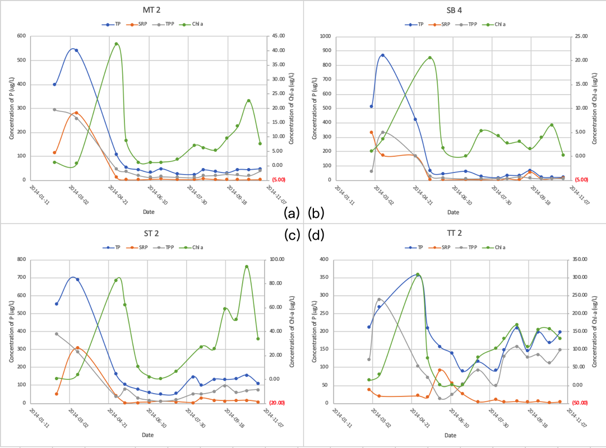Figure 4 (A). Time Series TP, SRP, TPP, and Chl-a in Each Pond 2014 (a). MT 2; (b). SB 4; (c). ST 2; (d). TT 2

&nbsp;&nbsp;&nbsp;&nbsp;&nbsp;&nbsp;&nbsp;&nbsp;&nbsp;Figure 4 (A) shows the varies daily average phosphors species and Chl-a concentrations in each pond. The values were calculated from the means of all the sites in each pond in 2014. The figures for each site in each pond can be found in Appendix 2. It is seen from Figure 3 that almost all the ponds reached their highest TP concentrations around March 11th to 12th except for pond TT 2, which reached its highest TP concentration on April 30th. TP concentrations of each pond then decrease rapidly and kept stable till Oct 29th. The concentrations of SRP and TPP in the same pond had close values. And they showed similar trends as the TP concentrations in all the ponds except for SRP in pond TT 2. The peak value of SRP in pond TT 2 was taken place on May 28th. The concentrations of Chl-a in each pond changed following the change of TP, and there were about 20 days to 60days delay for the respond of Chl-a concentrations.

&nbsp;&nbsp;&nbsp;&nbsp;&nbsp;&nbsp;&nbsp;&nbsp;&nbsp;Although there are similarities among the trends of phosphor species and Chl-a concentrations in each pond, the range values of concentrations were different. The concentrations range of all the phosphor species in SB 4 was from 3 to 871μg/L, which was the largest among 4 ponds. But its Chl-a concentration range was only from 0.14 to 20.56μg/L, which was the smallest among 4 ponds. Interestingly, pond TT 2 had the smallest concentration range of phosphor species from 2.67 to 357 μg/L and the largest Chl-a concentration range from 1.45 to 308.3μg/L.

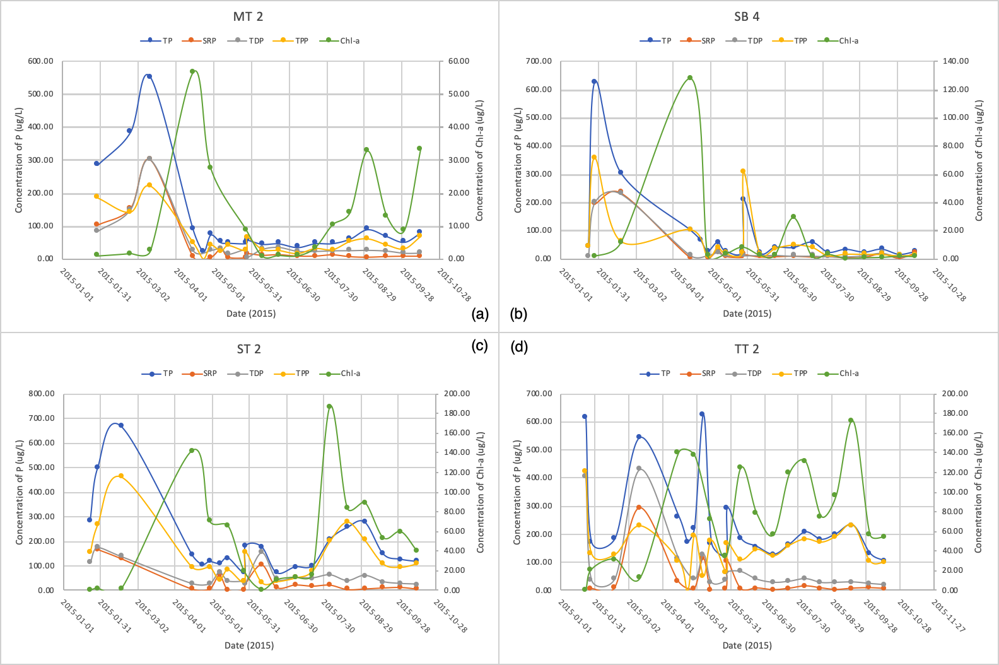Figure 4 (B). Time Series TP, SRP, TDP, TPP, and Chl-a in Each Pond 2015 (a). MT 2; (b). SB 4; (c). ST 2; (d). TT 2

 &nbsp;&nbsp;&nbsp;&nbsp;&nbsp;&nbsp;&nbsp;&nbsp;&nbsp;In 2015 (Figure 4B), one more factor (TDP) was measured. The trend of phosphor species and the response of Chl-a in the first three ponds were similar to that in 2014, but the trends in pond TT 2 become more complicated. In pond TT 2, TP had a “W” shape trend from January to May, which caused a similar variation of Chl-a. Other phosphor species follow similar trends as TP in pond TT 2. Compared with 2014, the concentration range of phosphor species in pond SB 4 was decreased, while that in pond TT 2 was increased. For Chl-a concentration, pond ST 2 was increased obviously, pond TT 2 was decreased. Pond SB 4 stayed good eutrophic conditions for the most of time in 2015 except for April 15th. At that day site SE had extremely high Chl-a concentration (341.06 ug/L), while the Chl-a concentrations of the other two sites were lower than 30 ug/L.

### 4.3 Nitrogen Species and Chl-a

Figure 5 (A). Time Series TN, NH3, NO2- + NO3-, NOx- + NH4+, TKN and Chl-a in Each Pond 2014
(a). MT 2; (b). SB 4; (c). ST 2; (d). TT 2

&nbsp;&nbsp;&nbsp;&nbsp;&nbsp;&nbsp;&nbsp;&nbsp;&nbsp;Figure 5 (A) shows the varies daily average nitrogen and Chl-a concentrations in each pond in 2014. The figures for each site in each pond can be found in Appendix D. The values were calculated from the means of all the sites in each pond. Similar to phosphors results, TN and TKN in all the ponds reach their peak values around March 11th to 12th. The values of TN and TKN in each pond were very close, indicating the most of the nitrogen in ponds were from organic sources. There was only a small portion of NO2- and NO3- species in the 4 ponds, especially in pond TT 2. NH3 took about 40% to 60% of all the nitrogen species in the first two weeks in all the ponds, but it decreased rapidly after March 11th and 12th and kept stable from April 30 to the rest of the days.
Compared with other ponds, the trend of nitrogen species in pond TT 2 shows a little bit more fluctuation. It also had the smallest concentration range of nitrogen species.

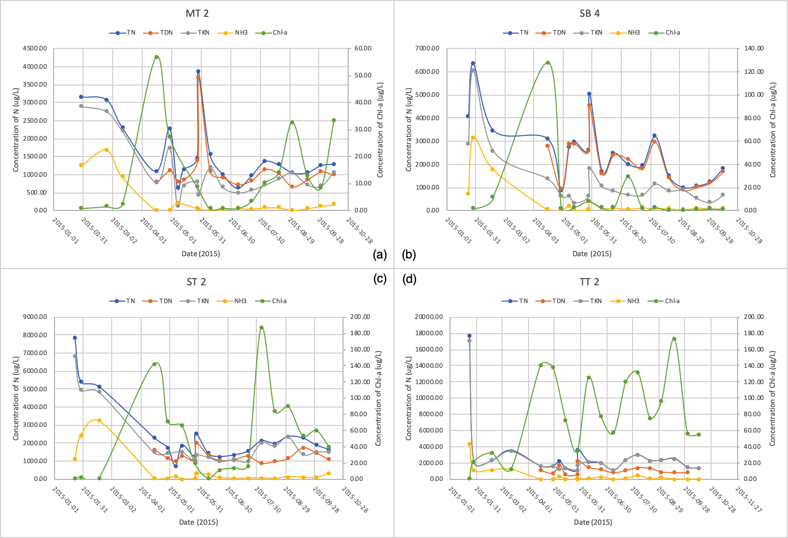Figure 5 (B). Time Series TN, TDN, TKN and Chl-a in Each Pond 2015 (a). MT 2; (b). SB 4; (c). ST 2; (d). TT 2

&nbsp;&nbsp;&nbsp;&nbsp;&nbsp;&nbsp;&nbsp;&nbsp;&nbsp;In 2015 (Figure 5 (B)), TDN was measured from the middle of April but NH3 and NO2- + NO3- were not. Although the trends of nitrogen species were not the same as in 2014, all the nitrogen species still reached their peaks at the beginning of the measurement. In pond MT 2 and SB 4, nitrogen species had a very high peak on May 28th, but the concentrations of nitrogen species in other ponds were relatively low and stable during summer. Compared with 2014, the concentration range of nitrogen species in pond TT 2 increased by about 4 times, while other ponds were about the same.

### 4.4 Nitrogen / Phosphor Molar Ratio
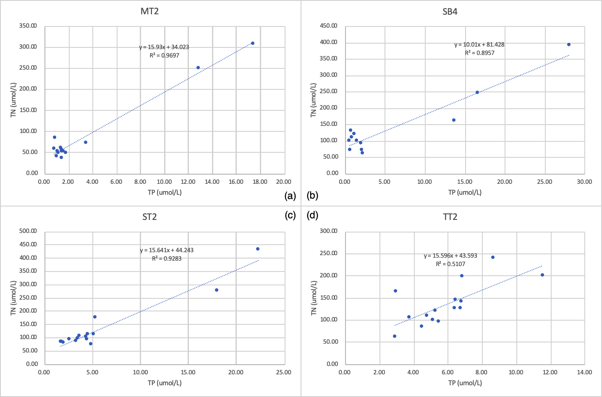Figure 6 (A). Average TN: TP Molar Ratio in Each Pond 2014 (a). MT 2; (b). SB 4; (c). ST 2; (d). TT 2
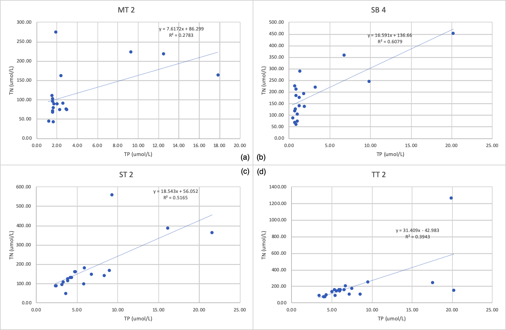Figure 6 (b). Average TN: TP Molar Ratio in Each Pond 2015 (a). MT 2; (b). SB 4; (c). ST 2; (d). TT 2

&nbsp;&nbsp;&nbsp;&nbsp;&nbsp;&nbsp;&nbsp;&nbsp;&nbsp;In this research, the relationships of TN:TP molar ratio and NOx- + NH4+: SRP molar ratio in each pond were studied. It is seen from Figure 6 (A) that in 2014 all the ponds showed good linear TN:TP relationship (with the lowest R2 value of 0.8957) except for pond TT 2, which happened to be the pond with the highest overall Chl-a concentrations. Compared with other ponds, pond SB 4 had the smallest overall TN:TP ratio (the slope of the curve) which was 10.01. Interestingly, it also had the lowest overall Chl-a concentrations among 4 ponds. Unfortunately, the correlations of TN:TP in 2015 were very poor for all the ponds. There were no valuable findings.

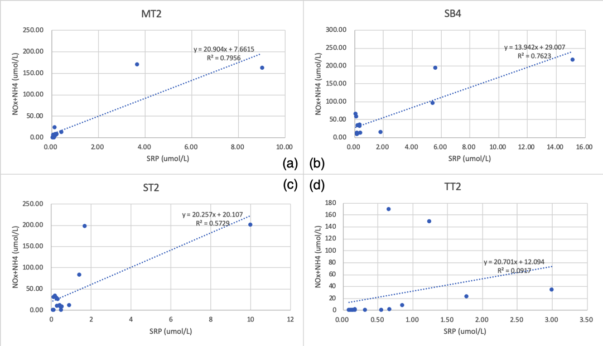Figure 7. Average NOx- + NH4+: SRP Molar Ratio in Each Pond 2014 (a). MT 2; (b). SB 4; (c). ST 2; (d). TT 2

&nbsp;&nbsp;&nbsp;&nbsp;&nbsp;&nbsp;&nbsp;&nbsp;&nbsp;Figure 7 shows the average NOx- + NH4+: SRP ratio in each pond. It shows similar information as Figure 4 did. Pond TT 2 had very poor regression, and pond SB 4 had the smallest slope. Compared with TN:TP ratios, all the curves have larger slopes. However, Figure 5 shows less regression. The R2 values of all the ponds are less than 80%.  

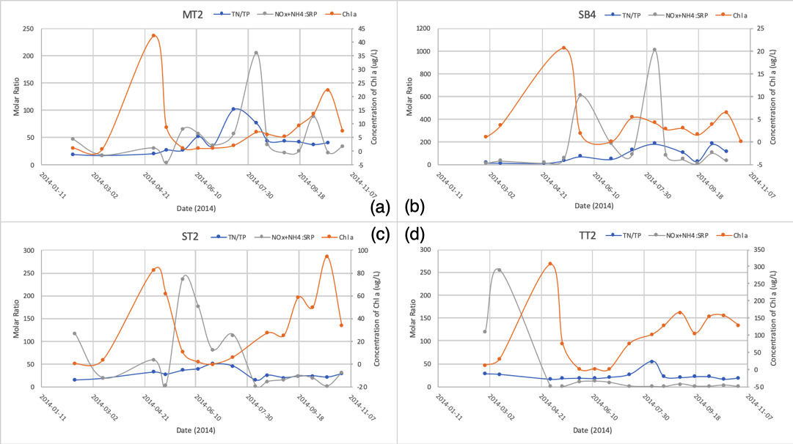Figure 8 (A). Time Series Average Nitrogen Phosphor Molar Ratio and Chl-a in Each Pond 2014
(a). MT 2; (b). SB 4; (c). ST 2; (d). TT 2

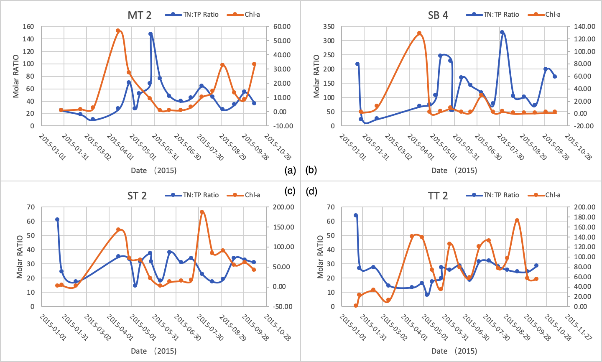Figure 8 (B). Time Series Average Nitrogen Phosphor Molar Ratio and Chl-a in Each Pond 2015
(a). MT 2; (b). SB 4; (c). ST 2; (d). TT 2

&nbsp;&nbsp;&nbsp;&nbsp;&nbsp;&nbsp;&nbsp;&nbsp;&nbsp;The relationships of algae conditions (in terms of Chl-a) and the two nitrogen phosphor ratios were also investigated in this research. According to Figure 6, there were no obvious relationships to be found among the three factors in both years. The Chl-a concentrations were high in the spring and fall in all the ponds, but each pond had different trends of nitrogen phosphor ratios. Since NOx- + NH4+ was not measured in 2015, the NOx- + NH4+: SRP ratio and its relationship to Chl-a concentration in ponds cannot be plotted.

### 4.5 Water Temperature, pH, Total Suspended Solids (TSS), and Chl-a

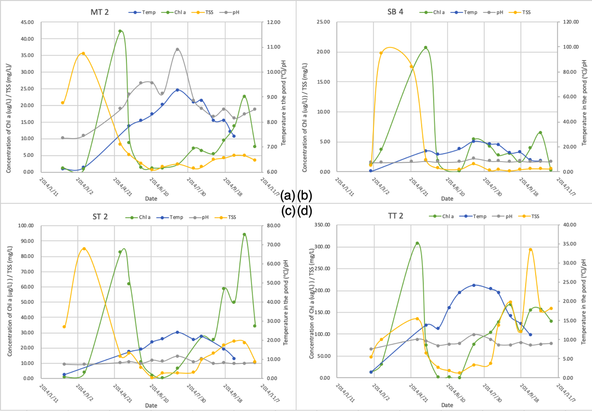Figure 9. Time Series Average Water Temperature, pH, TSS and Chl-a in Each Pond 2014
(a). MT 2; (b). SB 4; (c). ST 2; (d). TT 2

&nbsp;&nbsp;&nbsp;&nbsp;&nbsp;&nbsp;&nbsp;&nbsp;&nbsp;It is seen from Figure 8 that pH and water temperature show similar trends. Both reached the peak on July 16th. However, there was no correlation observed between the two factors and Chl-a concentration. TSS had similar trends with TN and TP in all the ponds. They all reached their peak around March 11th to 12th except for TT 2, which reached its highest TSS value on April 30th.

### 4.6
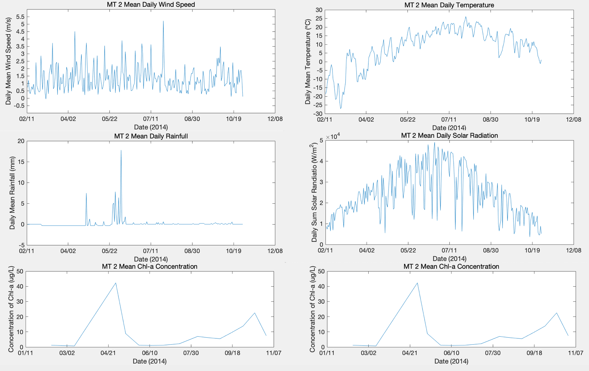Figure 10 (A). Time Series Average Daily Wind Speed, Air Temperature, Rainfall, Solar Radiation
and Chl-a in Pond MT 2

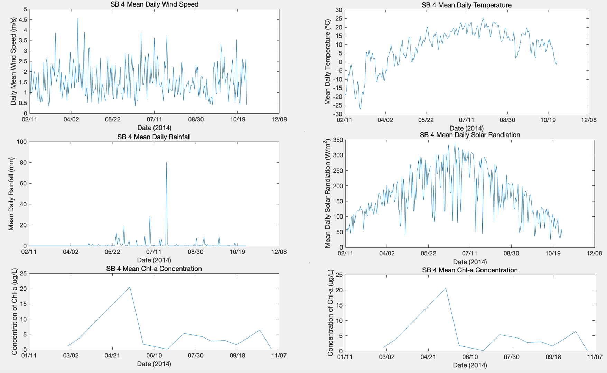Figure 10 (B). Time Series Average Daily Wind Speed, Air Temperature, Rainfall, Solar Radiation
and Chl-a in Pond SB 4

Figure 10 (C). Time Series Average Daily Wind Speed, Air Temperature, Rainfall, Solar Radiation
and Chl-a in Pond ST 2
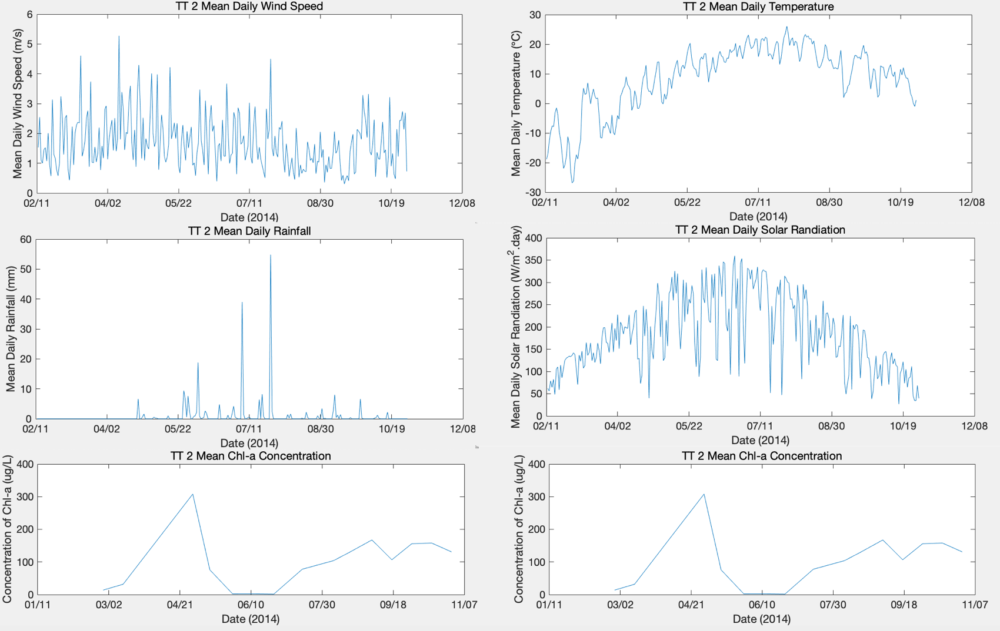Figure 10 (D). Time Series Average Daily Wind Speed, Air Temperature, Rainfall, Solar Radiation
 and Chl-a in Pond TT 2

&nbsp;&nbsp;&nbsp;&nbsp;&nbsp;&nbsp;&nbsp;&nbsp;&nbsp;Since all the ponds are in the south of the city, the weather data obtained from each pond were very close. According to Figure 9, wind speed, air temperature, rainfall, and solar radiation didn’t show an obvious influence on Chl-a concentration in each pond. Wind speed didn’t have obvious regularity during the research period. Air temperature and solar radiation were high in summer and low in winter. There was no rainfall during wintertime. Rainfall events started at the end of April, the highest intensity event occurred in the middle of July. There was no rainfall after the end of October.
