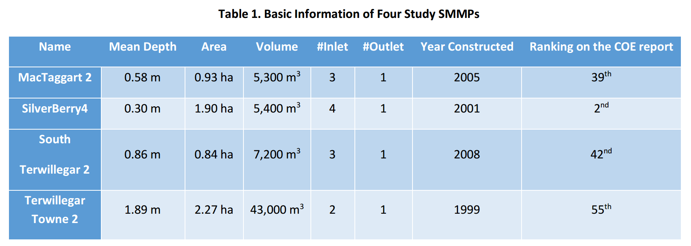
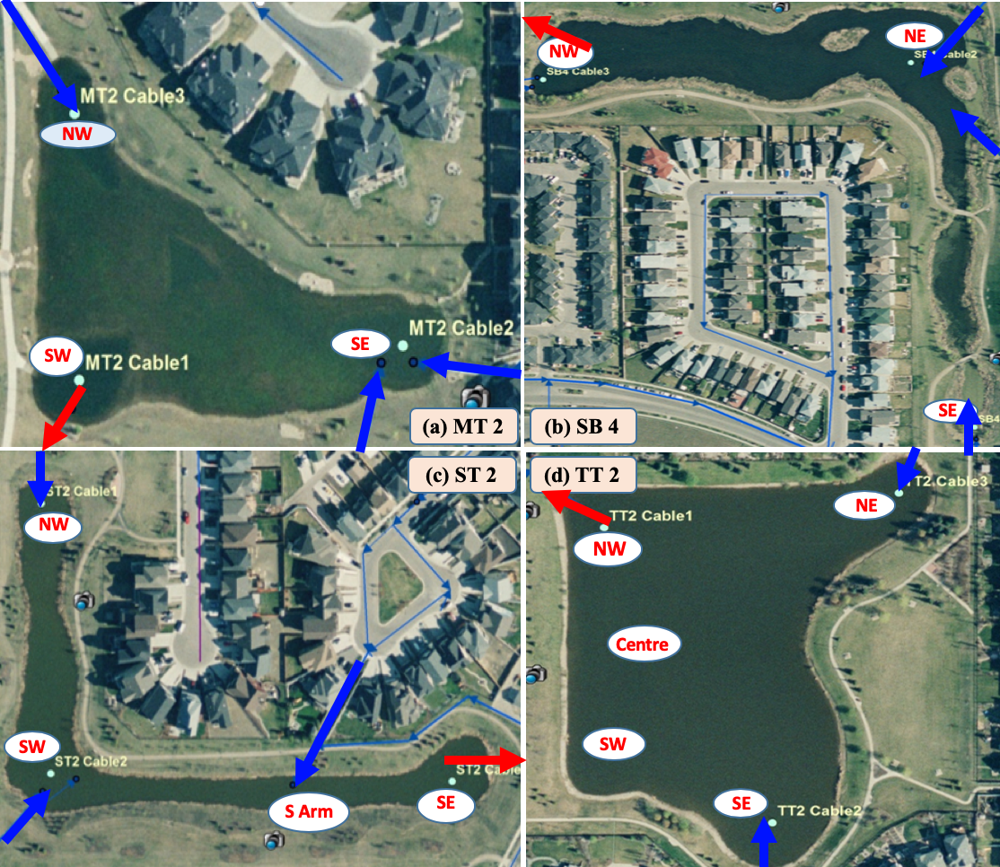

---
---

[home](home.html)

# Site Description

&nbsp;&nbsp;&nbsp;&nbsp;&nbsp;&nbsp;&nbsp;&nbsp;&nbsp;The four SMMPs in the City of Edmonton (COE) were selected for this study (Figure 1). All the SMMPs in this study were designed to collect stormwater runoff from their respective neighbourhoods. Each SMMP has one outlet and two to four inlets. All the SMMPs were reported as the worst ponds in COE based on algae, duckweed and weeds reports. The information of four study SMMPs is listed in Table 1.

{ width=100% }
<em>Figure 1. Four Study SMMPs and Sampling Sites. (a) MacTaggart 2; (b) Silverberry4; (c) South
Terwillegar 2; (d). Terwillegar Towne 2. Red arrow: outlet; Blue arrow: inlet
