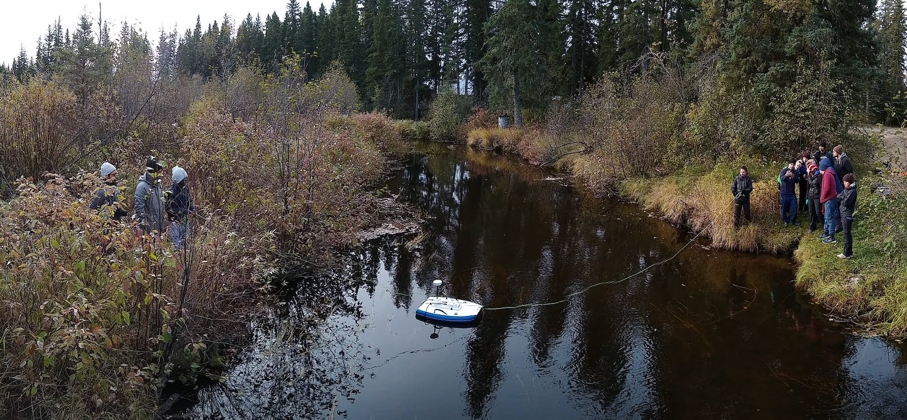

---
---

[home](home.html)

# Data analysis

**OPTIONAL**

If a substantial component of the work involves statistical analysis of existing data, which could include environmental, economic or social data, and could be time series data or spatial (GIS) data, this should be written up here. Include the objectives of the analysis, the data available (including the source of the data), quality assurance and quality control activities that were performed on the data by you, methods of analysis, results, including figures, interpretation and conclusions. Often appropriate plots of data are preferable to formal statistical analyses. You must be concise. If additional details are generated which will be useful to future workers, these can be included in an appendix.

## Analysis objectives

Objectives

## Data summary

Meta-data describing the available datasets, where they are from, how they can be obtained, etc.

## Quality assurance and quality control

If appropriate, provide details of any data processing that was undertaken.

## Methods

Methods - e.g. statistical methods applied and assumptions.

## Results

Results. Include Photos and Figures, using the command:

{ width=100% }

## Conclusions

Intrepretation of results and conclusions

Include references as appropriate and write down all reference information in the file references.md
