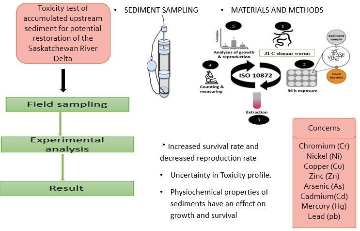

---
---

[home](home.html)

# Executive Summary

Located in the central lowlands of Canada is the Saskatchewan River Delta. The delta is a complex water inland consisting of numerous potholes and marshlands that support abundant of aquatic and terrestrial biodiversity, including native species. The delta supports 43 species of mammals, 48 species of fish, and more than 200 species of bird including the livelihood and well-being of Cumberland House and other indigenous communities that surround it. However, the presence of three large hydropower dam in the Saskatchewan River Basin and other upstream developments is a threat to the hydrological and ecosystem function of the delta. Changes in the natural flow regime and sediment transport has resulted in upstream sediment loading. Consequently, general decreased of water level, depletion of sediments and nutrient , loss of connectivity between river and wetlands, loss of wetlands and marshlands, declining water quality, changes in vegetation and food web, threats to native species and indigenous culture including severe implication on the well-being of the indigenous people of Cumberland House located in the heart of the delta since 1774 are some of the concerns
 However, considering the relevance of the delta, the upstream reservoirs and other water facilities, sediment toxicity study was conducted to ascertain the contamination status of the accumulated upstream sediment and the feasibility of discharging it to the delta.

{ width=100% }

Consequently, Further research is essential to determine the toxicity of the accumulated sediments upstream from the delta. More so, depending on the toxicity status of the sediment and its proximity to the delta including the cost of bioremediation, management strategies of discharging the sediments back to the delta should be considered. Sediment dredging and flushing through submerged by-pass tunnel are two common, economic and scientifically viable mechanism of returning the sediments to the delta
