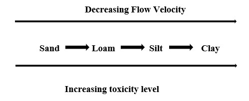
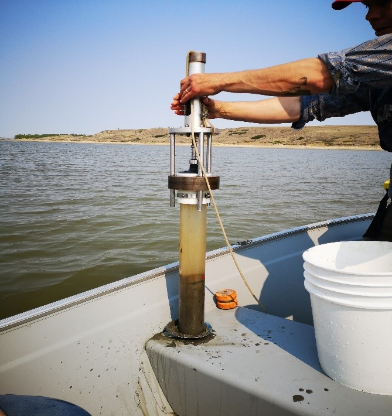
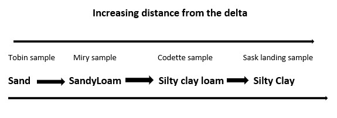
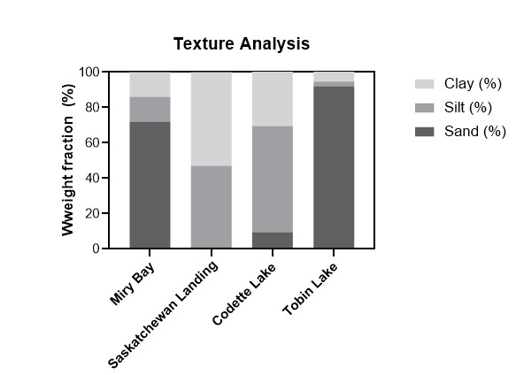
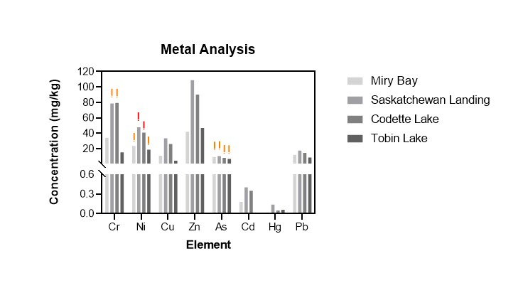
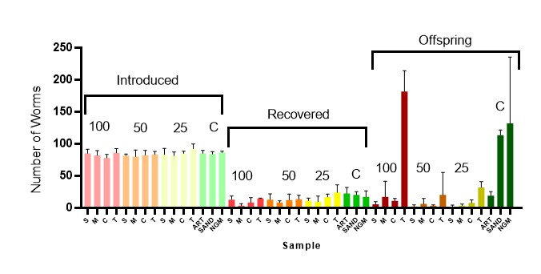
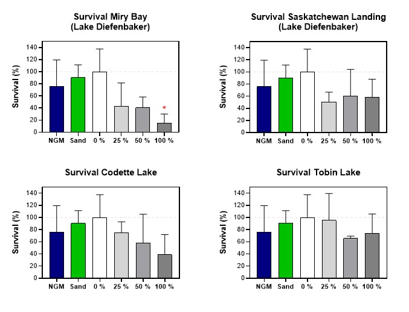
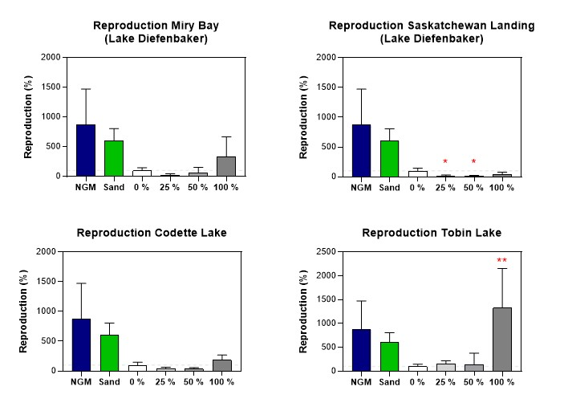

---
---

[home](home.html)

# Field work

Sediment samples were obtained from seven different locations upstream of the delta. Two sediment samples were collected on May 2019 at Saskatchewan Landing Provincial Park and Miry Bay. Upstream from Lake Diefenbaker is the Miry Bay. The Bay is sandy, shallow and is becoming dry land as sediments accumulate and filled-up the reservoir. According to an oral interview conducted with a local farmer on-site at the Bay, the volume and velocity of the water have reduced to a point where the water station facility located on-site can no longer pump water needed for irrigation and animal ranching activities. Further, samples from Tobin and Codette lake were collected in June 2019. These two reservoirs are downstream from Lake Diefenbaker and near to the delta.

{ width=100% }
Figure 2.0: Illustration of sediment bedload as flow velocity declines

To overcome local variability, two and three different locations were sampled respectively at Codette and Tobin lake. Thus, seven field samples were collected in total but four sediments were used for the study (Table 1.0). Sampled sites were chosen base on the hypothesis that fine-grained sediment particles can adsorb higher levels of environmental contaminants than coarse sediment particles. Thus, factors such as the flow velocity, depth of water level, the direction of flow, and the nature and possible particle size distribution (bedload) of deposited sediments were considered. Nutrients and other chemicals are often bound to fine-grain particles, which are usually deposited as the velocity of the flow decreases, as shown in figure 2.0 (Brils, 2004; Forstner, 2004). Similarly, gravel and sand particles are rarely toxic because of their large grain size (Brils, 2004; Forstner, 2004).

{ width=100% }
Figure 3.0. Field sediment sampling

Sediment sampling was done using a cylindrical gravity corer with a diameter of 7.5 cm and a length of 61 cm. An average of  6.6 inches (16.764 cm) of undisturbed sediment layer was collected at an average water depth of approximately 5.0 m. Water characteristics of each sampled location were recorded with a digital Cleanex data reader. This data is shown in table 2.0. All sediment samples in each case were emptied from the corer tube, homogenized using stainless-steel tools and transferred into a well-labeled glass jar, capped on-site and placed in a cooler for proper storage during transportation. Arriving at the Toxicology Centre, University of Saskatchewan, the samples were stored in the dark at 4° C before analyses.

Experimental objective
Management actions are needed to remediate the problem of sediment loading upstream of the Saskatchewan River Delta and the continuous deterioration of the delta. This experiment aims to present an easy and cost-effective method for determining the toxicity effect of accumulated upstream sediment using Nematodes-C elegans. This is to ascertain the feasibility of discharging the upstream sediment to the delta for potential restoration.

Materials and Method
The experimental objective was achieved through site collection of sediment samples from seven different locations upstream of the delta using a cylindrical gravity corer (e.g., Kajak corer, Uwitec, Austria). However, four of these samples were used in this study due to limited time allocation. Sampled locations were chosen base on the observed sediment texture and the hypothesis that "fine-grain particles sediments absorb and are sink to environmental contaminants when compared with coarse grain sediments." Characteristics of the overlaying surface-water of sediments samples were collected on-site in each sampling case (Table 2.0). All samples were transferred to a well-labeled 960 ml glass jar after homogenization, capped on-site, stored in a cooler for proper storage and transported to the laboratory at the Toxicology Centre, University of Saskatchewan. Sediments were stored in the dark at 4° C prior to analyses
The physiochemical properties of each sediment were analyzed. The water content of environmental samples was determined by drying an aliquot of each sample in an oven at 105° C for 72 hours and weighed consistently until a constant weight was reached. Particle size distribution was analyzed by Soil-Hydrometer at Maxxam, Bureau Veritas Environmental laboratory. To avoid undesired changes or variation in the natural chemical composition of the environmental samples, a subsection of samples for metal analysis was prepared by freeze-drying in a Dura-Dry multiprocessor corrosion control freeze-drier (FTS systems TM, Stone Ridge, NY, USA). Twenty-three metals were analyzed using a multi-element Agilent Technologies (8800 ICP-MS Triple Quad) at the Chemistry laboratory, Toxicology Centre, University of Saskatchewan. Using the most abundant freshwater-sediment nematodes, Caenorhabditis elegans, biological sediment toxicity test started after approximately four weeks of holding-time (Organization for Economic Co-operation and Development. 2007).  A subsection of sediment samples used was frozen at -20° C for approximately 12 hours to ensure the absence of indigenous organisms. Thus, to assess the toxicity of the accumulated sediment, this study utilized both biological and physiochemical sediment toxicity testing approach. However, due to limited time allocated for the study, other physiochemical parameters such as organic matter content (loss on ignition), polyaromatic hydrocarbon, organic and inorganic pesticides, total organic carbon and bioassay test using other benthic organisms and macroinvertebrates such as Oligochaete Lumbriculus variegatus, Hyallela azteca, midge Chironomus tentans or Chironomus riparius, were not Examined
Further, reference sediment (clean sediment) was prepared as one of the experimental controls. However, due to the limitation of the ISO reference/control/artificial sediment preparation procedure on this study, preparation of the reference sediment was according to the OECD standards for spiked chemical sediments (OECD, 2007). The detail preparation procedure of the reference sediment is outlined in Appendix C. Nonetheless, other methods used for the experiment was according to the ISO standardized guideline (ISO/FDIS 10872; Hoss et al., 2012; Hoss et al., 2010; Haegerbaeumer et al., unpublished). First juvenile stage of C. elegans (L1 stage) was obtained at Dr. Michael Wu laboratory, School of Veterinary Medicine, University of Saskatchewan. The worms were maintained in a Nematode Growth Medium (NGM) and were used immediately for the test. Wet weight equivalent of 0.15 ± 0.005 g dry weight of the environmental and reference sediments (Artificial and sand samples) were transferred into a 12-well microplate. Using the artificial sediment as a diluent and moistened with NGM buffer solution to achieve a 70% adjusted water content (ISO/FDIS 10872; Hoss et al., 2012), each sediment sample was analyzed for dilution series of 100% 50% and 25% (Table 1.0). An aqueous NGM buffer solution including Silica sand and the artificial or reference sediment, was used as controls for the experiment. Thus, fifteen treatments and three replicates were used for each sample. However, six replicates were used for artificial sediment. 0.5 ml of NGM solution containing 30 first juvenile stage (L1 stage) of C. elegans was added to each well. Escherichia coli strain OP50 of 0.5 ml was added as a food source to each well. The experiment was transferred to a shaker and incubated in the dark at 20° C for 96 hours. The test was terminated by heat-killing the worms at 80° C for 15 minutes, and 0.1 mL of Rose Bengal solution (0.3 mg/L) was added to each well to stain the worms for easy counting during analysis.
Three methods of nematode extraction process were explored to recover the worms from the sediments; (1) The centrifuged floatation method or the ISO standardized extraction method (ISO 10872: International Organization for Standardization, 2010; Hoss et al., 2012; Haegerbaeumer et al., unpublished) (2) Modified ISO centrifuged floatation method (3) the natural crawling method or No extraction method. These different methods were explored in a series of experimental trials (Appendix C). According to the standardized ISO method (ISO/FDIS 10872; Hoss et al., 2012; Haegerbaeumer et al., unpublished), the test was terminated after 96 hours exposure by heat-killing the worms through a transfer of the test media into a drying Oven at 80° C for 15 minutes. Then, 0.1 mL of Rose Bengal solution was added to each test well. The stained sediments-nematode mixture in each well was removed by washing properly with about 8 mL of deionized water into a 15 mL centrifuge tube using a Pasteur pipette. This suspension was centrifuged for 10 minutes at 800 ×g. The supernatant was decanted into a petri dish, leaving a pellet of sediment in the tube. The supernatant was appropriately checked for the presence of the test organisms. Then, 2 mL of colloidal silica ludox solution (Ludox TM50; Sigma-Aldrich) was added to the pellet of sediment, centrifuged for 15 minutes at 800 ×g and the supernatant was removed into another petri dish using a Pasteur pipette. This process of adding 2 mL of ludox solution, centrifuging for 15 min and pipetting the supernatant into a petri dish was repeated for three times. The resulting 6 ml  of the supernatant in each petri dish for each sample was passed through a 10-micrometer gauze to trap all recovered worm for accurate analyses. Survival rate and reproduction of the test organism were determined.
Similarly, due to the initial limitation of the ISO extraction procedures, a modification of the ISO extraction method was explored. The test was stopped by transferring the sediments-nematode mixture in each well into a 15 mL centrifuge tube and were appropriately washed with approximately 13 ml of deionized water (to achieve a 14 ml scale in the centrifuge tube) and centrifuged for 3 minutes at 1,800 ×g. The supernatant was decanted and checked for the presence of the teste organisms. The pellet of sediment was resuspended in 10 ml of colloidal silica ludox solution (Ludox TM50; Sigma-Aldrich) and centrifuged for 1 min at 1,800 ×g. Then, 3 mL of deionized water was added to the suspension and was centrifuged for approximately 10 minutes. Test organism recovered in the resulting thin layer interface between the water and the ludox solution was analyzed by pipetting the top 4 mL of the suspension into a petri dish. Survival rate, and reproduction were recorded and analyzed.
More so, due to the initial failure of significant recovery of the test organisms using the extraction methods as mentioned above, a technique described by Kim et al. (2018) for soil-nematode extraction analyses was modified and used as a novel method in sediment-nematode extraction. The test was stopped after 96 hours by pipetting the sediment-nematode mixture from each well into a 15 ml tube. Each well was appropriately washed with approximately 13 ml of deionized water and the suspension was centrifuged for 10 min. The supernatant was decanted, leaving a pellet of sediment in the tube which was scooped using a spatula into a petri dish, spread around the edges. A freshly grown bacteria was smeared at the central area of the petri dish as a food source to facilitate the movement of the worms from the sediments toward the food source. The contact between the food and the sediments boundaries were at minimal. Using a microscope, after 3 and 5 consecutive hours, the worms that crawled out of the sediments towards the food were counted and analyzed for survival rate, growth, and reproduction.
Further, as a result of a high level of success obtained using the ISO extraction protocol during the trials(Appendix D), this study adopted the ISO extraction method. The validity of the experiment was determined by calculating the mean recovery rate of the introduced test organisms (≥ 80% and ≤ 120%) (Haegerbaeumer et al., unpublished). The effect of sediments samples to C elegans was measured as a function of survival rate and reproduction (number of offspring per exposed test organism) These biological endpoints were compared with the respective controls to determine the toxic effect of the samples. The values were quantified against the artificial reference sediment.

Table 1.0: Dilution series of experimental sample
| Dilution series                     | Saskatchewan landing sample | Miry bay sample | Codette lake sample | Tobin sample | Artificial control Sample |
|-------------------------------------|-----------------------------|-----------------|---------------------|--------------|---------------------------|
| 100% Dilution                       |                             |                 |                     |              |                           |
|                                     |                             |                 |                     |              |                           |
| Adjusted water content %            | 70.0000                     | 70.0000         | 70.0000             | 70.0000      | 70.0000                   |
| Sediment dry matter content%        | 66.6082                     | 29.6314         | 56.1573             | 31.0495      | 35.8232                   |
| Mass of dry sediment (g)            | 0.1500                      | 0.1500          | 0.1500              | 0.1500       | 0.1500                    |
| Mass of wet sediment equivalent (g) | 0.2252                      | 0.5062          | 0.2671              | 0.4831       | 0.4187                    |
| mass of dry art sediment (g)        | 0.0000                      | 0.0000          | 0.0000              | 0.0000       | 0.0000                    |
| Mass of wet art equivalent (g)      | 0.0000                      | 0.0000          | 0.0000              | 0.0000       | 0.0000                    |
| Water added to sediment (ml)        | 0.2748                      | -0.0062         | 0.2329              | 0.0169       | 0.0813                    |
| Water added to art sediment (ml)    | 0.0000                      | 0.0000          | 0.0000              | 0.0000       | 0.0000                    |
| Total water added (ml)              | 0.2748                      | -0.0062         | 0.2329              | 0.0169       | 0.0813                    |
|                                     |                             |                 |                     |              |                           |
| 50% Dilution                        |                             |                 |                     |              |                           |
| Adjusted water content              | 70.0000                     | 70.0000         | 70.0000             | 70.0000      | 70.0000                   |
| Sediment dry matter content%        | 66.6082                     | 29.6314         | 56.1573             | 31.0495      | 35.8232                   |
| Mass of dry sediment (g)            | 0.0750                      | 0.0750          | 0.0750              | 0.0750       | 0.0750                    |
| Mass of wet sediment equivalent (g) | 0.1126                      | 0.2531          | 0.1336              | 0.2415       | 0.2094                    |
| mass of dry art sediment            | 0.0750                      | 0.0750          | 0.0750              | 0.0750       | 0.0750                    |
| Mass of wet art equivalent          | 0.2094                      | 0.2094          | 0.2094              | 0.2094       | 0.2094                    |
| Water added to sediment (ml)        | 0.1374                      | -0.0031         | 0.1164              | 0.0085       | 0.0406                    |
| Water added to art sediment (ml)    | 0.0406                      | 0.0406          | 0.0406              | 0.0406       | 0.0406                    |
| Total water added                   | 0.1780                      | 0.0375          | 0.1571              | 0.0491       | 0.0813                    |
|                                     |                             |                 |                     |              |                           |
| 25% Dilution                        |                             |                 |                     |              |                           |
| Adjusted water content              | 70.0000                     | 70.0000         | 70.0000             | 70.0000      | 70.0000                   |
| Sediment dry matter content%        | 66.6082                     | 29.6314         | 56.1573             | 31.0495      | 35.8232                   |
| Mass of dry sediment (g)            | 0.0375                      | 0.0375          | 0.0375              | 0.0375       | 0.0375                    |
| Mass of wet sediment equivalent (g) | 0.0563                      | 0.1266          | 0.0668              | 0.1208       | 0.1047                    |
| mass of dry art sediment            | 0.1125                      | 0.1125          | 0.1125              | 0.1125       | 0.1125                    |
| Mass of wet art equivalent          | 0.3140                      | 0.3140          | 0.3140              | 0.3140       | 0.3140                    |
| Water added to sediment (ml)        | 0.0687                      | -0.0016         | 0.0582              | 0.0042       | 0.0203                    |
| Water added to art sediment (ml)    | 0.0610                      | 0.0610          | 0.0610              | 0.0610       | 0.0610                    |
| Total water added                   |                             |                 |                     |              |                           |
|                                     | 0.1297                      | 0.0594          | 0.1192              | 0.0652       | 0.0813                    |

Statistical analyses
The Toxicity of the environmental samples to nematodes after 96 hours of exposure is a function of the biological endpoints as compared with the control samples. According to the ISO standards, a range between 80% to 120% ( ≥ 80% ≤ 120%) mean recovery rate obtained in the control sediment indicate the validity of the experiment, quality control and the accuracy of introducing the test organisms and extracting them from the sediments. (ISO/FDIS 10872; Hoss et al., 2012; Haegerbaeumer et al., unpublished). Similarly, the validity criteria for reproduction per test organism is ≥30 per test organism (ISO/FDIS 10872; Hoss et al., 2012; Haegerbaeumer et al., unpublished). The mean recovery rate/survival rate (MRR) of the introduced test organisms was calculated in the respective samples by counting all recovered first-generation nematodes worms (Adult) under a stereomicroscope and dividing this number with the total organisms introduced.

$$MRR=\frac {Number of worms recovered}{Total number introduced}$$

Less than 10% recovery of male nematodes in the sediment samples indicate a healthy stock culture. However, the number of observable male nematodes recovered were excluded when calculating the rate of reproduction. Reproduction rate (Rr) was obtained by counting the juvenile offspring (second generation juvenile stage worms) and dividing that number with the total number of recovered organisms minus observable males.

$$Rr=\frac {number of offspring}{total number of recovered adult}$$

The mean and standard deviation for each environmental sample and the controls were calculated across the replicates. To set the artificial control sample to a 100%, data obtained from all samples were normalized. The parameter (e.g recovered adult) of each sample was divided by the mean value across the replicates and multiplied by 100%.
 Further, to determine the chemical toxicity potential of each environmental samples, metal analysis data were compared with standardized sediment quality guidelines (CCME, 1999). The threshold Effect Levels/Interim Sediment Quality Guideline (TEL/ISQG) and Probable Effect Level (PEL) values of the Canadian elements of concern were obtained and compared with the data derived (Figure 3.0.). TEL and PEL indicate the chemical concentration at which adverse biological effect is expected to rarely and frequently occur (Smith et al., 1996).

 Result and Discussion

 Physicochemical Analyses

 Table 2.0: Characteristics of Overlaying surface water in sediment sampled locations and physiochemical characteristics of sediment samples

 | Parameters             | Saskatchewan landing sample | Miry Bay sample | Codette lake sample | Tobin lake sample |
 |------------------------|-----------------------------|-----------------|---------------------|-------------------|
 | Depth of water level m | 4.85                        | -               | 2.6                 | 0.5               |
 | pH                     | 8.43                        | 8.48            | 8.68                | 7.81              |
 | Temperature (°C)       | 16.9                        | 19.5            | 19.705              | 20.02             |
 | ODO (mg/L)             | 9.42                        | 9.15            | 7.14                | 7.91              |
 | Conductivity           |                             |                 |                     |                   |
 | Us/cm                  | 430.35                      | 441.6           | 367.7               | 389.9             |
 | Salinity  (psu)        | 0.25                        | 0.24            | 0.2                 | 0.21              |
 | Turbidity (FNU)        | 14.63                       | 21.4            | 6.57                | 6.82              |
 | TDS (mg/L)             | 331                         | 321             | 266                 | 280               |
 | ODO % Sat              | 97.8                        | 108.7           | 100                 | 87.8              |
 |                        |                             |                 |                     |                   |
 |                        |                             |                 |                     |                   |
 |                        |                             |                 |                     |                   |
 |                        |                             |                 |                     |                   |
 |                        |                             |                 |                     |                   |
 | Dry matter content%    | 66.61                       | 70.37           | 43 84               | 68.95             |
 | Water content %        | 33.39                       | 29.63           | 56.16               | 31.05             |
 | pH                     | 7.01                        | 6.98            | 6.64                | 6.74              |
 | Texture                | Silty clay                  | Sandy loam      | Silty clay loam     | Sand              |

 ODO=Organic dissolved oxygen

 TDS = Total dissolved solids

 ODO sat (%)= Percentage of saturated organic dissolved oxygen

All sediment sampling location was upstream from the Saskatchewan River Delta, and the sediments were observed to be sandy with nearness to the Delta. For example, sediments collected at Tobin Lake and Saskatchewan landing provincial pack range from sand to clay (Figure 1.0).

{ width=100% }
Figure 1.0. Texture analyses

{ width=100% }
Figure 2.0. The weight fraction of particle size distribution of samples

The metal analysis shows an increased concentration of eight elements of concern across all samples with increased concentration of  Chromium, Arsenic, and Nickel in values that are above the ISQG/TEL and PEL standard for the protection of aquatic life (CCME, 1999, Batts et al, 1995). adverse biological effect of these elements has been recorded (CCME, 1999, Batts et al, 1995).. Decreased diversity and abundance of invertebrates and benthic organisms were identified in Toronto Harbor, Ontario, over a 95 mg/kg mean concentration of chromium (CCME, 1995). However, an effect of the concentration of these values varies with site location and physiochemical/geochemical characteristics of sediments. According to CCME (1999), all other elements has no guideline, hence no ISQG/PEL value.

{ width=100% }

Figure 3.0. Metal concentration of sediment samples

Table 3.0. Metal concentration of environmental samples. Bold print indicates levels above the standardized effect concentration (CCME, 1999; Batts et al., 1995)

| Tobin lake sample | Codette lake sample | Saskatchewan  Landing sample | Miry bay sample |       |       |       |
|-------------------|---------------------|------------------------------|-----------------|-------|-------|-------|
| Elements          | ISQG/TEL (ppm)      | PEL (ppm)                    |                 |       |       |       |
| Aluminium         |                     |                              | 29132           | 58036 | 69351 | 40732 |
| Titanium          |                     |                              | 1308            | 3521  | 4001  | 1862  |
| Vanadium          |                     |                              | 30              | 115   | 130   | 52    |
| Chromium          | 37.3                | 90                           | 15              | 79    | 79    | 34    |
| Manganese         |                     |                              | 224             | 571   | 679   | 291   |
| Iron              |                     |                              | 10352           | 29525 | 34752 | 14856 |
| Cobalt            |                     |                              | 5               | 12    | 14    | 7     |
| Nickel            | 18                  | 36                           | 19              | 41    | 48    | 24    |
| Copper            | 53.7                | 197                          | 4               | 26    | 33    | 11    |
| Zinc              | 123                 | 315                          | 47              | 90    | 109   | 42    |
| Arsenic           | 5.9                 | 17                           | 7               | 8     | 10    | 9     |
| Selenium          |                     |                              | 4               | 2     | 6     | 3     |
| Strontium         |                     |                              | 177             | 214   | 207   | 215   |
| Molybdenum        |                     |                              | 0               | 1     | 1     | 1     |
| Silver            |                     |                              | 0               | 0     | 0     | 0     |
| Cadmium           | 0.6                 | 3.5                          | 0               | 0     | 0     | 0     |
| Tin               |                     |                              | <LoD            | 1     | 1     | 0     |
| Antimony          |                     |                              | 0               | 1     | 1     | 1     |
| Barium            |                     |                              | 634             | 774   | 946   | 812   |
| Mercury           | 0.17                | 0.486                        | 0               | 0     | 0     | 0     |
| Thallium          |                     |                              | 0               | 1     | 1     | 0     |
| Lead              | 35                  | 91.3                         | 9               | 15    | 18    | 12    |
| Uranium           |                     |                              | 1               | 3     | 3     | 2     |

Biological analysis

{ width=100% }

Figure 4.0. Average number of organisms introduced and recovered.
100, 50 and 25% represent the artificial dilution series of the sampled sediments. Environmental sediment samples were indicated as 100%, sediment mixture of 50% environmental sediment and 50% artificial sediment was indicated by 50%, and samples of 25% environmental sediment and 75% artificial sediment was indicated as 25%. C indicates the controls, Artificial sediment (control 1 or 0%) sand (control 2) and NGM (control 3)
Minimum variation was observed between replicates of introduced and recovered organisms across all samples. However, due to the physicochemical characteristics of sediments including differences in environmental conditions and biological make-up in which organisms survive and reproduce, significant variation exists in the number of offspring recovered.

{ width=100% }
Figure 5.0. Survival rate of test organisms

Data obtained from all samples were normalized using the artificial control sediment (0%). Significant growth rate was observed in all samples except Miry bay sample. Tobin and Saskatchewan landing sample (approximately 80, 60%, 50%  and 15% in Tobin, Saskatchewan landing, Coddette and Miry sample respectively). Although all sample shows an increasing concentration of the eight elements of concern (CCME,1999; Batts et al., 1995), the low survival rate observed in Miry bay samples could be due to differences in physiochemical characteristics. Nevertheless, Decreased diversity and abundance of invertebrates and benthic organisms have been identified in sediment with a high concentration of Chromium, Arsenic and Nickel (CCME,1999; Batts et al., 1995). However, the effect of these elements in a concentration above the ISQG/PEL standards depends on site location and the physiochemical properties of the sediments. Further, due to insufficient data obtained from the study, the toxicity of these elements (Chromium, Arsenic and Nickel) on the survival rate of the test organism was uncertain.

{ width=100% }
Figure 6.0.  Reproduction rate of the test organism

A high variation between survival rate and reproduction rate was observed across all samples including the artificial reference sediment. However, the decrease in reproduction rate of the reference sediment (control 1) may be as a result of physiochemical characteristics since the trend of its effect on the sample (Dilution series) was reviewed (Fig 6.0). An increased in reproduction rate and survival rate was observed in Tobin sample. In contrast, while the Saskatchewan landing sample supports survival rate, reproduction rate was low. Similarly, low and moderately high reproduction rate was observed in Codette sample and Miry bay sample respectively. This indicates that the sandy sediments support reproduction.
