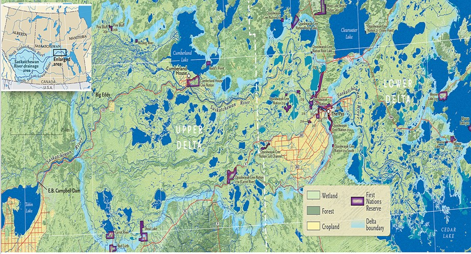

---
---

[home](home.html)

# Site Description

The Saskatchewan River Delta (SRD) is located in the central lowlands of Canada, and it lies between the Saskatchewan and Manitoba borders (Abu, 2018; Andrew, 2015). It consists of the lower and upper delta separated by the Pas Moraine. The delta was formed from the retreat of the glacial lake, Lake Agassiz (Andrew, 2015). Rapid deposition of river-borne sediment during the glaciation period formed numerous potholes that support a wide array of plants and animals, including wildlife and birds (Kew, 1962; Goulet, 2013). Consequently, the SRD is characterized by a complex network of wetlands with high cultural and economic value (Abu, 2018; Andrew, 2015; Damas and Smith, 1980). It is internationally designated as an important breeding area for birds (Schmutz, 2001). The marshlands and wetlands surrounding Cumberland House form a significant part of the Delta (Upper delta) (Abu, 2018). The delta is the largest freshwater delta in North America covering an area of approximately 10,000 km square. However, it is significantly impacted by the presence of large hydropower dams such as the E B. Campbell dam, Gardiner dam, Nipawin Hydro dam, Grand Rapid dam including other small dams, dikes, canals and other upstream developments (Abu, 2018; Smith et al., 1998). This has resulted in the alteration of the natural function of the delta (Andrew, 2015; Abu, 2018). For example, the major inflow into the delta is the Saskatchewan River. The Saskatchewan River Basin drains approximately 340,000 km square and about 80% of water supplied to the delta is from the Saskatchewan River and it passes through the E.B Campbell dam located upstream of the delta. The water supplying the E.B. Campbell dam is released and held as needed to maximize the function of the dam. This result to significant alteration in the natural flow regime of the Saskatchewan River, and a general decrease of water level in the delta (Partners for the Saskatchewan River Basin, 2008; Abu, 2018; Andrew, 2015). Similarly, other hydrological and ecological functions have been altered. For example, the dam impounds a significant amount of river-borne sediment entering the reservoirs which have led to an enlargement of channels downstream of the dam and has resulted in depletion of sediment-borne nutrient in the delta. Consequently, loss of indigenous fish species, loss of cultural values, loss of identity, loss of indigenous livelihood, degrading water quality and insufficient quantity of water are some of the concerns of  indigenous population inhabiting the delta (Waldram, 1989; Andrew, 2015).

{ width=100% }
Fig 1: The Saskatchewan River Delta. (Canadian Geographic, (2019)

Include references as appropriate and write down all reference information in the file references.md
