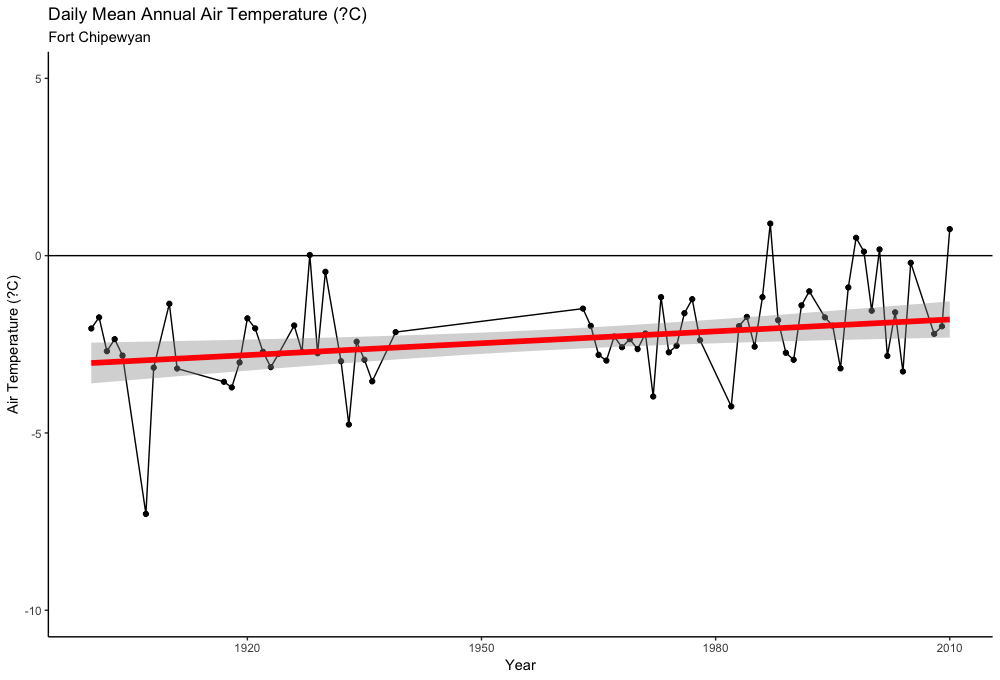

---
---

[home](home.html)

# Appendix B: Plots of climate and hydrometric trends at studied sites
## HAY RIVER BASIN ANALYSIS
###  Precipitation and temperature statistical analysis results at Hey River site
#### Precipitation (Annual)
 { width=100% }

####  Mean daily temperature

 { width=100% }

###  Precipitation and temperature statistical analysis results at Fort Simpson site
#### Precipitation (Annual)
 { width=100% }

####  Mean daily temperature

 { width=100% }

###  Streamflow statistical analysis results at Hey River basin stations
##### HAY RIVER NEAR HAY RIVER
 { width=100% }

##### CHINCHAGA RIVER NEAR HIGH LEVEL
 { width=100% }

##### STEEN RIVER NEAR STEEN RIVER (Seasonal)
 { width=100% }

##### LUTOSE CREEK NEAR STEEN RIVER (Seasonal)
 { width=100% }

##### HAY RIVER NEAR MEANDER RIVER (Seasonal)
 { width=100% }

## SLAVE RIVER BASIN ANALYSIS
###  Precipitation and temperature statistical analysis results at Fort Smith site
#### Precipitation (Annual)
 { width=100% }

####  Mean daily temperature

 { width=100% }

###  Precipitation and temperature statistical analysis results at High Level site
#### Precipitation (Annual)
 { width=100% }

####  Mean daily temperature

 { width=100% }
###  Precipitation and temperature statistical analysis results at Peace River site
#### Precipitation (Annual)
 { width=100% }

####  Mean daily temperature

 { width=100% }
###  Precipitation and temperature statistical analysis results at Fort McMurray site
#### Precipitation (Annual)
 { width=100% }

####  Mean daily temperature

 { width=100% }
###  Precipitation and temperature statistical analysis results at Fort Chipewyan site
#### Precipitation (Annual)
 { width=100% }

####  Mean daily temperature

 { width=100% }

###  Streamflow statistical analysis results at Slave River basin stations
#### ATHABASCA RIVER BELOW FORT MCMURRAY
 { width=100% }

##### PEACE RIVER AT FORT VERMILION (Seasonal)
 { width=100% }

##### PEACE RIVER AT PEACE POINT (ALBERTA)
 { width=100% }

##### SLAVE RIVER AT FITZGERALD (ALBERTA)
 { width=100% }
