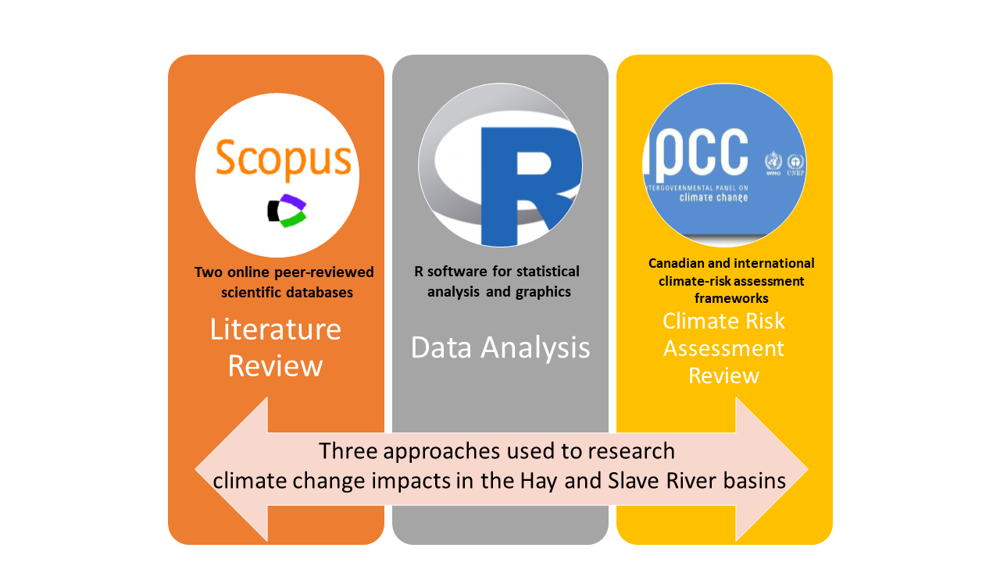

---
---

[home](home.html)

# Executive Summary

The Bilateral Water Management Agreement (BWMA) between the Government of the Northwest Territories (GNWT) and the Government of Alberta was signed in 2015 (Mackenzie River Basin Bilateral Water Management Agreement, 2015). In this context, a project from the GNWT took place to understand transboundary water issues of the Hay and Slave River basins. The project’s main goal was to generate inputs to initiate a learning process for the design of future research on climate change risks and impacts on water resources. These actions will help to improve the GNWT management capacity of the transboundary water resources and the risks and impacts of climate change. Specifically, this initiative seeks to identify previous research in both river basins, to analyze data on trends in temperature and precipitation, and to propose a climate change risk assessment approach for transboundary water management and research.

To achieve this objective, three main activities were carried out:

1.	A systematic literature review of scientific research on climate change and associated impacts on water resources (water quality, water quantity, and biology) in the Hay and Slave River basins and adjacent basins with similar land-cover and hydrological characteristics.

2.	A statistical analysis of historical hydrometric and climate data available for the Hay and Slave River basins to detect temporal and spatial changes.

3.	A draft framework for climate change risk assessment of water resources aligned with Canadian and international guidelines on climate change risk assessment and the BWMA’s Risk Informed Management (RIM) approach.

The result of these activities will support the design of future research projects with a climate-risk assessment approach. The new research will contribute to untangle the impacts of climate change-induced stressors and anthropogenic changes on transboundary water resources and aquatic ecosystems. To guide future investigations, a set of research recommendations was developed to fill in the information gaps, as per the requirements of the BWMA. Additionally, these recommendations promote the improvement of management processes for monitoring and adaptation on the Hay and Slave River basins. Figure 1 shows the approach of this project.

 { width=100% }

Figure 1. Diagram of the project approach to achieve the main objective. Source: Author.
