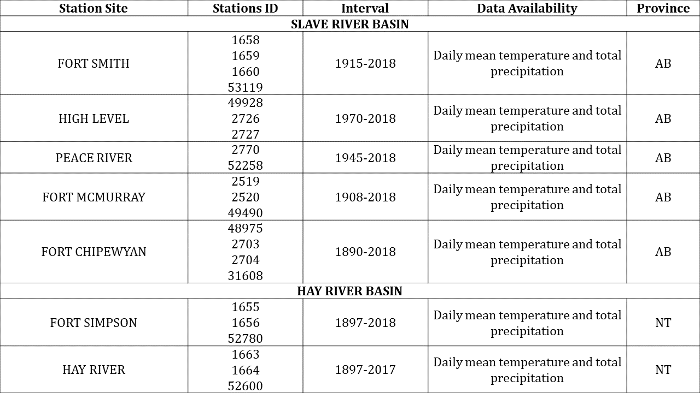

---
---

[home](home.html)

# Methodology

In order to understand the impacts of climate change on the transboundary water resources in the Hay and Slave River basins, each objective of this project was addressed with different methodological approaches:

1.	The first objective, which focused on systematically aggregating, evaluating, and synthesizing scientific literature on climate change on the transboundary water resources in the Hay and Slave River basins, served to establish the knowledge gaps and to outline more specific research topics to fill those gaps.

2.	The second objective, which focused on a statistical analysis of trends in streamflow and meteorological events in the Hay and Slave River basins, used locally-generated data from hydrometric and climate stations and an R-software programming script developed by GNWT to detect any significant trends in total annual precipitation, mean daily temperatures, and annual flows in each station. These results, which updated previous reports, also contributed to outline recommendations for future research on hydroclimatic trends in the region.

3.	Finally, for the third objective, a review of the IPCC, Canadian, and international literature on climate change risk assessment frameworks and tools was undertaken. We identified a risk assessment framework and adapted in order to generate a prototype tool for climate-change risk assessment, applicable to the Canadian river basin context. Next, we tested the prototype tool on a group of papers from the systematic literature review (objective 1) to identify climate risk assessment components in the region (hazard and impacts).

This section presents the methodology applied to each objective of the project.

## Systematic literature review

The first approach to addressing this project’s overall aim of understanding the impacts of climate change on the transboundary water resources in the Hay and Slave River basins, was to carry out a systematic review a plethora of relevant research in the region. Northern Canada, and the Mackenzie River basin in particular, have been the focus of research on climate change-induced hydrological changes in recent decades. The Mackenzie GEWEX Study (MAGS), the Changing Cold Regions Network (CCRN), and the Global Water Futures (GWF) are examples of current and recent programs that focus on understanding the changing regional hydro-climate and its effects, particularly the Saskatchewan, Mackenzie and Peace-Athabasca River basins (Debeer et al., 2016; Wheater & Gober, 2013). Internationally, a large number of studies on climate change have been published in the last decade. The last International Panel on Climate Change (IPCC) report acknowledged this increase in research, specially in the northern hemisphere, in the freshwater resources sectorial chapter (IPCC, 2014).

### Methods
The focus of this systematic literature review is to find relevant scientific sources of information on climate change and the associated risks and impacts on water resources (water quality, water quantity, and biology) in the Hay and Slave River basins and/or adjacent basins with similar land-cover and hydrological characteristics. The methodology followed the approach developed by von der Porten and de Loe (2014) to systematically aggregate, evaluate, and synthesize the scientific evidence.

A literature search of peer-reviewed scientific articles was carried out using two online databases: Scopus and ISI-Web of Science. These multidisciplinary databases house research in the environmental sciences and they were available through the University of Saskatchewan database licensees. Literature published in formats other than indexed journal articles, such as government and international organizations’ publications and consultant research were also assessed in this project, but they were not included in this systematic review.

A structured search protocol was designed to identify all available relevant information in the two databases. The relevance of the studies and the quality of evidence was assessed during this systematic review of literature. Relevance of each study was evaluated by searching explicitly for the search terms in the study. The quality of evidence was assessed through a pertinence assessment of the study’s outcomes (Lau & Kuziemsky, 2016). There were no restrictions placed in the search regarding publication date. However, it was expected that the last two decades would capture the most relevant information on climate change and water resources research in the region (IPCC, 2014).

The systematic review was carried out by a single reviewer and with search criteria in the English language. The search terms used covered the following four categories: 1) climate change; 2) hydrological characteristics relevant to the region of interest (identified using guidance from IPCC (2014) and DeBeer et al. (2016)); 3) location (i.e. Hay and Slave River basins and adjacent basins with similar land-cover and hydrological characteristics); and 4) climate change risk assessment (to identify research that specifically addressed the impacts of climate change). Table 1 shows the categories, search terms and strategy used for the literature search.

Table 1. Search categories, terms and strategy used to find peer-reviewed articles in Scopus and ISI-Web of Science databases:
{ width=100% }

Upon running the search strategy in each database, the first step was to identify scientific articles containing at least one term from each of the first three search categories (climate change, hydrology characteristics, and location categories) in the title, abstract, or author keywords. The fourth category (climate change risk components) was not contemplated in this first step because the purpose of it was to scope the search in the databases only. The results obtained from each database in the first step were merged, and duplicate papers were eliminated. The resulting search set was then refined by skimming the documents (second step). In the second step, two activities were carried out: 1) exclusion of false positives incorrectly included in the first step, and 2) application of the fourth search category by identifying those articles that discussed climate change and associated risks and/or impacts on water resources (water quality, water quantity, and biology) in the Hay and Slave River basins and/or adjacent basins. False positive articles defined as those that contained terms from all four search categories, but one or more terms were not related to the indented purpose or broad characteristics of the project (von der Porten & de Loë, 2014). For instance, if a desired location is mentioned in the abstract but the actual study area is different, this paper is a false positive identified in step one, that would be eliminated in step two.

Each of the papers in the final pool of papers was reviewed to determine their relevance and pertinence to the main focus of this project: climate change and associated risks and impacts on water resources (water quality, water quantity, and biology) in the Hay and Slave River basins and/or adjacent basins with similar land-cover and hydrological characteristics. Each paper was assessed to how it explicitly or implicitly addressed the impacts of climatic changes on water quantity, quality and biology in each basin. The following information was recorded for each paper: author(s), title, publication year, location (e.g. Slave River delta, Fort Resolution, etc.), the water resources-related focus topic of the paper (e.g. water quality, aquatic ecosystems, etc.), the climatic driver (e.g. recent global warming, projected global warming, etc.) and the direct effects on water resources (e.g. increasing streamflow, increased risk of ice jam flooding, etc.).  Further analysis was conducted on the final pool of papers, related to the climate risk assessment approach (see _Climate Risk Assessment Framework Review_ sections).

## Data analysis

The second approach to addressing this project’s overall aim of understanding the impacts of climate change on the transboundary water resources in the Hay and Slave River basins, was to carry out an analysis of streamflow and meteorological data in the region.

The current state of quantitative evidence on the impacts of climate change on the Hay and Slave River basins is limited. The systematic literature review carried out in the first part of this project identified only one paper that analyzed hydrometric data in the Slave River basin (Rood et al., 2017). As previously stated, this long-term trend analysis at the Fitzgerald station in the Slave River (2016-2013) has shown no significant trends on annual discharge. Similarly, a report from Aboriginal Affairs and Northern Development Canada in 2012 has shown no statistically significant trends on annual flows at the Fitzgerald station in the Salve River for the period of analysis (1972-2010). Additionally, the grey literature reviewed for this project did not report any significant trends in annual flows in the Hay River basin (at the Hay River station) (Aboriginal Affairs and Northern Development Canada, 2014; Stantec Consulting Ltd., 2016). Moreover, the Chinchaga River at near High-Level station in the Hay River basin, has also not shown significant trends in annual flows for the 1969-2012 period (Stantec Consulting Ltd., 2016).

### Methods
The data analysis was carried out in this project to determine any trends (i.e. magnitude and direction) in precipitation, surface air temperatures, and discharge in the Hay and Slave River basins and relevant adjacent river basins over periods of more than 30 years. Three additional hydrometric stations (two in the Peace River basin and one in the Athabasca River basin) and five climatic sites (High Level, Peace River, Fort McMurray, Fort Chipewyan and Fort Simpson) were included in this study. No water quality statistical analysis was conducted in this project. The outcomes from this analysis provide a temporal overview of trends and potential climate change signals or impacts on water resources that could help the design of future monitoring programs in the Hay and Slave River basins.

#### Data sources
For this project’s quantitative trend analysis, data was obtained from Environment and Climate Change Canada, through either the Water Survey of Canada or the Meteorological Service of Canada. The hydrometric and the climatic datasets publicly available were downloaded online using R software coding packages rclimateca (temperature and precipitation historical data) and tidyhydat (discharge historical data).

The period of analysis for each site varied depending on the availability of hydroclimatic data (Table 2 and 3). The selection of the stations was based on the length of data availability and only stations with data records of 30 or more years were included.  A total of 9 sites with hydrometric data were analyzed.

Table 2. Hydrometric stations in Alberta (AB) and Northwest Territories (NT) selected for this analysis.
{ width=100% }

Table 3. Climatic stations in Alberta (AB) and Northwest Territories (NT) selected for this analysis.
{ width=100% }

#### Statistical analysis
Dr. Ryan Connon from the Water Resources department at the Government of the Northwest Territories developed a hydrometric and climatic script for R software programming to statistically analyze these historical datasets with the non-parametric Mann-Kendall test, at p values for statistical significance of >0.01, 0.05 and 0.1, for the desired stations.

The climatic datasets used in this analysis were built with data from different stations at the same site. This procedure allowed to increase the period of analysis for each site and to detect any significant trends in total annual precipitation and mean daily temperatures. The hydrometric datasets were analyzed to detect any significant trends in annual flows in each station. The hydrographs displaying maximums, minimums, and means for annual flows of the Hay and Fitzgerald stations (figures 4 and 6).

## Climate risk assessment framework review

The third approach to addressing this project’s overall aim of understanding the impacts of climate change on the transboundary water resources in the Hay and Slave River basins, was to develop of a framework for climate change risk assessment of the transboundary water resources.

From a management perspective it is crucial to have an effective and efficient approach to deal with environmental pressures in order to achieve sustainable development. The RIM approach integrates and configures actions to cope with water resources issues from a holistic perspective.  The key value of RIM is the application of three core principles: be well informed, manage adaptively, and take a participatory approach (Brils et al., 2014). The BWMA has identified the need for developing tools to assess the risk of transboundary waters through learning processes and plans which apply the RIM approach(Mackenzie River Basin Bilateral Water Management Agreement, 2015). From this perspective, a tool that generates information about the climate change risks on water resources for the RIM is highly desirable. Thus, this framework could then be used as tool that will allow to integrate the climate change risk perspective into the RIM of the BMWA. Moreover, this instrument will also be useful to identify specific needs in research, whose outcomes will help quantify the risk and impacts of climate change of water resources in the transboundary basins.

### Methods
#### Climate change risk assessments of water resources in river basins
The design of a prototype for a climate change risk assessment tool in this project aimed to adapt important assessment tools developed for the Canadian river basin context using a current IPCC framework for climate change risk assessment. The Canadian Council of Ministers of the Environment has developed very powerful guidelines and tools for vulnerability assessment, monitoring, and management of water resources at the watershed level.

For this project, a literature review of the IPCC Fifth Assessment Report framework on climate change risk assessment and of Canadian and international literature on climate change risk assessment was undertaken. Additionally, literature from the CCME for assessing and quantifying water resources exposure, sensitivity and adaptive capacity (resilience) to climate change at the watershed level was also reviewed. This process allowed the identification of the IPCC framework as the most updated conceptual framework on climate change risk assessment and of the CCME Tools for Climate Vulnerability Assessments for Watersheds as the most pertinent tool to be adapted for this project (CCME, 2011, 2013, 2015; IPCC, 2014; Black et al, 2010)

#### Climate change risk assessments framework adaptation

For this project, climate change risk is defined as “_the potential consequences, effects or impacts on something of value, due to the interaction between climatic hazards, level of exposure of the systems under analysis, and their propensity to suffer negative effects_” (IPCC, 2014). The IPCC framework describes risk as the probability of occurrence of a harmful impact in a certain location caused by a hazardous climatic event. The impacts depend on the degree of exposure and the location’s underlying propensity or predisposition to be adversely affected (vulnerability). Climate change risk of impact is described by the following mathematical formula (Zebisch et al., 2017):

_Climate Change Risk of (Impact)= f(Hazard, Exposure, Vulnerability)_

The IPCC conceptual framework was not modified for this project, but rather the definitions of its components were adapted to measure and assess the risk of climate change impacts on water resources. In order to move forward, it was crucial to understand the climate change risk assessment components (Impacts, Hazard, Exposure, Vulnerability), as its characteristics may differ from other risks assessment methods. The definitions and concepts of these components have been adapted to the water resources context of this project, as follows:

1.	**Impact:** The term impact refers to the effects that different meteorological and climatic events may have on natural and human systems (IPCC, 2014). Impacts are generated by the interaction of climate changes or hazardous climate events, with the vulnerability of an exposed system and with the level of exposure to the climatic hazard. Impacts may also be referred to as effects, consequences or outcomes of climatic risks. Identifying the relevance of climate change impacts on a specific system is crucial for the successful implementation of a risk assessment tools (Fritzsche et al.,2014).

2.	**Climatic hazard:**  Defined as the potential occurrence of a climatic-related event (increase of mean temperature, shifts on precipitation regimes, decrease in seasonal precipitation, etc.) or their physical impacts (floods, permafrost degradation, droughts, etc.), that may cause losses, damages or changes in natural or human systems (IPCC, 2014). For this project, climatic hazards were defined as climatic events with the potential to negatively affect water quality, quantity or aquatic ecosystems in the Hay and Slave River Basins.

3.	**Exposure:** It refers to the presence of a resource or system of natural or artificial occurrence in places and environments that could be adversely affected as a consequence of climatic hazard (IPCC, 2014). Therefore, water resources and aquatic ecosystem may be at risk of suffering losses, damages or changes due to the action of a climatic hazard in a specific region (Beniston, 2006). Water resources’ exposure to hazards at a basin level are measured by the ratio of the changes in the magnitude to the spatial extent of the exposure, and by the rate of change in water quality and/or quantity due to climate change over time (CCME, 2013). Quantitative changes can be measured using the rate or the ratio, while qualitative changes can only be measured by the ratio. Moreover, the exposure of an aquatic ecosystems is measured by the ratio of spatial extent in the basin surface (Zebischet al., 2017).

4.	**Vulnerability:** In the field of climate change, vulnerability is defined as the propensity or predisposition of a system to be negatively affected by a climatic hazard. Vulnerability involves two factors: 1) sensitivity (susceptibility to harm) and capacity to adapt (coping and response potential), and 2) resilience (ability to recover from harm) (IPCC, 2014). When assessing water resources in natural systems (basin) the term resilience is preferred (CCME, 2013).

    + _Sensitivity:_ Sensitivity is the capacity of a resource or system to respond to changes. Sensitivity is directly linked to the intrinsic attributes of the exposed system, which may increase or decrease the probability of suffering harmful impacts when exposed to climate changes. Sensitivity assessment of water resources focuses on the characteristics of the biophysical environment, such as topography, land use and land cover, basin and river geomorphology, vegetation succession and natural disturbance, hydrologic and energetic patterns, and chemical cycles. Characteristics of aquatic ecosystems such as freshwater species, habitats, populations, or communities are also used to estimate sensitivity (CCME, 2013).  

    * _Resilience of aquatic systems:_ Refers to the pre-existing ability of the natural system to respond and tolerate disturbances, such as climate change, without moving into a different qualitative state. These qualities depend on the state of integrity of the natural system and the biodiversity and on the tolerance capacity of the ecosystem’s biological components (CCME, 2013).

#### Climate change risk assessments framework adaptation

In order to test the newly adapted framework, it was objectively applied to the most
 recent papers in the final pool of references (20 papers) in the systematic literature review. This analysis aimed to identify impacts, climate hazards, exposure variables, sensitivity, and resilience properties of water resources in each study. Hazards and impacts identified by the prototype tool were compared with the management priorities of the BMWA in order to assess whether they aligned or not.
