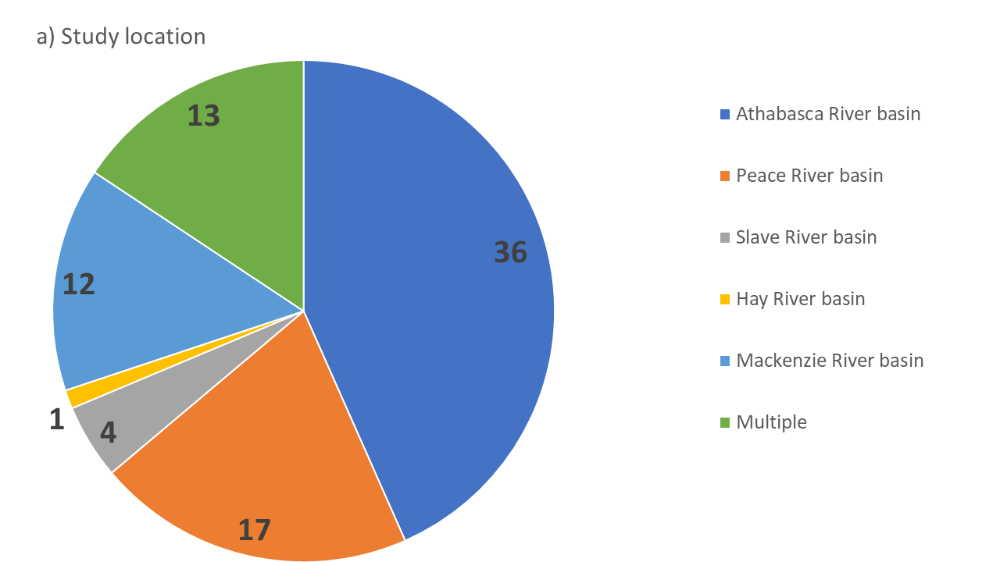
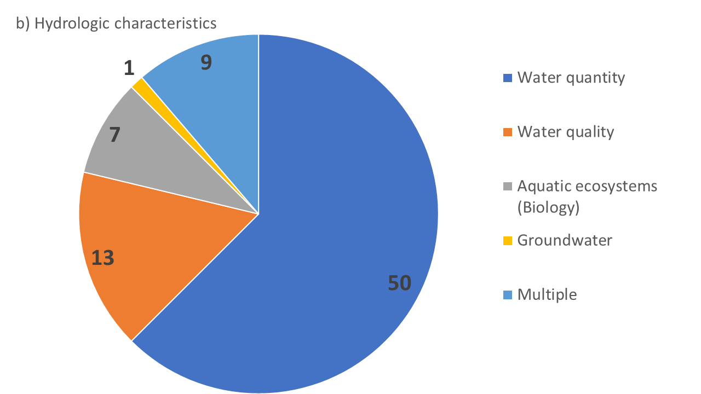
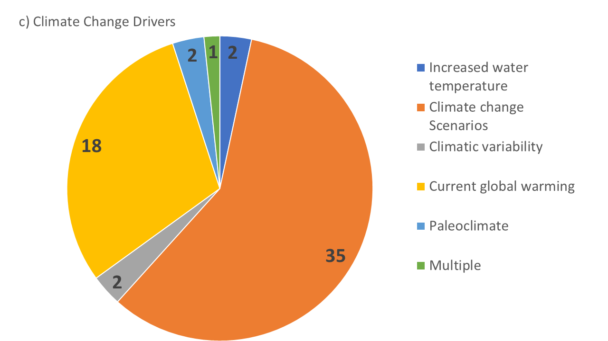
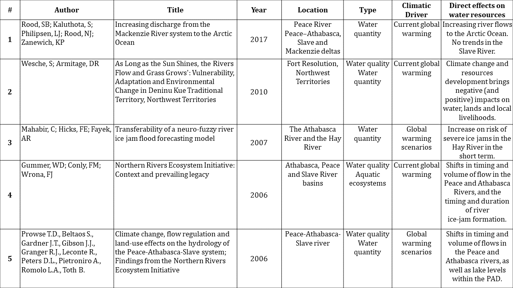
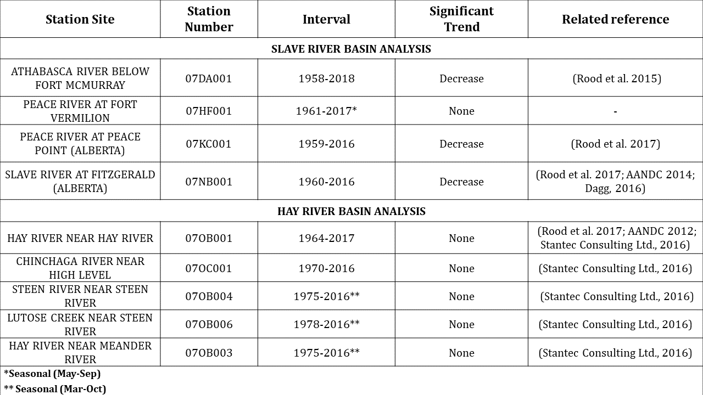
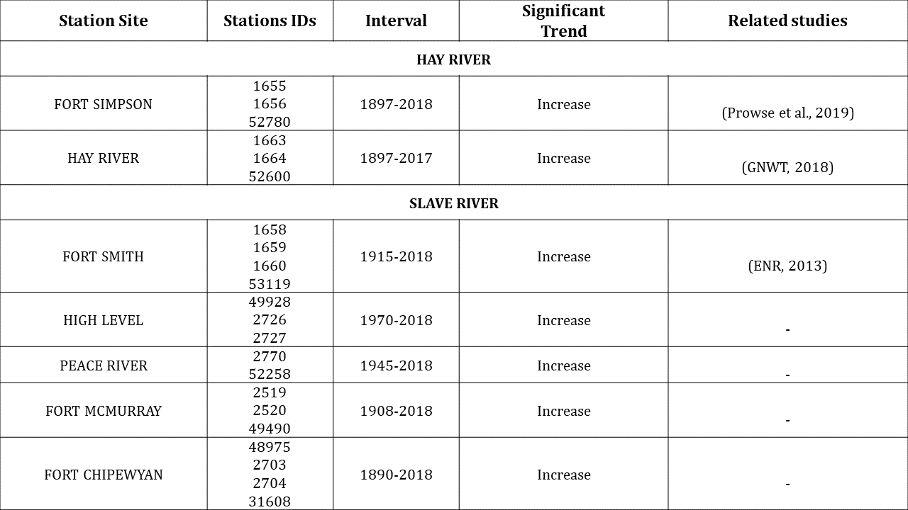
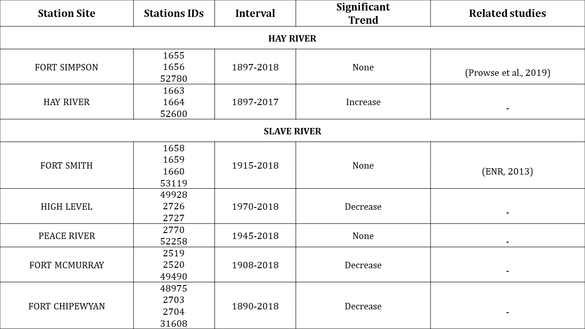
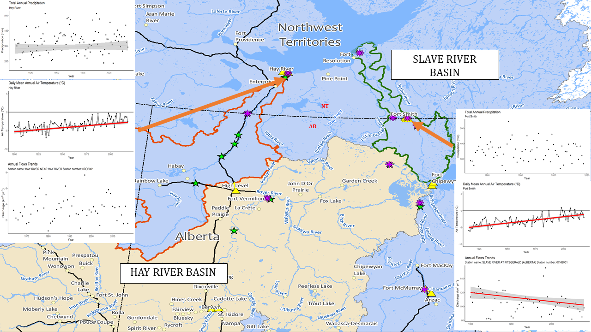
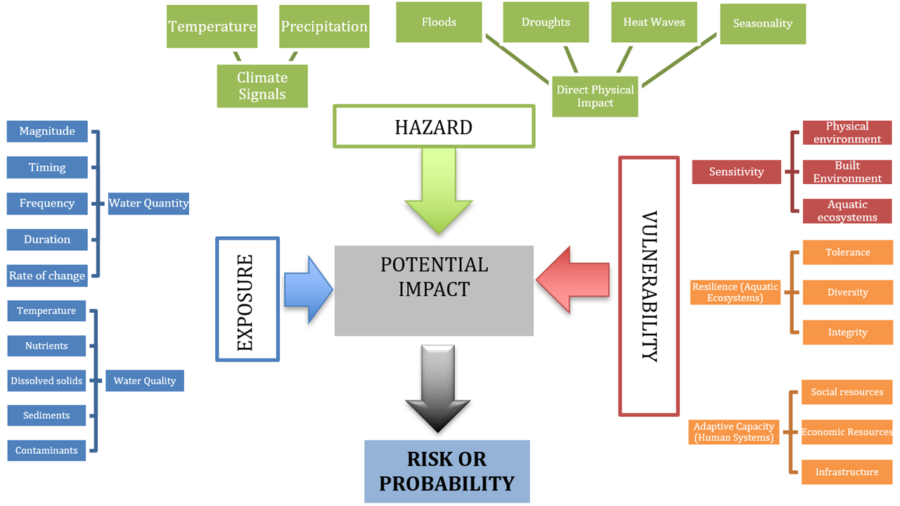
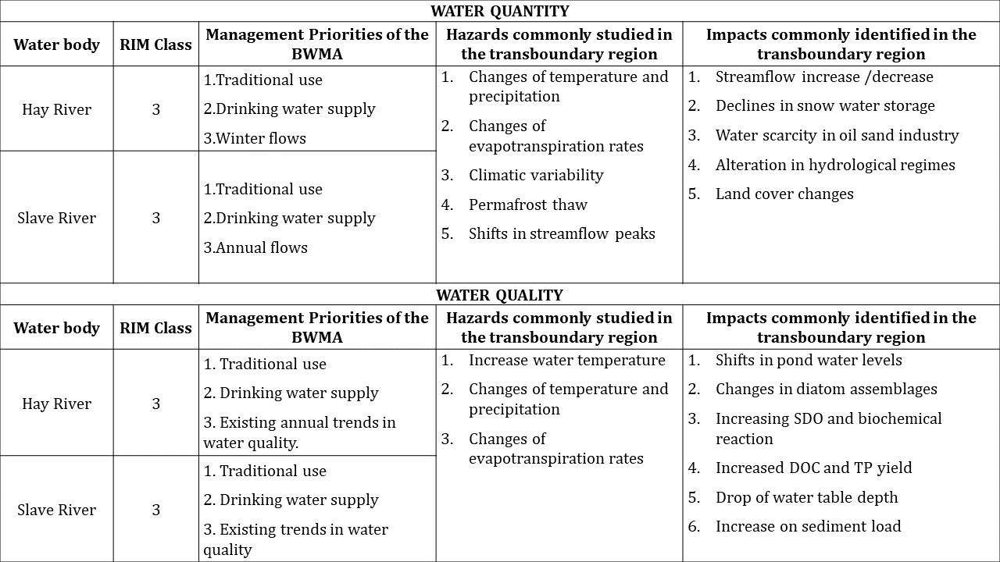

---
---

[home](home.html)

# Results
## Systematic literature review
The systematic literature search criteria identified 255 papers in the ISI-Web of Science database and 181 papers in the Scopus database. In ISI-Web of Science, 134 papers explicitly containing climate change, hydrologic characteristics, and location terms in the title, abstract, or author keywords were identified, while 122 papers were found in Scopus (step one). Subsequently, both search results lists were merged, and duplicate papers were eliminated, resulting in 160 potentially relevant papers for this project. Finally, through a skimming process of each paper, the pertinence for location, change climatic drivers and hydrologic characteristics were assessed in all 160 papers and 100 false positives were excluded (step two).  The result was a pool of 60 peer-reviewed papers. The number of papers that fit the search criteria categories is summarized in Figure 8. It is noteworthy that several studies were conducted in more than one location and/or studied more than one hydrologic characteristic. Moreover, as it was expected, most papers were published within the last 15 years (55). [Appendix A](figures/Appedices/FinalListSystematicLiteratureReview.xlsx) contains the full systematic literature review information extraction matrix.

{ width=100% }
{ width=100% }
{ width=100% }

Figure 8. Number of articles that fit each search criteria category: a) Location, b) Climate Change Drivers, and c) Hydrology Characteristics. The final number of peer-reviewed papers was 60.

As seen in figure 8, most papers identified in this project focused on the Athabasca River basin. Several of these papers revised impacts of climate change related to water resources use in the oil and mining industry. For instance, Leong et al. (2015, 2016) studied future water availability and demand in the Athabasca oil sands region, under different climate change scenarios. Regarding hydrologic characteristics and climate change, the vast majority of papers (50) focused on water quantity issues under climate change forcing. Of these, 30 articles covered topics on projected impacts on water quantity under future climate change scenarios; 14 evaluated impacts on water quantity under current global warming trends and climate variability; and one paper studied future climate impacts on water quantity through paleoclimate analysis. Furthermore, 13 papers focused on water quality and analyzed changes in river discharge and stream temperature affecting water quality factors, under current and future global warming scenarios.

Finally, five papers studying the Hay and Slave basins were identified. These papers focused on analyzing water quantity and quality under current and future global warming scenarios. The most recent paper in the Slave River basin, analyzed historical trends in annual water discharges for the basin (Rood et al. 2017). Because the Hay and Slave River basins are the location focus of this project, Table 4 briefly describes the main characteristics of these papers.

Table 4. General information from the 5 scientific papers identified in the systematic review on water resources and climate change in the Hay and Slave River basins.
{ width=100% }

## Data analysis

Hydroclimatic analysis was conducted for the stations listed in Table 3 and Table 4. Table 5 summarizes the results streamflow analysis by station name and number, period interval, trend and direction, rate of change, and whether any previous literature is available for that station.

Table 5. Streamflow statistical analysis results for the Hay and Slave River basins.
{ width=100% }

Likewise, Table 6 and 7 summarize the results of temperature and precipitation statistical analysis, respectively, by stations site, stations ID number, period interval, trend and direction, rate of change, and whether any previous literature is available for that station.

Table 6. Mean daily temperature statistical analysis results for the Hay and Slave River basins.
{ width=100% }

Table 7. Precipitation statistical analysis results for the Hay and Slave River basins.
{ width=100% }

A set of plots were produced for all hydrometric stations to show either significant trends or no trends in streamflow, annual precipitation and mean daily temperature. These figures are presented in the [Appendix B](appendixB.html) of this report. Figure 9 depicts the results of the hydroclimatic analysis conducted with datasets from the BMWA monitoring sites: Town of Hay River in Hay River basin and Fitzgerald for hydrometric data and Forth Smith for climatic data in the Slave River basin.

{ width=100% }

Figure 9.  Results of trends in annual precipitation (top panel), daily mean temperature (middle panel), and annual precipitation (bottom panel) on BMWA monitoring sites in the Hay River basin (Town of Hay River, left) and the Slave River basin (Forth Smith and Fitzgerald, right). Map Source: Geomatics, GNWT.

Steady increases in mean daily temperatures were found in both sites for this analysis. No trend in total annual precipitation was detected in the Slave River basin, whereas a statistically significant increase was found in Hey River basin. Furthermore, the annual discharge in Hay River (at Hay River station) showed no significant trend, whilst the Slave River (at Fitzgerald station) showed a statistically significant decreasing trend in streamflow for the analysed period (1960-2016).

## Climate risk assessment framework review

The final climate risk assessment tool adapted from the conceptual framework of Fifth Assessment Report of IPCC is presented as a flowchart in Figure 10. It contains the framework’s components and factors and their interactions. The measurement and quantification of the components according to the tool implementation guidelines from CCME are designed to quantify the risk of occurrence of a given potential impact under climate change context.

{ width=100% }

Figure 10. Depiction of the climate risk assessment tool adapted from the conceptual framework of Fifth Assessment Report from IPCC (2014) and the CCME Tools for Climate Vulnerability Assessments for Watersheds (2013). The tool measures the probability or risk of occurrence of an impact under climate change stress.

The climate change risk assessment tool in Figure 10 was applied to the 20 most recent papers from the systematic literature review (33%). The tool identified the most common climate hazard and impacts of climate change on water quality and water quantity assessed in the papers. In order to translate the findings of this study’s third objective into the current context of this project (objective 1), Table 4 provides a summary of the BWMA management priorities, the RIM class assignment for the Hay and Slave Rivers (columns 1-3) and presents the climatic hazards to and impacts on water resources identified through the application of climate change risk assessment tool prototype to 20 articles (columns 4 and 5).

Table 8. Summary of the BWMA management priorities, the RIM class assignment, hazards and impacts identified through the application of climate change risk assessment tool prototype to the 20 studies carried out in the Hay and Slave rivers.
{ width=100% }
