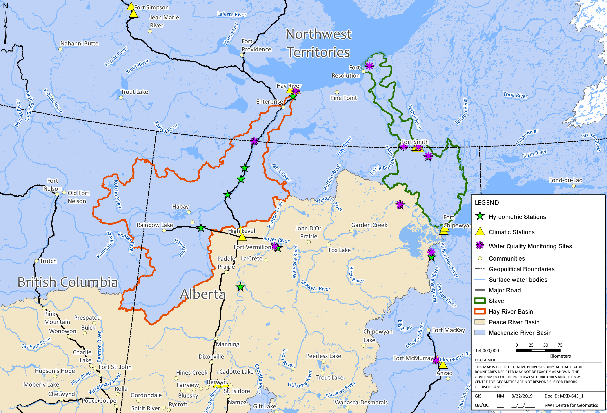
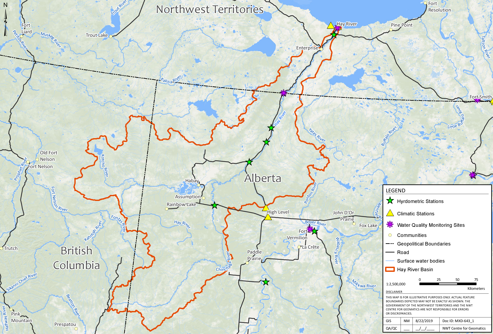
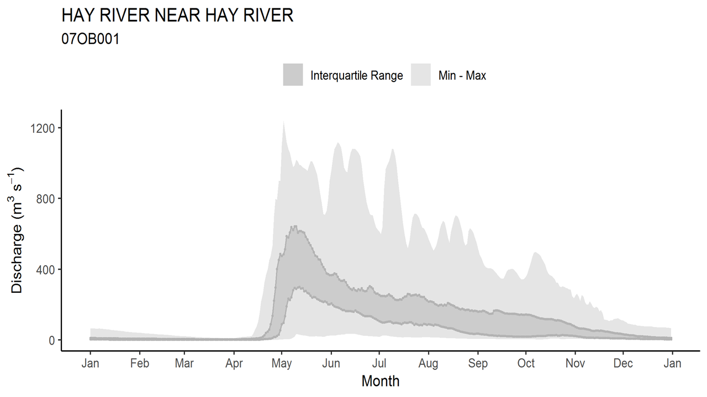
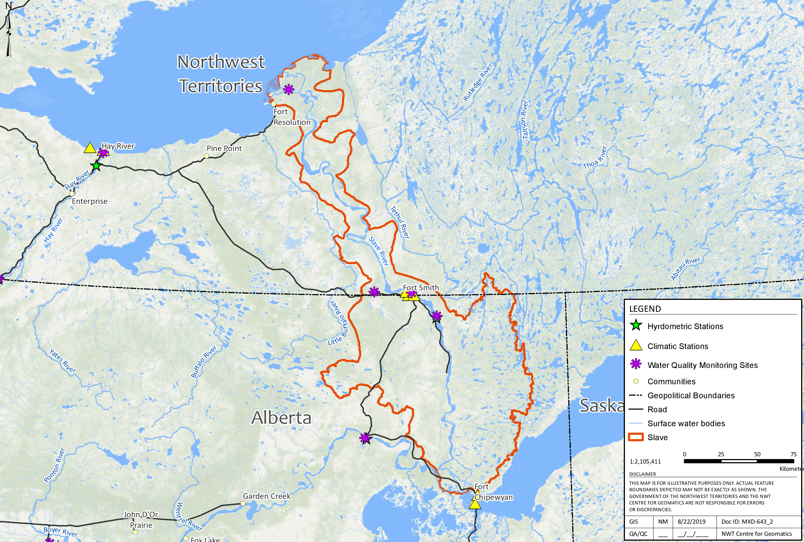
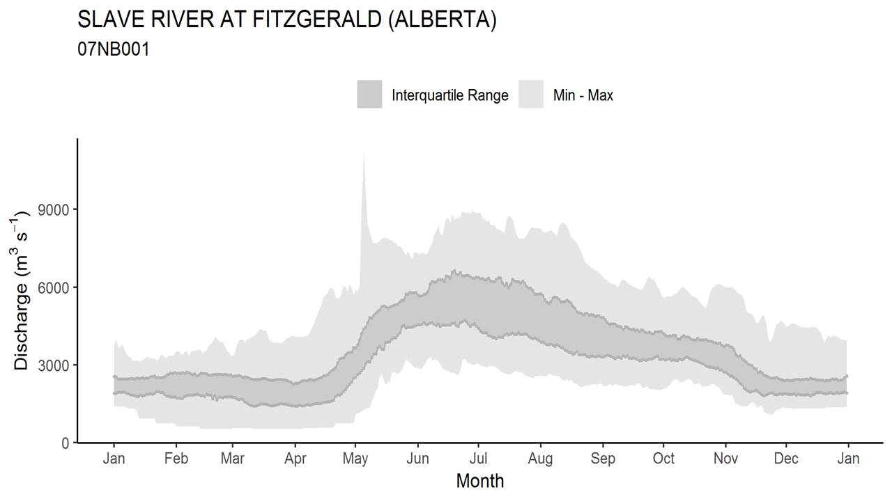
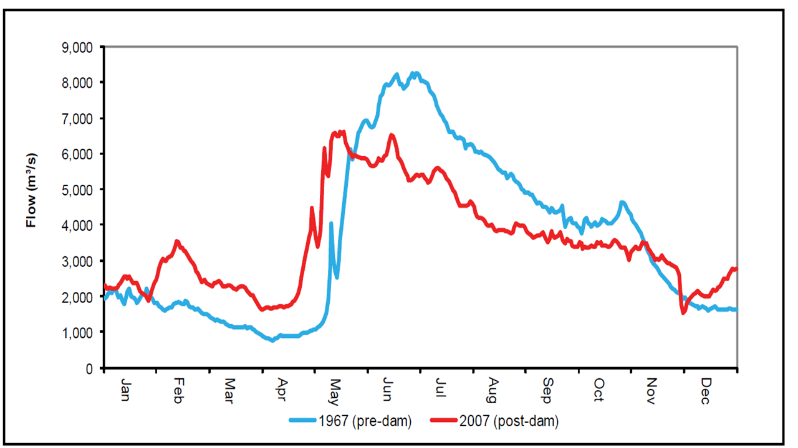

---
---

[home](home.html)

# Site Description
This section provides background information and a description of the biophysical context, characteristics and trends in climatology and hydrology affecting the Mackenzie River basin and the Hay and Slave River basins. The Hay and Slave River basins comprise part of the larger Mackenzie River basin, which drains into the Arctic Ocean. These transboundary river basins straddle the border between Alberta and the Northwest Territories at 60° N.

## Climate characteristics and its changes
The transboundary Hay and Slave River basins region is characterized by cold, long winters and warm short summers. The mean annual temperature averages -5 ºC in this region, with mean daily winter temperatures ranging from -20 to -25 ºC and mean daily summer temperatures from 10 to 15 ºC (1971-2000) (Prowse et al., 2019). Along the transboundary river basin region there is relatively low precipitation of around 400 mm/year. Most of the total precipitation is in the liquid phase, occurring mainly in the summer season (Prowse et al., 2019). There is mounting evidence that climate warming at high latitudes is occurring at a rate disproportionated to the global average(IPCC, 2012). A report from the GNWT (Environment and Natural Resources, 2013) shows an average temperature increase of 2.4 ºC in the NWT and a mean increase of 2.5 ºC in Fort Smith at the NWT-Alberta border over the 1957-2012 period.

## Characteristics of Mackenzie River Basin
The Mackenzie River basin is the largest river basin by area in Canada, with an average annual flow of 325 km3/year. Both the Hay and Slave River basins drain into the Great Slave Lake, where the Mackenzie River starts flowing towards the Arctic Ocean. At the basins’ transboundary region, the Hay River flows throughout the Boreal Plains ecozone (shrubs and boreal forest), while the Slave River is located in the taiga shield ecozone (open forest). The two ecozones cover a physiographic region known as the Interior Plains, which is characterized by a low-plateau with extensive presence of water bodies, such as wetlands and lakes (Prowse et al., 2019).

Hydrological fluxes in the Hay and Slave River basins area, are highly dependent on the land-cover type and associated vegetation. Another important factor that influences hydrology in colds regions is permafrost (Dingman, 2015). Because the transboundary basins are underlined by sporadic and discontinuous permafrost, the presence or absence of permafrost can govern surface and subsurface hydrological processes. Infiltration depth and runoff responses are controlled by the depth of the seasonal thaw of the permafrost active layer (Prowse et al., 2019). Climate warming has intensified permafrost thaw, which can result in changes in land cover and vegetative communities. This process has been shown to alter the basin’s water balance and near surface hydrological connectivity in a such a way that has led to either permanent or transient increases in streamflow in nearby transboundary basins (Connon et al., 2014).  Figure 2 depicts the location of the Hay, Slave and Mackenzie Rivers’ basins.

{ width=100% }

Figure 2. Map of the Hay and Slave River basins and their connection to the Mackenzie River basin. Source: Geomatics, GNWT.

Several hydrological studies carried out within the Mackenzie River basin have shown different results in discharge trends, which depend on the sub-basins involved and the period for analysis. For example, Rood et al. (2015, 2017) analyzed streamflow records of around one hundred years of data of 10 hydrometric stations. The researchers demonstrated a gradual increased in discharge in the Makenzie River basin and no significant trend on annual discharges in the Slave and Athabasca rivers. These studies also demonstrated the importance of regional climatic variability, such as the Pacific Decadal Oscillation, in hydrological changes over time.

## The Hay River basin
The Hay Basin is a transboundary basin that drains an area of approximately 51,700 km2  and has a mean annual discharge of 110 m3/s (Rood et al., 2017). The basin headwaters are in British Columbia and Alberta. The main stem of the Hey River is joined by the Chinchaga River, a major tributary in Alberta, and from there, the river flows north for 702 km into the Great Slave Lake (Aboriginal Affairs and Northern Development Canada, 2014). Roughly, 77% of the basin area is located in Alberta, 6% in the NWT and the remaining 17% in British Columbia. The Hay River basin is comprised of wetlands and low-lying land that represent nearly 30% of the total area. The remaining area of the river basin is in the headwater areas in British Columbia and Alberta and is characterized by uplands with steep slopes and undulating topography (Stantec Consulting Ltd., 2016). Figure 3 shows the hydrology of the Hay River basin.

{ width=100% }

Figure 3. Hydrology of the Hay River basin. Source: Geomatics, GNWT.

The annual hydrograph of the Hay River represents a typical nival streamflow regime, which is dominated by a large peak during the spring freshet and a declining recession curve during the summer. Summer and fall rainfall events augment the hydrograph, while baseflow sustains the relatively low volumes during winter (Ryan Connon, GNWT, pers. Comm). Figure 4 depicts the Hay River’s flow in a year.

{ width=100% }

Figure 4. Typical Hay River (at Hay River) flows over the calendar year. Source: GNWT.

No significant changes in annual flow have been detected for the period 1964-2012 in the Hay River at Hay River station (Stantec Consulting Ltd., 2016). Streamflow in the Hay River basin exhibits significant variation on a seasonal and annual basis in response to variable precipitation inputs.  A recent long-term data analysis revealed a trend of slightly increased winter baseflow in the Hay River (Stantec Consulting Ltd., 2016).

## The Slave River basin
The Slave River is the largest transboundary river basin between the NWT and Alberta, contributing approximately 75% of the inflow into Great Slave Lake (Aboriginal Affairs and Northern Development Canada, 2012). The Slave River has a length of 434 km,  a basin surface of 15,100 km2 and 320 km of the river’s length are located in the NWT (Dagg, 2016). The Slave River commences in the northeastern region of Alberta, at the confluence of the Peace River and the Athabasca River. Together both rivers drain a basin surface of 606,000 km2 over three provinces (British Columbia, Alberta and Saskatchewan) and the discharge flows into Great Slave Lake through the Slave River Delta, which has an active area estimated to be 400 km2 (Dagg, 2016). The mean annual discharge is 3371 m3/s (Rood et al., 2017) of which approximately 66% is contributed by the Peace River (Dagg, 2016). The river basin lays over the Canadian shield toward the east, and the Interior Plains are located toward the west (Aboriginal Affairs and Northern Development Canada, 2012). The landscape around the Slave River is known as the High Boreal Wetland, which displays a gentle topography upstream, with higher gradients as it approaches the Delta (Dagg, 2016). Figure 5 shows the hydrology of the Slave River basin.

{ width=100% }

Figure 5. Hydrology of the Slave River basin. Source: Geomatics, GNWT.

The Slave River hydrograph is consistent with cold regions’ hydrology and has a similar regime to that of the Hay River. Figure 6 depicts the Slave River’s flow in a year.

{ width=100% }

Figure 6. Typical Slave River (at Fitzgerald) flows over the calendar year. Source: GNWT.

An analysis of 97 years of data from the Slaver River at the Fitzgerald site, showed no changes in the mean annual discharge of the Slave River (Rood et al., 2017). Nonetheless, flow regulation of the Peace River upstream, through the Bennett Dam located in British Columbia, has influenced the Peace River’s flow characteristics. Increases of up to 75% have been detected in the winter’s mean low flows and decreases of up to 20% in the spring’s mean peak flows (Aboriginal Affairs and Northern Development Canada, 2012). Figure 7 depicts the shifts seen in the annual hydrograph of the Slave River in the pre (1967) and post (2007) dam periods.

{ width=100% }

Figure 7. Annual hydrographs regimes of Slave River at Fitzgerald from pre and post upstream Peace River regulation. Source: Taken from Aboriginal Affairs and Northern Development Canada, 2012.

The upstream regulation of the Peace River represents a challenge when trying to discern the impact of climate change from the impact of the dam on Peace River’s flow changes. As a possible solution to this challenge, it has been suggested that hydrometric data from unregulated rivers and adjacent river basins or water bodies could be used to obtain possible patterns in changes of streamflow associated with climate change (Aboriginal Affairs and Northern Development Canada, 2012). The tributaries that flow into the Peace River and water bodies, such as the Great Slave Lake, the Athabasca River, and the Athabasca Lake, are some examples of potential sources of data. Using inferential methodology, such results could be applied to the Peace River (Aboriginal Affairs and Northern Development Canada, 2012). Additionally, studies conducted on the Peace River’s upstream dams, aimed to describe the influence of these dams on downstream hydrological processes, such as ice-jams and streamflow shifts (S Beltaos et al., 2006; Beltaos 2003, 2019).
