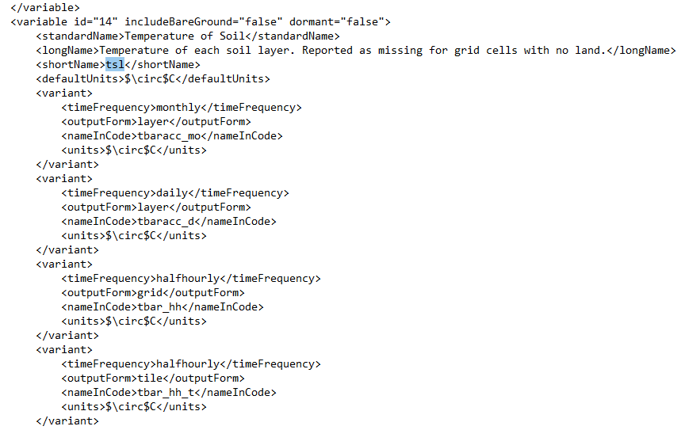

---
---

[Previous Section](runningclassic.html)
[Next Section](findings.html)

# 6. Data analysis

#### 6.1 Output Data

If the model runs successfully, CLASSIC would generate a total of 41 outputs in the folder name ‘outputFiles’. Since CLASSIC ingests netcdf file formats, all the outputs too were in netcdf format. The netcdf format is not readily readable and therefore data was extracted from the netcdf files using R programming. The R script was created for this purpose which creates a csv file with timeseries data.

To extract output data from the netcdf file, following packages needs to called from the R packages directory.

$library(chron)

$library(RColorBrewer)

$library(lattice)

$library(ncdf.tools)

$library(ncdf4)

$library(RNetCDF)

A working directory, where the netcdf files are located, needs to be defined.

$setwd('C:/Users/Sadiq/Desktop/mine/TERM3/OUTPUT/outputFiles')

To read the data dump in a netcdf file, nc_open was used.

$ncin <- nc_open('tsl_monthly.nc')

After allocating the data into a data structure called ncin, the names and numbers of variables present in the data dump can be determined. For example, the output file ‘tsl_monthly.nc’ had one variable and four dimensions. The name of variable was ‘tsl’ and names of the four dimensions were ‘lat’, lon’, ‘time’ and ‘layer’.

$lat <- ncvar_get(ncin, "lat")

$lon <- ncvar_get(ncin, "lon")

$time <- ncvar_get(ncin,"time")

$layer <- ncvar_get(ncin, "layer")

Since this data is a timeseries, the extraction of time was required and the following script was used to extract timestamp from the output files.

$tunits <- ncatt_get(ncin, "time","units")

$tmonth=as.integer(unlist(tdstr)[2])

$tday=as.integer(unlist(tdstr) [3])

$tyear=as.integer(unlist(tdstr)[1])

$tnew <<- chron(time, origin=c (tmonth,tday,tyear))

$tt <- as.POSIXct.numeric((time), origin= tnew, tz= "UTC")

With the above script, the timeseries array was assigned into the data structure called ‘tt’. The values of variable name ‘tsl’ were assigned to ‘tsl.array’ using following script.

$tsl.array <-ncvar_get(ncin, "tsl")

The two arrays - ‘tt’ for time values and ‘tsl.array’ for variable values were merged into a single array with the help of following script.

$tbl <- merge(tt,tsl.array)

Lastly, the following script was used to create the csv file. The location of this csv file will be same as the set location of working directory.

$write.csv(tbl,file="tsl_monthly.csv")

The final outputs were in time series format in half hourly time-step. The outputs of the model can be configured via Output Variable Editor (OVE). The Output Variable Editor (OVE) is a web interface that allows a user to configure the output variables for the CLASSIC. Using this interface the user can load an existing XML file and add/remove variables and variants. This XML file is located in ‘configurationFiles’ folder named ‘outputVariableDescriptors.xml’. Once the changes are complete, the user may download an updated version of the XML configuration file. Also, all the output file names are in short form and are not set up in a logical way. It is therefore difficult to even guess which output file gives which data. For example, there is one output file named ‘hfls. nc’. This file includes latent heat flux time series data. This information of short names for each of 41 output files is also mentioned in ‘outputVariableDescriptors.xml’ file (Figure 9).

 **Figure 9**: Screenshot of the outputVariableDescriptors.xml file used to configure the outputs of the model
