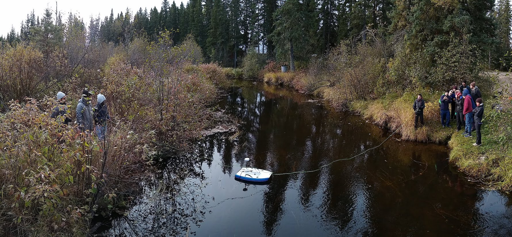

---
---

# Field work

**OPTIONAL**

Describe any field work that was undertaken, including the rationale/objective, the experimental design, description of instrumentation, results, interpretation and conclusions. You must be concise. If additional details are generated which will be useful to future workers, these can be included in an appendix.

## Experimental objective

Rationale for the experiment/experimental objective

## Experimental design

Design of the experiments, developed before they were undertaken

## Description of instrumentation

If appropriate.

## Results

Results. Include Photos and Figures, using the command:

{ width=100% }

## Conclusions

Intrepretation of results and conclusions

Include references as appropriate and write down all reference information in the file references.md
