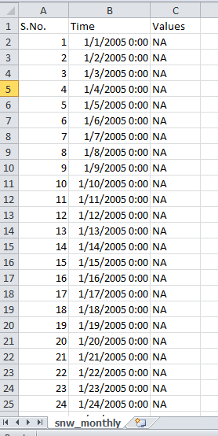

---
---

[Home](home.html)
[Previous Section](data.html)
[Next Section](solution.html)

# Summary of findings

During simulation trials, the model generated all 41 outputs; however these outputs did not have real values (Figure 10). This was evident after extracting data from the netcdf formatted outputs into a csv file. This reason of not obtaining real time values was due to the following error:

$ bin/CLASSIC_ configurationFiles/template_job_options_file.txt 62.36/-114.86
in process       0       1       1       -114.86       62.3599        1           1           1           1
netCDF error with tag ncGetVarId(ipeatland) hint -check if nameInCode is in the xml file, or perhaps you have a duplicate : NetCDF: Variable not found

This error is related to ipeatland flag which was needed to be switched off. This flag was first predicted to be present in the line 14 of the INI file which was created to define the site’s parameters. It was predicted that if the soil percent values in the line 14 are set as ‘-2’, the ‘ipeatland flag’ gets activated. Setting these values to any other value, for example 70, should switch off this flag. However, even after several trial runs with different values and different scenarios, the outputs generated in the outputFiles folder did not have real time values.

Other different scenarios were also tried in order to fix this error included using ‘grep’ command to locate the ‘ipeatland’ flag. Also, ncdump command was used on several netcdf files. The ncdump command was used to look at the structure of any given netcdf file. Following ncdump command was used on OBS. nc.

$ ncdump –h OBS.nc

Expert consultation was also taken but the desired result was not achieved. One of the reasons of being unable to resolve this error could be that CLASSIC is relatively new to the modeler’s community when compared to familiarity with models such as MESH. Nevertheless this report should be helpful in terms of giving a head start to generate real time outputs. Below is the screenshot of the outputs with values as ‘N.A.’.

**Figure 10**: Screenshot of the monthly snow output generated after a model run
