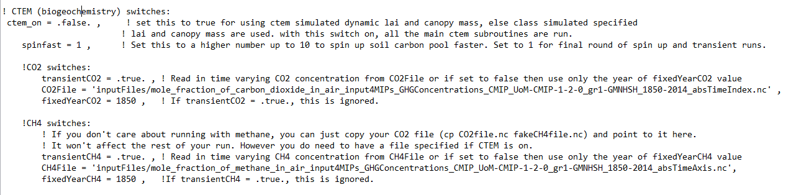

---
---

[Home](home.html)
[Next Section](site.html)
[Previous Section](data.html)

# 4. Model
The Canadian Land Surface Scheme Including biogeochemical Cycles (CLASSIC) was created by Joe R. Melton, a research scientist with Environment and Climate Change Canada based at the Canadian Centre for Modeling and Analysis (CCCma). CLASSIC is formed by the coupling of two schemes – the Canadian Land Surface Scheme (CLASS) and the Canadian Terrestrial Ecosystem Model (CTEM). The physics of the model is handled by CLASS including the fluxes of energy, water, and momentum. CTEM simulates biogeochemical cycles including the fluxes of carbon. For this project, the CLASSIC model was used to estimate the soil temperature and moisture of the site. CTEM was switched off for this project as outputs from CTEM scheme had no relation with soil properties and therefore if CTEM was kept on, it would have complicated the model processes and reduced the overall model efficiency. The switch to turn CTEM on or off is located in the text file named “template_job_options_file.txt” in the configurationFiles folder, one of the directories in model package (Figure 4).

 **Figure 4**: Screenshot of the CTEM switch

#### 4.1 CLASS Description

The Canadian Land Surface Scheme, CLASS, was developed for Canadian Global Climate Model or GCM (Verseghy, 1991; Verseghy et al., 1993 ). At each time step, with the help of atmospheric forcing data, CLASS internally performs energy and water balance of the soil, snow, and vegetation canopy(Figure 5). The basic prognostic variables consist of the temperatures and the liquid and frozen moisture contents of the soil layers; the mass, temperature, density, albedo and liquid water content of the snow pack; the temperature of the vegetation canopy and the mass of intercepted rain and snow present on it; the temperature and depth of ponded water on the soil surface; and an empirical vegetation growth index. These variables must be initialized, and a set of physical parameters describing the soil and vegetation existing on the modelled area must be assigned background values, at the beginning of the simulation. In performing the surface flux calculations the modeled area is divided into up to four subareas: bare soil, vegetation over soil, snow over bare soil, and vegetation over snow.

 **Figure 5**: Schematic Diagram of CLASS model

CLASS model, because of its flexible soil vertical formulation, is well suited for permafrost studies.(Paquin and Sushama 2014). Each grid cell is computed independently and it corresponds to a single soil profile of sand, clay and bedrock (Paquin and Sushama 2014).
