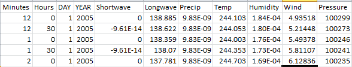

---
---

[Previous Section](model.html)
[Next Section](data.html)

# 5. Running Classic

## 5.1 Input Files

#### 5.1.1 '.INI' File

Landscape parameters are incorporated in .INI files. Figure 5 shows the parameter values, most of which were informed by observations at the hillslope and nearby sites (cite the Guan papers). The structure of the .INI file is similar to that of parameterization file used in MESH.

The INI file contains all the required properties of the site such as vegetation properties, hydraulic properties, soil properties and initial prognostic values. The first four lines contains site’s name, author’s name, name of the place/office, and latitude, longitude of the site. The forth line passes input information such as reference heights, number grid cells. Line 5 to line 11 has all parameters related to vegetation such as annual maximum leaf are index, albedo, canopy mass. The hydraulic properties of the site’s soil such as drainage index, Manning’s coefficient ‘n’ and saturated surface soil conductivity are mentioned in line 12 and line 13. In line 14, 15 and 16, soil parameters are mentioned which passes the information of percent content of sand, clay and organic matter in the mineral soil. The line 17, 18 and 19 has initial prognostic parameters such as air temperature, liquid water and frozen water component of precipitation held on the vegetation canopy. Finally, few dates are listed in the last three lines of the file. Values in the first two of these three lines are not used; however, they are required to exist in the file. Detailed explanation of these parameters is mentioned in the appendix.

Figure 6 is the screenshot of .INI file with the parameter values organized in the required structure. The file was converted into netcdf format (This file conversion is discussed in section 5.3).

 **Figure 6**: Screenshot of the .INI file used for simulation in this project

#### 5.1.2 '.MET' File

The second input file was the meteorological file which had the basic required model inputs to run the CLASSIC. This data is a combination of in situ data from Meteorological Service of Canada climate network data and remote climate station data collected near the hillslope and GEM (Global Environmental Multiscale Model; GEM data is simulated data gathered for forecasting purposes). The majority of the data was monitored and gathered by Dr. Chris Spence and Dr. Newell Hedstorm (Figure 7), both from Environment and Climate Change Canada; however, this dataset had some missing data, mostly during the winter periods due to extreme cold conditions. This missing data was filled with the help of GEM data. This filling of gap in the data was done by Haley Brauner (Master of Water Security program, University of Saskatchewan.

 **Figure 7**: Dr. Chris Spence at one of the hydrometric gauge station located in Baker Creek. (This picture was provided by Dr. Chris Spence)

These climate data were in a half hourly time step from the start of 2005 until the end of 2018. The reason of choosing this particular time interval was that it covered a diversity of dry and wet conditions, covered time of more than a decade and had minimal data gaps. Figure 8 is the screenshot of this data file which was then converted on to netcdf file format.

Following are the data sets that the CLASSIC required:

a)	Timestep: Minutes, Hour, Day and Year

b)	Shortwave radiation incident on a horizontal surface (Wm-2)

c)	Longwave sky radiation (Wm-2)

d)	Surface precipitation rate  (kgm-2s-1):
CLASSIC is able to run with total incoming precipitation, partitioning it into rainfall and snowfall on the basis of empirically-derived equations. If the rainfall rate and snowfall rate are available, they could be used instead.  In this project, total incoming precipitation rate was provided to the model.

e)	Air temperature at reference height (degC)

f)	Specific humidity at reference height(kgkg-1)

g)	Wind speed at reference height(ms-1): Atmospheric models provide the zonal and meridional components of the wind velocity, but CLASS does not actually require information on wind direction.

h)	Surface air pressure (Pa)

 **Figure 8**: Screenshot of header values of '.MET' file used simulation in this project

#### 5.2 LINUX User Interface

To run the scripts in Linux, a few Linux packages were required and following are the names of the packages that were installed into the LINUX user environment:

a) make

b) libnetcdff-dev

c) git

d) gfortran

e) netcdf-bin

f) zlib1g

#### 5.3 NETCDF formatted files

CLASSIC needs both the .INI and .MET files in netcdf format and to convert these readable file formats into netcdf format, convertor algorithms were passed to the model. These algorithms contained the netcdf convertor provided in the model package and longitudes and latitudes of the site. One of the algorithms also contained a ‘containsLeaps’ switch to pass the information to the model whether the timeseries of the input data has any leap years (‘containsLeaps’ = true means that there are leap years in the input data).

To convert .INI file into netcdf format, following command was used:

$bin/initFileConverter [file.INI or file.nml] [file.CTM]

To run .MET file into netcdf format, use the following command was used:

$bin/metASCIILoader [file.MET] [longitude] [latitude] [containsLeaps]

#### 5.4 Changes required in 'template_job_options_file.txt'

There were few more changes that needed to be done to run the model. These changes were done in ‘template_job_options_file.txt’ located in configurationFiles folder. The first change was to replace the default start and end year to the years specific to the project. These flags are in line 8 and line 9 of the ‘template_job_options_file.txt’ file. The second change that was required was changing the location of netcdf formatted .MET files. These flags are in line 14 to line 20.

#### 5.5 Moving files before running the model

The initialization file for the model was the netcdf version of INI file which contained values of all the parameters that the model required. The model required this netcdf version of INI file to be moved to the folder named ‘inputFiles’. Apart from this, there is a file named ‘rsFile .nc’ which was originally present in the benchmark folder. To run the model, this file had be moved to the main folder of the model package (main folder name is ‘classctem-develop’).

#### 5.6 ‘Make’ command

To run the CLASSIC model, an executable file is needed which was done by running the ‘make’ command using LINUX user interface. This created an exe file named ‘CLASSIC_’ in the bin folder. Once ‘CLASSIC_’ exe file and the input files were created and converted into netcdf format, the model can be made to run to get the output file.  Following script was used to execute ‘CLASSIC_’.

$bin/CLASSIC_ configurationFiles/template_job_options_file.txt -114.86/62.36

#### 5.7 Outputs of CLASSIC

This should generate outputs in the 'outputFiles' folder. Output files were in netcdf format which needed to be converted into ASCII format. In this project, instead of converting output file formats within the model code, the data dump in the netcdf formatted output files were extracted using R. The R script created and used in this project is explained in the data analysis section of this report (Section 6.3).
