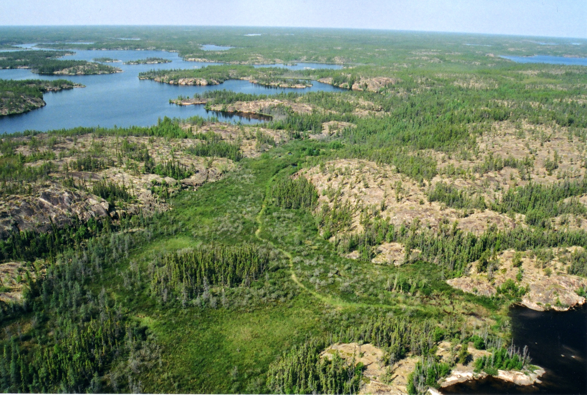

---
---

[Home](home.html)
[Previous Section](intro.html)
[Next Section](model.html)

# 3. Site Description

Baker Creek , a stream network that has lakes connected by short channels, is located just a few kilometers north of Yellowknife, in the subarctic Canadian Shield landscape of the Northwest Territories of Canada. The landscape north of Great Slave Lake has distinct changes in topography, vegetation, winter snow accumulation, local hydrology and surficial geology over short distances result in abrupt transitions from permafrost to non-permafrost conditions, thus the landscape	 belongs in the zone of discontinuous permafrost. Glaciolacustrine clays, outwash and organic deposits are typically underlain by permafrost, whereas bedrock and well-drained glaciofluvial sands are typically unfrozen (Morse et al., 2016).  Overburden has never been documented to be more than 10 m in the region. Soils are derived from glaciolacustrine sediments, glaciofluvial sands or outwash. An organic soil layer of about 0.25m is ubiquitous.

 **Figure 2**: Aerial view of Baker Creek catchment (This picture was provided by the project supervisor Dr. Chris Spence)

The forest in these areas is generally quite open. Predominant vegetation includes black spruce (Picea mariana), jack pine (Pinus banksiana), paper birch (Betula papyrifera), Labrador tea (Ledum groenlandicum), moss (Sphagnum spp.) and lichen (Cladonia spp.).

According to the data from the closest Meteorological Service of Canada (MSC) station at Yellowknife, the regional climate has short cool summers with a daily average temperature of 17 degC in the month of July and long cold winters with the daily average temperature of -27 degC in the month of January. Unadjusted precipitation averages at 289mm annually, with 40% of the same falling as snow. The duration of snow begins in October and lasts until the end of April and beginning of May (Spence et al., 2010).

**Table 1**: Land cover percentage (SPence C., & Hedstorm N., 2018)
| Cover                        | km2   | %     |
| ---------------------------- | ----- | ----- |
| Coniferous forest hillslopes | 31.88 | 20.78 |
| Deciduous forest hillslopes  | 1.15  | 0.75  |
| Exposed Bedrock              | 61.24 | 39.92 |
| Peatland                     | 15.45 | 10.07 |
| Water                        | 34.72 | 22.63 |
| Wetland                      | 8.98  | 5.85  |

Coniferous forest hillslopes covers an area of 31.88 km2 and deciduous forest hillslopes covers just 1.15 km2 (Table 1). The specific coniferous forest hillslope used for simulations in this project is located at the longitude of -114.86 and latitude of 62.36. The parameters of the site are characterized in one of the input files (discussed in detail under section 5.1). These parameters included maximum leaf area index of this site (equal to 2.6), minimum stomatal resistance of the vegetation canopy (equal to 300sm-1) and manning coefficient (set as 0.5). The values of all the parameters are mentioned in the appendix.

**Figure 3**: Satellite view of Baker Creek land covers (Spence C., & Hedstorm N., 2018)
