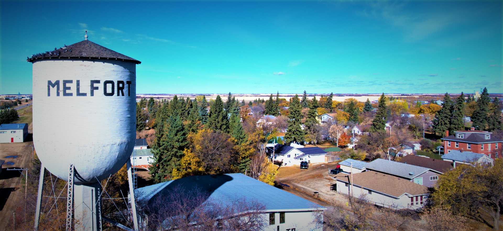
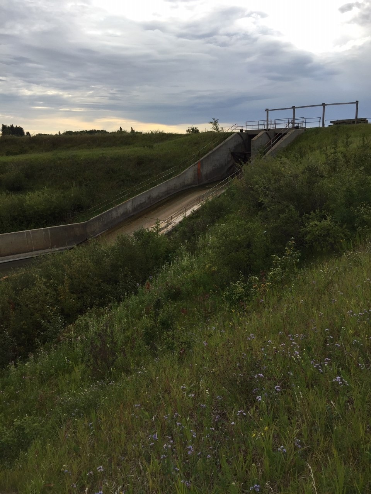

---
---

[home](home.html)

# Site Description

{ width=100% }

The above photo is from the City of Melfort wesbite.

&nbsp;&nbsp;&nbsp;&nbsp;&nbsp;Known as the “City of Northern Lights”, Melfort is situated approximately 178 km northeast of Saskatoon, or 95 km southeast of Prince Albert. It is the gateway to Northeast Saskatchewan at the intersections of Provincial Highway 3, 6, and 41. This Prairie community is located in the Carrot River Valley Watershed in the boreal transition ecoregion (Padbury et al., 1998). Melfort has a semi-arid climate receiving an average of 291 mm of annual rainfall, and an average 106 cm annual snowfall (Environment Canada, 2019). Similar to much of the prairies, the remnants of glacial activities left the topography of the region riddled with numerous potholes and wetlands (Myrow, 2018). The fertile black loam soil proved advantageous for dryland agriculture, and attracted European settlers to the region to establish the prairie community (City of Melfort, 2019). Today the land-use surrounding Melfort remains dominated by dryland agriculture; however, Melfort has a strong diversified economy for its residents. The current population of Melfort is approximately 5,990 people (Statistics Canada, 2017). The median household income is approximately $62,000, with the labor force dominated by occupations in sales and services, the trades and transport sector, and business and finance division (Statistics Canada, 2017). Statistics Canada (2017) data demonstrated the City had grown at an annual average rate of 1.49%, from 2011 to 2016.The daily summer water consumption for the City of Melfort was around 1500-1800 cubic meters daily, which is 1.5 million litres a day of total community water use (Lang, 2019).

{ width=100% }

The figure above shows where Melfort is located.

{ width=100% }

The figure above shows one of Melfort's reservoirs (The Star City Reservoir)
