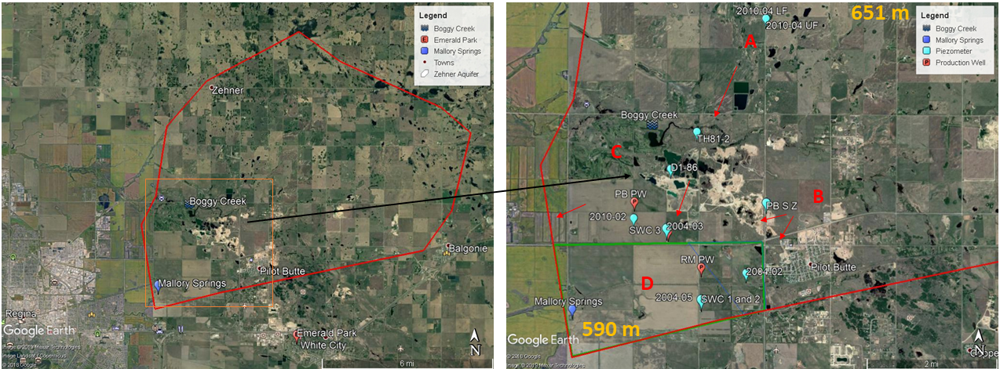
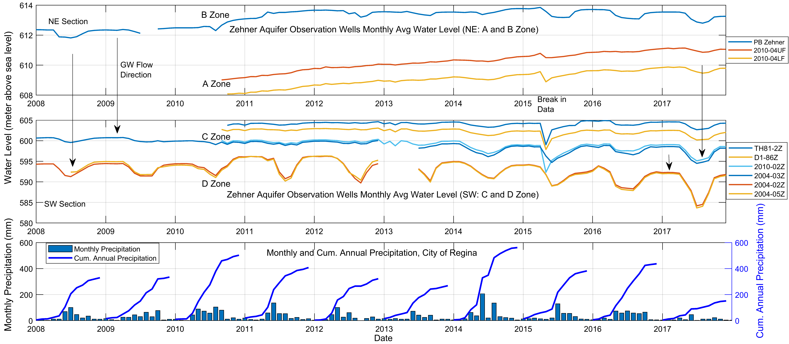
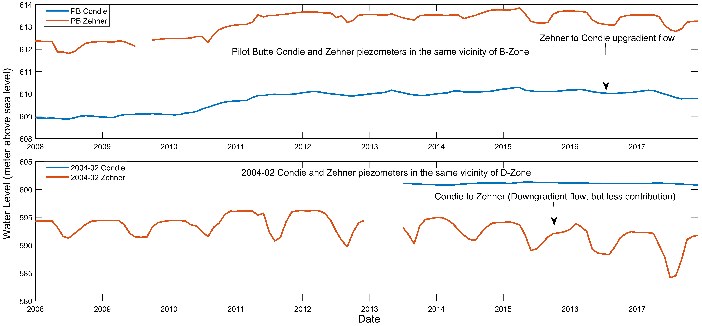
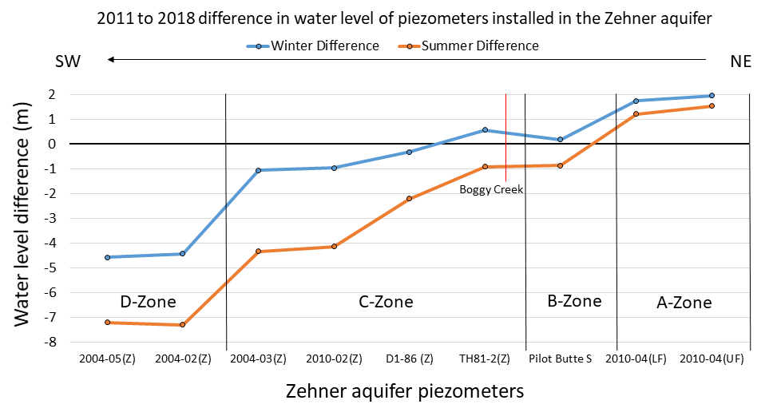
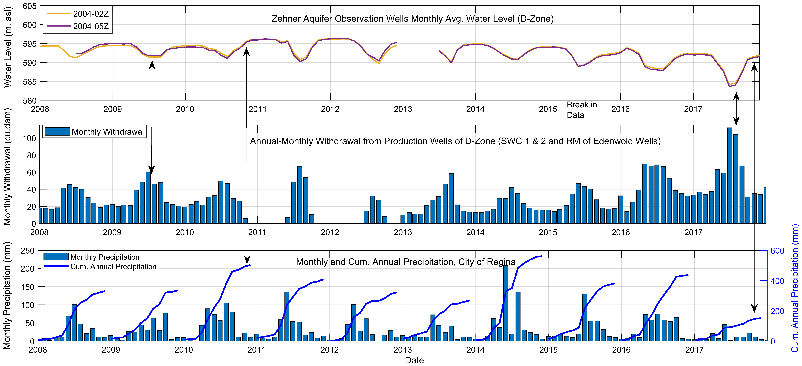

---
---

# 6. Characteristics of the Zehner Aquifer with Focus on the D-Zone

Figure 5: Location of the piezometers and production wells installed in the Zehner aquifer and the zones created on basis of the water level response of piezometers. D-Zone is the 11.2 Km2 green boundary and the yellow numbers are the surface elevation (m. asl) of the respective points. The red arrows are the possible groundwater flow directions.

It was essential to have an understanding in the characteristics of the aquifer to:
* Understand the groundwater flow.
* Understand the concept of the hydraulic barrier.
* Visualize the stress caused by the production wells on the water level of the Zehner aquifer.
*	Develop a methodology for water balance.

The following data was provided by WSA:
* Zehner and Condie aquifer piezometer daily water levels.
  * A-Zone: Zehner- 2010-04 UF and 2010-04 LF
  * B-Zone: Pilot Butte South (PB) Zehner and PB North Condie.
  * C-Zone: Zehner- TH81-2Z, D1-86Z, 2010-02Z and 2004-03Z
  *	D-Zone:
    * Zehner- 2004-02Z and 2004-05Z
    * Condie- 2004-02C
* Zehner aquifer existing monthly withdrawal from production wells.
  * C-Zone: Pilot Butte production wells and SaskWater (SWC) # 3
  * D-Zone: RM of Edenwold production wells and SaskWater (SWC) # 1 and # 2

Precipitation data for the Regina area was collected from Environment Canada and Climate Change website. The precipitation, water level and withdrawal from production well data were well arranged in a monthly and annual format. Data from 2008 to 2017 is considered in this study.

Figures 5 and 6 provides a visualization of the groundwater flow from the northeast to the southwest section of the Zehner aquifer and relates to the assumptions made in previous studies. From figure 5, the northeast section of the study area is at a higher topographic elevation and, towards the southwest section, the elevation steadily decreases. The groundwater flow mirrors the topographic elevation of the study area i.e. from higher to lower elevation. On basis of the differences in water level and inferred hydraulic barriers from previous studies (Figure 4), the Zehner aquifer is divided into zones i.e. A, B, C and D.

Further analysis determined that the ground water in the Zehner aquifer flows from:
* A-Zone to C-Zone (NE-SW)
* C-Zone to D-Zone (NE-SW) (potential seepage through the low hydraulic conductivity barrier)
* B-Zone to C-Zone (E-W) (potential seepage through the low hydraulic conductivity barrier)
* B-Zone to D-Zone (NE-SW) (potential seepage through the low hydraulic conductivity barrier)

Figure 6: Water level data in the A, B, C and D-Zone and NE to SW flow from A to C-Zone, C to D-Zone, B to C-Zone and B to D-Zone. The A and B Zone flow from two different sections. The A Zone is more towards the north and the B zone is more towards the east. Drop in water level in the D-Zone (2015-2017) reflects with reduce in precipitation.

## Difference in flow gradients between the Zehner and Condie aquifer in the B and D-Zone.
Figure 7 depicts the relation of the Zehner and Condie aquifer in the B and D-Zone. The Pilot Butte Zehner and Condie piezometers are installed in the same vicinity and the 2004-02Z and 2004-02C are installed in the same vicinity. The distance between the piezometers of both zones is approximately 1.8 Km. From BHL (2004), the B and D-Zone are separated by an inferred hydraulic barrier. From figure 7, in the B-Zone the groundwater in the Zehner aquifer has an upgradient flow into the Condie aquifer while in the D-Zone the groundwater in the Zehner aquifer has a downgradient flow into the Condie aquifer. The contribution of the downward flow in the D-Zone is less compared to the upgradient flow in the B-Zone. The figure 6 and 7 and the previous studies conducted on the inferred hydraulic barrier confirms that it is viable to conduct separate water balance calculations for each zone as the recharge and discharge function for each zone are different.

Figure 7: Condie and Zehner aquifer wells installed in the same vicinity of B and D-Zone. B-Zone: Upgradient flow from Zehner to Condie (Note: Condie aquifer overlies Zehner aquifer). D-Zone: Downgradient flow (less contribution).

## NE To SW change in water level from 2011 to 2018
Figure 8 depicts the summer and winter water level differences within each zone from 2011 to 2018. Since 2011 the water level in the A-Zone has increased by more than 1 meter and the B-Zone remains stable with minor seasonal fluctuations. The piezometer TH81-2Z is located close to the Boggy Creek reservoir in the Boggy Creek well field site. The water level in the TH81-2Z piezometer remains stable with seasonal fluctuations. As we go further south in the C-Zone the water level in the piezometers have decreased since 2011 due to increase in withdrawal rates from Pilot Butte production wells and SaskWater (SWC) production well # 3. The water level in the D-Zone has dropped drastically since 2011 by more than 4 meters due to increase in withdrawal rates from RM of Edenwold production wells and SaskWater (SWC) productions wells # 1 and # 2. The decrease in water level in the D-Zone is also because of lower replenishment through groundwater flow from neighboring zones due to the low hydraulic conductivity hydraulic barriers and recent drought conditions that limits the infiltration of water by leakage through the glacial till aquitard.

Figure 8: NE to SW change in water level from 2011 to 2018 in Zehner aquifer piezometers.

## Characteristics of the D-Zone
In this study the proposed method for calculating water balance will be applied to the D-Zone. Therefore, we will focus on the D-Zone withdrawal data from production wells and contribution of flow from other zones into the D-Zone. The RM of Edenwold production wells of the D-Zone supplies water to Emerald Park and other subdivisions of RM of Edenwold while the SaskWater (SWC) # 1 and # 2 wells supplies water to the Town of White City. Figure 9 below depicts the similarities in peaks of the monthly withdrawal data from production wells and its effects on the water level of the D-Zone and other neighboring zones.

From figure 9 it is observed that the peaks of withdrawal rate from production wells have similarities with the peaks of drawdown in the D-Zone. In 2009 the increase in withdrawal rate and stable average precipitation reflects with the decrease in recovery water level compared to the previous year. While in 2010 and 2011, the decrease in withdrawal rate and increase in precipitation reflects with the increase in recovered water level. Similarly, from 2015 to 2017 the increasing rate of withdrawal and decreasing amount of precipitation reflects with the decreasing trend of the overall water level within the D-Zone. This infers that withdrawal from production wells is the major discharge function of the D-Zone and due to precipitation, the infiltration through the glacial till aquitard is the major recharge function of the D-Zone. There is minimum contribution from the neighboring zones due to the low conductivity hydraulic barriers.

{ width=100% }
Figure 9: Water level and withdrawal from production wells of D-Zone and precipitation data from the City of Regina.
