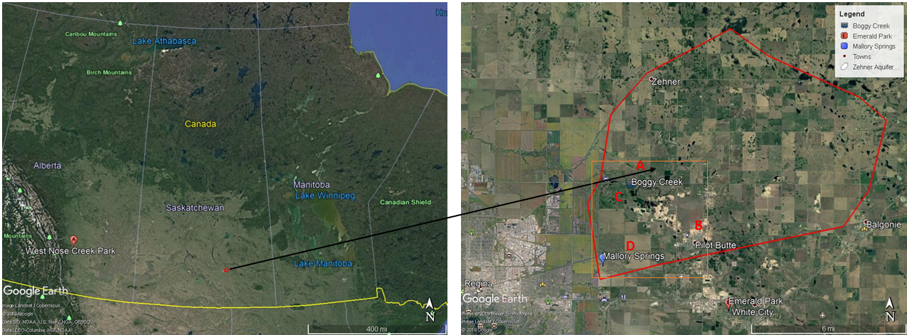

---
---

# 1. Introduction
Growth in population and economy has led to an increase in the demand for water resources in the area east of the City of Regina (COR). There is no sufficient surface water supply to meet the peak demands in the area. In the absence of surface water supply, groundwater has long since played an important role in meeting domestic and municipal demands (Maathuis & Thorleifson, 2000). Groundwater is an integral part of the natural hydrologic system and its use has increased significantly over time. Only in the last few decades have we realized the limitations on its supply and its vulnerability to contamination or over-exploitation (Healy, 2010). Therefore, it is essential to review the allocation of an aquifer on a regular basis.

The Regina East area comprises the Town of Pilot Butte, Town of Balgonie, Town of White City, Emerald Park (RM of Edenwold) and other subdivisions of RM of Edenwold (Figure 1). The Zehner aquifer is the major quaternary aquifer system that supplies water for domestic and municipal use to the Regina East area. Demand of ground water in the Regina East area has increased greatly due to increased growth and development in the communities and the rural municipality. The ground water allocation limit for these Towns is based on the accepted sustainable yield of the Zehner aquifer (Lo, 2010). The Saskatchewan Water Security Agency-WSA (Formerly Saskatchewan Watershed Authority) has generally accepted the best sustainable yield of 4,800 dam3/year from the Zehner aquifer (Lo, 2010). The 4,800 dam3/year was based on previous studies conducted by Maathuis & van der Kamp, (1988) and the Regina Aquifer Management Plan (Part A- Allocation Plan) commissioned by the Saskatchewan Water Corporation (SaskWater) in 1989 (Clifton Associates Ltd., 1989). The 4,800 dam3/year sustainable yield accounts for the total recharge to the aquifer and the natural discharge to the springs and outflow to the Regina and Condie aquifers. In general, it is an estimate of annual inflow less natural outflow from the aquifer systems.

The 1988 report by Maathuis and van der Kamp (Saskatchewan Research Council) comprehensively evaluated the groundwater resources in the Regina area and prepared the water balance for the Regina aquifer systems. The major aquifers of the Regina aquifer systems are the confined Regina aquifer in the City of Regina, confined Zehner aquifer in the Regina East area and the unconfined surficial Condie aquifer overlying the Regina and Zehner aquifer (Figure 2). The study had inferred some discontinuities within the Zehner aquifer but had no strong evidence or exploration data to support the assumption (Maathuis & van der Kamp, 1988).

In 2004, Beckie Hydrogeologists LTD. (BHL) had conducted a groundwater exploration and pumping test in the Regina east area, commissioned by SaskWater. The study inferred the hydraulic discontinuities in the southwest section of the Zehner aquifer (West of Pilot Butte). Similarly, WSA’s chemical and isotope study (Lo & Melnik, 2014) and the Regina East aquifer Science and Monitoring Program (Lo & Shaheen, 2014) confirmed that there are existing discontinuities within the Zehner aquifer (Figure 2). Therefore, the groundwater allocation of 4,800 dam3/year across the entire Zehner aquifer could be refined to represent the individual groundwater sub-systems and closely spaced production wells (Lo & Melnik, 2014). It is important to refine the water balance within the Zehner aquifer on basis of ‘zones’, taking into consideration the hydraulic discontinuities.

The estimation of the sustainable yield of an aquifer system depends on the understanding of the balance between recharge and discharge of the aquifer (Hayashi & Farrow, 2014). The Zehner aquifer belongs to the North American Prairie region and the recharge function of the ground water here depends on the hydrogeology, geology, topography, land use and climatic variability of the area (van der Kamp & Hayashi, 1998). There is a huge variation in all these factors in this region, resulting in higher complexities in the estimation of recharge in the study area. The discharge function depends on the outflow of ground water from the aquifer in the form of springs, seepage and ground water pumping (Maathuis & van der Kamp, 1988).

In the Zehner aquifer the major recharge zones are the wetland and other depressions, glacial till aquitard drainage, Condie aquifer, and Boggy Creek, whereas the discharge zones are the springs, seepage through surface depressions, upgradient flow into the Condie aquifer, and the inter-aquifer flow to the Regina aquifer (Lo, 2010; Maathuis & van der Kamp, 1988). In the present study, the aquifer is divided into zones A, B, C and D. The zones are prepared on basis of differences in the water level of piezometers installed in each zone. Town of Balgonie have production wells in the A-Zone; Town of Pilot Butte, SaskWater (SWC #3) have production wells in the C-Zone; and SaskWater (SWC #1 and #2) and RM of Edenwold have production wells in the D-zone. There is no existing production in the B-Zone. A methodology for water balance is proposed solely for the D-Zone that lies at the extreme southwest section of the aquifer. The proposed methodology can be used for each zone within the Zehner aquifer.

This study provides an alternative approach to refine the water balance in the individual zones of the Zehner aquifer and refine the recharge and discharge estimates for each zone.

Figure 1: Study Area: The inferred boundary of the Zehner aquifer and location of towns belonging to the Regina East area (Google Imagery).
