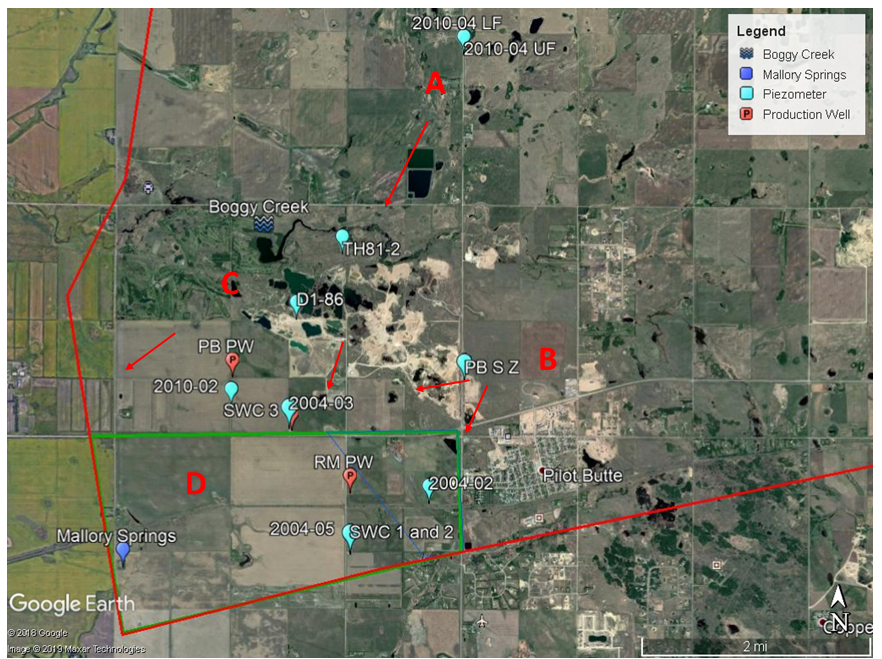
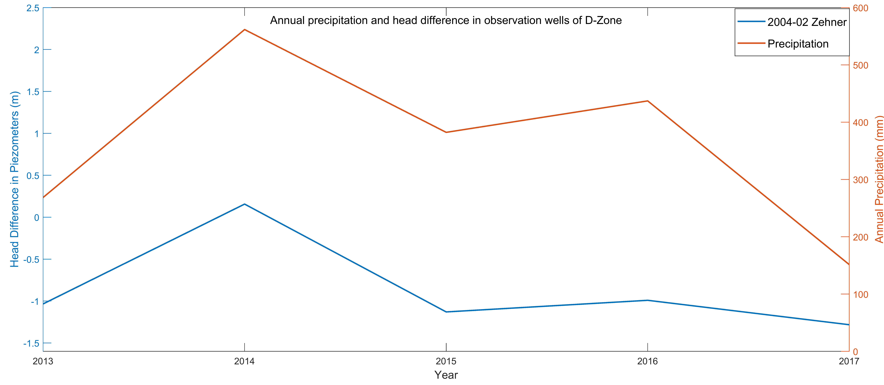
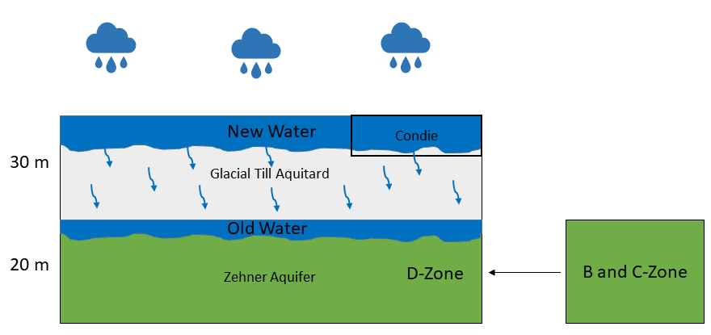
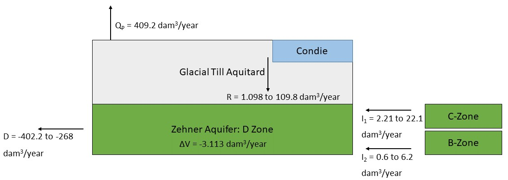

---
---

# 7. Methodology to Estimate the Water Balance of the D-Zone

Figure 10: Assumed boundary for the D – Zone of the Zehner aquifer (Green boundary – 11.2 Km2) and groundwater flow directions from C to D-Zone and B to D-Zone through low hydraulic conductivity hydraulic barriers.

After studying the historic water levels, change in water level differences within each zone, and locations of the inferred hydraulic discontinuities, it was decided to consider the compartmentalized nature of the Zehner aquifer in order to refine its water balance. The aquifer was divided into zones on basis of the differences in water level elevation of piezometers and the inferred hydraulic barriers. Therefore, it was deemed appropriate to generate an individual water balance for each zone within the Zehner aquifer. In the current study, we will consider applying the proposed water balance method on the D-Zone due to its simplified nature in contrast with other zones.

To quantify the water balance in the D-zone, it is essential that to be aware of the aquifer’s physical and hydraulic properties. In many parts of the world, vertical leakage through regionally extensive aquitards is an important source of recharge to underlying aquifers (Gerber & Howard, 2000). In the study area, leakage through the glacial till aquitard is the major source of groundwater recharge and the glacial till has an approximate thickness of 30 meters as inferred from previous core sections (BHL, 2004). The production wells operating in the D-zone are the SaskWater (SWC) 1 and 2 and the RM of Edenwold wells. The observation wells are:
* 2004-02 (Condie) and 2004-02 (Zehner): Same vicinity.
* 2004-05 (Zehner): Approximately 1- Kilometer west of 2004-02.

The WSA’s 2014 and 2017 water chemistry and isotope report suggests that the water in the Zehner aquifer’s 2004-02 and 2004-05 wells is pre-1950’s water, while that in the Condie aquifer 2004-02 well is as recent as 0-10 years (Lo & Melnik, 2017; Lo et al., 2014). Previous studies have also estimated that the Condie aquifer is placed in isolated patches within the study area and it occupies about 2.1 Km2 area of the 11.2 Km2 area of the D-zone (estimated from Google Earth). Figure 11 and table 2 provide a representation of the head differences over 5 years from the Zehner aquifer 2004-02 piezometer as well as the correlation between the peaks of head difference and annual precipitation. Figure 12 is a cross section (BHL, 2004) of the D-zone. From this, we can infer that the water from precipitation replenishes the Condie aquifer and the shallow area of the glacial till aquitard, while the older water at the bottom drains into the Zehner aquifer. To get a better understanding of the drainage recharge concept, please refer to the conceptual diagram in figure 13.

Figure 11: Correlation of peaks of annual precipitation and annual head difference of Zehner aquifer in the D-Zone.

Table 2: 5-Year average data of the D-Zone of Zehner aquifer.

{ width=100% }

The general ground water balance is:
$$∆V= (R) – (D)$$
Where;
* ∆V = Change in storage volume of the aquifer in a year (dam3/year).
* R = Recharge into the aquifer in a year (dam3/year).
* D = Discharge from the aquifer in a year (dam3/year).

In the study area, as the aquifer storage is highly influenced by pumping and precipitation, the overall recharge and discharge properties change annually. Also, for the water balance in the D-Zone, the input groundwater flow from the C and B-Zone through the low hydraulic conductivity barrier must be taken into consideration. This is referred to as intra aquifer flow.

The 5-year average ground water balance of the D-Zone is therefore represented as:
$$∆V=(I_1+I_2 )+(R)- (D)-(Q_P )…... [equation 1]$$
Where,
* I1 = Input through intra-aquifer flow from the C-Zone into the D-Zone of Zehner aquifer (dam3/year). Can be roughly estimated from the head difference between the water level of the two zones and the hydraulic conductivity of the inferred hydraulic barrier.
* I2 = Input through intra-aquifer flow from the B-Zone into the D-Zone of Zehner aquifer (dam3/year). Can be roughly estimated from the head difference between the water level of the two zones and the hydraulic conductivity of the inferred hydraulic barrier.
* R = Recharge through glacial till aquitard leakage (dam3/year). Can be estimated with aquifer and aquitard hydraulic properties.
*	D = Discharge by springs, seepage and outflow to Regina aquifer (dam3/year). As we do not have enough data, this will be back calculated after estimation of other functions.
*	QP = Average annual withdrawal (pumping) from production wells = 409.2 dam3/year (Table 2) …... [1]
* ∆V = Change in storage volume of the aquifer in a year (dam3/year). Can be roughly estimated with changes in head and aquifer hydraulic properties.

{ width=100% }
Figure 12: SW-NE trending cross section (BHL, 2004) of the 11.2 Km2 D-zone. Majority of the area is overlain by the glacial till deposits.

## Results
### Estimating recharge in the D-zone
Recharge = Recharge through the glacial-till aquitard

{ width=100% }
Figure 13: Conceptual Figure representing the vertical recharge through glacial-till aquitard and intra aquifer flow in the D-Zone of Zehner aquifer. New water is contributed by precipitation and due to stress from incoming new water the old water below leaks into the Zehner aquifer.

The Condie aquifer has a high horizontal hydraulic conductivity and, therefore, much of the groundwater would flow horizontally contributing less to vertical recharge. In contrast, the glacial till aquitard has an overall low hydraulic conductivity, hence water will drain vertically through the low bulk hydraulic conductivity (Kv) glacial till aquitard into the underlying high hydraulic conductivity Zehner aquifer.

Darcy’s law will be used to quantify the flow from the glacial-till aquitard to the Zehner aquifer. The water level and accurate estimation of the vertical hydraulic conductivity (Kv) of the aquitard, however, remains unknown. In Saskatchewan the shallow glacial till is fractured and jointed due to which it holds enough water in its shallow layer (van der Kamp & Hayashi, 1998). From the figures 12 and 13 the Condie aquifer and the shallow zone of the aquitard are approximately at equal depth. Therefore, the water level of the Condie aquifer is assumed as the water level of the glacial till aquitard (Table 3). The general range of vertical hydraulic conductivity for the Glacial till is from 10-11 to 10-9 m/s (Dingman, 2015; Freeze & Cherry, 1979).

Table 3: Annual water level and head difference of 2004-02 (Condie) and 2004-02 (Zehner). The water level for the glacial till aquitard is assumed to be equivalent to the depth of the Condie aquifer.

{ width=100% }

Darcy’s Law:
$$R=q=Kv ×(∆h/L)  …… [equation 2]$$
Where;
* R = q = recharge through the aquitard or Darcy’s velocity (m/s)
* Kv = the vertical hydraulic conductivity of the glacial-till aquitard = 10-11  to 10-9 m/s
* ∆h = the average 5-year hydraulic head difference between the aquitard and the Zehner aquifer = 9.23 m
* L = the thickness of the aquitard or the distance for the new water to drain till the old water = 30 m
* ∆h/L = the hydraulic gradient between the water level of the aquitard and the aquifer = 0.31 (m/m)

Table 4: Recharge rate from the glacial-till aquitard to the Zehner aquifer in the D-Zone with a range of vertical hydraulic conductivities.

{ width=100% }

Therefore, the rate of recharge R in the D-zone from the glacial-till aquitard to the Zehner aquifer may range between **1.098 to 109.8** dam3/year.

**R = 1.098 to 109.8 dam3/year …… [2]**

### Intra aquifer flow (I1) from C-Zone to D-Zone
From Figure 10, the C-Zone lies to the north of the D-Zone and from this and previous studies it is inferred that the aquifer characteristics in these two zones are different due to the presence of a low conductivity hydraulic barrier. The characteristics of the hydraulic barriers are unknown; hence we have assumed that the value for the low hydraulic conductivity barrier would range between the horizontal hydraulic conductivities of the glacial till aquitard and the Zehner aquifer (C and D-Zone). The horizontal hydraulic conductivity for the glacial till (fractured) aquitard of the Floral formation is generally considered as 5 x 10-9 m/s (Fortin et al, 1991). From previous studies and data provided by WSA, the hydraulic conductivity of the Zehner aquifer in the C and D-Zone is in the magnitude of 10-4 m/s. As we know that the hydraulic barrier is a low conductivity zone, hydraulic conductivity would not parallel the Floral Formations sands and gravels and therefore we assume a lower range between 10-8 to 10-7 m/s. The range of hydraulic conductivities for the hydraulic barrier is between the horizontal hydraulic conductivity of the fractured glacial till aquitard and Floral Sands and Gravels of the Zehner aquifer.

2004-03 Z is the representative piezometer in the C-Zone close to the boundary between the 2 zones. The distance between 2004-03 Z and 2004-05 Z (D-Zone) is approximately 2 Km (Google Earth estimate) and the average 5-year water level difference (∆h) between the 2 piezometers is in table (5). To calculate the hydraulic gradient of the flow from the 2004-03 Z piezometer to the D-Zone we will consider the head difference between the two piezometers and the surface distance (L) between the 2004-03 Z and the border of C and D-Zone. The distance (L) is estimated from google earth as approximately 90 meters.

Table 5: Annual water level and head difference of 2004-03 (Zehner) in the C-Zone and 2004-05 (Zehner) in the D-Zone.

{ width=100% }

Using Darcy’s law, the flow from the C-Zone to the D-Zone is estimated as follows:
$$I_1=q=K_h  ×(∆h/L)  …… [equation 3]$$
Where;
* I1 = q = rate of intra aquifer flow from the C-Zone to D-Zone (m/s)
* Kh = the assumed horizontal hydraulic conductivity of the hydraulic barrier = 10-8 to 10-7 m/s
* ∆h = the average 5-year hydraulic head difference between the piezometers of the C and D-Zone = 6.20 m
* L = the distance between 2004-03 Z and the assumed border of the C and D-Zone = 90 m (approximated from google earth)
* ∆h/L = the hydraulic gradient of the flow between 2004-03 (C-Zone) and the D-Zone = 0.07 (m/m)

In order to estimate the total rate of flow in dam3/year from the C-Zone to the D-Zone, the subsurface cross-sectional area through which the groundwater flows must be considered. It was assumed that the length of the border of the two zones is approximately 5,000 m (5 Km) (Google Earth estimate) and the thickness of the aquifer was considered i.e. 20 m. Therefore, the total cross-sectional area through which the groundwater flows from C-Zone to D-Zone was estimated to be 1,00,000 m2 (0.10 Km2)

Table 6: Rate of intra-aquifer flow from the C-Zone to the D-Zone

{ width=100% }

Therefore, the rate of intra-aquifer flow (I) from the C-Zone to the D-Zone within the Zehner aquifer may range between **2.21 to 22.1** dam3/year.

**I1 = 2.21 to 22.1 dam3/year …… [3]**

### Intra aquifer flow (I2) from B-Zone to D-Zone
Similarly, the intra aquifer flow from the B-Zone to D-Zone is estimated taking into consideration the water level data between the Pilot Butte South (PBSZ) Zehner piezometer (B-Zone) and the 2004-02 Z piezometer (D-Zone).

PBSZ is the representative piezometer in the B-Zone close to the boundary between the 2 zones. The distance between PBSZ and 2004-02 Z (D-Zone) is approximately 1.8 Km (Google Earth estimate) and the average 5-year water level difference (∆h) between the 2 piezometers is in table (7). To calculate the hydraulic gradient of the flow from PBSZ piezometer to the D-Zone we will consider the head difference between the two piezometers and the surface distance (L) between PBSZ and the border of B and D-Zone. The distance (L) is estimated from google earth as approximately 750 meters.

Table 7: Annual water level and head difference of PBSZ (Zehner) in the B-Zone and 2004-02 (Zehner) in the D-Zone.

{ width=100% }

Using Darcy’s law, the flow from the B-Zone to the D-Zone is estimated as follows:
$$I_2=q=K_h  ×(∆h/L)  …… [equation 4]$$
Where;
* I2 = q = rate of intra aquifer flow from the B-Zone to D-Zone (m/s)
* Kh = the assumed horizontal hydraulic conductivity of the hydraulic barrier = 10-8 to 10-7 m/s
* ∆h = the average 5-year hydraulic head difference between the piezometers of the B and D-Zone = 21.64 m
* L = the distance between PBSZ and the assumed border of the B and D-Zone = 750 m (approximated from google earth)
* ∆h/L = the hydraulic gradient of the flow between PBSZ (B-Zone) and the D-Zone = 0.028 (m/m)

In order to estimate the total rate of flow in dam3/year from the B-Zone to the D-Zone, the subsurface cross-sectional area through which the groundwater flows must be considered. It was assumed that the length of the border of the two zones is approximately 3,500 m (3.5 Km) (Google Earth estimate) and the thickness of the aquifer was considered i.e. 20 m. Therefore, the total cross-sectional area through which the groundwater flows from B-Zone to D-Zone was estimated to be 70,000 m2 (0.07 Km2)

Table 8: Rate of intra-aquifer flow from the B-Zone to the D-Zone.

{ width=100% }

Therefore, the rate of intra-aquifer flow (I) from the B-Zone to the D-Zone within the Zehner aquifer may range between **0.6 to 6.2** dam3/year.

**I2 = 0.6 to 6.2 dam3/year …… [4]**

### Estimating annual change in storage ∆V in the D-zone
To estimate the annual change in storage in the Zehner aquifer, the formula for Storage Coefficient or Storativity (S) from Dingman, (2015) and Todd & Mays, (2005) was modified as follows:
$$S=∆V/(A×∆h )$$
$$∆V=S ×A×∆h …… [equation 5]$$
Where;
* ∆V = change in storage per year (m3/year).
* S = Average storativity for the Zehner aquifer in the D-Zone = 3.04 X 10-4 (WSA provided data and BHL, 1986).
* A = Surface area of the Zehner aquifer in the D-Zone = 11.2 x 106 m2.
* ∆h = average annual change in water level (hydraulic head) in the piezometers of the D-Zone = -0.92 m/year (Table 2).

Therefore, from equation 5, average annual Change in storage within Zehner aquifer in the D-Zone:

∆V = 3.04 X 10-4 X 11.2 x 106 m2 X - 0.92 m/year

∆V = -3133 m3/year

**∆V = -3.13 dam3/year …… [5]**

### Back estimating discharge
From equation 1 and [1], [2], [3], [4] and [5] the discharge from the D-Zone of the Zehner aquifer can thus be back estimated as:
$$(D)=(I_1+I_2)+(R)-(Q_P)-(∆V) …… [equation 6]$$

Table 9: Water balance functions of the D-Zone and the back-estimated value for discharge (D).

{ width=100% }

## Conclusion
{ width=100% }
Figure 14: Conceptual figure representing the estimated water balance of the D-Zone.

Figure 14 is the conceptual figure representing the calculated water balance of the D-Zone. The back-estimated discharge value is negative (-402.2 to -268 dam3/year) which implies that the overall storage within the D-Zone is depleting each year. Withdrawal rates of the production wells in the D-Zone exceeds the rate of recharge. From the estimated water balance and decline in water level trend of the D-Zone (Figure 8), we can infer that the outflow from the D-Zone exceeds the inflow, hence there is an annual decrease in storage. To develop a more accurate estimation of water balance in the D-Zone, the following data would be required:
* Glacial till aquitard water level and hydraulic properties through installation of piezometer in the aquitard layer.
* Measurement of natural discharge rate from the Mallory Springs well field site.
* Estimation of discharge from the D-Zone to the Regina aquifer.

From these measurements and estimations, we can infer a more precise estimation of increase or decrease in storage within the D-Zone of the Zehner aquifer.
