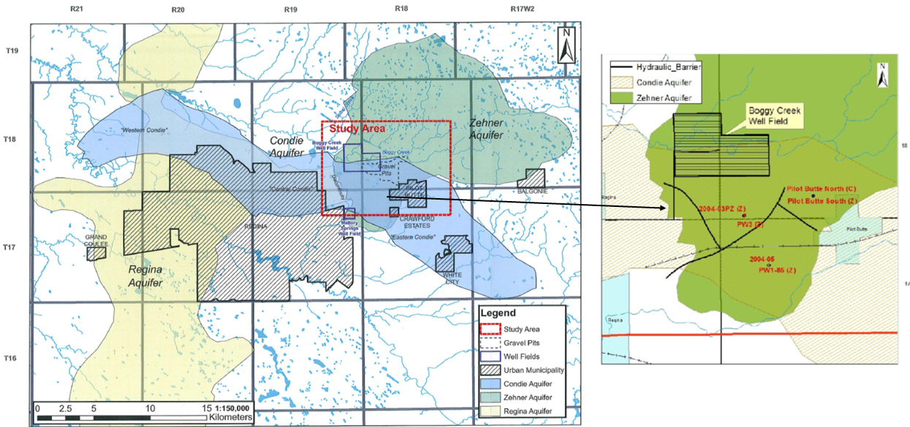

---
---

[home](home.html)

# 2. Site Description
{ width=100% }

Figure 2: Major aquifers in the Regina area (left) and inferred spatial extent of hydraulic barriers (right) in the Zehner aquifer (Lo & Melnik, 2014; Lo et al., 2014).

## 2.1 Study Area
The Study area is in South Saskatchewan and is located to the northeast of City of Regina between Townships of 17 and 19 and Ranges 17 and 19 W2 (Figure 1 and 2). The figures outline an inferred boundary of the Zehner aquifer, and the figure 1 represents the locations of the Town of Pilot Butte, Balgonie, White City, and Emerald Park (RM of Edenwold). The study area involves the Boggy Creek well field, which is located near and at the immediate vicinity of the Boggy creek reservoir. The Town of Pilot Butte, SaskWater (SWC) and RM of Edenwold operate production wells further south of the Boggy Creek well field and the gravel pit area. SaskWater wells supply water to the Town of White City. RM of Edenwold wells supply water to Emerald Park and other subdivisions of the RM while the Town of Pilot Butte wells supply water to the Town of Pilot Butte and Balgonie.  The Town of Balgonie’s production wells 1 and 2 has been decommissioned and its production well 3 is about 2 to 4 Kms northwest of the Town of Balgonie. The groundwater in the Town of Balgonie wells have been exceeding the selenium concentration guidelines (WaterMark Consulting LTD., 2010). Therefore, since 2014, the Town of Balgonie obtains water from the Town of Pilot Butte wells for its water demands and have ceased extraction from their wells. The Balgonie PW 3 still has an existing allocation for standby purposes. Previously, majority of the population in the Town of Pilot Butte depended on private wells in the Condie aquifer for their domestic water demands. But, as the Condie aquifer is exposed to the surface, it is prone to contamination from decommissioned waster water lagoons, gravel pit mining and surface runoff. Hence a shift was planned towards a centralized system to meet their demands (AECOM Canada Ltd., 2009). Since 2013, all the Regina East Towns have been withdrawing groundwater from production wells installed into the Zehner aquifer to meet their municipal groundwater demands.

## 2.2 Boggy Creek Well Field
Boggy creek well field is constructed around the Boggy Creek reservoir with most of its area to the south of the reservoir. The Boggy Creek reservoir was created by the construction of a dam in 1904, with the sole purpose of supplying water to the City of Regina (COR) (Maathuis & van der Kamp, 1988). From 1911, due to increase in demand, production wells were drilled in the area around the Boggy Creek reservoir. This was the establishment of the Boggy Creek Well Field. By 1929 the water needs of the COR were exceeding the supply from the Boggy Creek well field which led to the development of Mallory springs well field in 1930 (Maathuis & van der Kamp, 1988). Post 1955, the demand of the COR was met by the water supply piped from Buffalo Pound Lake which is at a distance greater than 40 Km northwest of the COR and since then the groundwater extraction volumes by the COR from the Zehner aquifer has been gradually declining (Maathuis & van der Kamp, 1988). At present, COR completely depends on the water supply from the Buffalo Pound lake but still has its production wells in the Boggy Creek well field for emergency ground water supply (Lo, 2010). WSA has reduced COR’s original allocation of the Zehner aquifer from 5170 dam3/year to 1500 dam3/year and this allocation is only for emergency purposes from the Boggy Creek well field. Gravel pit mining in the Boggy Creek well field site has been functioning since the establishment of the well field. Several studies have been conducted in the Boggy Creek well field for the expansion of both the well field and gravel pit mining. Pumping test studies conducted in the shallow Condie aquifer wells and gravel pits have inferred a discontinuity between the gravel pits and Boggy Creek to the north and east part of the pits (Clifton Associates Ltd., 2002; McPhee & Balzer, 1975). At present, the gravel pit within the Boggy Creek well field exposes the Condie aquifer and is likely influencing the water balance of the C-Zone.

## 2.3 Mallory Springs
Mallory Springs well field, located at the extreme southwest section of the Zehner aquifer (Figure 1 and 2), was developed in 1930 due to increased demand for water supply from the COR (Maathuis & van der Kamp, 1988). Kelly 1, Kelly 2 and Mallory PW were the three production well sites in the Mallory Springs area (Lo, 2010). These production wells exhibit flowing conditions and represent a discharge area. The previous original production from the Mallory Springs well field has been approximately 512 dam3/year (Lo, 2010; Maathuis & van der Kamp, 1988). Due to excess natural flowing conditions through these production wells, the COR decided to decommission these wells.
