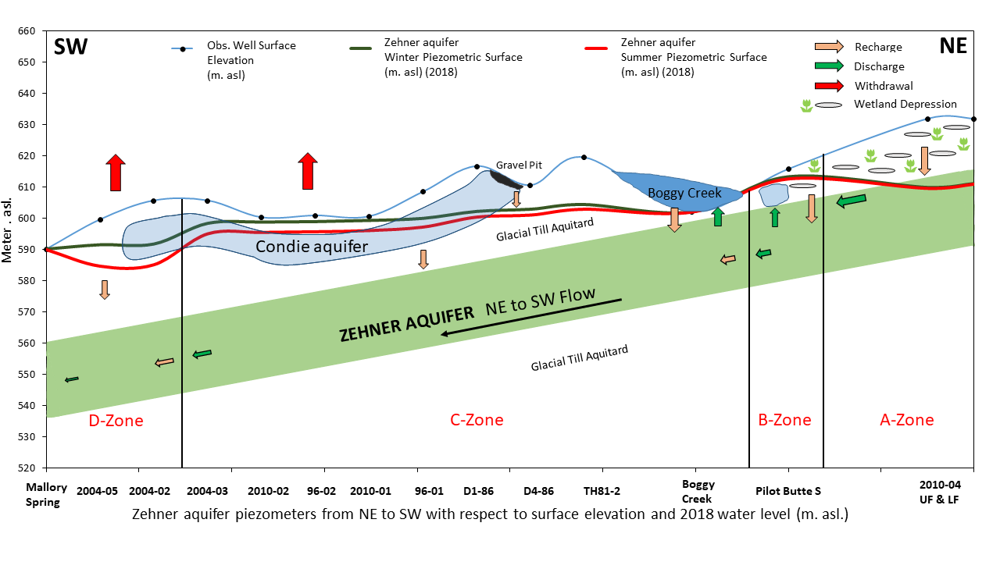

---
---

[home](home.html)

# 8. Summary of Findings
{ width=100% }

Figure 15: Conceptual figure depicting the water balance functions for each zone. (Note: The surface elevation and piezometer water levels are accurate but the distance between piezometers are not to scale.).

The analysis of the characteristics of the Zehner aquifer and the conducted literature review helped develop an understanding of the background of the study area and the Zehner aquifer. The increasing trend of water level in the A-Zone may be attributed to this zone experiencing less withdrawal (pumping) compared to other zones and continued replenishment through depression-focused recharge and leakage through glacial-till aquitard. Land-use within the A-Zone is surrounded by wetland-depressions which could be the main source of depression focused recharge into the A-Zone.

The B-Zone has a seasonal drawdown due to pumping by few domestic wells but the overall water level trend in this zone is stable. The B-Zone is surrounded by comparatively fewer surface depressions but receives flow from the vast east portion of the Zehner aquifer which is also surrounded by wetland-depressions. The C-Zone is replenished by the Boggy Creek and gravel pit area that has a downgradient flow into the Condie aquifer and eventually the Zehner aquifer through the glacial till aquitard. The exposure of the Condie aquifer due to gravel pit operations enhances recharge to the Zehner aquifer, due to disturbance of the underlying till (fracturing). The macropore flow through these fractures may help recharge the B and C-Zone.

The recharge into the D-Zone is by intra-aquifer flow and recharge through infiltration from the glacial till aquitard. The inflow of groundwater from the B and C-Zone into the D-Zone is less due to the inferred hydraulic discontinuities surrounding the D-Zone. The recharge through the glacial-till aquitard is slow due to the low hydraulic conductivity of the till. Therefore, the declining water level trend in the D-Zone can be attributed to high pumping rate and less recharge. The figures 5 and 15 give a rational view of the surface and subsurface section of the zones within the Zehner aquifer. Due to this difference of recharge, discharge and withdrawal within each zone of the aquifer, it is recommended that a separate water balance be prepared for each zone within the Zehner aquifer.

This study proposes a method to calculate the water balance and applied it to the D-Zone of the Zehner aquifer. In this methodology, the water balance functions were estimated with the available data from piezometers and production wells within the zones B, C and D and the hydraulic properties of the Zehner aquifer and glacial-till aquitard. There was no reliable data available for estimating the discharge in the Mallory springs area and other depressions. Therefore, the change in storage was calculated based on the aquifers’ physical and hydraulic properties, and from that, discharge was back estimated. The value estimated for discharge is negative indicating that the water level in the D-Zone is declining. In general, the overall water balance of the D-Zone shows that the outflow exceeds the inflow which results in a decrease in annual water level. The water balance is dependent upon the surface-subsurface physical and hydraulic properties, precipitation, and withdrawal rates from production wells.

This method provides an alternative approach to determine the water balances for each zone within the Zehner aquifer.
